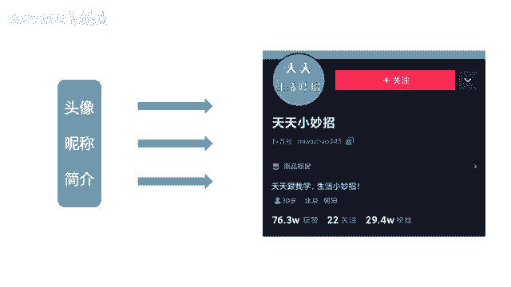
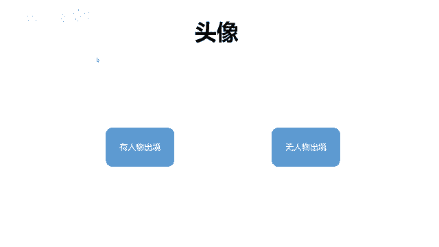
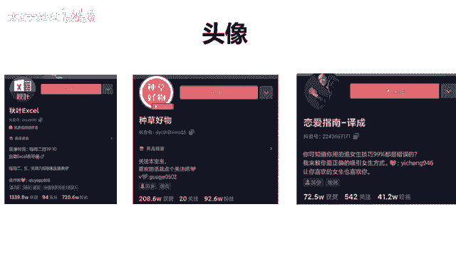
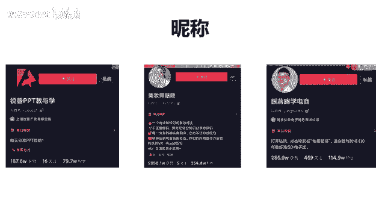

# 【2024最新抖音运营教程】分享花了2.1W买来的抖音课程，目前B站最新最完整的抖音运营教程，起号涨粉变现一条龙教学！ 小白收藏！ - P31：账户头像和昵称 - 熊孩子在b站 - BV1wZ421E7Pj

啊，那么好，我们就一个一个来讲一个一个来讲，那头像怎么去选择啊，昵称我们的头图以及简介啊，它都有什么样的标准，对不对？它也是我们账号搭建啊，最最基础最最啊重要的一步。😊。

好吧，我们来先来看头像。😊，啊，那么头像其实是根据我们的内容定位去做选择的。比如说你的内容里面有人物出镜，那你的头像最好就是出镜的这个人去做头像就可以。如果说无人物出镜了。无任务出境。

那可能有一一些关于你的行业关键词啊，比如说音乐、美妆、医疗，对不对？什么恋爱。😡，那这是无人物出境的，无人无出境基本上都用什么呀？文字或者是风景，基本上就是这两种。那么我们可以看一下啊。😡。

啊，这里给大家举到了几个例子，你像第一个是秋叶啊，秋叶的这个PPT啊，或者excel啊，它都是啊就是比较有名的一个办公软件的教学。所以说它的头像呢直接选择的就是excel这个图标，大家看到了？

如果你做的是PR教学或者是什么PS教学。😊，啊，那么其实你可以把这个图标就直接放在这里啊，那包括说这边还有好物种草，好物种草可能就是呃就直接使用的是这个文字，对吧？那么第三个呢就是这个恋爱指南。

恋爱指南它是直接使用了这个人物的头像，这个人物的照片作为头像。可以看到吧。所以说有人物出镜的话，最好是选择直接这个人作为头像就可以。你看尤其是像第一个像秋叶，他的这个头像就非常的能够传递价值。啊。

我看了之后呢，我是很想关注他的，因为我觉得他早晚对我有用啊，因为我是呃一直在上班，我不是上一天班，也不是上两天班，对不对啊？所以说我觉得我关注他之后，万一有一天我遇到了哪个数据不会算。

我可能就会想来看一下啊，包括我说PPT教学什么的啊，可能你们现在看见PR教学也会想要关注一下啊，都是这个道理。😊，好吧，那么咱们做头像的话啊，也是有几个禁忌的，有几个禁忌点需要去跟同学们说啊。

第一就是它不要过大或者过小啊，就是要适中排版适中。尤其像这个种草好物啊，他做的就比较好。排版适中。另外就是关于人物的话啊，如果说他的脸太大，他就直接怼在这上面了，他的视觉效果就不太好。那如果太小呢。

我们又看不清这个人了啊，这个是要注意的。而且最好不要用人群的照片，比如说一张照片里有六七个人去做头像啊，这样是要避免的，最多的话就是两个人的合照就可以了，两个人的合照。那这个大家可以就是稍微呃注意一下。

好吧，这个也是比较简单的那接下来我们再讲昵称这一块啊，昵称的话呢。😊。

嗯，它其实要突出的点有那么几个，我们先来看看啊，给到大家的几个例子。😮，看瑞普PPT的教育学，什么美妆师咕咚，还有跟蒋辉学电商啊，这三个其实你一看你就明白了，这三个都有什么特点。就是我一看他的昵称。

我就知道他是做什么的。你就像刚才咱们说的那个喝名酒还是喝酒米来着，你看我一直都没记住他，你像这种你就不知道他是干嘛的。😡，对吧那所以说它其实吸分能力是比较强的。你对这个行业有需求，你就会关注它。

这个是一定的。😡，所以其实他们的粉赞比啊都很好，你可以看一下。你们可以计算一下，像这个瑞普PPT的粉赞比大概是2。2。3比1吧。然后美妆师的话呢，它是1个8比1。那一会儿再讲他为什么8比1。

然后跟学辉学电商啊，跟蒋辉学电商啊，这个是嗯2。5比1差不多，对吧？他们的粉站比都是不错的。那么一般我们去看粉赞比啊，就是比较好的。😮，啊，比较好的是什么呢？啊？当我们去看竞争比较激烈的行业的时候。

比如说美妆美食，他们比较好的粉黛比就是做到7比18比1就很不错了。就比如说我们刚才看到的这个什么美妆师咕咚，对不对？他这个他这个粉黛笔做到了8比1，其实是很不错的。

因为现在美妆这个行业在抖音里面竞争是非常激烈的非常激烈。那么小领域的话，比如说像电商，像PPT教学，像什么啊就是PR教学这种领域比较小的话，可能做到4比13比12比1是比较好的一个比例。

大家其实可以对照的自己去看，对照着跟自己去看。所以说其实你会发现它的昵称，它的这个头像，它的简介写的比较好之后，它是有强吸粉能力的。啊，就是跟那个喝名酒啊形成了一个比较大的反差，对不对？

那他的音乐行业现在他可能做的是10比1啊，它的粉黛比是比较差的。好吧啊啊，那么我们接着往下看哈，可能有同学会想啊，老师有没有说赞少粉多的，你们会有这种疑问吗？

因为我们一般看到哈都是这种货赞都是11000多万100多万啊，然后呢，他的粉丝是70多万，一般都是粉丝要比赞要少的那有没有这种啊赞少，但是粉丝多的情况。😊，有没有啊，其实也是有的。

我这里简单给大家介绍一下，大家作为一个了解就可以了。好吧，可能有的人说老师我看到有些人他有3000个赞，但是呢他竟然有30万粉丝。😊，那中间悬殊的很多，为什么会出现这种情况哈啊。

这种情况是有的而是因为他可能把之前比较火爆的视频或者点赞量比较高的视频它给删除了。😊，可以删除了。😡，但是通过视频，它确实积累了一部分粉丝，就会出现这种赞少粉多的一个现象。啊。

这是我们说啊30003000赞为什么有30万粉？那还有一种情况，可能他只有七八千个赞，他有1万粉丝。😡，啊，有没有到这种情况，还好像有点接近1比1的那个粉赞比的比例啊，但是还不是他的赞明显比粉丝要少。

那么这种情况是为什么呢？就说明这个人他比较爱开直播，他吸引粉丝的途径呢，主要是以直播为主，而不是以他的作品为主。😡，那这个时候其实啊我们可以想一下啊，或者是你想一下你最近有没有关注一些带货的主播。

因带货的主播的话会有这种特点，带货主播的账号一般不会发什么特别有意思的一些视频内容。他主要以依靠这个开直播吸粉为主。所以说他们可能会出现这种啊赞相对比较少，那粉丝会比赞稍微多一点点这种情况。好吧。

基本上就是这几种情况了啊，大家其实可以多关注一下啊。如果说想了解的话呢啊可以去自己看看。好吧，那这个的话呢就其实没有什么可分析的，这个就不用学了。好吧。那还有一种情况，可能就是别的平台的大V。

别的平台的大V就是它迁徙过来迁移过来。它会带着粉丝过来啊，尤其是像抖音，还有今日头条，它是一个打通的状态。抖音和今日头条打通的状态的话，比如说你今日头条上有30万赞，它可能在抖音上也会显示30万赞啊。

但是其实你抖音上没有发什么作品啊，所以就是导致什么呀啊，就是我们会看到它的粉丝来源，基本上都是来自于今日头条，而不是抖音的作品，就会出现那种赞比较少的情况。😊，好吧啊，这是这几种情况啊。

基本上有1233种情况吧啊，简单给大家介绍一下。😊，好吧啊，那么啊取昵称的话呢，建议啊就有三个建议。第一就是我们在取昵称的时候，里面要有行业的关键词。比如说啊PPT是一个行业关键词，还有什么美妆。

它其实也是一个行业关键词，还有什么电商，它也是一个行业关键词，对不对？这是第一个要点。😊，第二个。😡，我们可以在里面加入一些人设啊，比如说像这个美妆师咕咚，他是一个人，对不对要把它给突出。

还有就是跟蒋辉学电商，蒋辉他也是一个人，哎，在里面加入你的行业关键词，加入你的人设。对不对？这是第二个啊，有人设。那么第三个呢，最好是能够体现你的价值。啊，这个是什么意思啊？体现价值的字眼是什么？

我们看一看教学。😡，对不对？哎，学你看这些字眼就非常体现你的价值。你过来我能教你，你能学会。😡，对不对？这就是我存在的价值。😡，我为你服务的这就是第三，这就是我们说的三点哈，稍后会给大家总结一下啊。

这就是关于取昵称的哎几个小点需要注意。那么我接着再往下讲啊，我们头像讲完了，然后昵称也讲了一下。其实嗯大家如果说细心一点去做的话，这一块哈，账户搭建这一块是比较简单的。😊。

