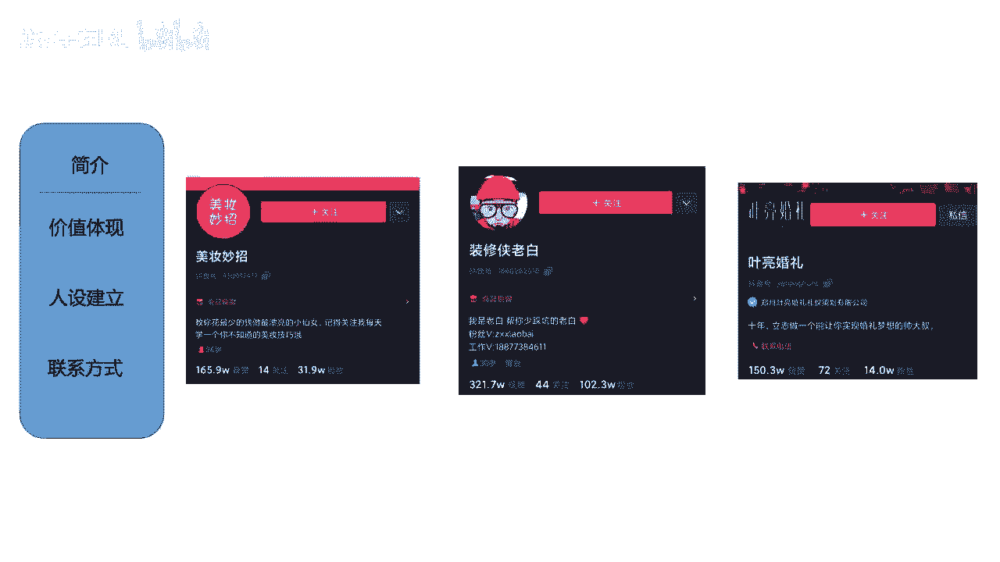
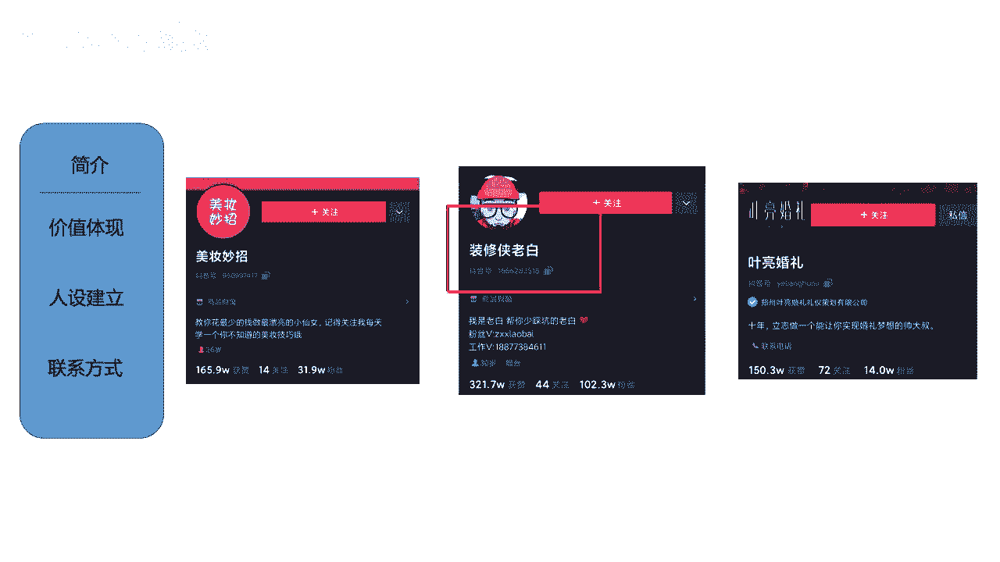
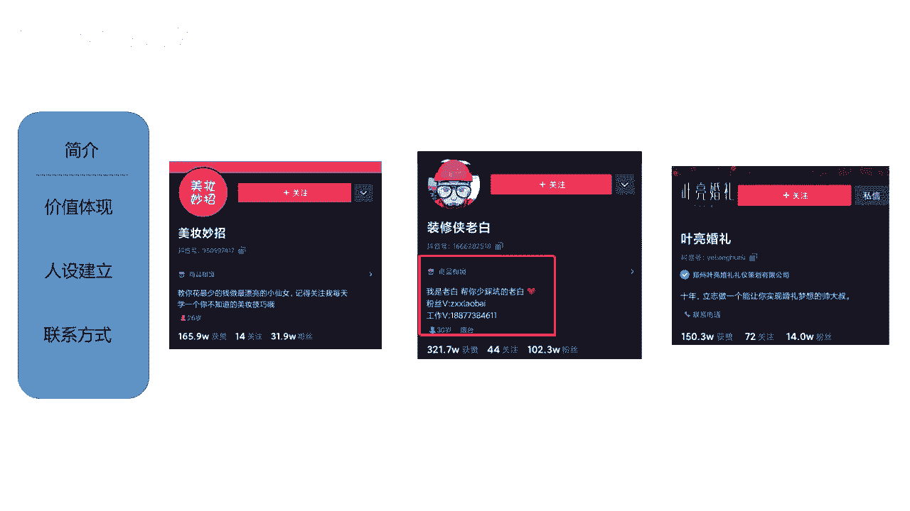
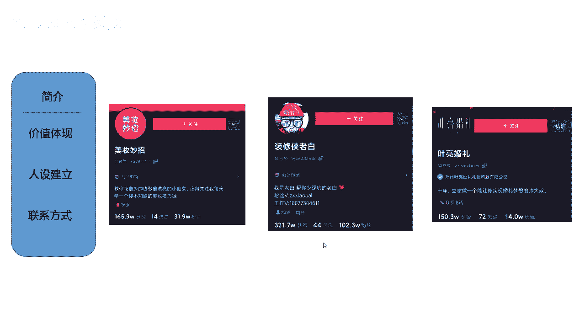
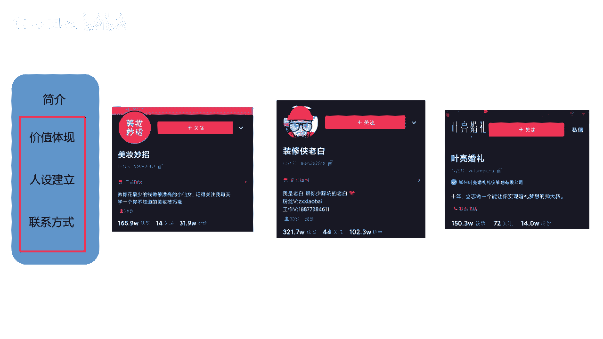
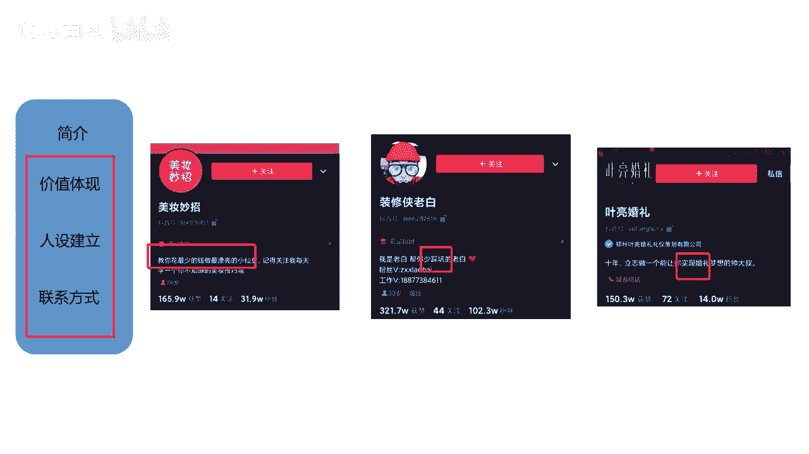
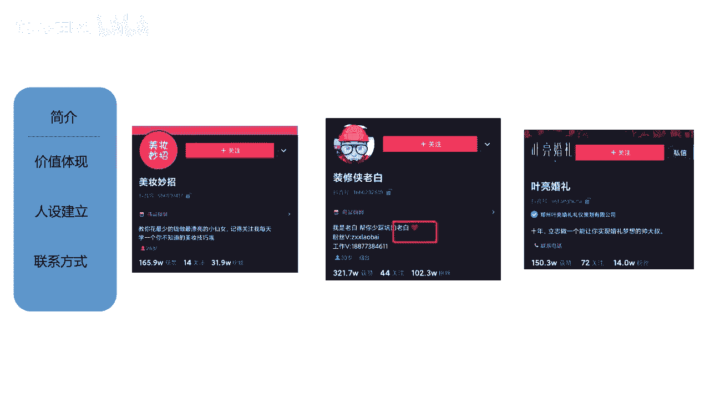
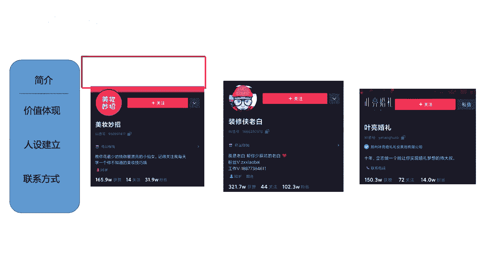
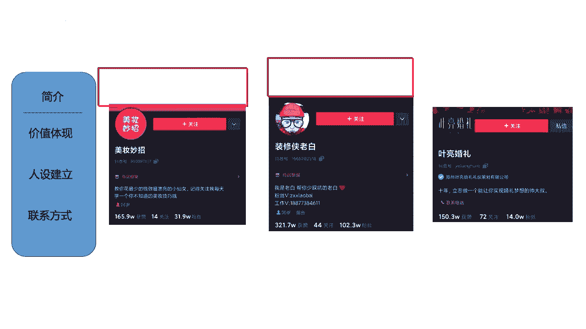

# 【2024最新抖音运营教程】分享花了2.1W买来的抖音课程，目前B站最新最完整的抖音运营教程，起号涨粉变现一条龙教学！ 小白收藏！ - P32：账户简介 - 熊孩子在b站 - BV1wZ421E7Pj

我再来讲简介，那么简介应该怎么去做啊？大家注意啊，简介呢就是把昵称去做一个细分。

あださ。就是直接粗暴告诉别人，你是干嘛的啊，是是是这个样子啊，但是在里面也要注意几个小细节啊，稍后我把这个总结的知识点呢给大家看，好吧。来哈，然后我们讲这个简介，简介把昵称做细分的啊。

比如说我们来看一个啊。😊。

像这个装修老白装修侠老白，它里面我们看到昵称里面啊，它带有装修，然后它带有人设老白，对不对？那么他在他的这个简介里面也一定会涉及到的关键词，就是老白，对不对？涉及到的是什么装修，对不对？

其实就是把它细分出来，然后再做一个补充。我是老白帮你在这个装修路上少踩坑的老白，对不对？或者我是老白在这个装修行业摸爬滚打了十年的老白。

要有这样的一个行业。对，这是我们要体现价值，然后把我们的人设讲出来。那么其次呢啊其次就是我们要怎么样。

留联系方式了啊留联系方式。那么这个地方呢我要给大家讲一下啊，留联系方式。当我们是1万粉丝以下的时候，1万粉丝以下的时候，最好不要写联系方式。😊。

你看他这里留的是联系方式啊，最好是1万粉丝以下不要写，而且在私信里面也要少说微信两个字。因为昨天给大家讲过哈，我们不是有那个引流咨询这个事情嘛。那么引流咨询的话呢，我们一定会涉及到你加我微信吧。

你加我QQ号吧啊，你来到我的线下吧，对不对？一定会涉及到这个事情。啊，当他跟你私信的时候，你有可能就说你加我的微信号什么什么什么那么之前我们有的账号啊，就是因为这样直接去做引流，然后就被评级了。

就是账号就废掉了。😊，大家知道吧？啊，那个时候啊经常就在私信里跟别人说，你加我的微信号。😊，然后导致整个微信就被啊整个我们的抖音号就被评级了。那，如果说你要引流的话。

你最好是在私信里就说你就加我的号就行，不要提微信，也不要提QQ，就加我的号，对吧？这个应该不会有人听不懂吧啊就基本上他们都知道了，我要去加你的微信了啊，这个一定要记住啊，这个一定要记住。

这个是很重要的一点。还有就是呃一万粉丝以下，不要去先更改我们的这个呃简介里面的联系方式，不要去添加。😡。

好吧，那这个要注意。好，然后我再给大家总结一下，紧接我们要三个点，第一是价值的体现。😊。

啊，就是我要教你变小仙女，我要让你少踩坑，我要实现你的婚礼梦想，这个是我的价值。😡。

第二个就是人设要有老白，是不是还有一个什么呀？帅大叔人设要有，其次就是联系方式要留下。

嗯，这是我们的简介需要注意的几个点。好吧啊，那么其实头像啊简介啊，包括我们的昵称啊还是比较简单的。那么接下来我们再讲一讲头图这个事情。那么头图大家知道吧啊，就是在昵称上方的一个图片在这个位置。😊。

啊，基本上大家都采用这种引导关注的头图。

在这个位置啊，我给截掉了啊。😡。

那这个位置的图呢叫做头图。我们先来看一下头图的尺寸，好吧。😡。

好了，我在这里非常不要脸的把我自己的照片放在这里了。😊，来，我们可以看一下，那么头图的尺寸，它要求上传的尺寸是1个1125乘以633的像素。这个是他要求的上传的头图尺寸。但是实际上你传上去之后啊。

你会发现它会遮挡住一些边边角角的位置。所以我们说核心尺寸，或者说能让用户看清楚的尺寸是900乘以400像素。大家知道吧？那这个尺寸大家要注意一下，虽然说我上传的是125乘以633。

但是可能用户看到的只有900乘400。那在这里其实大家可以注意看一下我给到大家的这张图片啊。你看本身的话，125633，它是一个满屏的，看起来还不错。哎，但是当我用900到400这样一截的时候。

我发现我上面的眼睛看不到了，对不对？我下面的脖子也看不到了，就会出现这样的一个问题。😊，所以说。大家在做投图的时候呢，也要注意这样的一个尺寸问题。好吧。😊，好了啊，那大家这个尺寸呢可以记一下可以记一下。

然后呢，我们来接着看一看啊，就是头图常见的几种类型。😊。