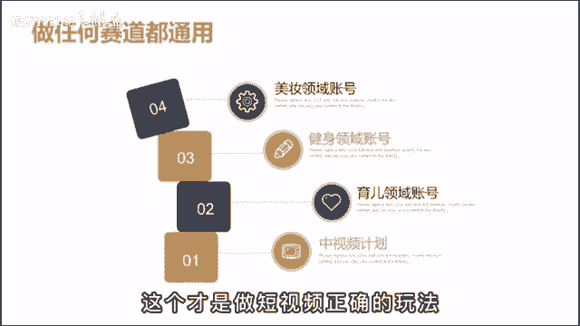

# 【2024最新抖音运营教程】分享花了2.1W买来的抖音课程，目前B站最新最完整的抖音运营教程，起号涨粉变现一条龙教学！ 小白收藏！ - P35：运营篇丨新手最快起号的方法 - 熊孩子在b站 - BV1wZ421E7Pj

🎼小白做短视频从开始到放弃啊，都是卡在了，不知道如何起号上，不知道怎么打标签啊，就一直啊这么稀里糊涂的做着，直到呀放弃了那天。😡，🎼那其实呢做短视频，新号起步是不需要原创的也没必要原创。

在这里呢不是说让大家去抄啊，它不是这个意思，而是说你是小团队运作，或者呢个人在做账号，时间精力、经济成本都非常的有限。你花费太多的时间在原创上啊，费劲巴拉做为一个作品。😊。

🎼那由于呢你对短视频的内容感知还不足，所以呢很可能怎么发都没有播放，会长时间的渗入到一个自我怀疑当中，就很容易放弃。所以呢新手啊在做短频的第一步就是要学会如何低成本的气候。😊。

🎼我呢把它总结为了三个阶段。第一步，低成本喜欢打标签。第二步，验证变现模型。第三步，原创做个人IP啊步一个个给大家解释一下。那为了方便理解呢，我就用中视频来比。😊，🎼比如做户外美食的账号。

一般人啊都会想着说自己去采购食材，然后呢找个地方去拍做饭。😡，🎼那想法呢是挺美好。🎼在实际做过呀，你就会知道这个人类物力都是消耗不起的。🎼在二线城市，三个人的小团队各种花销加在一起，一个月就得3万。

那怎么办呢？可是啊就去有馆值班就好了。上面呢有好多优秀的博主也在发美师。😊，🎼他的画面、声音、场景跟你自己比起来，只有过之手不及。🎼直接发就好。🎼三个人呢一天剪去60条还不过分吗，用不用你写完。

就这么坚持发一个月啊，基本上啊有的号就能大标签了。😊，🎼然后第二步。🎼然力去测试电线模型。🎼最简单的呢就是根你发的作品，来找到合适的商品去带货。🎼然后呢，还有星通广告啊。

比如说会有一些厨房用品的商家来找你合作。🎼那第三个呢就是做培训。🎼啊，你就算起泡的概率只有20%。🎼60作品就是12号。🎼这个粉丝加起来啊至少都有几百万。

🎼在一个月的时间同时能起12个账号累计几百万的粉丝。🎼在外人看来是一件很恐怖的事情。那想入行的人呢都会想要跟你学习。😊，🎼但是呢有你自己才知道这你该那也是问题。🎼第三步，当你的变现模式跑通之后。

就来到了原创环届。哎，你不能一直靠这种玩法撑一辈子，得为了以后的长远来打算。🎼不然呢像有些广告要把产品植入到视频里面，哎不是般的，肯定做不到。🎼就会啊错失很多的机会。😊。

🎼所以这个阶段你就按照之前的视频风格去搭建一模一样的场景啊，比如做的是野外烧烤，你就去找个什么风景秀丽的地方，在一个小河边去堆个吹火啊，连他拍摄用的相机你都买同款，争取完成1比1的幅制。😡。

🎼那到了这里呢，你之后再去参加个什么地方的直播活动，就可以直接拿着十几个账号去参加活动，是补贴了。😊，🎼那这套起号流程呢啊你不只是带通视频，你做任何的赛道都可以借鉴。😊，🎼比如这个口播领域啊。

无论是说美妆、健身、育儿都行得通。🎼啊，你就把别人有结果的视频换个角度直接翻拍啊，一天拍个30条，咱么都起来。😡，🎼做短视频啊，和这个创业一样啊，你不要觉得说很简单，是个人都能做。🎼他就是个概率游戏。

🎼学会去堆料来打破概率的限制。这个呢才是做短视频正确的玩法嗯。

