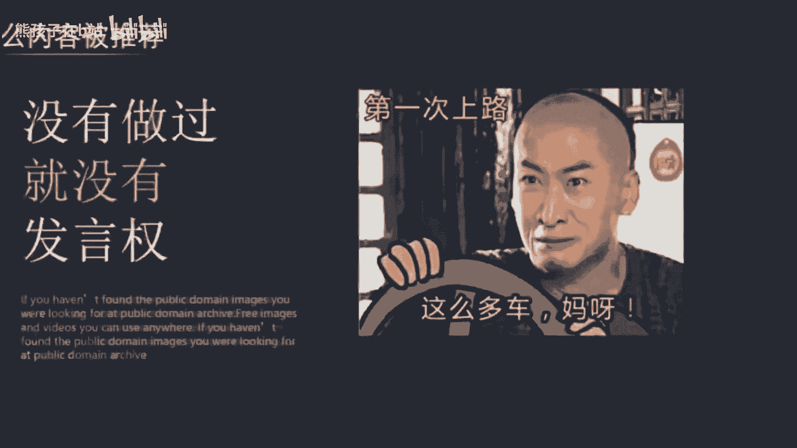
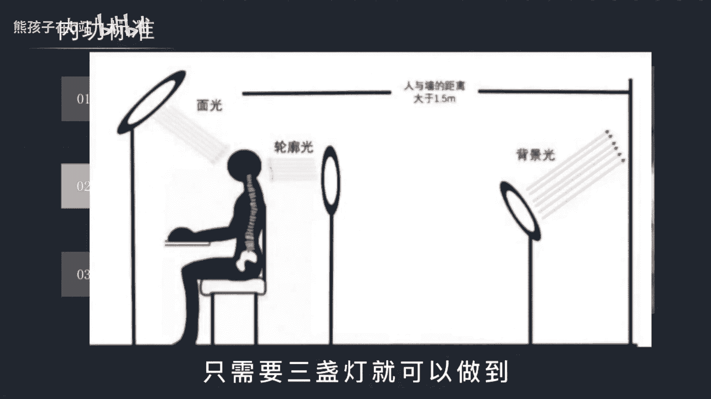
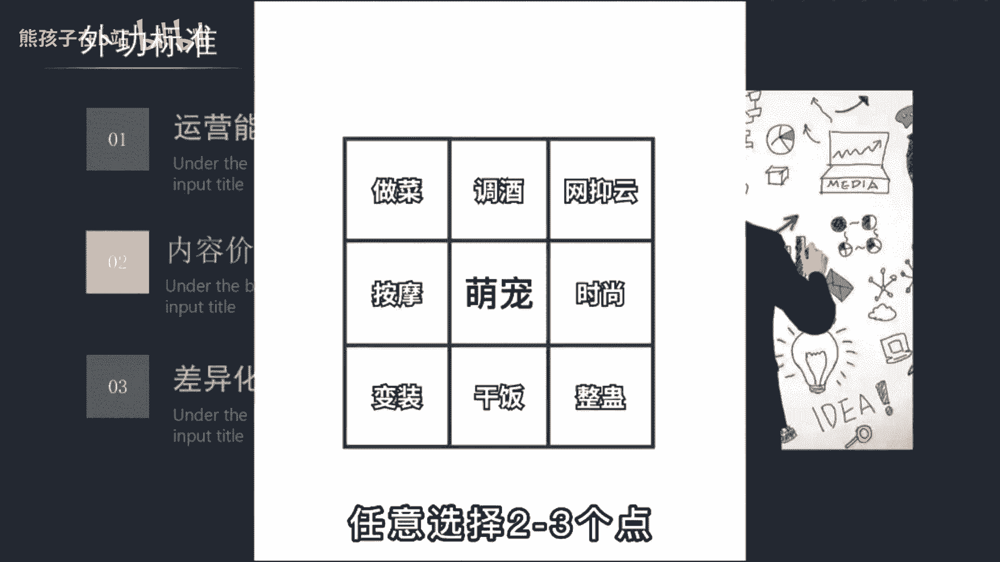
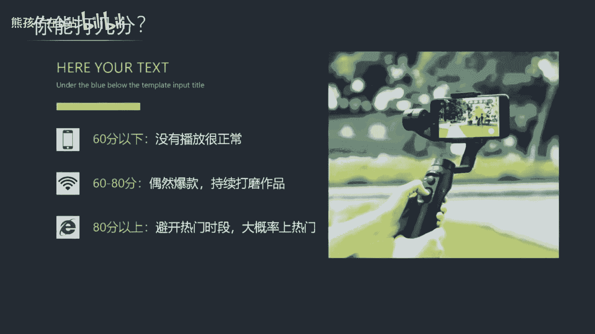

# 【2024最新抖音运营教程】分享花了2.1W买来的抖音课程，目前B站最新最完整的抖音运营教程，起号涨粉变现一条龙教学！ 小白收藏！ - P36：运营篇丨什么内容容易涨粉上热门 - 熊孩子在b站 - BV1wZ421E7Pj

🎼那什么样的内容才会被推荐才值得投放抖家来撬动更大的流量呢？上节视频啊已经给出了答案。但是这个答案没有实际做过账号的小白，根本无法实际理解。有些东西啊只有经历过不会懂，啊，这就和学开车一样。

你嘴上说的头头是道，在一让你上路就手忙脚乱，这就是没有实操的原因。所以这期视频呢我会给你一套打分的标准，哪怕没有经验，靠这套算分值的方式，也能判断自己的内容是不是优质，到底应该优化哪里。

这个打分标准分为内功和外功两个部分。首先，外功啊看的是这三点，画面观感剪辑节奏叙事逻辑，总体呢是40分，画面观感啊属于比较基础的要求。你的画面字体、颜色、音乐等搭配，你让人感觉舒服协调。

清晰度呢保证720P以上。其中啊影响观感最重要的因素，就是光线的利用。在拍口播类短视频时，常常需要通过打光来让人物和主体进行分离，其主体很清晰。😊，🎼经很暗，那这种光应该怎么打呢？啊，就像这张图这样。

只需要三盏灯就可以做到。然后呢是剪辑的节奏，什么跳切啊、离奇啊啊这些专业名词我就不科普了。只要你是做出境类的，我都强烈建议你看看静静香这个账号。它的整个剪辑节奏的把控，镜头的切换，每三秒的一个反转。

抛开剧情都能牢牢的锁住你的眼球，你直接啊去看视频去了解吧。那最后一个呢叙事的逻辑。这点啊是很多新手不太容易掌握的地方。短视频呢它不像聊天那么随意，你必须3秒内就抓住注意力。不然呀。

后边就是再精彩也没有用。那我这里呢给大家一个我自己用的方法论。第一个开头抛出问题，加一二三解答，加结尾总结，或者呢开头抛出问题，加讲述自己的经历，加结尾升华，时间呢控制在一分钟左右。

这样调理就会比较清晰，没有废话，每一句都是重点。接着说内功有运营能力，内容价值，差异化这三点。😊。

🎼总分呢是60分，那为什么会比外公高20分呢？因为啊内容的价值远比技术重要的多。普通人啊一听到运营就感觉啊这东西好专业啊，自己弄不来。其实呢没必要把运营想的那么高级，我用人话给你解释一下。

就是解决一类人群的核心需求，让他带着疑问，看完你的视频，可以尽可能的提高完播率，最后呢还能得到他想要的答案，这就是运营的工作，就比如我这条视频，你想想自己为什么要看到这里在期待上。第二个呢是内容价值。

本质上就能够对用户产生影响的内容，那这个呢比较难说清楚。不过啊这些内容普遍对我一些这样的特点，引我思考，引我发笑，有我激励教我心知，按照这个标准你可以对比一下自己的作品有没有做的。最后一个呢就是差异化。

这里啊有个小技巧。比如说你想做一个萌宠号，那就画一个九宫格出来，把所有你个人的爱好写上去，任意的选择2到3。😊。

🎼个点这样呢就会出现一个差异化的创意。比如他就是用这个方法最终变成了1个1300多万粉丝的账号。因为啊猫咪会做饭实在太稀奇了。😊，🎼通过这个评判标准，你可以看看自己的作品能打几分，综合达到60分呢。

为及格可以正常的发布。80分以上呢为优质视频，适合抖抖家，然后呢持续日更就罢了。因为大多数人啊最擅长的就是放弃别人呀还在对标优质内容。但你有的这个标准就可以对标生产队的驴了。送一句话。

成功的道路啊并不拥挤，只是能坚持的人太少。😊。

