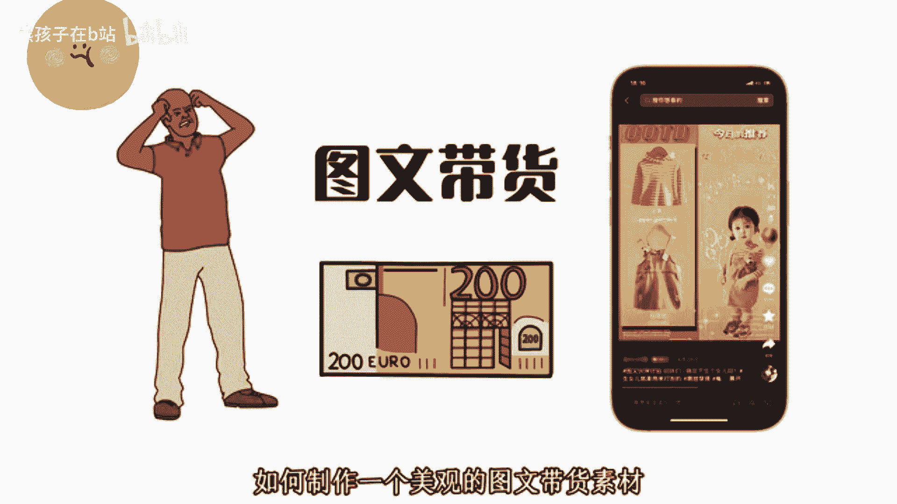

# 【2024最新抖音运营教程】分享花了2.1W买来的抖音课程，目前B站最新最完整的抖音运营教程，起号涨粉变现一条龙教学！ 小白收藏！ - P4：抖音图文带货 - 熊孩子在b站 - BV1wZ421E7Pj

🎼所有人都在告诉你，图文带货是一个风口项目，但却没有人告诉你如何制作一个美观的图文带货素材。今天花2分钟时间教会大家如何制作这种图文带货的爆款素材。首先打开选品中心，找到我们要带货的产品。

保存好产品的图片素材。接着我们打开美图秀秀，点击这里的设计室，新建一个空白画布，选择图文带货，点击下方加图，把产品的图片添加进来，选中这个画布背景，选择颜色，用吸盘吸取衣服的颜色。

然后保存好这张图片备用，继续新建一个空白画布，把刚刚保存的那张粉色的图片添加进来，拖动到右边或者左边都可以。再次点击加图，把粉色图片添加进来。然后点击这里的一键换色，把图片换成白色。

接着我们点击下方这个菜单栏的形状，把白色的图片换成圆形，然后点击特效，选择一个外。

🎼发光的效果，再把这个发光的颜色改成白色完成后，把这个圆形移动到左上角合适的位置，然后点击复制，得到一个新的圆形图片，放到左下方，把两个圆形对齐位置。那么图文大概的排版就做好了。我们继续点击加图。

分别把衣服跟裤子的照片素材添加进来，选择抠图，抠出来的衣服素材放到上面，裤子放到下方，再把真人模特图添加进来，进行抠图处理，移动到右边可以把这个白色的背景换成偏暗一点的颜色，再加一些粉色的线条装饰一下。

然后我们点击下方的贴纸继续添加一些英文字，这样会显得图片特别高级。最后保存好图片，一张好看的童装图文带括素材就做好了。兄弟们赶紧收藏学起来。

