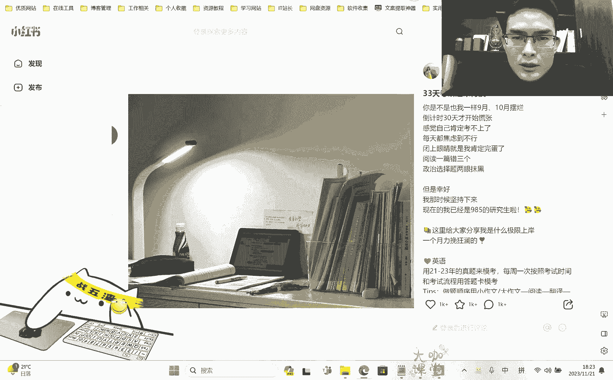
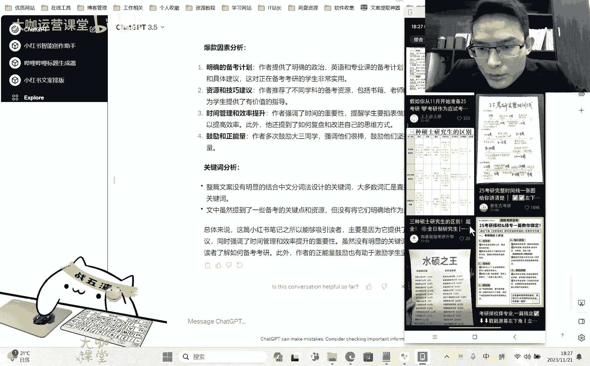
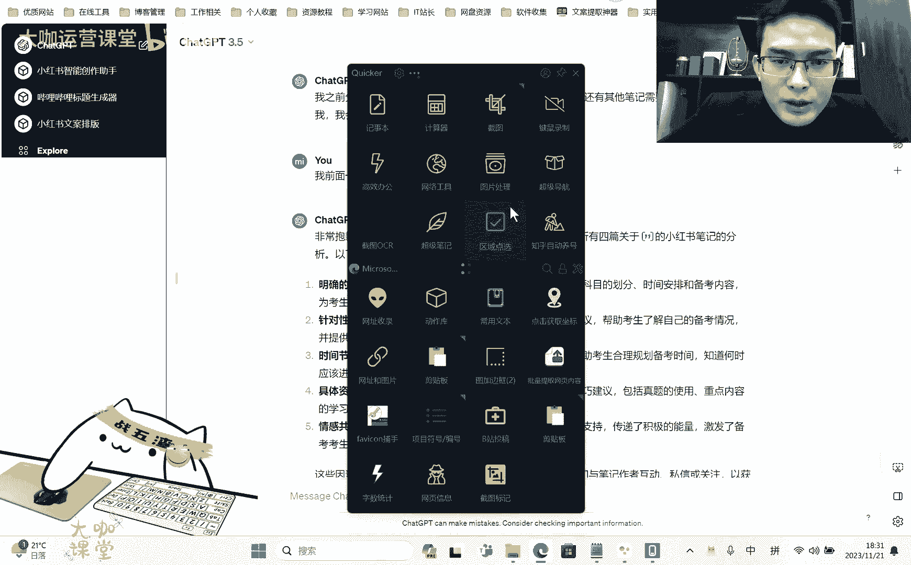

# 【2024最新版零基础转行新媒体运营教程】小红书运营新手起号必备课程 包含所有运营技巧！起号／剪辑／涨粉／赚钱 适合0基础观看 学完直接起飞！ - P15：01.10.03：Ai：训练Ai模拟爆款笔记 到产出爆款笔记的过程 - 大咖运营课堂 - BV1y7421d737

OK好，欢迎大家来到我们这一节，那么呢上一节呢我们通过一些啊，就是喂资料的这种方式告诉他，告诉大家，用这个技巧呢去让这个chat gbt去理解，我们所要求的，我们所希望达到的这种平台的一些啊用词用语。

或者是它的一些内容的风格啊，虽然说上一节呢我们用旅游攻略这个东西呢啊，最终展现出来这个内容呢不是很理想，但是这种方式是正确的，也就是说如果说你做的，你思考一下当下你的这些赛道。

你去提供一些内容去给这个chat gbt，然后让他去透彻的分析你提供的这些文章，并且把这些内容反馈给你，那么最终呢他能够学习到啊，他能够从自己的总结当中，以及你提供这些资料当中学习到这个呃。

这个平台的文案他是怎么写的啊，以及要写成什么样，OK那么这一节呢我们再来看一下，剩下的就是我们怎么去通过让chi gbt来分析，就是一些爆款的这种内容啊，爆款的内容这里边有几个点啊，有几个点。

一个是我们提供这种爆款的这个啊内容，让他去分析这个内容，为什么有哪些可能是导致他爆啊，也就是说它成为爆款的一些点，我们把这些点呢让它罗列出来之后，让他去学习，然后呢让他分析一下这个内容的结构。

这个结构具体指的什么意思呢，也就是说比如说有一篇文案，这篇文案它的一开始啊，开篇提供的是什么样的一个语气词，用什么，开篇是用什么东西来吸引住用户，继续往这个内容的下面去看啊，然后呢。

它的内容中间呢又提供了哪些符合用户需求的，这种痛点的东西来拉住锁住用户，来提升用户的一个停留时长，最后它的结尾又是留了一个什么样的钩子，来让用户呢能够去呃找他要联系方式，或者说私信等等。

形成这样一个互动的一个关系，OK那么这是我们要让他去分析的，还有一个比较重要的点，就是我们要让他去分析一下，就是别人在这个爆款笔记当中，是否有做这个特异的关键词植入，然后这个关键词的话，如果有做的话。

他的这个频率是怎么样的，就是在整体的文案当中，它能占到什么样的频率，它是用什么样的结构来铺设的，这就是我们要研究的几个点啊，那么我们来看一下啊，我们来看一下。

还是一样，我们呢还是要先找到相应的文案，对不对，那么呢这个呢我们就以简单一点的。

就是知识付费这种类比较典型的类型啊，比如说我们来看一下啊。

我们以考研来做吧，好吧咳，我们以考研来做。

这个是拿3000多点赞的，3000多点赞，照常来说考研领域也还可以啊。

也还可以。

OK嗯我看一下啊。

这个提取挺麻烦的。

我直接复制。

OK我把内容复制了。

然后呢我们来开一个新的，我们来开一个新的，这个新的呢还是3。5啊，给你提供一些关于小红书上面的小红书，平台上的考研相关的爆款笔记文案，你需要分析这些文案的呃，爆款因素，嗯比如文案的整体结构。

这个整体结构怎么来告诉它呢，就是说呃分析这个文案的一些爆款因素对吧，这个整体的结构，也就是说呃开篇用什么吸引用户，中间用什么内容戳中用户痛点，结尾啊用什么方式，让用户形成互动或者私信关注，等行为。

开篇结构对吧，整体的结构开篇用什么吸引用户，中间用什么内容戳中用户痛痛点，用什么方式让用户形成互动或者私信，关注等行为，呃还有呃也就是说还有一个，分析我我给你的每一篇笔记的关键词呃嗯，根据整篇文案分析。

该笔记是否有结合中文分词法，设计关键词没有的话，请告诉我没有关键词，有的话啊，告诉我是哪个关键词，这个关键词的出现频率，出现比率OK那那好，我们把这个文案递给他，情感共鸣。

文案一开始以焦虑或担忧的情感吸引读者，让考生产生共鸣，特别是对考研备考的人来说，这种情感非常真实。

很真实吗，我看看，阅读一篇错三个政治选题，两眼抹黑，哎哎是是有这么个说法啊。

嗯逆袭的故事，分享自己的备考建议，备考经验啊，英语和专业课的备考方法，使用表情符号啊，增加了情感表达，让文案更加具备亲和力啊，对对对啊，使用了一定的这个表情嗯，嗯结尾鼓励和正能量。

文墨鼓励读者不要责怪自己啊，好关键词的一个分析，整篇文案没有明显的结合中文，分词法涉及的关键词，大多数词汇是直接的常用词汇，没有特别的关键词，为什么具备备考的关键点，但没有将他们明确的作为关键词来强调。

和突出显示。

OK好，我们再来找一篇，我们再来找一篇啊。

好这一篇呢也还可以啊，我们。

罗翔老师说我看一下他，他他认不认识罗翔这个人啊，如果说呃他知道这个人，那他们那么他应该是能够分析出来，前面通过罗翔这个东西啊，不额罗翔这个人物，然后呢，这个知名的人物去做了前面的一些呃人员的。

这个用户的一些锁定啊，不好意思，一些词汇上面的那用的不是特别好啊，罗翔老师的话语，嗯还是没有关键词啊，他准确的呃识别出了罗翔老师嗯，然后呢描述了很多大学前3年的一个状态。

这种语言让读者产生共鸣还是一样啊，情感共鸣对吧，我们看一下他给的这个前面这一点，爆款因素对吧，这个是情感共鸣，然后呢这个呢，等于什么情感共鸣，情感认知转折对吧，逆袭故事哎。

也就是说相当于是唉还是分享经历嘛对吧，提供一个详细的规划，提供实用的建议，推荐一些资源和建议嗯，然后呢时间节点明确啊，正能量鼓励等等等等啊，这是这个结构，是不是很很眼熟啊对吧，差不多啊，差不多差不多好。

那么呢我们再提供一条。

我们再来提供一条，找一找。

我们找这种数据高的啊，这是什么来着。

好这个也有一定的特色啊。

嘿。

专业课，明确的备考计划，作者提供了明确的政治，英语和专业课的备考计划，包括学习方法，时间节点和具体建议，资源和技巧建议，时间管理和效率提升，作者强调了时间的重要性，提醒学生要掐表做题，控制时间。

在25分钟内提高效率啊。

也没有关键词，OK嗯。

再来我们给他提供足够的啊。

这个是机构的，机构的，我们不用来找一些这种个人博主的。

没有了吗。

嗯这个是我们刚才用过的。

嗯这个没有用是吧，这个排名还挺靠前的。

第一个阶段，备考时间表啊，呃政治英语数学专业课，他好像已经跑题了嘞对吧，我们需要让他分析对吧，来给他拉回来拉回来怎么拉呢，编辑，然后的话呢，把我们上面这个额，最开始的要求给他重新提一下，他肯定是忘了啊。

他肯定是忘了，嗯我们提供的内容在这里啊，这就是3。5跟4。0的一个区别了啊，说实话的他有时候他真的他自己都忘了啊，你得你给他的目标，你非得去强调明确的备考计划啊，针对性的建议，时间节点明确啊。

具体资源和技巧建议正能量鼓励啊，关键词分析好，那么呢我们给他喂资料就喂到这里了嗯，他分析的也还不错，那么我们提供资料的阶段结束了，那么剩下的我们需要做一个什么样的操作呢。

就是让他把他之前分析的这些爆款因素，来做一个整合，去重和整合，把一些就是每一个呃关键的这些点爆款因素，把它结合到一起，整合成一个列表，让我知道就是正常的有爆款的这些内容，就是他分析过后之后。

这些点我们把它列成一个表，先把上面你分析过，你分析过的关于，考研这几篇笔记的爆款因素总结总结一下，嗯对吧，总结一下啊，就这样就够了，就这么时间节点明确针对性建议，嗯你前面分析了几篇几篇笔记。

嗯我们帮他回忆一下好吧，两篇怎么可能才两篇呢，我们来数一下啊，E篇哒哒哒啦啦啦哒哒哒哒哒哒，两篇三篇，四品OK，我前面一共让你分析了四篇笔记，你再重新回顾一下，咳咳。

嗯他想起来了啊，他想起来了。

虽然说呢这个内容，好像他给的还是差不多的是吧，我们来看看他给上面的明确的备考计划，针对性建议，时间节点，明确具体资源和技巧建议，情感共鸣和正能量鼓励啊，总共给的都有这些对吧，总共给的差不多就是这些了。

有没有什么突出的点，我看一下他没他漏掉的明确的备考计划，时间管理和效率，提升时间节点啊，时间节点，咳咳咳，然后这个呢是提供详细规划针对性建议，然后推荐资源啊，具体资源这里有正能量的一个鼓励啊。

这个也有使用表情符号对吧，然后呢逆袭故事情感共鸣啊少了，对不对，情感共鸣有那个逆袭故事，有没有逆袭故事，他没有啊，这就是他的一些啊智障的问题啊。

智障的一些点呃，我们这样，我们现在让他写一篇好吧，按照我们的一个啧规划来对吧，嗯接下来呢我需要告诉他，我要写一篇什么呀，我要写一篇这个关于考研的这么一篇笔记，让它融合一些爆款这样的一些点啊。

就是前面学习到这些点，把它融合进去，然后呢先给我列一个大纲出来啊，这个大纲呢呃列出完了之后呢，还要写出每一个大纲的一个细化的要点。

我们再根据这些要点去筛选，哪些是我们要的，再根据这些要点来写文案，Ok，规划一篇嗯，我要写一篇小红书呃，写一篇关于考研的小红书笔记，请结合对吧，请结合你分析的呃，你前面分析的这个爆款笔记因素。

帮我梳理一个具备爆款因素的笔记大纲嗯，嗯每个大纲节点要细，要细分，不同的小小节点啊，在我确定没问题了之后，再生成笔记，再生成文案，介绍啊吸引读者注意啊，开篇用引人入胜的这种话语或者问题，吸引读者的兴趣。

介绍主题啊，介绍主题也就是呃简单的告诉别人，我这个笔记是关于什么的啊，就是考研备考，然后呢专业选择分析专业，然后时间规划，政治备考，英语备考，数学备考，专业课备考，咳咳咳，时间管理和心态调整。

互动和互相关注，提醒读者互动，鼓励读者提问，诶诶这个还可以的啊，嗯那假设假设呢我们现在这个他给的大纲可以，那么接下来呢我们就让他来通过通过这个大纲，提供的大纲可以请按照大纲，嗯写写出，嗯写出具体的文案。

文案的结构要严格，按照爆款笔记因素和结构来写，呃，并且需要你提供一个简单的逆袭小故事，引入观众的，引入读者的情绪，并且要包含要包含这个，emoji表情，要包含一定的这个词啊。

这个用词真的跟AI对话的时候，这个用词很讲究对吧，你如果说你包含丰富的emoji表情对吧，他可能给你这里加一条，那里加一条，每一个都给你加的很多，但是如果说你给它不要这个词，你给它包含emoji表情。

它可能就给你加那么三五个两三个，所以说啊这个用词的话呢，有时要让让他理解你的这个呃意图，可能这个用词上面我们还得琢磨琢磨啊，一定量的吧，然后文案中，要结合中文分词法的方式融入，融入关键词。

关键词是什么呢，我们来看一下啊。

考研全流程，考研政治就这样。

关键词的话就是考研，Ok，我看一下他能给我们写成这样啊，我看一下啊，首先前面呢当你曾经迷茫，觉得时间不够用，考验他们速率，我理解那种感觉，这个地方就很有那种味道了对吧，我理解那种感觉。

但是我也亲身经历了整个逆袭的过程，让我来告诉你，只要你下定决心制定一份合理的考研，绝对不是遥不可及的梦想，OK这里呢给了一个呃呃简单的小故事啊，这这这这这可能算不上故事。

但是这几句话呢能够让别人理解一种啊，就是切身的那种感受，就是我确实我曾经也这么经历过啊，我也是从这么走过来的，让别人产生一种一定的这种共鸣啊，能够继续往下看嗯，然后这下面就具体的一个时间规划对吧。

明确你的备考时间，2023年的11月8日开始考研，那么现在就是他人的时间宝贵，千万不要浪费啊，专业选择嗯，你专业不在考研适合，但不要再相信明年，如果说你的专业适合考研，大胆前进吧，不要啊。

这个这个文案就很傻了啊，这个文案就很傻了嗯，政治备考，嗯英语备考，嗯这个时间线还可以的哦，结合我们上面提供的内容，然后数学备考扎实的知识体系，给出了具体的日期，具体的内容，诶那这个文案写的倒还可以哦。

啊整体的在这个专业度上面还是不错的，时间管理和心态调整，最后但同样重要的是时间管理和心态调整，合理分配备考时间，坚持每日学习，不要浪费宝贵的时间，保持积极的心态，克服焦虑，无论多困难，只要坚持不懈。

你也可以像我一样啊，你也可以像我一样逆袭上岸，加油啊，联系我，如果你有任何问题需要，我随时都在这里，通过严格按照爆款笔记因素和结构啊，他还没写完呢，怎么了啊，还没写完啊，整体的文案相对来讲啊。

倒是呃勉勉强强足够，就是我们真正的可说如果说优化的话，可能还需要去让他去调一下，就这篇文案就对于正常的我们做运营来讲呢，可能还足够了，但是如果说对于我来讲，我可能还有很多的一些想法。

我会融入到每一篇笔记，把这个笔记呢做得更加的丰富，更加的简洁啊，这不冲突啊，丰富和简洁它是不冲突的，然后呢把这个内容做一个整体的一个质的提升，但是对于我们正常的呃做运营的人来讲呢。

普通的这种运营运营人员来说，你写这样一篇文案呢，他其实是可以的对吧，当然了，这是我们的ChatGPT一个3。5，那如果说你用4。0，那肯定会得到一些你意想不到的一些效果对吧，更何况我们现在呢。

呃这个在GBT的这个GPTS啊，他还能创作很多，就是符合我们自己的这种呃内容的一些版式，比如说啊我写的这个小红书的一个文案排版，对吧。

我简单的去弄一下对吧，我可以在这个里边加上什么呢，我可以在这个里边加上，就是呃我需要给他提供的要求，我可以给他提供一些文件，这些文件里边呢有一些专用表情诶，有一些这个相关的这种小红书风格的，这种内容呃。

就是他的一些这个文案题材呃，就是文案借鉴，就是这些资料我能够放在这里让他去学习，也就是说打造真正属于我的这种私人的啊，这个呃就是我的这个AI助手嘛对吧，那么正常的我们用这个HISPT。

有时候可能会遇到一些啊，比如说他忘了我前面讲什么呀，或者说他忘了我强调的这些东西啊，就在导致我们后面用的过程当中啊，就要重新去提供一些指令，那GBTS的这个创建呢，就是还是很还是很方便的。

OK还是很方便的。

OK好，那么呢这就是我们这一节课。

要跟大家传达的一个点好吧，那么呢呃我们后面还将继续分享，关于AI这一块的一些创作的技巧，和一些这个小红书方面，还有我们抖音这一块运用的一些方式好吧，那这节课呢就先给大家讲到这里。

