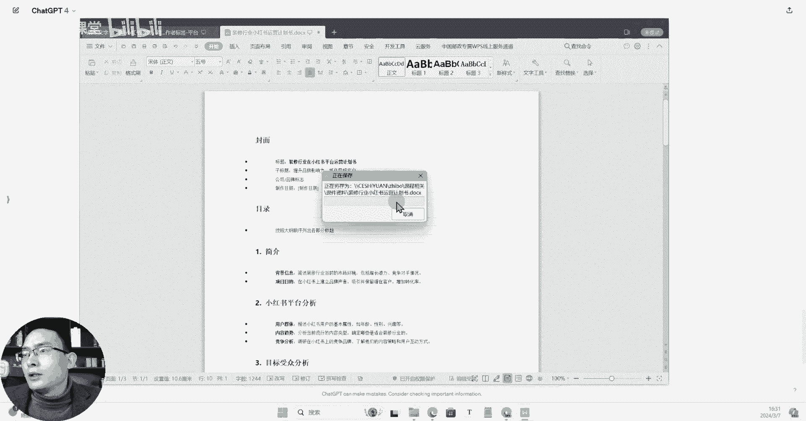
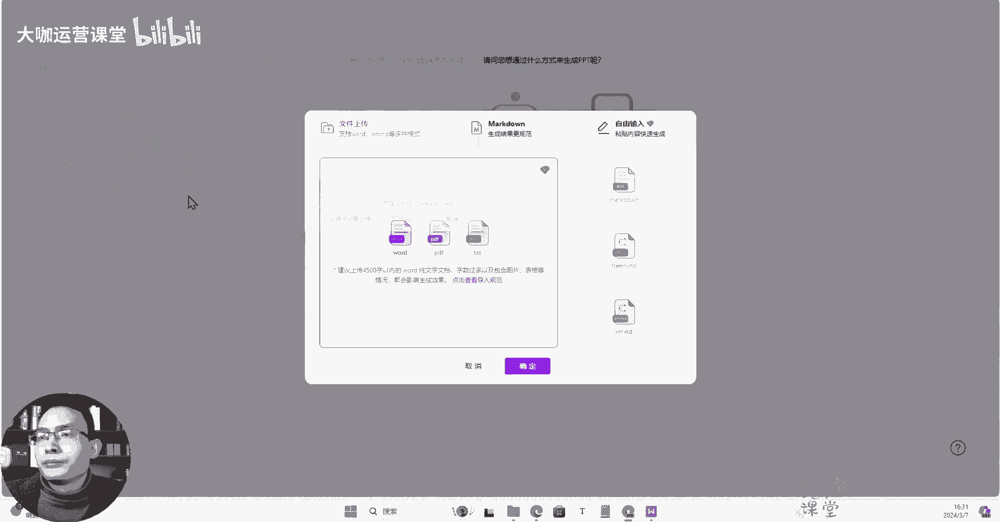
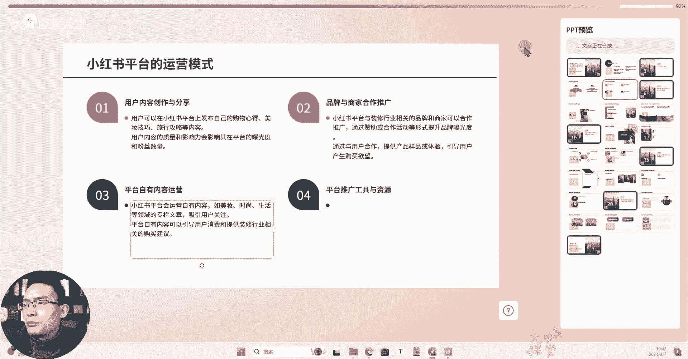
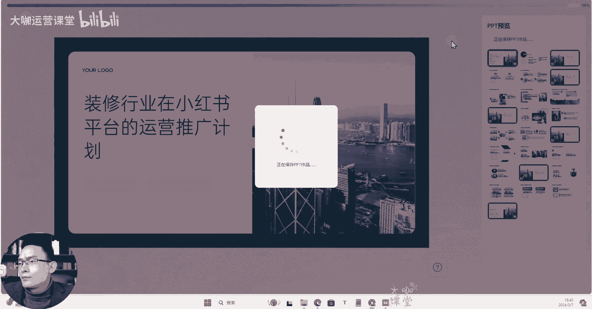
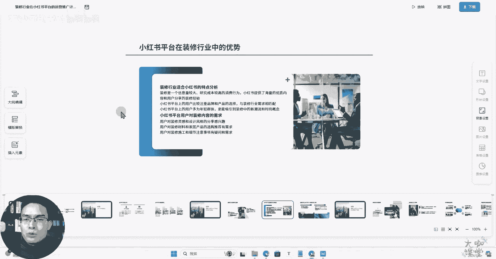
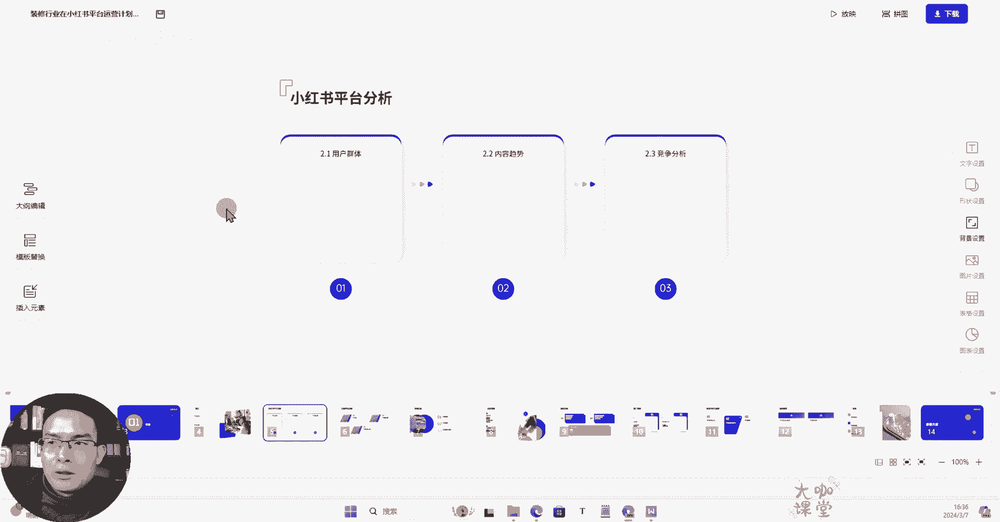

# 【2024最新版零基础转行新媒体运营教程】小红书运营新手起号必备课程 包含所有运营技巧！起号／剪辑／涨粉／赚钱 适合0基础观看 学完直接起飞！ - P18：02.3：工具篇-Ai生成PPT 第2款强大的PPT自动生成工具 - 大咖运营课堂 - BV1y7421d737

大家来到我们这一节课，那么这节课呢我们再给大家分享一个，关于我这边用的还不错的一个AI，生成PPT的这么一个工具，那么呢前面呢我跟大家分享了一个还不错的啊，这个工具用来生成PPT的一个AI工具。

但是呢它这个平台上面也有一定的缺陷，就是模板也比较少，生成的这个内容呢，偶尔跟我们料想弄成的一个区别还是挺大的哈，那么这个今天跟大家分享的这个工具呢，就是它在有几个优势啊。

一个就是它呢生成这个速度比较快，然后呢也比较稳定，但是呢呃他的这个什么呢，呃就是我们要把这个PPT，或者说我们要做的这个大纲节点的内容呢，给他做的比较详细，比较丰富。

然后他才能分析出来一个比较不错的这个模板，然后另外一点呢就是它的模板啊还挺多的，非常丰富，模板数量非常庞大，就是我们可以选择各种各样的样式去调整，我们的一些细节，就是我觉得这个工具相辅相成哈。

结合之前分享的这个AI生成PPT的工具，两相结合，还是能够给我们提供很多，在这个生成PPT这一块的一个呃工作好吧，那么呢我们先来看一下他一共有两种方式，首先呢一个是AI智能生成，一个是导入本地大纲。

那么呢我一般呢都是导入本地大纲来生成呢，会比较额多一些，那么首先呢我先用这个CHRGBT我来写一个，就是呃写一个主题哈，让他来提供一个大纲，嗯我们使用4。0，要求，是一致，好就这样。

我让大家先写一个大纲出来好吧，帮我完善每一个小节点的具体内容信息，保持好结构和格式排版，好的，我们重新提问，让他继续做，好那么他已经生成完了额，那么我们可以看到，其实有一些细节点他没有给出详细的内容。

比如说教育内容制作，装修知识技巧分享等，教育性的内容，其实还可以再拓展和延伸，包括前面呢描述小红书用户的基本属性，年龄性别兴趣，其实呃ChatGPT呢，我们再把指令完善一下。

他可以把这一块的内容帮我们做好，而不是只是相当于做一个总结哈，那么我们现在呢我们就不要求那么高，我们基于它提供的这么一个呃目录和内容，然后呢我们来去用这个I工具，我们来生成一下我们的PPT。

然后呢我们将内容贴进去，额基本上是不用调的啊，他这呢带有一定的格式，我们就基于这个格式呢来生成好的内容。

准备好了，我们来到这个地方，我们选择导入本地大纲，然后呢选择导入本地文件。

好的，他现在呢在梳理我们的一个大纲结构，速度还是非常快的啊，我喜欢用这个工具的一个优点，就是它的这个怎么说呢，他的这个反应速度很快啊，不会经常出现各种各样的卡壳，然后呢他现在提取到的这个大纲。

我们来看一下，接下来呢我们挑选PPT的一个模板，模板非常多啊，很多很多，我们挑选一个装修行业比较适合的，这个颜色风格，好我们选择一个风格，然后呢我们点击生成PPT，我们稍微等一下，OK我们可以发现。

就是有一些内容他并没有加载进去，比如说像这种呃，内容趋势下方应该是有一定的东西，小红书平台的分析，我们来看一下啊，用户的群体分析当前流行的内容类型，确定哪些是适合装修行业的。

其实呢这一块啊并没有融入进去，我们在那个大纲编辑的环节，可以将这些内容呢填充进去，它可以呢基于这个内容来做生成，那么这是一个已经成型的一个模板，那么呢我们正常的编辑内容呢，在右侧它有文字设置，形状设置。

还有这个背景设置，就是比较完整的一个PPT的一个编辑，这样的一个在线编辑的一个工具，因为我之前分享给大家的那个呢，在使用起来会怎么说呢，可自定义程度会高一些啊，那么比如说呃像这些目录这里呢有缺失的。

我们可以让他重新再生成一下，一直到它可以生成符合我们这样一个效果的呃，一个具体的一个情况，然后呢这个地方呢啊比如说大纲编辑，大纲编辑的话，这个地方是目录，然后章节背景信息。

背景信息呢这块是属于详细的一个内容，我们可以在这个下方呢回车啊，把这个内容呢给它加进去，或者说我们直接加到这个地方也可以，然后呢我们来点击它，有一些功能，比如说我们在这里呢。

发现它的一个排版并不是特别好看，我们单击一下，这里呢有相应的页面可以去做更换啊，一键就可以更换，OK这是他现有的，然后呢其他的也是一样，我们可以选择自己觉得合适的这种内容模板，还可以进去做替换。

然后的话呢，呃当然你这个已经生成的，也是可以更换模板的啊，在这个地方有一个模板替换，那么我们来试一下，我们点击应用它的速度是非常快的啊，响应速度是非常快的好吧，模板的样式，内容，那么符。

可以符合我们基础的这块PPT的一个编辑的需求，具体的就需要我们把内容放在这里呢，让他去做生成，或者说我们去做填充啊，这个呢AI有时候并不是特别智能，但是我觉得你把内容结构给他准备好，还是可以完成的。

我们在线更换图片，这些有的也都可以办到，好的那个这个是我们的额这块的一个生成，也就是我们这个工具好的，那么我们再来看一下这个AI生成PPT的工具，它的一个我们输入主题了之后。

它自己来自动生成我们的大纲和内容，那么我们来试一下，我们点击AI智能生成，然后呢在下方输入我们的主题，比如说我们刚才生成的是装修行业，在小红书平台的运营推广计划，然后呢我们点击箭头让它生成好的。

他目前呢正在构思我们的一个大纲，大纲生成的还是非常详细的，我们可以结合自己各个每一个人在不同的行业，你们所正在操作的一个产品，或者说你们的一些特性来输入详细的主题，让他来结合生成。

那么呢我们呃大纲已经好了，我们来挑选一下模板，还是一样，装修行业我们看一下啊，就用这个，然后呢我们点击生成PPT，好的，那么在这个情况下面，它提供的这个内容呢，呃就是他自己去根据你提供的主题来生成的。

这个PPT内容，它是可以去把下面的这个详细的文字内容，给你生成完整的，那么我们来看一下呃，先等它生成好，好的下一步他就开始合成我们的文案。

好的已经生成完毕。

那么我们接下来点击去编辑页，在我们的编辑界面还是一样，我们可以去调整它所有的字体，然后呢它的样式，我们更换模板等等，这些都可以办到，还是非常方便非常便捷的啊，还有很多的这个模板样式供我们可以选择。

那么我们也可以在这个地方呢，编辑大纲的具体内容，然后也一样可以选择其他的模板来查看样式，在我们查看的差不多的呢，我们就导出一个PPT的风格，或者说我们在线把这些素材呢，替换成我们自己的都可以，Ok。

那么这就是我们这节课要跟大家分享的，这个工具，结合我们之前的AI工具呢，我觉得这个工具呢有它独到的一些优势，那么其他的我就不说了，这两个工具呢是我用的AI生成PPT里边，非常好用的两个工具。

也是我自己偶尔会用到的，那么呃在第二个这个工具上面呢，它的反应速度更快，它可提供挑选的这个模板数量也更多，只不过呢我们要想用好它，我们把这个呃，我们把这个我们自己的大纲的这个。

节点的内容啊给他做好了之后，可能我们需要调整一下格式，把这个具体的内容呢在我们的文档里边呢，给他做一下排版，然后比如说像这个他可能只摘取了这个名称，那么我们如果说测试一下，给它换个行。

然后让它更好的去理解，我们提供的这个节点内容，说不定它能够生成的更好，那么他自己基于主题来生成呢，肯定有一些是不是我们想要的，我们自己呢去结合AI工具，把这个大纲主题设计好了之后，让它来生成。

应该是会效果更好的，那么呢同样的这个工具的领取入口，我一样放在我们的视频下方的置顶评论区，还有我们视频的一个简介信息里都有领取地址。

如果说感兴趣的可以再去试一下，它的这个根据主题来生成模板，生成对应的PPT，这就是我们这一节课要跟大家分享的工具，那么这个工具呢一样领取的这个地址和方式呢，我放在这个我们评论区置顶评论。

以及我们视频下方的简介信息里，都有领取方式和入口。

