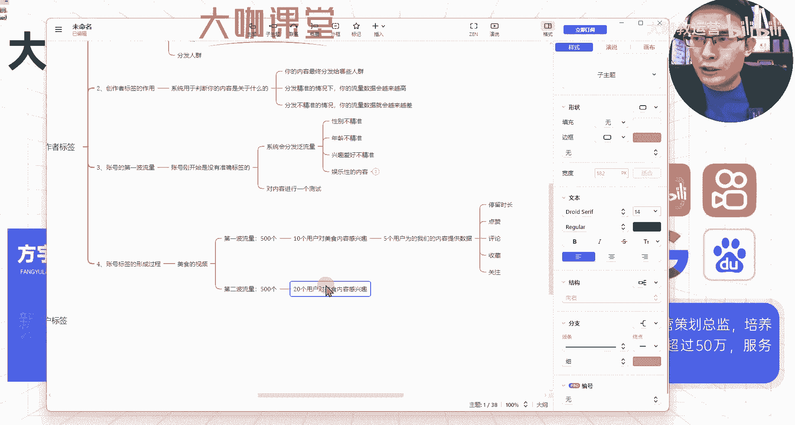
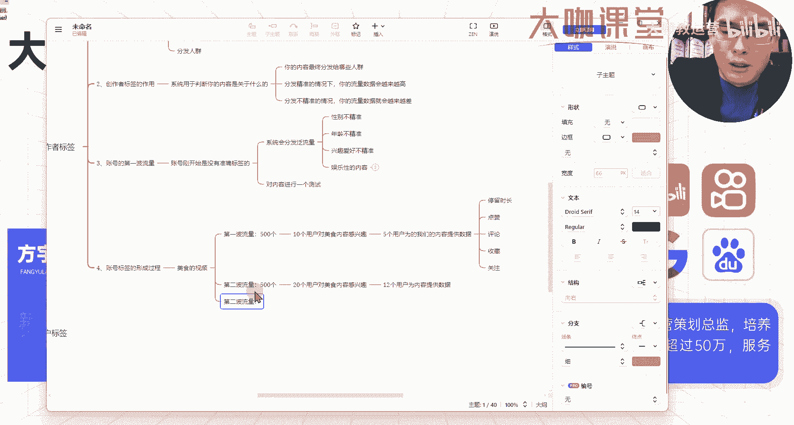
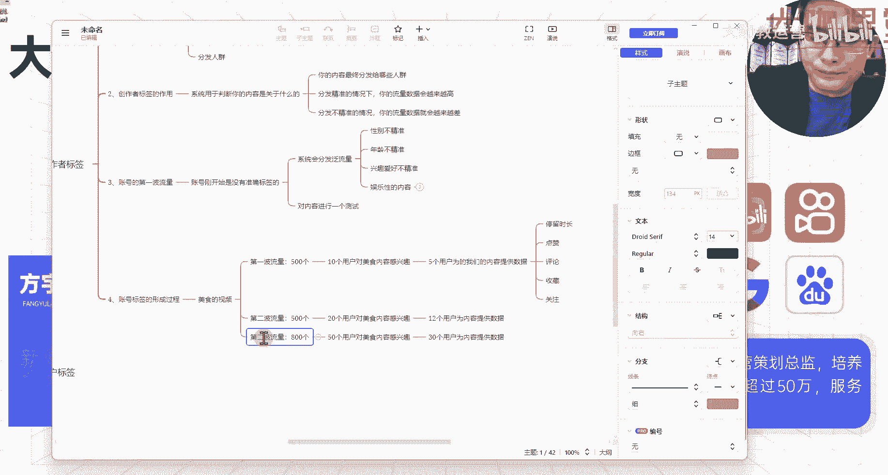
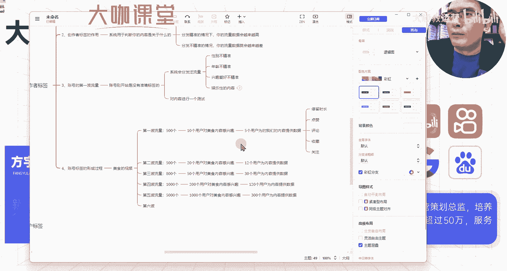

# 【2024版】新媒体运营全平台学习路线图，B站最强小红书运营零基础教程，入门到实战所有干货，抖音短视频全套课程，手把手教学！ - P3：2、新媒体运营第一课：账号流量的层级演化过程 - 大咖教运营 - BV1Mw4m1k755

好，那么第四步我们来看一下这个账号标签，它的一个形成过程。

或者说这个账号标签跟我们流量之间成长的，这么一个模型到底是怎么来的。

我们来看一下。

账号标签的形成过程，那么这个时候假设说我们的账号。

现在想做美食相关的内容。

我们发了一篇关于美食的这么一个视频，或者笔记，我们来看一下美食的视频好。

那么这个时候我们发布出去视频之后，我们就会有什么呀。

我们就会有第一波流量，第一波流量。

假设说我们第一波流量有500个，OK那么这个时候我们来推算一下，这500个当中是绝对，或者说肯定有这么一定的这个用户，他是对我们的美食，这个版是特别感兴趣的这一部分人群，那么这个时候。

我们假设说我们的500个流量当中，有十个用户对美食内容。

十个用户对美食内容感兴趣，那么这十个是我什么呀，他是我们的一个精准流量，那么在这十个精准流量当中，在我们的流量，或者说在我们的内容制作非常优质的情况下，也就是说我们内容还不错的一个情况下。

我们假设这十个精准用户当中，有五个用户为我们的为我们的内容提供数据。

什么数据呢，这五个用户他们觉得我们内容做的还不错诶。

长得特别符合他们的胃口，那么这个时候他们会提供哪个数据，首先第一个就是我们的一个平均播放时长，或者说我们讲的完播，那么我们就呃我们叫它叫停留时长吧。

也就是这部分用户他会看我们的内容，看多长时间。

30秒，40秒，50秒，相对来讲这个十个用户，或者说我们剩余的这个490个用户来讲。

这部分用户他们停留的这个时长算是比较多的。

好这个是停留时长，除此之外还有什么，还有我们现在的新媒体平台非常多的这个点赞。

评论收藏，还有我们的关注等行为对吧。

这个就是我们这500个流量当中，我们获取到了五个精准用户。

给我们的内容提供数据，那么这五个精准用户呢，他肯定是这有一部分呃，十个精准用户当中，他不可能是百分百，所有的内容都是所有的人群。

对你的内容都感兴趣，我们假设有五个用户给我们提供这样的一个呃，数据支撑好。

那么这个时候平台还是没有办法去判断，你的内容到到底是不是关于美食的。

他不可能说凭借五个用户提供的数据，就觉得诶这个账号呢是制作的关于美食的视频。

那么我下一步应该给他推关于美食的流量，这个是不会的，那么下一波这个平台呢。

他还会对我们的流量去进行一个测试，那么这个时候迎来了我们第二波，第二波流量。

迎来了我们第二波流量，这个第二波流量他很可能还是500个流量分发。

那么这500个流量当中就有点不一样了，我们前面讲的是，十个用户对我们的美食内容感兴趣是吧。

那么这个时候500个流量当中，可能就有20个用户对美食内容感兴趣。

这个是基于什么呢。

基于平台对我们的内内容的一个呃，这么一个判断的情况下，我们可以看到十个用户当中呢。

有五个十个对美食内容感感兴趣的用户，有五个用户为我们的内容提供数据。

那么平台呢它可能，但是他又没办法准确的去判断它只能做什么呀。

他只能去做测试，他来小小的提升一下，对美食内容感兴趣的这个用户占比，然后再从这一部分用户当中，去判断你的这个内容，他们对你这个内容的一个感兴趣程度好。

那么假设这个时候是20个，对美食感兴趣的用户当中。

我们可能得到十个，或者说12个用户为内容提供数据。

还是这些数据对吧，我们这个时候呢获得了12个用户提供数据啊。

那么平台呢，它可能再一次加深平台对我们内容的一个判断，它有可能在下一波流量当中怎么办。

他继续提升对美食内容感兴趣的用户占比。

那么第二波流量我们可能得到什么呀，第二波流量我们可能得到800。

或者说1000个流量的这样的一个分发，那么在这个流量分发的基数下，我们不光说泛流量提升了我们的精准用户平台。

一样会给我们提升，但这个时候只是我们以为的精准用户平台呢。

还没有办法去判断，那么假设说这个时候是800个流量对吧。

那么其中可能就有50个用户，对美食的内容感兴趣。

咳50个用户对美食内容感兴趣。

OK那么在这种情况下还是一样，我们的内容制作比较精良的情况下，我们可能得到多少。

假设说这个时候我们得到30个用户，为内容提供数据的情况下。

我们是不是这样的一个视频，我们就能得到30个。

比如说还不错的停留时长，以及我们的点赞评论，收藏关注等等行为，综合起来有这么一些数据。

对于我们前期账号的一个成长，假设说你的账号现在你发布的视频诶。

到了这个阶段有这么些内容，用户给你的视频提供这些数据支撑，那么至少这些用户。

他是对你的这个内容是感兴趣的，而且呢这个用户他可能是对当前这个赛道。

他是感兴趣的，OK这就是我们第二波流量获取到的，这么一个数据。

但是这个时候还是不能平台还是一样，它不能准确的判断他，或者说他不能一锤子敲定。

你这个账号创作的内容就是跟美食相关的，而且你的创作内容特别优质。

那么怎么办，我们可能会迎来第三波，或者说第四波的一个流量分发。

嗯啊第四波第五波哈。

假设说我们迎来了第四波流量。

OK我们第四波流量呢有1000个流量对吧，有1000个流量。

那么这个时候有一种可能，在前面的几番测试之下，他会平台会挑一个时间节点。

或者说挑一个你的内容还行的情况下，他来给你分发一个更多的一个精准用户。

这个时候假如说1000个流量分发当中，有200个用户对内每对美食的内容感兴趣。

这个时候你获得了200个精准用户，那么这200个精准用户对你视频的一个行为。

就决定了账这个平台怎么去判断。

判断你发的内容是关于什么的，那么假设说我们有200个精准用户了，好这200个精准用户当中。

我们不要多的能有120个用户给你的内容。

为内容提供数据，那么这个时候我们就已经算是初步成功了。

你想一想，如果说你能有1000个这样的一个播放，或者说小眼睛当中有100多个数据。

100多个数据，不管是点赞评论收藏关注也好，加起来有那么多。

那么这部分用户是不是你已经抓住了，哪怕有200多个，我们还损失了80个，这个不影响，甚至说我们其他的800个泛流量。

我们都不用管，我们只管平台分发的这个美食。

这部分我们的精准用户，我们能不能抓住它，抓住了，OK对我们后续的一个账号。

就会有持续的一个量的增长，好那么到了第五波对吧，我们接下来还会迎来第五波的一个流量分发。

以及第六波的一个流量分发，那么这个时候我们的流量可能涨到5000。

涨到1万，或者说涨到更多，是不是啊。

这个就是我们整个平台，判断我们的内容标签的一个过程。

它会通过分发出去的这些人群，每一个人群感兴趣的方向不同，来判断哪些用户对你的内容提供了停留时长。

点赞收藏评论，还有关注这些行为。

然后再逐步提升这些用户的一个体量，通过这些增加的体量的这些用户。

对你的内容的一个质量来进行判断，以及你的这个呃，你的内容所处的方向来进行判断。

这个就是整个模型，那么这里呢我们还会遇到一个问题。

什么问题呢，嗯比如说我们到第五波流量对吧，我们到了第五波流量的时候，系统呢给你分发了5000个5000个流量数据。

系统给你分发了5000个流量数据的时候，那我们来想一下。

按照之前的这个推算，那么这个时候当中是不是可能有1000个，或者说五百八百个这样的一个数据。

用户来给你的内容提供数据支撑呢，你们想一想啊。

我们先来我们先来把模型完善一下，第五波流量当中有5000个这样的一个呃。

用户对你的内容感兴趣啊，五千五千个流量当中呢。

有1000个用户对美食内容感兴趣。

那么在这个情况下面，我们继续推算，后面是不是你的视频就能迎来六百五百的。

这样的一个数据支撑，你想一下这个地方呢是大概率不可能的啊。

不可能的，那我来给你讲一下，为什么为什么说我们的流量基数提升了。

我们所获得的数据呃，还达不到我们所要的这个成倍增长的一个情况。

我们来了解一下现在用户的一个行为习惯，比如说1000个用户。

他对美食内容感兴趣，但是你们要了解一个问题，就是现在的短视频平台或者说图文笔记平台。

用户呢，他们对内容的一个挑剔性也会相应的增加。

你比如说你前期有200个对美食，内容感兴趣的用户，你能得到一半，这个数据不错了。

但是一旦你的这个流量数据放大了之后，那么很多很多的用户。

他对内容的挑剔性要求越来越高了，你这个时候你得到的数据反而远远赶不上。

这个能有60%的数据，可能说这个时候呢，你能有一个你在1000个用户当中呢。

你能有个30%的一个这样的一个数据，用户来给你提供席位数据就已经不错了，30%，比如说假如说我们有300个用户，为内容提供数据。

这个时候它的增长就不会向上面，形成这个成倍的增长。

我们用这样的一个模型只是告诉大家，我们的流量增长到底是怎么来的，我们流量如何实现增长。

或者说平台是怎么判断，我们发的是关于什么内容的这样一个模型。

这一点大家一定要理解啊，一定要理解你的流量基数放放大了之后。

它不是所有的精准用户，他都会对你的内容特别感兴趣的用户，在内容方面他有很他会很挑剔。

而且呢他刷到的内容呢他不一，他能感兴趣的内容也很多。

可能说你的内容暂时契合不了他的需求，或者说这个他对美食感兴趣的精准用户。

他当下就是对美食这一块，他暂暂时他就不是那么感兴趣。

他也可能为你提供不了这个数据支撑，这个就是大数据，当下平台对用户行为的一个分析。

或者用户标签的这么一个打的一个系统下，不是所有的用户呢，他都会老老实实的。

按照系统标签这么一个东西去走，好吧，这个呢就是我们带大家来分析。

整个我们账号标签它的一个形成过程，你了解了这一套玩法。

你就能明白你的账号在前期发布的这个流量，它比较少，或者说这个流量比较高。

你没有得到数据到底是哪些原因，或者说你发了一段时间之视频之后。

你的视频流量为什么没有提升，反而可能有下降，我们来考虑一下你的内容问题。

或者说你现在的这个视频分发的这个用户群体。

他们是不是不精准，或者说你现在分发了1000个，或者说50个，20个，100个，200个这样的一个精准用户，你得到了这些人群，但是你这些200个用户。

如果说你只得到了十个用户，给你提给你的内容提供数据，那么这个时候你会给平台造成一种什么错觉，就是他不知道诶，他这个时候没有办法判断，你的内容是跟美食相关的，因为这200个美食的内容。

200个对美食感兴趣的用户呢，当中只有十个用户给你提供了数据，这能代表什么。

这代表不了什么，剩下的190个对美食感兴趣的，这个精准流量，我们全部没有抓住。

没有抓住的情况下，用户他会继续拿其他的流量来测试我们的内容，如果说对很多个赛道的内用户，这个他的一个兴趣测试。

我们都已经去测试完了，结果说所有的我们都没有抓住，那么OK你这个账号基本上就算是废了好吧，那么这就是我们的整个流量模型，大家一定要理解其中的原理。

你们去做新媒体，做短视频也好，做长视频，或者说我们做这个图文笔记也好，你一定要了解你现在的流量。

它背后的一个意义是什么，好吧，那么下节课我们就重点带大家了解一下。

我们这个用户标签，也就是说，我们现在互联网这么庞大的一个系统当中。

大数据分析的这些人群，这些用户他们是怎么给我们的视频，或者给我们的账号提供这个数据支撑。

或者说帮助我们去形成我们流量的一个增长。

