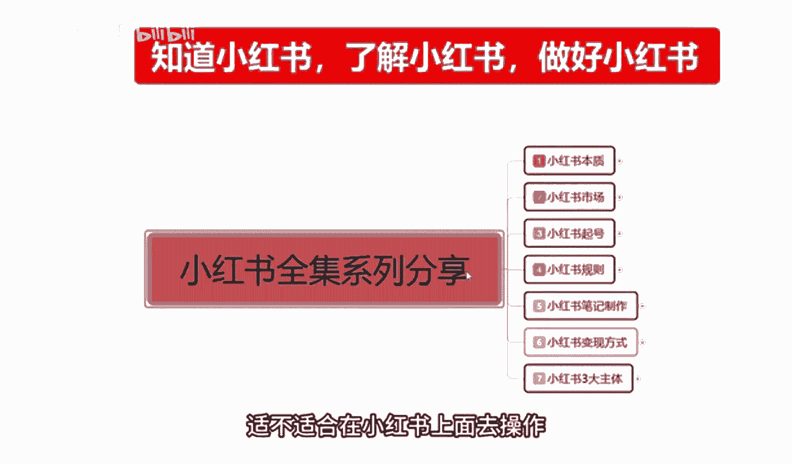
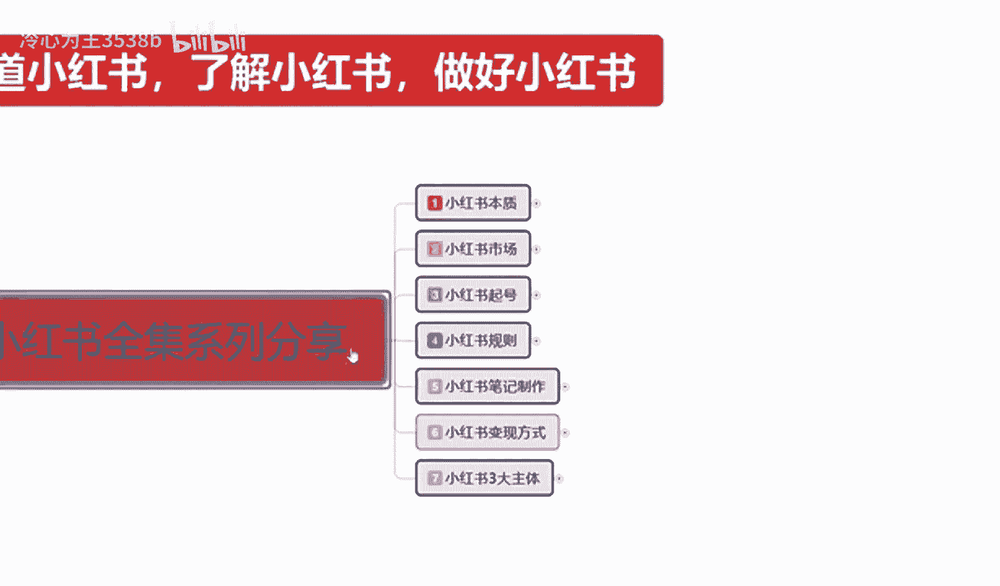
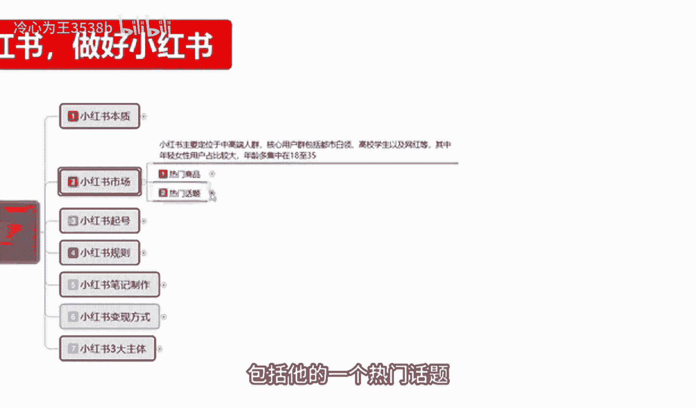
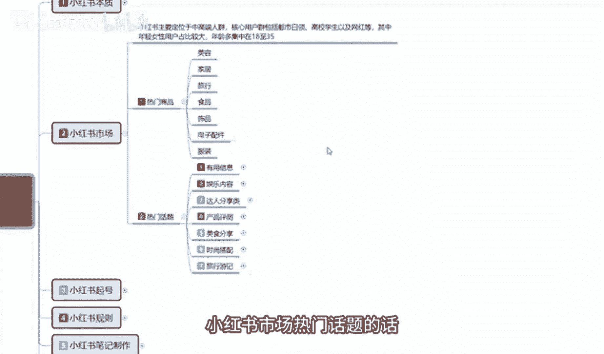
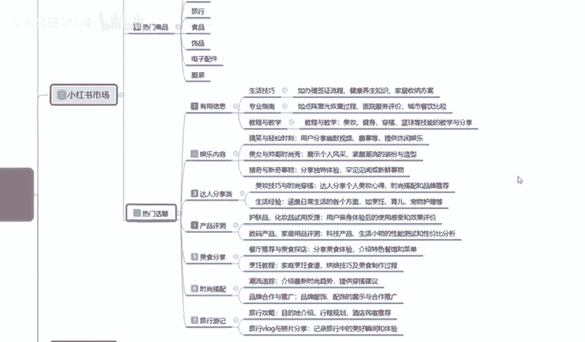
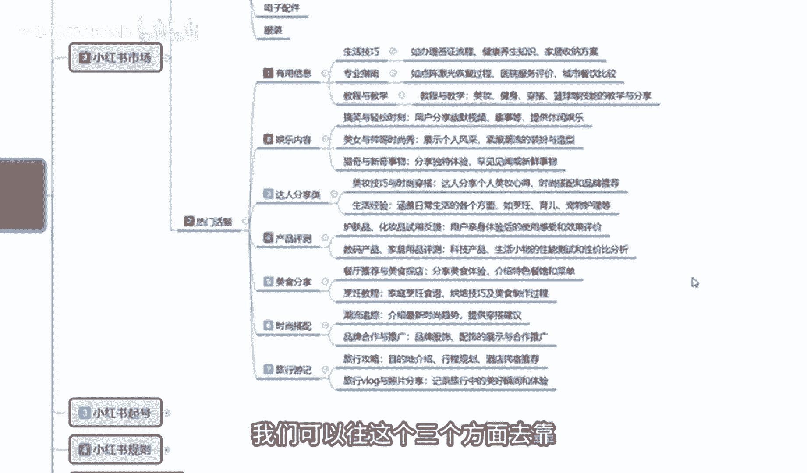
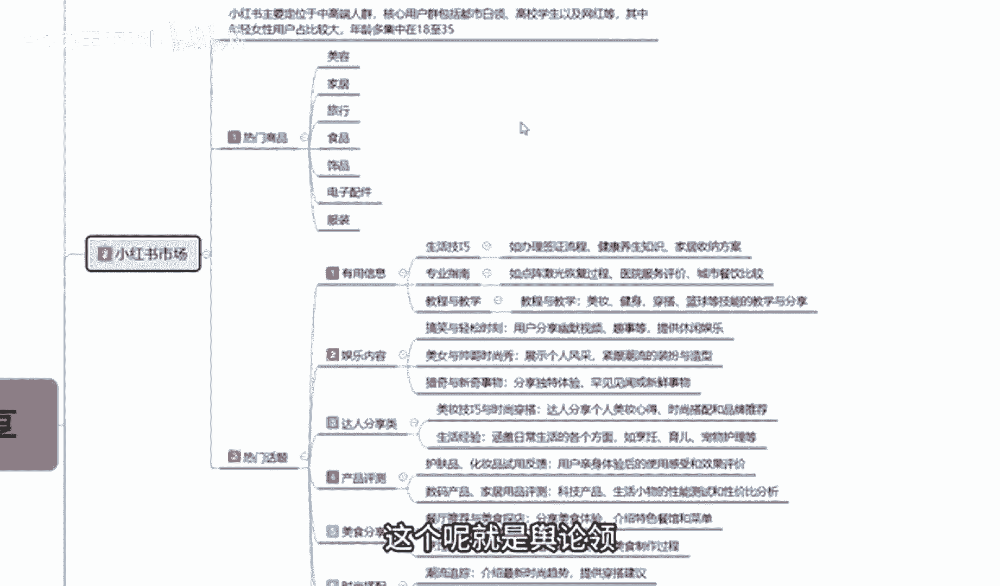
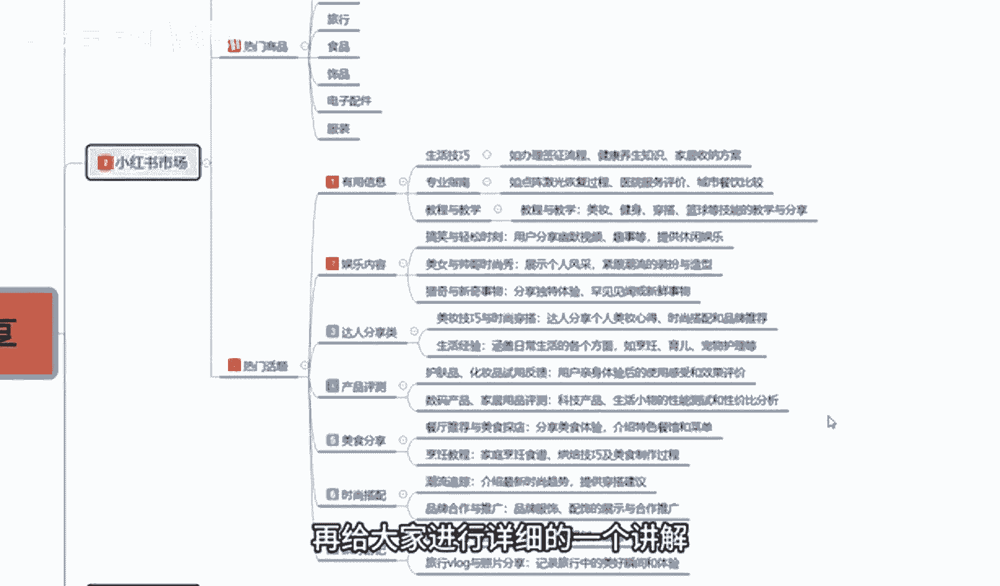
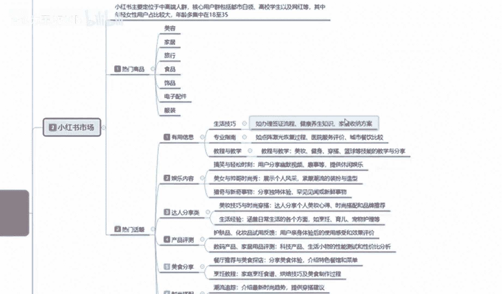

# 【2024版小红书体运营教程】全B站最良心的小红书开店全套运营教程！小红书体开店 起号真的不难，拿走不谢！ - P14：04、新手小红书运营-小红书市场分析（1） - 冷心为王3538b - BV1dW421X7Lg

大家好，这一节呢给大家分享的是小红书全集系列，分享的第二课时啊，第二大课时小红书的一个市场，什么叫小红书的一个市场呢，就是说我们通过第一大课时，小红书的一个本质的话，就是了解了小红书。

它整体啊是否适应我们的一个市场环境啊，对应我们的一个产品，那我们从产品里面的话，它其实还是有区分的，我们要从小红书本子里面了解小红书的市场，通过小红书的市场啊，发现我们的产品适不适合在小红书上面去操作。

所以说我们需要对它进行一系列的分析和了解，那我们首先来看一下啊。

小红书的市场有什么，小红书的话，它主要定位的是中高端的一个人群，核心用户群体的话，包括都是白领高效群，高校的一个学生啊，以及网红等，其中的话年轻女性用户占比较大，他的整体女性用户占比的话。

其实是在85~90，男性可能只占10%左右到15%啊，年龄多的话，他基本上都是集中在35~18岁，整体分层的话，就是说他在这个里面20多岁的占主体，18岁的话也比较多，35岁的也比较多，但是12~18。

它这个里面的人群也有，只是说比较少，这种的话就相当于类似，家里面有那种不听话的小孩啊，比较喜欢玩手机，对新奇事物比较感兴趣的，12~18的这个之间的用户群体，也有35岁往上啊，年纪偏大的一点也有。

只是说他对于整体小红书来说的话，嗯人群没有那么广，就是人数没那么多，小红书，小红书目前的话接近3亿的一个，浏览记录和访客的话，他可能里面18~35的话占2。51，剩下的5000万才是18比18小的。

比35大的啊，它的整体一个分流的话，就是说女性用户占9%，十，18~35就占了，剩下那么大的一部分数据啊，基本上2。5亿的一个数据量，占全球全国女性范围接近一半了，接近一半了，没有一半，然后是小红书。

整体的话我们了解他的人群年龄和划分，以后的话，就是了解小红书的商品为什么呀，只有先了解这这一一整块的小红书女性，她喜欢什么样的内容，和小红书商品的一个投放内容，和他所感兴趣的热门话题啊。

只有你了解他的一个性别了以后，你才能去进行分析，如果说你连性别都不了解，你就想去分析小红书上面卖什么产品好啊对吧，我那卖个男装啊，卖个汽车，对不对，那不现实对吧，所以说只有了解他的一个人群用户了以后。

我们才好确定它的一个热门商品，包括他的一个热门话题。

热门商品这边的话，我只是说给大家列了一些例子啊，呃热门话题里面的话信息数稍微多一点，因为商品的话说实话对于小红书来说的话，他不是整体数据的话不高，在小红书上面直接搜索商品的话。

它的热门话题就是人群搜索度的话，不到20%，正常的话也就10%到15%左右，其他的话基本都是收小红书，收热门话题的比较多啊，就说小红书只要他去搜商品了，那么成交概率就很高。

但是他搜索商品的整体人数的话没有那么多啊，热门商品上面的话就是说呃小红书上面，因为女性偏多，她整体的话热门商品也就是一个美容，一个家居，一个女性，一个食品，一个电子配件和服饰，这七个大类目是最好做的。

你其他的类目去做的话，嗯你要做产品也好，做推广也好，呃做其他等等一系列东西去做的话，其实是没那么好做的，因为她女性的需求量基本上都集中在这一块，美容化妆品啊，眉笔唇膏口红对吧，睫毛耳环Z4等等。

都包括她的视频里面也都在里面嗯，家居里面的话，就是说家居里面的一些日常用的什么开关器啊，对吧，菜刀啊，剪子啊等等都在这个里面，就是说方便他生活日常所需的你都可以去做啊，有个前提啊。

女性用品不要把它划分到男性里面，男性的5%到百分百，10%到15%的男性用户，说实话我们去做小红书市场的话，你尽量你就不要考虑那些人了啊，因为那天男同志进来别有目的好吧，正常的话女性在这个里面啊。

我们去操作这个类目的产品都是可以的，就是说你要做店也好，做网红也好，做博主也好，做引流也好，最好是从这些产品里面去写，你其他的产品也能做，只着效果没有这些产品好。

这是我给大家进行的一个热门商品的一个推荐，好吧，第二个呢就是热门话题，小红书市场热门话题的话那就比较多了啊。

热门话题我在这里面我给大家把它分了七个点，第一个是有用的信息，第二个是娱乐内容，第三个达人分享，第四个产品测评，然后美食时尚旅行啊，我把它全部给大家进行了一个分类，热门话题的话。

说实话做你要了解热门话题，你要从热门话题里面去做商品，也可以去做引流，也可以去做博主也行啊，你要先了解什么样的商品，什么样的话题对我们整个的一个权重，对我们整个了解小红书操作步骤啊，有提升就行。

什么叫有用的信息啊，有用的信息的话，嗯怎么说呢，就是针对我们的一个生活技巧，专业的一个指南教程与教学，它就类似于知识类的一个分享，我们在分享小红书的时候，比方说生活技巧，如办理签证也好啊。

健康养生知识也好，家具收纳方案也好，嗯包括呃饭后吃什么水果，美食保健对吧，化妆怎么画都可以，在生活技巧里面，专业指南的话就是说如点阵激光恢恢复过程，这个的话就是说它比较涉及的就是医疗科技，这种啊。

然后就是chin这个城市有什么好吃的，那个城市有什么好吃的啊，比方说就是类似于做美食博主，这种教师与教学的话，其实就是嗯补习班，美妆博主健身教练啊，穿搭篮球技术的一些演练演示和教学，这种的话。

他是因为是用图案描述的啊，小红书笔记的话，虽然说也有那种视频笔记，但是视频笔记的话，说实话它没有文案笔记容易爆，你视频笔记的视频比一爆的概率贵，如果说我们拿把爆款概率按100来划分。

视频笔记的一个爆款概率可能不到5%，到10%，文案笔记爆款概率的话可能就有90%，他的差距就这么大，他不主推视频，主推视频的话，说实话它的一个流量的话，还没有文案的流量高的啊。

大家一定要把这个了解一下啊，就是说有用的信息的话，就是分享我们日常生活中的一些生活技巧，专业指南，教程与教学，我们可以往这三个方面去靠。

通过这三个方面，如果说我们是想做商品啊，通过分享这三个内容方面的一个知识，结合到我们产品上面去，比方说我做美容的对吧，做美容之前我们先要了解有用的信息，对用户有用的信息你进行发布。

你让人家了解你这个产品怎么去发布以后的话，别人才会去问你，你在哪里买的配件，你要知道啊，在小红书里面做商品，一定要把它当配件处理掉，你不能当主主流去处理掉，我们正常打开小红书以后的话，它的整个搜索页面。

20个笔记里面，才有一个是附带商品的一个笔记，而且这个是推广还要花钱的，不然正常搜索的话是没有商品，笔记展示给你的啊，大家一定要把这个弄清楚啊，所以说我们一定要从笔记里面去找商品啊。

而不要从商品里面去找笔记，所以说我们在发布额商品笔记，或者类似的有用信息的时候，一定要先把我们自己的人设打造好啊，这个里面的话就是有用的信息，但主要最重要的一个点啊，第二个呢就是内容娱乐。

什么叫娱内容娱乐呢，内容娱乐的话，说实话这个的话你就是完全往网红方面去考，搞笑与轻松时刻的一个分享，用户分享趣幽默，视频趣事等，提供休闲娱乐，这种的话说实话你要把它变现的话有点难度。

但是你接广告啊之类的嗯，做好了以后接广告之类的，或者做一些分享还是比较容易的，第二个就是美女与帅哥的一个时尚秀，展示个人的一个风采，紧跟潮流的一个装扮与造型啊，这个的话说实话就是教程与教学里面的啊。

你传达也好，你健身也好，美妆也好，你要通过这个方式对别人进行一个教学，教育的一个培教育的一个培训，这个呢就是舆论内容。

第三个是达人分享类的啊，为什么说是达人分享类的，达人分享的话额他和娱乐内容不一样啊，娱乐的话它是以搞笑轻松，通过这种方式来进行的一个分享，这种好容易起，但是变现困难，达人分享的话。

就是说你要自己有一定的知名度才行，说实话这个达人分享美妆技巧与时尚的话，你要在怎么说呢，在这一领域做了一定的时间，或者说你有一个团队，你才能去做达人分享，你没有团队，你个人想做达人分享。

那我建议大家的话还是以娱乐为内容为主，好一点啊，因为娱乐内容的话，你个人就能做达人分享，你个人做不了，你没有团队，你后续的一个设备资源，你做不到内容，你不好找对吧，你的产品对应的一个效果也不好。

你没有自己主做的一个产品，你没有名气，别人不会去看你的，你只有先把娱乐内容做透啊，通过自己的一些方式，保留一定的粉丝和权重，以后让商家来联系你，你再去做答案才可以啊，但是达人类分享的一个热门话题。

他热度是非常高的啊，在小红书上面，他的美妆技巧与时尚大时尚穿搭啊，达人分享的一个个人美妆心得，它比怎么说呢，它比抖音的效果还要强大，为什么说它比抖音的效果还要强大，抖音的人群他是包括男性和女性，他都有。

而且男性占多，大部分女性抖音的用户不到30%，但是男性抖音的用户占70%的一个比例，那小红书的一个占比的话就是90%，85~90的一个女性比例，说说我们做达人分享的时候，在女性方面这个里面做美妆也好。

穿搭也好，在这个里面是非常吃香的，而且女性对于小红书这个平台来说啊，联合力更高，所以说达人分享类的，你要想把它做起来，先把娱乐内容做好，你平常的一个娱乐内容，一个化妆或者说一个穿搭。

影响到了你后续做达人分享的一个整体权重，就是你先把账号提升起来，把自己提的稍微有一点名气，有个2000粉，3000粉对吧，你就可以去做达人了，把账号一申请啊，把数据一提交，把经验公式范围一提交。

就会有人来主动推广你啊，这个就是小红书达人类的一个分享内容，好吧，呃后面还有产品测评，美食分享，时尚穿搭和旅行啊，邮寄这四个点啊，通过下一节课再给大家进行详细的一个讲解。

然后我把这几个内容给大家讲解，完成以后的话，我会教大家啊，怎么判断热门商品和热门话题综合考量。

