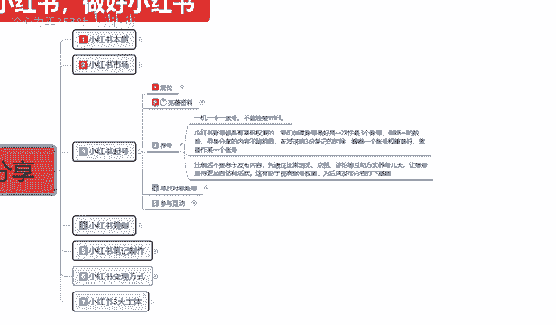

# 【2024版小红书体运营教程】全B站最良心的小红书开店全套运营教程！小红书体开店 起号真的不难，拿走不谢！ - P17：07、新手小红书运营-小红书起号（2） - 冷心为王3538b - BV1dW421X7Lg

大家好，今天给大家分享的是小红书全集系列啊。第三大课时小红书起号啊，第二课时的一个内容。因为整体内容较多，所以说我把这个所有的一个内容的话都给大家进行了一个分散啊。

每节课的话给大家讲1到2个点的一个整体内容。这节课呢主要给大家讲解小红书喜号啊，养号开始，往后续我们再进行一个详细的一个讲解啊，包括上面的定位和完善资料。嗯。

上个课时呢我已经给大家进行了一个详细的介绍啊，包括一个改变我们账号的一个小技巧。

这节课呢我们从养号开始啊，养号什么叫养号啊？小红书养号我们。

我不管大家是怎么想的啊，我在这里的话，我建议大家的话，就说像现在小红书很多人都宣传做什么。店群啊，说实话现在店群小红书你做不了，你去做小红书的话，很难起来的。我建议大家的话就是说我们做小红书。

你真的感觉小红书市场非常不错的话，你想去这个里面投入的话，说实话你有个3到5个账号就可以了。就是同时起3到5个店铺就可以啊。好吧，过多的额外话题我就不跟大家说了。因为这个的话说实话也是另外的一些内容。

在这里面的话，我没有给大家那个做详细的讲解，因为它在后续会陆续出现的，好吧。嗯，他只是说会影响我给大家分享我们小红书起号养号里面的一个内容。我只是说把所有的内容提前给大家透露一下。好吧。

养号什么叫一级一卡一账号啊？一级一卡一账号是什么意思呢？就是说一台手机，一张卡，一个账号，你不能一台手机，一张卡，两个账号，三个账号，4个账号。那样的话，你整个整个数据链的话会嗯系统会判判定你啊。

操作异常直接给你把整个号封掉了，就把你的手机的一个型号。手机型号里面的话，它都有那个定位系统和手机型号的专业认证的，所有的手机都有。这种的话，如果说别人在这个大数据运运营下面一检测你这个是。

系统数据异常。系统数据异常。直接给你把号下掉啊，这种的话是没用的。包括你这个整个wifi，就是说你一个wifi下面连了多少个小红书账号，别人都能查不出来的。现在不要大家不要觉得这我说的这个是假的啊。

因为我接触的范围是非常广的，尤其是对网络这一块，我是非常清楚的。不能连接wifi啊，我说实在话，如果说大家想避免这种方式啊，你用1G一卡两账户或者其他的都不行，最好的操作方式就是1G一卡一账号。啊。

你做分号过来，在我这边连wifi都不行，连wifi了，你就是在一个wifi下面同时有多个账号啊。这个大家一定要注意了啊，因为你如果说。一G两卡两个号这种的话，就说一一台手机，手机它都是有型号的。

型号下面它都是有。手机出厂设置里面它都有一个手机编码，这个是每一台手机单独配配的。一台手机，两个卡，你的卡上上去以后的话，它显示的两个卡是一台手机也是重复的，也不行。所以说大家一定要把这个点弄清楚啊。

包括连wifiwifi的话，你所使用的网络线条反馈过去给别人的也是在一个点里面。所以大家一定要注意了啊，这个的话千万不要去做一级一卡一账号。就是说你创建一个账号，一部手机就可以。你创建4个账号。

你就有4部手机。啊，你在电脑上面，你同时登多号也要用分机去做啊。下一个就是杨浩。啊，应该不说下一个是养号，也是养号里面的一个内容。小红书账号的话，这个里面它都是有一个技术权重的。

我们创建账号最好是一次性创建3到4个。啊，我刚给大家说的是3到5个，其实就是三个账号往上走做统一的数据。但是分享内容的话不相同。啊，在发送前三份笔记的时候，看哪一个账号权中好就操作哪一个账号。

这是追最基础的选号。但是说实话，这里面的话还有进阶版，待会儿呢我会给大家讲讲解一下什么叫境阶版啊，就是我们自己把定位资料完善全部做完以后的话，我给大家讲境阶版，它是怎么做。然后注册以后的话。

我们是不急于发布内容的。先通过正常的一个浏览、点赞、评论、互动、互动等方式养几连号，让账号显得更加自然活跃，这有助于我们提升整体账号的一个权重。为后续发布的话，就是说打下一个坚实的基础。因为你。

只有把账号养活跃了啊，别人让系统判定你我们不是在跟人斗，我们是在跟机器斗，跟系统斗，跟计算机斗。那你要从计算机里面去寻找漏洞，像我们玩游戏一样，对吧？有些人发展的话，有些人发展的慢。

那他们就是找到了漏洞，而你只是默默无闻的在那耕田。啊，这就是区别，好吧。😡，然后这里面的话我给大家讲讲一下，刚刚给大家说的我们养号这个里面的话，它有一个详细的一个过程。

我在这一节呢就给大家详细的分解一下啊。养号这个过程的话，整体持续时间的话应该是在8到15天，也就是接近半个月。你真想把一个数据量做好的话。你前期养号都会花8到15天，这8到15天里面的话。

就说我们大家不要着急的的去改我们的一个基础数据。比方说称力改介绍。这8到15天，我们前面几天怎么做呢？每天只需要刷刷小红书就好。但是这个刷小红书也有内容啊，别。那要看我们自己。你想去发布什么内容？😡。

我们统一发布，然后。调解内容里面的一些数据量。怎么说呢？就是说。我们前面是准备资料，前面8天里面啊，我们是属于养号期间。这8天里面的话，我们用3到4天的时间。让这个账号像一个新号一样。

让抖抖音判断我们是一个新号。新号创建进来以后，我们首先是定位。

然后把资料做完，定位里面的话，我再给大家结合一下，讲一下啊。定位里面我们商品定位往后定位达人定位也好，我们三选一选择一个定位以后，比方说我想选达人定位，我做视频好吧。我做食品做做什么呢？做婴儿保健吧。

就是对于小孩子10岁以下小孩子的一个食品调节。我选达人的一个定位，往这个方面走。那我们叫做统一的发布，我们每天去小红书上面浏览，我搜索就是视频类。1睡一下儿童膳食纤维啊，星期一吃什么，星期二吃什么？

星期三吃什么？整个7天的一个食品搭配啊，什么样的一个营养均衡，身儿儿儿童的一个身体条件，儿童的一个。呃，吃饭时间、休息时间等等这一些东西啊。按照这种达人定位的方式去做。我们先把定位做完以后。

或者说我们做商品型。我做儿童的一个膳食纤维的一个食品推广。我这边有柴食材，对吧？你买不到食材，我这边有你买得到食材的话，你就有些食材，我会选择一些我这边特定的一些食材进行推广，比你买的便宜。

你到我这边来，或者说我这边能给你保证质量。我做商品定位也可以通过这种po去做，对吧？所是说我们要宣传的内容是这个，前面3天到4天，我们是养号，就去查找这些资料，查找我定位食品这需需要的资料。

然后在小红书里面搜别人怎么做的，我去参考一下哪些做的好，哪些做的不好。只看这个内容，其他内容不看，知道吧？所以说这个就是我们养号。让淘宝标签认为我很喜欢这个内容。

或者说我对这个内容的一一些词材内容特别感兴趣。那么你后续发布的一个小红书笔记的话。他就会把你定义为食材类的。同理啊同理你要搞做科学的，也可以，做文化的，也可以做情化的，也可以做书本的，也可以做传达也。

也可以做编装的，也可以。它都是同类的。你就搜索同类的一个内容三四千。就行啊，这里面呢同时观看肯定是不行的啊。这个里面的话我们要有动作，点赞关注啊，要找到好的一个爆品爆款的一个作品，点赞留言，点赞。

不一定要上来去点赞啊，你要找好的作品以后点赞，要把作品看完以后再去点赞，你不能说一上来，我感觉他这个人气比较高，我上去直接点赞，那不行的啊，那个太假了，你要瞒过系统。

你不要把别把系统当啥子系统它是按照机器的固定方式去操作流动的。所以说我们要把这个方式的话。把自己当做一个真实客访客，去浏览他所有的内容。等看完以后点赞收藏，然后去评论区里面进行评论。

让别人对你的这个账号。就是因为他下面本来就已经有很多粉丝了。你在里面发表一下自己特定的一个看法，或者参与一下讨讨论。什么提高自己的活跃度，让别人认可你对你有个第一印象，你才好后面的一个操作。

三四天以后的话，我们再按照。花个几天的时间。把自己的笔记整理一下，做一个数据模板出来，然后在后面8天左右，这个号基本上就养的差不多了，再去发布你的数据。啊，8天左右账号出栏。14天左右。到15天左右。

你的笔记发布出去以后，基本上就有一定的成效了。这个就是8到15天前期养号，我们需要操作的重点。前面15天你肯定是你要做商品的话，前面15天肯定是不能上传商品的。你网红定位你新号你进来了，你定位定啥。

对不对？你本来就是给自己人设都没有做好，你再去宣传自己，我想当网红，不可能，对吧？所以说你的账号起码要有15天的成淀期，你才能慢慢的步入你卖商品，做网红做达人的一个定位里面去啊。

有一定的数据量了以后才能去做。你不然的话。😡，你这个号白呀啊，数学白做了，好吧。😡，这个呢就是这一整节的一个内容给大家啊。

介绍的一个养号啊，包括后续的话，其实这两个内容参与互动和寻找对标账号的话，都是在我刚刚给大家说的这个养号的内容方式里。

啊，只是说我把这三个点给大家结合了一下，给大家进行一个讲解。呃，寻找对标的一个账号，研究和分析你内容领域想表现优秀的账号，学习他们的内容策略。这个呢我只说给大家打了一个大概。

但是我刚刚给大大家讲解的这个内容的话，是整体的一个实际操作部分。啊。就是8天到15天，这15天前8天的话就。看别人的数据，然后自己准备自己的笔记。或8天以后的话，等账号定型以后，你再去发布笔记。

大概15天左右，你就能知道你这个号能不能好起来。能好起来，你就去操作这个好，不能好起来，换一个更号继续所以说为什么我在这个里面的时候，我给大家说的是。

我们创建账号一次性最少创建三个账号，就是这个原因。啊，你不能说保证我的每个账号都能按照这种方式起来，那么你最少要保证三个账号同步的操作这个事情。你才好做。如果说你觉得我资资源不够。

我自己只能做一个账号的话，说实话，做一个账号也行，只是说节奏会超我慢一点，别人可能需要半个月的事情，你可能需要两个月。啊，节奏会慢一点而已，就看大家自己怎么去理解，怎么去操作。😡。

这个呢就是整个一个呃小红书起好啊，这个里面我们才到起好，所以说大家对这个方面的内容一定要进行一定的了解。而且我这个给大家说的一个定位的话，我说实话还没说完，因为定位里面的。内容太多了啊。

我后面的话我会再给大家讲那个小红书三大主体里面啊。综合的进行讲一下。因为小红书定位的话，它不光要定账号的位啊，还要定用户的位，还要定我们商品的位，达人的位，进定网红的位啊，它每一个定位的一个选项的话。

它不一样，它的。属性量非常大，所以说我就是放在后期给大家进行讲解的。好吧，那么这一期的课程呢，应该说是这节啊第三大节的一个课程呢，就给大家讲解到这小红书的一个起好。下一节呢给大家讲解一下小红书的规则。

啊，我们了解小红书的本质市场几号以后的话，我们要了解小红书市场整体的一个规则。了解规则以后，我们才能去做下一步。所以说这些基础的一个属性资料的话，其实前面的课程还是比较快的。

后面的课程内容的话就会稍微比较多。好吧，那么这节课呢就到这里。

下节课给大家讲详细介绍一下小红书整体的一个规则变化。

