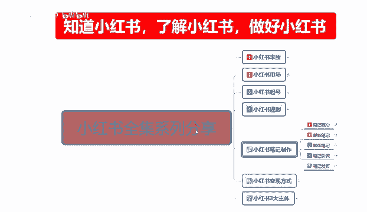
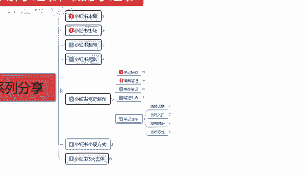
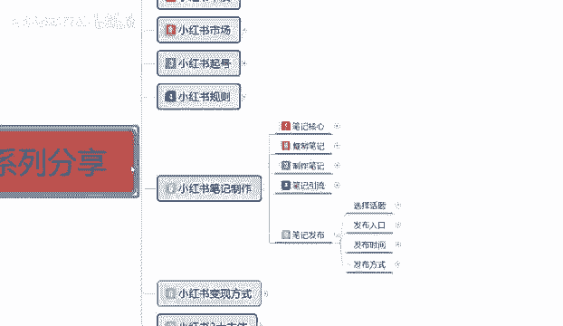
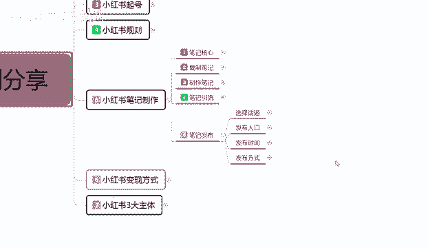
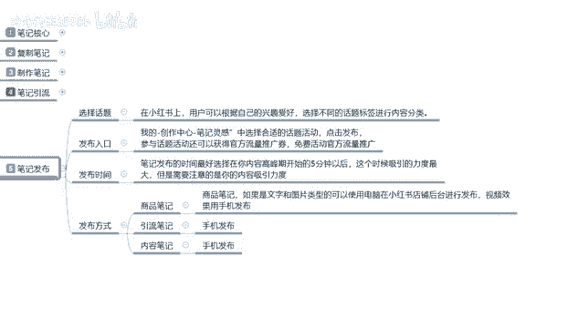
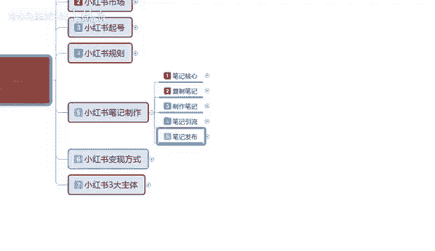
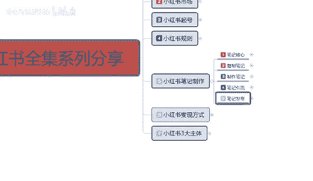
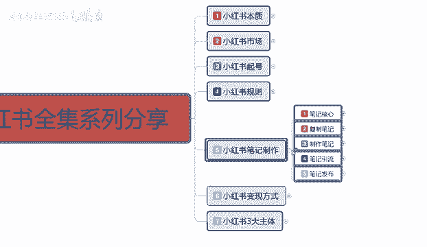
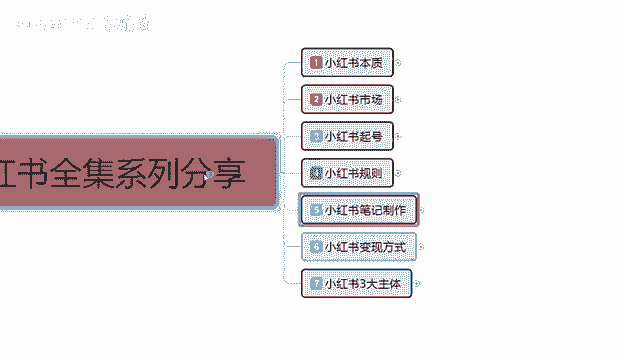
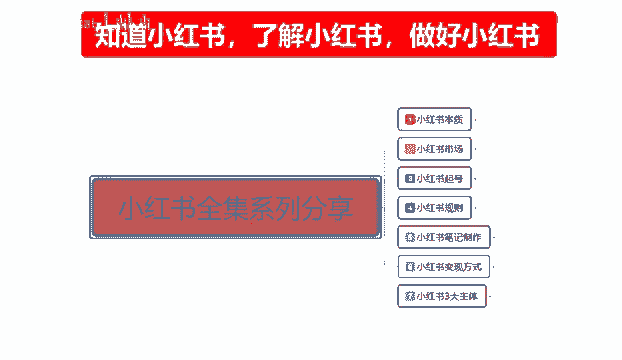

# 【2024版小红书体运营教程】全B站最良心的小红书开店全套运营教程！小红书体开店 起号真的不难，拿走不谢！ - P41：31、新手小红书运营-小红书笔记发布 - 冷心为王3538b - BV1dW421X7Lg

大家好，今天给大家分享的是，小红书全集系列的一个课程，第五大节小红书笔记制作的最后一节课，笔记发布，这节课的话主要是给大家讲解一下，我们这个小红书啊，笔记做完以后，它里面笔记发布它都是有技巧的。

他不是说我们笔记做完了，然后跟着他的程序直接去发布就可以了，他是要根据我们的内容选择对应的去发布啊，发布到你所需要的一个位置，而不是说我们随意的进行一个发布，它这个里面都是有权重上限的。

那么这节课呢我们就来了解一下啊，小红书笔记发布的一些呃。

注意细节和技巧。

首先我们来了解一下小红书笔记发布的话。

我在这里呢是给大家分成了四个步骤，第一个呢是话题的一个选择，第二个是发布入口，第三个是发布时间，最后一个呢是发布方式。

这几个的话其实看着是比较简单的，但是我们在里面的话，有很多需要注意的一些细节去我们去操作的，首先呢是选择话题，在小红书上面，用户可以根据自己的一个兴趣爱好，选择不同的一个话题标签进行内容分类。

就是我们账号前期呃一个整体定位，比方说嗯食品美妆服装等等之类的，他呃就是兴趣爱好，你账号创建初期的时候有个兴趣爱好，这个兴趣爱好的话，他是可以调整的啊，当然了，我们也不要过分的经常的去修改，懂意思吧。

就是说你的账号如果说已经创建好了，我，但是我现在的话，我想选择的类目和我的兴趣爱好符合程度不高，我们可以去这个小红书后台系统里面，用手机登录点击我，然后那边有一个色字点。

设置里面的话有一个兴趣爱好偏好设置啊，把我们的兴趣爱好偏好设置，把它改成一个，它里面有一个兴趣偏重选项，我们把它选择一个，然后的话选择对应我们商品笔记也好啊，引流笔记也好，内容笔记也好。

就是我们所发布的笔记所需要对应的一个人群，然后再去发布这个呢就是话题的一个选项，他的话如果说我们选择的一个数据越少，他就越精准啊，发布出去的话，就是对应的人群，他喜爱程度的话就会高一点。

整体提升我们的一个数据点击率，你的一个点击不起来的话，那个小眼睛数量称不上去，整体的一个笔记效果的话，是展示他有上限的，知道吧，就是根据我们账号权重来的，账号权重里面的话，它还有一个呃B级引流的整体。

它里面有个比基层级的，上一节课呢我也给大家讲过了啊，笔记成积分为八个层级，你的数你的小红书笔记如果说没有问题的话，基本上都能到达第三第四层级，第五层级的话就要我们精心制作啊，最高的话也就是到达第五层级。

不费费的情况下，你要付费的话，就第六第七第八都有可能，只是说你没我们现在的话，你刚了解小红书不可能有那么大的能量，基本上如果说你是刚创建账号的话，就在第一第二成绩大概半个月以后的话，会到第三层级。

第四层级的话就需要时间的一个累积，慢慢的往上面走啊，一直到第五层级，这个呢就是小红书，我们要注意的一个选择话题啊，就说我们前期为了做数据，把你的账号权重拉起来，你的话题人数不要限制太多，知道吧。

你就说我们现在有小红书平台，给了你1000的展示量，那1000的展示量，你要把1000个展示量，尽可能的投入到，我们选择的一个分类内容里面去，因为你投入到其他地方的话，他不可能给你太多的一个点击的。

所以我们在操作的时候，一定要把话题选择对了，不然后续的话你不好弄，第二个呢就是发布入口啊，发布入口的话其实是比较简单的，他的话就是说在我的创作中心里面有一个笔记，灵感中选择合适的一个话题。

点击发布就可以，这里面的话它系统，小红书平台系统里面有一个参与话题活动，还可以获得官方流量的一个推广券，免费活动的一个官方流量推广卷啊，这个的话你当任务去做就可以了，不要把精品笔记往这个里面放。

精品笔记往这个里面放也行啊，但是尽量的话就是说我们推广笔记的时候，你不要太在意这个光温官方的一个发布入口，你把他的任务完成以后的话，你正常发你的笔记就可以了，你不能说是因为我为了完成任务而多发。

没有用的笔记，那样的话他会把你整个权重的话给打乱的，知道吧，就说你要做这个官方任务可以做，但是你的笔记一定要按照精美程度去做，先笔记内容的一个整体整体权重拉起来了以后，你再去考虑他这一部分的推广流量。

不然的话他现在给了你推广流流量，你的笔记效果达不到他的一个需求量，那后续的话他会降权的，他后续他就不会关注你了，他整个系统的话，就把你筛选到不合格的一个范围以内，你后续发布的所有笔记的话。

他都在这个范围以内，你再想把它做起来就不好做了，懂意思吧，我们先要内容的一个整体质量，再去考虑完成官方的一个推广流量任务，第三个呢就是发布时间，笔记发布时间的话，最好是选择在我们内容的一个高峰期。

开始前5分钟去发布，这个时候的话他的一个吸引力度是最大的，也就是说对同类产品感兴趣的人，他们在休息的时间去逛小红书，观看他们所感兴趣的内容的时候，我们要提前5分钟入场，就是你的笔记要提前5分钟入场。

系统一个反应时间，然后的话在这个高峰期的时候，它会刷新他的数据，虽然说是随时刷新的，但是同类型的一个人员数量，在这个地方提前5分钟入场，那有些朋友就可能会额比较不好把握这个时间。

因为我们的笔记做出来以后的话，你做完以后，你去发布的话，他有时候审核时间在10分钟，20分钟，30分钟，50分钟，其实这个的话是可以避免的，你到三天到五天以后的话，你的整体笔记你把它熟悉了以后。

有自己的风格了以后，你就可以卡这个时间，没有自己风格的时候，适合时间，市场有自己事的风格，图片的一个形式，文案的一个显形式，文案的一个内容等等，把自己的风格体现出来以后，他系统审核的时间就会缩短。

基本上的话就是五到10分钟，快的话可能12分钟就给你把它审核上去，然后直接一更新，它就有数据出来了，慢的时候可能要几个小时，但是几个小时的话基本上都是我们账号刚创，刚创建，然后了解嗯。

对小红书不是很了解，然后的话随便编辑了以后发送上去，他的系统读取你的一个小红书笔记的一个状态，要很长时间，或者说是职业不过审，所以说发布时间卡时间段的话，其实我们把小红书了解一段时间。

你有自己的程序以后的话，基本上都是很快的啊，这个卡前5分钟的一个高峰期，发笔记绝对是可以做到的，所以说大家一定要把这个啊给了解一下，然后呢就是发布方式，发布方式的话，商品笔记引流笔记和内容笔记啊。

它不一定都是要手机发布的，商品笔记建议大家使用电脑去发布啊，引流笔记和内容笔记用手机发布，为什么商品笔记的话，他说实话他主要是编辑的一个商品，商品的内容，详细细节的话用电脑去编辑它的效果会好很多。

如果说你用手机去编辑你的商品笔记的话，那些说实话你编辑出来以后，你再去发布到手机上面，它整体的一个图片我们先不说别的，但他图片的像素它都跟不上，懂我意思吧，就是它整体的一个清晰度它是跟不上的。

我们要做的话，其实引流笔记和内容笔记说实话按照正常来算，也是应该用电脑发布，只是说在手机上面发布的话，它的一个流量效果好一点啊，匹配的你用电脑发布，别人观看的时候，他不管是用手机观看。

用电脑观看小红书也好，它的一个形式的话都是偏向于电脑，手机发布，就是偏向于手机，所以说引流笔记和内容笔记的话，一般都是用手机去发布啊，商品笔记也可以用手机发布，你编辑好了以后，把文案放进去。

放到我们的一个手机手机内存条里面，然后用手机再次进行编辑，再发布就可以了，这个呢就是整体的一个笔记发布啊。

同时呢也是我们这个小红书笔记制作。

最后一节啊，包括我前期给大家讲的，因为小红书我笔记制作，我在上课之前呢，我就已经给大家说过了，这一整套课程的一个内容是非常多的，你说它复杂是对于新手，对于我们对整个网络运营系统，网络营销的一种方式。

不熟悉的人，他可能会啧怎么说呢，就是我讲的这一整套课程，他可能会不是太理解，所以说但是呢我在这里的话，建议大家呢把我这一整套课程多听几遍啊，对你有很大的一个帮助，如果说你这个听得懂的朋友。

他基本上就说了解这里面有一些技巧，只是说我再给你们补充一下，让你们整体了解一下。

如果说你的小红书笔记这一课的话，说实话它是最重要的一节课，你上面这几个不懂，我们可以慢慢学，但是这个你不懂的话，你后面你学都不好学，所以说你要想把小红书做好，笔记制作是第一要义。

因为它就是你的流量来源好吧，那么这一节的课呢就给大家分享到这。

整个一个小红书笔记制作呢，也就给大家分享完了，下一节呢是给大家啊讲解一下，小红书的一个变现方式，什么叫小红书的变现方式呢，就是说我们小红书的话，我们不光有卖商品变现这一个方式，而且小红书上面卖商品。

说实在的，你要想靠它去变现的话，难度啧，额不亚于平地起高楼，因为你是没有整体数据的，你要是想在小红书上面，说实话，小红书3亿用户，你看见有多少店铺直接靠店铺做起来的啊，很少，好吧。

那么这一期这一节的分享呢。

