# 【2024版小红书体运营教程】全B站最良心的小红书开店运营教程！小红书体开店 起号真的快，小红书赚钱的几个方式，小红书赚钱方法有哪些，小红书赚钱教程！ - P12：11、新手小红书运营-小红书规则（4） - 叶梓颐N - BV1fogqeREQn

大家好，这一节给大家分享的是小红书全集系列，分享的第四大课时。

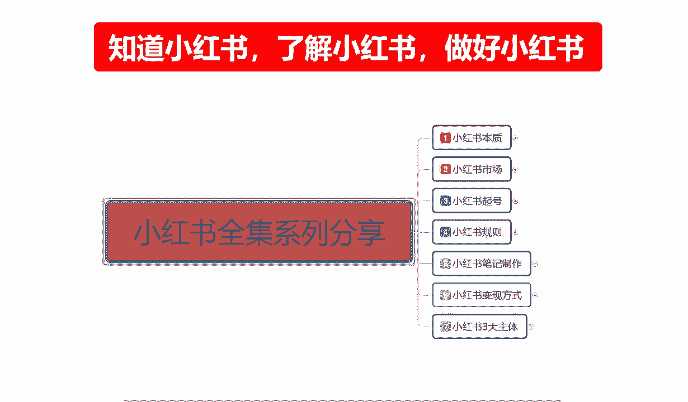

小红书规则啊，也是第四小节课程呃，接着我们上一节课程的一个内容。

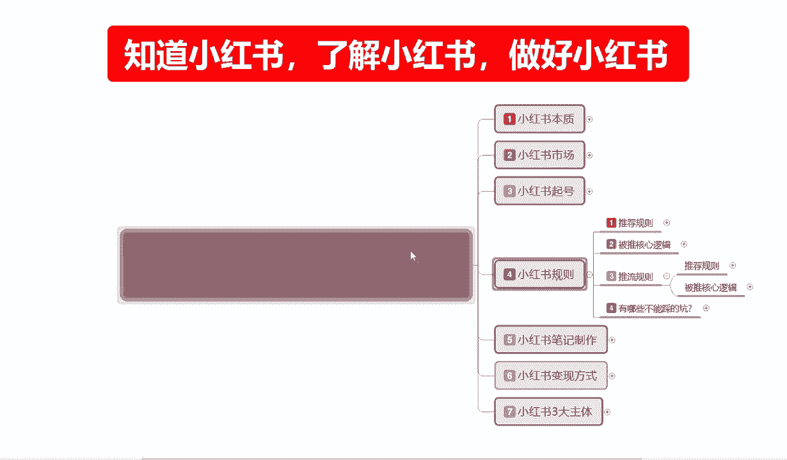

继续往下面讲，上一节课呢给大家讲的是推荐规则里面的啊。

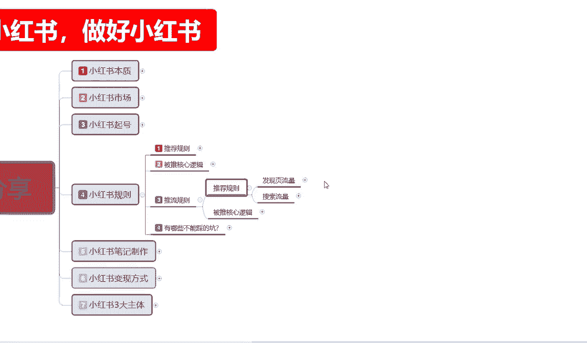

一个发现流量，发现流量把前面两个大点给大家讲了，下面的话就是说我们标账号，标签的一个设置方法，和笔记标签的一个设置方法，账号标签设置方法的话，其实就是我们小红书起号的时候。

就已经给大家已经呃大概的说过了，首先如何给藏豪和笔记打上精准的标签，让平台精准推流啊，第一个多看自己和同领域的内容，增加用户标签，就是说我们在这个时间段的话之前。

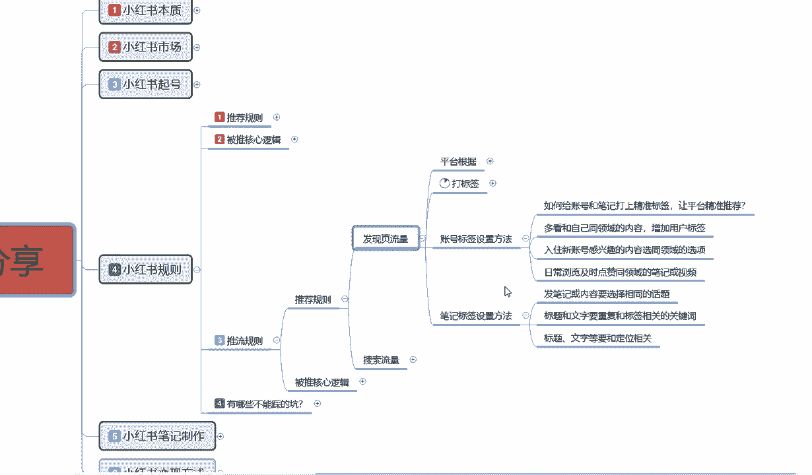

我也给大家把时间，小红书起号的时候，我也给大家把时间段给说过了啊。

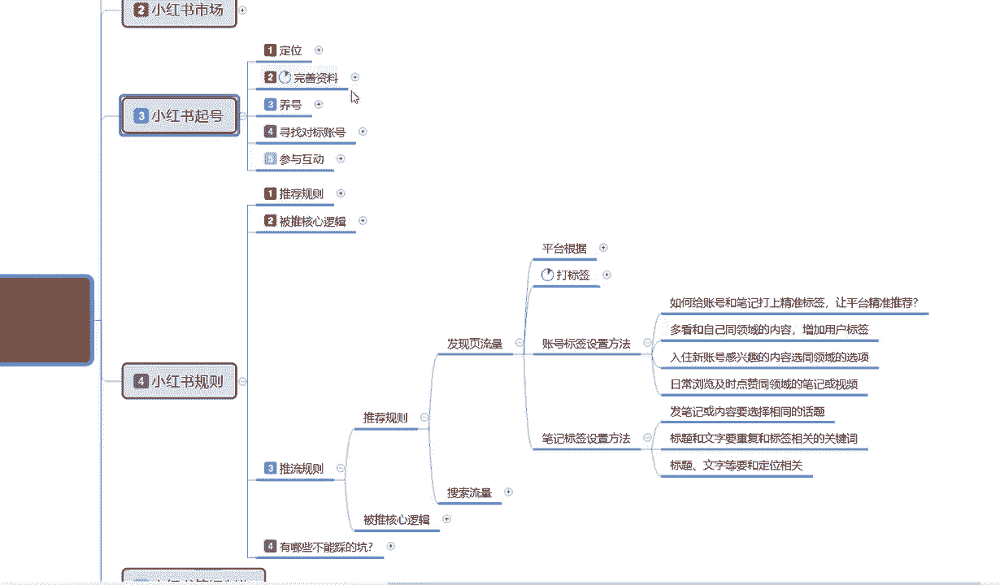

我们养号的时候就是这个。

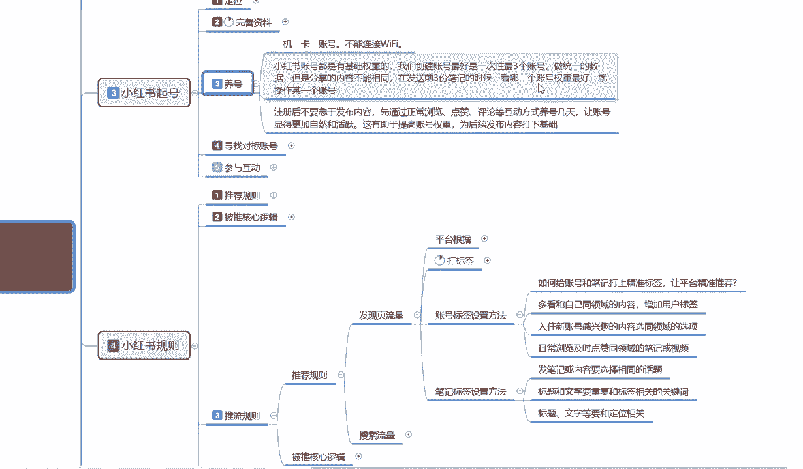

哎养号不是养号的话，是三个账号同时操作，我看一下啊，啊这个寻找对标账号的一个标签，研究，分析我们领域内相似并且表现优异的一个账号，学习他们内容标题技巧啊，我们去观察别人的时候，也同时也是学习一下。

同时再给我们自己打上这个类型的一个标签，就行啊，这个的话还是比较简单的，然后入驻新账号，感兴趣的内容，选择同领域的一个选项，就是我们在创建账号的时候啊，把我们三个顺序选项的话，你尽量的去框。

可能对这个兴趣感，对我们这个产品也好，对我们所发布的内容也好，感兴趣的去框，你要是不框的话。

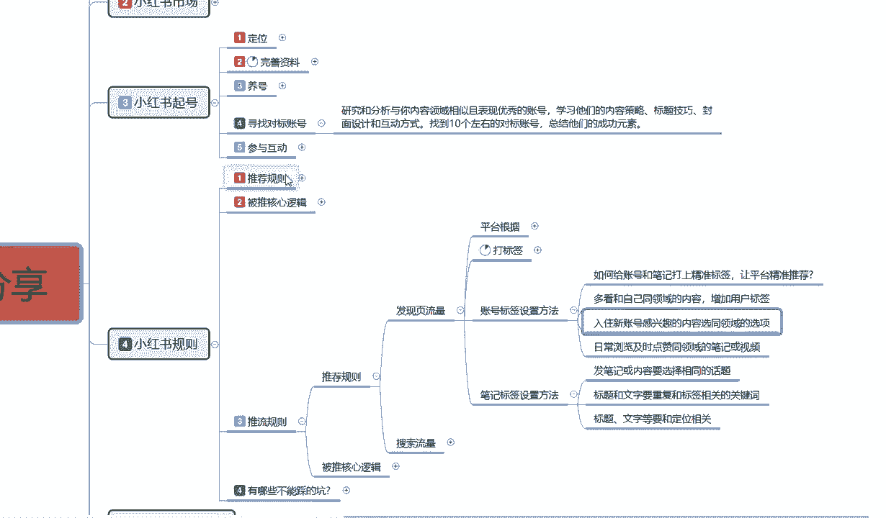

你就根据我们平台的一个规定，我们账号就没设标签，就没搜到啊，然后是，日常浏览及及时点赞，同领域的一个笔记或视频啊，这里面大家要注意一点啊，嗯之前也给大家说过，就说我们浏览别人的一个产品。

浏览别人的一个笔记，或者浏览别人一个内容的同时，我们需要观察它的内容到底是不是精品，它不是精品的内容，你别去点了，嗯那种不精准流量你点了以后也是浪费，然后的话啊给大家一个怎么说呢，就说给大家一个保底吧。

小眼睛低于5000的，你就不用去管它了啊，除非他是是刚上传一天两天的，你可以去看一看，然后嗯抢个排头，抢个位置去和别人聊一聊，如果说两天以后都没有超过5000的这种，他就不属于爆款笔记了。

你就没必要去观看它了，直接跳过就行啊，因为他的内容话题的话，他本来自己做别人的表现，自己做的就那个样，你去看他了，对你自己没什么好处对吧，别把自己的账号给作废了，所以说我们日常浏览的话啊，点赞啊。

关注啊，你跟别人做互动啊，啊你感兴趣的内容你去看一看，然后点赞关注，收藏这种好好尽量走5000小眼睛以上的账号。

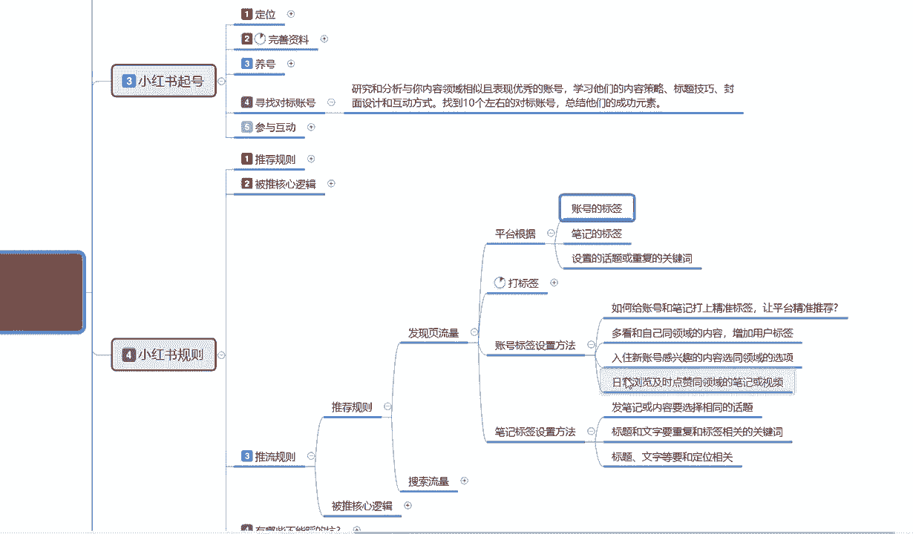

然后笔记标签设置的方法，发布笔记或内容选择要相同的一个话题，就是说我们的标题，一定要跟你的笔记内容描述相关，不然的话你光做标题一档，你的一个笔记内容，跟实际内容性质完全不一样的话。

说实话这种的话只适合搞笑主播那种啊。

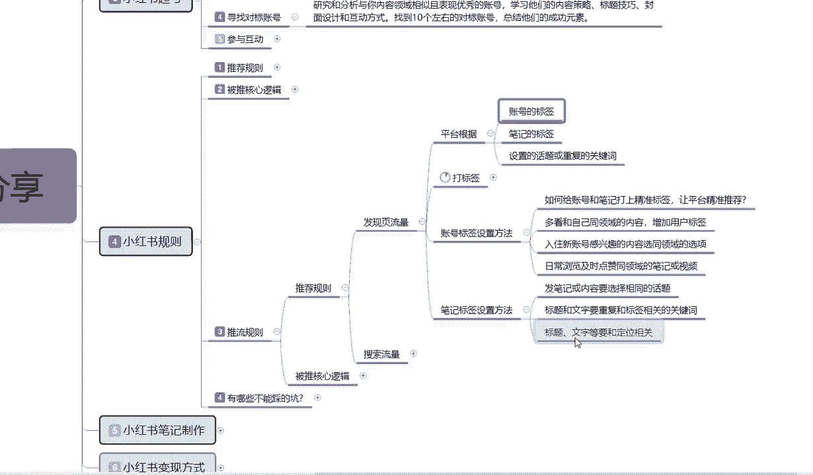

就是我们前期起号的时候做啧。

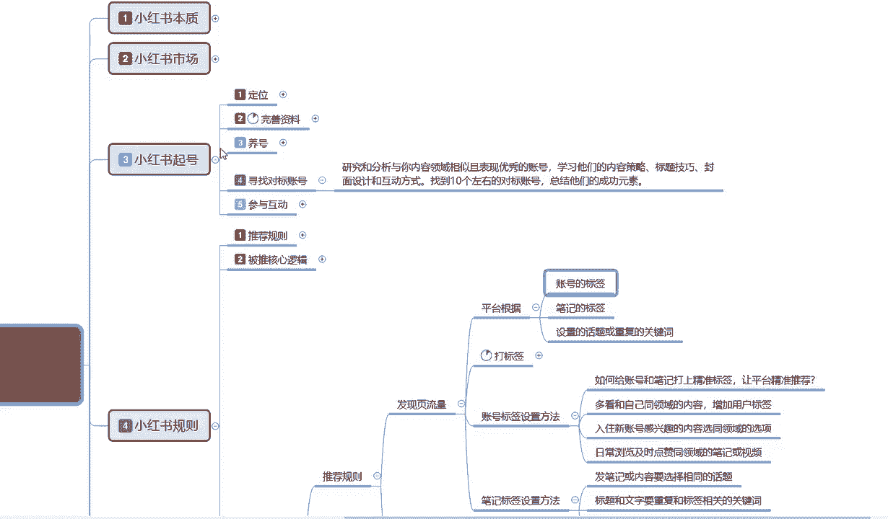

怎么说呢，就是小红书市场里面的话，我做热门话题，你可能适合这个方式。

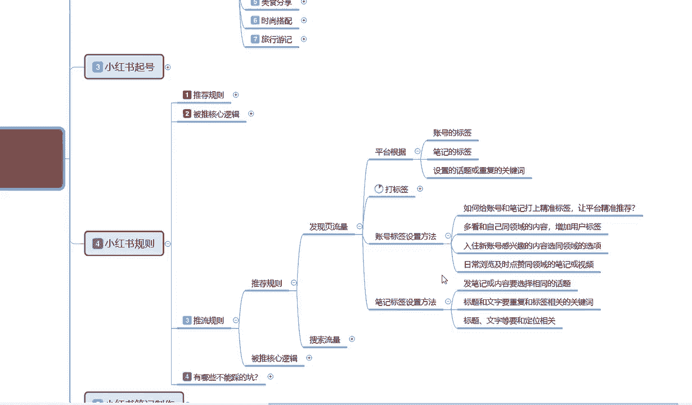

不然的话，你基本上都要匹配我们自己的一个账号，标签需求，你要是做搞笑网红，做这种后期滴，做后期啊想把它做大了以后，然后的话通过额账号的权重去把它转变成啧，提款的话啊，就是接广告啊之类的。

可以按照这种方式啊，就是呃怎么说呢，标题非常吸引人，其实内容一般啊，说实话你那么做的话，权重不高，想起来也很困难啊，你没有没有什么才华的话。

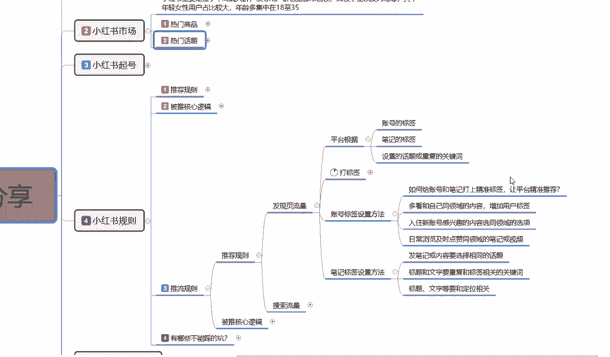

尽量不要往这边靠，第二个呢就是标题和文字，重复和标签的一个相关的一个关键词啊，尽量的话就是不要有重复的关键词，然后呢，你的关我们所搜索的关键词，和我们笔记所发放的内容尽量保持一样啊，你可以带赞美词啊。

带优化词或带其他的一些词汇都可以，最后一个就是标题，文字等要和定位相关，你不能说是你一个笔记发出去了以后，和你的定位关系不大，那引流是能引流，但是你后期不好转化啊，这个就是推荐流量里面的一个。

怎么通过这种方式去把更多的流量，引入到我们的一个账号里面来，这个是搜索流量啊，刚刚给大家讲的是发现的一个流量啊，这只是系统推荐的啊，搜索流量才是重点，搜索流量，它超过60%的流量来源于搜索额。

检查搜索就是说我们打开小红书的时候，小红书在搜索页面它有一个放大镜，放大镜的话在里面输入关键词进行搜索，它的一个准确率流量达到65%以上，这个才是我们所有流量的一个核心点。

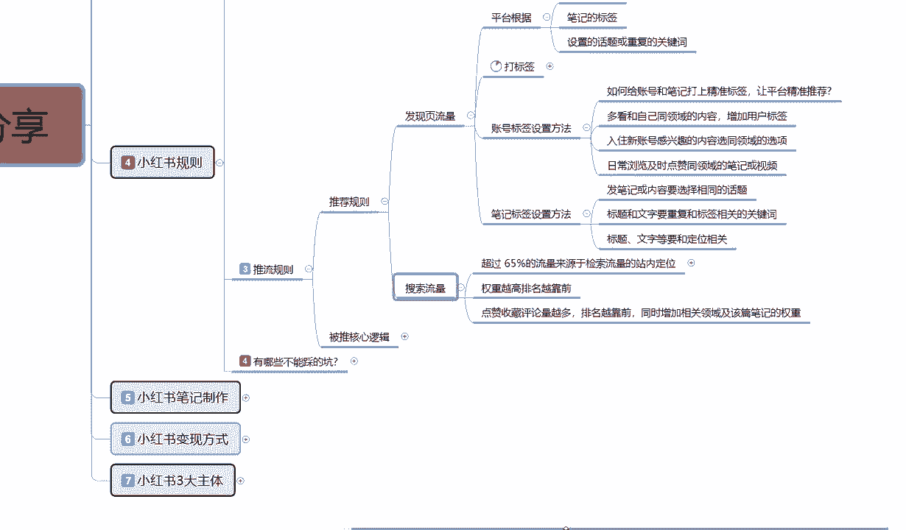

因为其他的自然推广流量，说实话给我们推再多的话，他的转化率你要是做电的话，它转化率或者是说是其他一些东西，他都不是太高的，准确率，没有那么多，知道吧，搜索流量就是通过关键词进行搜索的。

这种笔记流量才是最精准的，这里面的话它有一个默认的一个提示提示词，就是我们在输入关键词以后啊，嗯我们做标题的时候，你比如说你可以去参考一下这些提示词，在关键词搜索栏里面看什么是热门话题啊。

和我们相关的一个热门话题，然后搜索发现热门的一个搜索词，可以把它做到我们的关键词，就比方说我今天啊搜索了一个金线，什么什么什么什么关键词对吧，他这个搜索热度排第一，排第二排第三，我们也可以用这种方式。

去把我们的笔记标签给换成这样，那么它的展示几率就会变高，因为这种的话，他的整个搜索流量来源的话，会达到65%啊，这是搜索流量，整体搜索流量的话，其实在小红书八仙页里面，按80%算，搜索流量只有20%。

但是它也是不可忽视的一个部分啊，然后补充联想的一个关键词，后面的词汇就看我们自己怎么去补充了啊，把这几个点的话，就说这四个点把它做好的话，基本上嗯，可以从里面抢个1%到2%的一个，搜索流量词汇出来。

就是按热门词汇去做，不要小瞧这1%到2%，因为搜索词汇它的准确性是非常高的，所以说很多人都在做这个关键词的一个，流量节流，你要把这个词做好了，你能截留1%到2%，那最少都是2万到5万的一个。

再次你如果说点击评论啊，这些数据做好以后的话，他的展示还会更大，然后他是按照权重越高，排名越靠前啊，就说他的权重是怎么划分的呢，点赞收藏评论越多，排名越靠前，同时增加相关领域及该篇文章的笔记前度。

就比方说嗯笔记里面他有成绩划分200，展现零到200，展现200到500，500到2000吧，好像是啊。

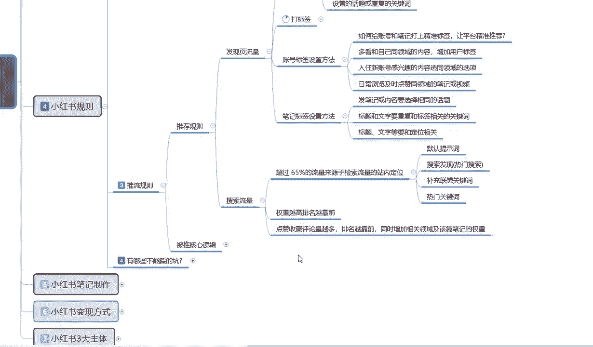

他都有一个笔记笔记展现的一个整体数据。

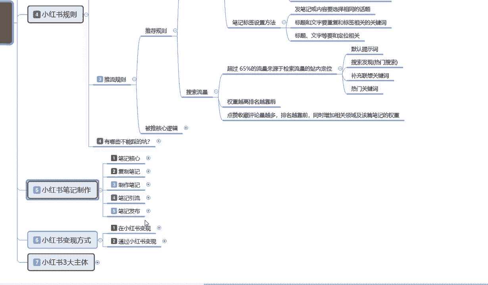

这个我没记，但是我有一个呃小红书笔记。

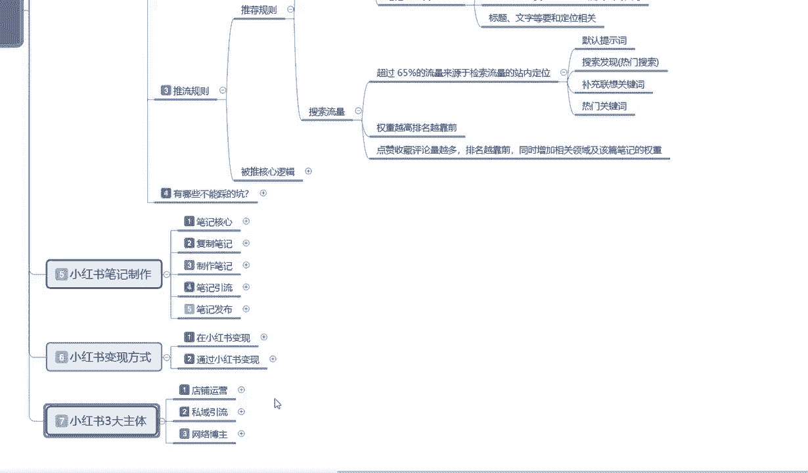

算了偏题了，这儿就不给大家讲了，他这个里面的话是嗯。

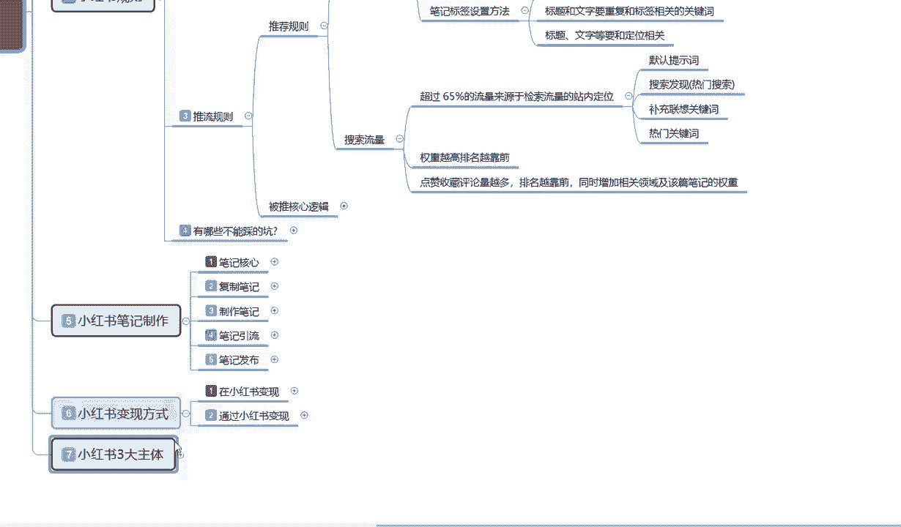

小红书笔记里面有一个流量层级，这个流量层级的话就是展示流量层级的好吧。

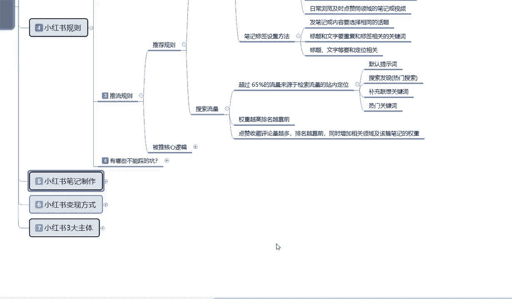

所以说我们把这几个点把它了解一下就好了，主体的话，就是说我们推荐规则里面，有一个发现页流量和一个搜索流量，搜索流量虽然说只占20%，但它整体的一个65%的搜索流量，来源的话是非常准确的。

剩下35%就是看着好玩的，整体65%的搜索流量，准确性是什么意思呢，就是说这部分人如果说他去搜索商品，他一一百个人里面有65个都可能去成交啊，只是说在不在你店里面成交的问题。

看你的产品有没有嗯那么高的一个吸引力，或者说拿你的商品进行参考，所以说他的成交概率是非常大的，你比方说嗯你卖个T恤对吧，用户通过搜索你的T恤关键词进来以后，如果说有展现，他看的十几个产品里面。

就有65%的概率，他去成交十几个里面，那100个人进来就是65个人，65个人看十几个产品，十几个产品的话里面有你的展示，最少也能成交两三单啊，你按概率学算的，如果说你的产品还比较优秀，价格还比较公道。

然后后续的一个展示介绍，和自己相关系的一个笔记话题，都是非常好的对吧，一篇笔记成交个几单，然后他后续在成交过后再给你加权，再给你展示，按照这种方式去做的，所以说大家不要忽视这个搜索流量啊。

小红书的搜索流量是直接成交，最关键的一个重点，如果说你要是做商品，你可以忽视发圈链，发现页的一个流量都可以，但是你不能不做搜索页，当然了，你要是做引流，做网红的话，你就必须要发现一个流量啊。

这个就是整体推流的一个规则，额包括我们下一节课的话就给大家讲一下啊。

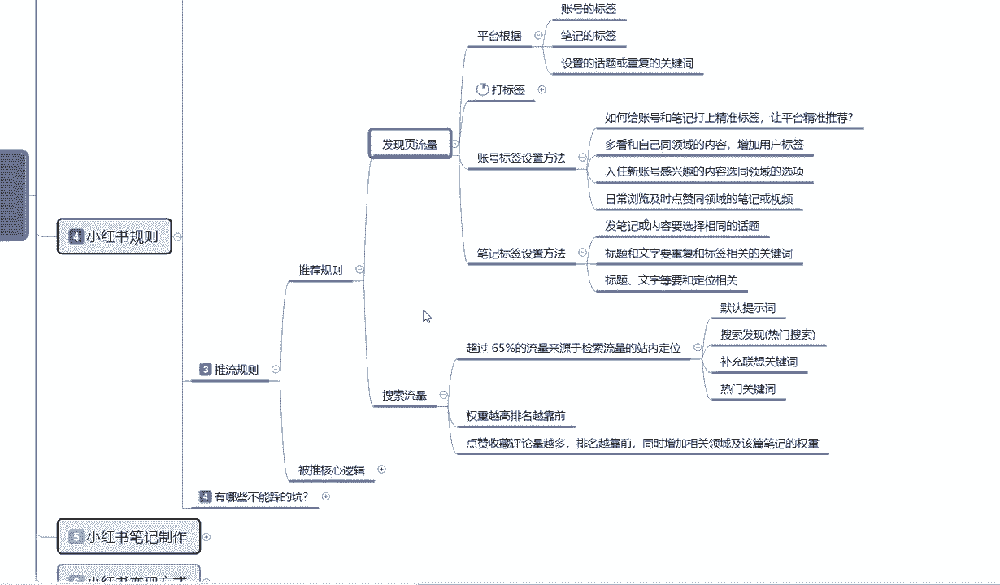

被推的一个核心逻辑好吧。

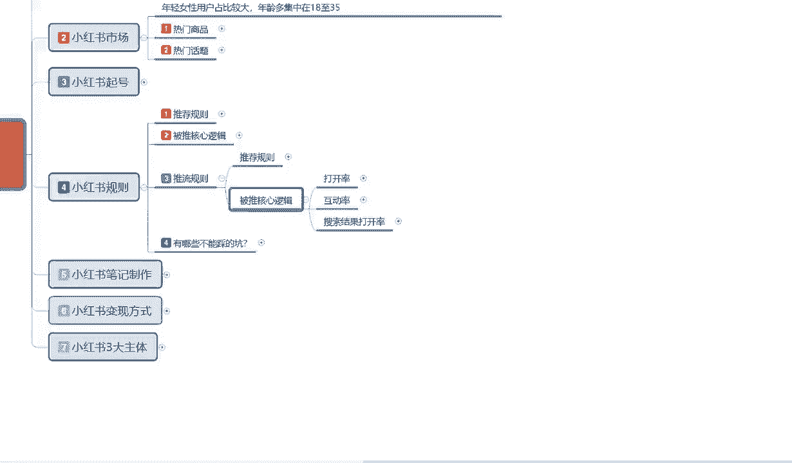