# 【2024版小红书体运营教程】全B站最良心的小红书开店运营教程！小红书体开店 起号真的快，赶快点赞收藏起来 - P1 - b黑桃在这里 - BV1WH8ve6EYh

就是大家是19年用小红书还是20还是2122，还是23年才用小红书，还是没用小红书，可以告诉我一下。然后我针对大家的情况来决定说我的内容的一个速度啊，现在是8点16分啊，我们预计一个小时可以讲完。

然后剩下的时间啊，我们进行一些简单的答疑。OK好，有19年有2有22202223年的啊。OK好，50%的人啊应该是用来小红书有一段时间的啊。啊，也有刚开始用的啊。好的，我大概大概清楚了一个情况。

那我简单的做个自我介绍吧。呃，我的。我用的网名啊叫福克斯装修笔记，是某top一电商平台的一个认证讲师。那我应该我相信大家应该也猜得到top一是哪个电商平台啊，因为我们自己出去讲课的话。

正常来说是要报备的。然后这一次呢我们去组织，咱们的这个小红书的一个淘金互助计划呢，也是属于一个临时起义，就觉得说市面上有很多那种打韭菜的是吧？卖个9991299啊，包括1个chedGDP啊。

卖个2000多。我们觉得反正这不是我们的风格吧。然后。这一次组织啊，我们是相当于说是无组织无预谋的。就是大家觉得说可以去给大家做一点事情。因为不管是我也好，还是戴老师也好，还是大一老师也好。

我们其实三个人都是在不同的城市，而且有自己不同的公司，而且是纯实战派的。呃，我上一次分享是什么时候呢？是。上一次我去带这种带队去做这种新平台研究，是20年的时候做视频号。那个时候有一个学员叫小七。

他后来成为了视频号保险行业的一个扛把子也是非常不错的那我跟大家分享一下，就是在我上一次带队20年带队的这个过程中，呃，我最后的一个感受啊，就是往往能够出结果的人。

是他提前就有自己的变现方式或者说商品的人。因为他自己有变现的产品，他对自己的产品足够了解，他对这些东西呢。就有更强的一个欲望和目标去做。但是呢针对咱们啊有一些小白的这个同学是吧？

可能之前没有在电商上去卖过东西，或者说没有在自媒体去做个账号，没有赚过钱。那么对于你们而言，我说真心的啊，我觉得就是说可以降低一下咱们的一个目标。因为我们看到的就是说像以我为例啊。

我可以用二十几篇笔记做出1万粉丝的账号，这是基于我十年来的一个内容积累，就是我可以很快的去了解到一个平台，他要什么，我可以很快的去判断这个类目能不能做要怎么做谁做的方式离钱更近，这都是需要基本功的。

所以说接下来呢那我就不浪费时间了啊，马上进入正题啊，感觉大家进来的差不多了。那么我们今天讲的主题是小红书运营的一个底层逻辑。我们怎么样从0到1来做出一万粉的账号？那么先是我们来看一下啊。今天讲4个。

大块。第一个是了解小红书的一个平台。第二个是小红书平台的一个底层逻辑。第三个是小红书用户的一个使用逻辑，以及我是怎么样从零起号约破百万的啊，我是大概是平均去年应该是做了将近1000万的一个线下的成交额。

那今天我会弱化这块部分会主要跟你们讲账号和平台怎么去做。然后整个的这个内容绝对是纯一线的实战干货，我敢说这个东西你们在外面应该是很难很难听到的。因为大部分就是说公司比较大的话，这个老板。

他不会是自己一线的操盘手，他操盘有别人，而我的账号是我自己从选题到内容到全流程是我一个人独立完成的。虽然公司有人，但是我做小红书是属于2019年是属于先行研究，所以我是没有用用任何公司资源做出来的。

那我们先了解一下小红书的一个平台啊，就是说先看一下小红书平台的一个官方定位啊，这这张图是小红书官方的图片，它的描述什么？是生活方式平台和消费决策的入口。凭借真实向上多元的社区氛围。

小红书已成为年轻人不可。替代的啊入口。所以小红书给自己打的标签真实是排第一的向上啊，社区以及消费者觉对入口。那这个第二个呢它是讲到了高净值啊，高净值人群，超一亿的月活用户70%的一线和这些一些东西啊。

但这些数据是中间的。我们把官方的这个资料说成人话是什么意思呢？就是在目前现阶段的这个网络平台当中啊，我们可能会刷抖音，可能会刷快手或者B站知乎啊，甚至微博。那我们会在这些平台上去接触很多很多的信息。

那我们小红书和他们之间是发生什么关联的呢？就是因为他们从这些平台上啊，从这些平台上收获到信息之后，他们。在穿梭到小红书来进行一个研究，通过小红书进行浏览啊，然后进行一个影响决策。

要么他们会在小红书进行打扫。因为小红书它自己有官方商城啊，要么他们会直接在其他的平台进行一个购买，这是小红书的一个决策时刻。好，那我就跟大家用说人话讲啊，就是小红书这个平台它到底是怎么火起来的呢？

其实它是经历了抖音的一个4近将近4年的一个增长。因为抖音在它这个四年的一个野蛮生长时期，它的变现方式其实是经历过N种样式的迭代。我不知道你们有没有人刷到过啊，最开始的抖音快手变现，他们是主播只要有粉丝。

你在直播间你开直播就有几千几万人在线，这个时候就已经开始有商家，比如说比如说啊比如说你们是主播，你们的直播间有几千人上万人，而我是一个卖面膜的商家，啊，我就会告诉大家。

我非常非常的喜欢你很喜欢看你的内容。我的这个面膜，在天猫旗舰店卖199啊，在京东卖199，但是针对你直播间的粉丝，我拿出几百单来做福利，只要多少钱，只要39。9块。那个时候是抖音最开始的一个变现模式。

就是商家直接打版，打版之后直接卖货。然后。主播给这个商家挂人，我想问一下，大家有经历过这个时刻的人吗？有经历过的打个有好吗？有经历过这种卖货的吗？叫打连麦卖货。那再往后走，抖音开始推出一个小黄车。

就可以进进行一个通过小黄车去购物。那这个时候它是什么玩法呢？他们就有很多的人啊跑到这种源头的水果产地啊，大爷大妈啊，下贵说求求大家了，我的苹果直销啦，橘子直销了呀，就用感情牌啊。

用视频去吸引大家去下单啊，但是这些东西现在是不被允许了啊。那么再往后走，像一些美妆的，他们又研究出一个什么样的一个玩法呢？就是一次性投放上百个达人账号。比如说啊我老婆她买的那个酒酿面膜。

我记得买过酒酿面膜，买过那个薏米茶，买过那个号称是协盒的美白，美白的那个小瓶瓶的，后面都上新闻了啊，协盒说根本他们就没出过这个产品。那么这个操盘的打法，就是可能你通过一个博主，对吧？

你说这个美白能这个东西能美白，可能你不信，那O我买通100个博主甚至几百个博主，我让你9点钟刷视频，A说他有用，B也说他有用，C也有用，刷的越多之后就造成一个从众心理，最近一个收割。而这一系列下来啊。

就有不少人收到货之后，他就会发现什么，就会发现自己踩坑了。然后也就开始变得谨慎。那怎么样防止大家上当呢？所以这个时候其实小红书的价值就开始体现了。因为小红书它的定位是种草的一个分享社区。

而且它的算法对普通人很友好，有大量心地善良的人在里面分享，包括面膜的使用感受啊，防晒霜的一个真实效果对比图啊等有效信息。所以小红书就相当于它为大众提供了一个产品好坏的一个体验的一个分享平台。

你们如果片面点的去理解，也可以理解为它是一个避坑平台。但是然后又由于前期有很多的海外购物经验分享，小红书，它的前身是做海外购物分享的，积累了一批高素质、高学历、高消费能力的用户。

高素质高学历就决定了他们的语言表达会更加的客观。他们拍照的能力和展示能力都更强。所以他们给用户的感觉会比商业的博主要更加的真诚啊，可信度更高，也就慢慢积累下一批女性用户为主的用户。那么抖音和小红书如果。

我说在我的视角里，我们去做一个对比，就是抖音，现在是专业的玩家居多，里面呢鱼龙混杂啊，有正有正向的啊，也有玩套路的，而套玩套路的是层出不穷，而小红书呢，它更倾向于普通人真诚分享的平台。

里面信息的密度是比较大的，你可以筛选出有用的避坑指南生活方式。所以其实就让我想到啊，就像我们以前用淘宝是吧？最开始我们在淘宝上买衣服啊，可能只需要有衣服在上面挂着就会有人去买。

那再往后唉商家觉得说好像好评这个东西对消费者决策起到关键的作用。那可能他们就会在好评上面啊，比如说我搞100个买家秀自己弄100个账户去。说这个衣服有多好看，穿上去效果有多好，但是消费者他也不傻呀。

他发现说唉我买回来衣服和好评里面的衣服不一样，怎么办啊？消费者就开始不看好评，我们开始看差评啊。那有的商家又变聪明了，你看差评是吧？那我就在差评里面去做文章，通过差评去让你认可我的产品品质。

比如说啊比如说一个一个一件卖一件衣服是吧，他可能说给的是一个差评，但他说虽然衣服质量还可以，价格也合适，但是配送太慢了，这个差评我给定了。像这种的语句，看似它是一个差评。

实际上它还是向你传递了用户的真相认可。所以商家和消费者他一直在博弈。而大部分人我们在抖音，如果说去买到了这种不好的商品，你去曝光它，其实拿到的流量是很有限的，而小红书这个平台不一样啊。

如果说你在上面买了什么不好的产品不好的体验，第一，素人的流量权重和大大的博主可以说几乎没有太大的区别。第二，小红书它有搜索流量，因为我们是基于什么基于我们在某些短视频平台刷到了这个产品。

比如我刷到一个是吧？这个又刷到一个什么面膜啊，号称能够美白。那这个时候因为我之前上过当了。所以我这一次我就希望说我在小红书平台再去搜一下。而这个时候当他搜这个面膜的时候，可能他就进来一个测评的帖子。

那测评的帖子可能就告诉他这个。的面膜不如另外一个面膜啊，然后这个消费者的心质就被影响了。所以小红书它基本上就是给我觉得片面的理解啊，就是避坑平台，它的内容就类似于说豆瓣的电影评分啊。

以及大众点评的一个美食评分一样。那虽然到今天为止啊，平台里也会有很多的素人分享。但是同时也参杂了很多的这个商家啊冒充信息。但是这个平台整体来讲还是非常有这个使用价值的。那小红书平台的一个底层逻辑啊。

就是我在做小红书平台的时候的底层逻辑。首先我们去做一个东西，一定要了解一个平台他要什么平台要的东西，你给他他自然就给你流量。那么我想问大家一个问题啊，假设现在你们啊是一个开淘宝开天猫旗舰店的。

现在你手下有5个有5个客服来回复这个客户的咨询，你店里有2000，现在每天有2000个咨询啊，你会怎么去分配，是平均分配2000个，除以5个人，每个人平均分配400个，还是怎么分配，还是说不平均分配。

你们可以告诉我们？你们思考一个问题啊，现在你们的身份是天猫旗舰店的一个老板，你有5个客服啊，然后有2000个客户咨询，你们怎么分配是吧？这同学很配合啊，这者是平均分配。这个其他的啊其他的朋友啊。

也可以啊，继续去多互动。因为我知道你们的水平就决定了我后面讲的一个东西的重点和速度。啊，有人说不理能下单的不会多问啊，这个兄弟，你在跟我开玩笑，你一个开天猫旗舰店的，你说2000多个客户咨询。

你有5个客服，你跟他跟我都不理啊，有人说按需求比例，有人说按能力分配，有人说平均分配。好的，那如果说这五个是新人的话，那基本上来说的话，第一轮肯定是先平均分配。但是你们往后走，你们会发现一个结果。

就是每个人的能力是不一样的那我们可以看到，那通过一个星期的数据下来，那我们现在发现了张三他的成交是4000块钱，李四是3000块钱，往五是8500块钱。到6是6500，孙七是1000。我想问一下你们。

接下来你们准备拼怎么分配呢？我相信啊。假设你们是一个老板的话，你们是不是会希望王五能够拿到更多的客户？因为王五的销售额是8500元。他是张三对吧？和李四的double。所以。

这就是我们啊假设我们开店的一个商业逻辑。那。到了小红书平台，你们就去思考小红书平台，其实对于小红书而言，我们他手上拿到的东西是什么？他手上拿到的是反客，对吧？我们打开手就变成反客了。然后呢。

他手上会有多少呢？会有新增笔记。那你觉得他分配笔记怎么分配呢？他就像我们去开店铺一站。他前期比如说我们现在同一时刻这一分钟有500篇笔记，新到诞生了，他一定是给这500篇笔记啊。

一个平均的一个初始流量值。然后通过初始流量值的一个数据表现，再次再去决定二次分配和三次分配。所以那我就想问一下大家第二个啊问题就是小红书平台它最想要的东西是什么？你们有想过吗？

是用户停留还是新增还是成交额？你们可以在评论区啊可以在评论区。告诉我。你们觉得小红书平台最希望要的是什么？我来看一下啊，这道题这道题挺有技术难度的。所有打停留的啊停留的是正确答案，停留的是正确答案。

因为我现在用的词是什么？是最希望要的是什么？为什么我告诉你，用户停留是最关键的啊。因为不管是小红书也好，抖音也好，快手也好，微信也好，他们都在干一件事情，就是要争取用户的时间。为什么？

因为你后面所有的成交额，你的这个电商的变现，广告的变现都是要基于用户在使用你这个软件。包括你们所说的用户新增，新增看上去很重要。但是你要明白，但我们愿意用1个APP愿意一。新增只是早和晚的问题。

如果1个APP你一天只用2分钟，或者说你一个星期你都不想打开一次，你觉得这样的新增有意义吗？所以我们就想到以前是吧，我们以前看电视的时候。还记得吧？以前电视台的核心关键数据是要啥？是要收视率，对不对？

收视率电视台有了收视率，它就可以去插播。广告植入对吧？可以接一些大品牌的一个广告。所以对于。这种平台也好，其实不管小红书、抖音、微信、淘宝，他们都是希望有用户停留，有用户停留才有解可能。

那这里又有一个问题就是。我们希望用户停留。那就需要有好的内容让用户去停留下来。但是小红书的平台，它是一个机器。如何让机器去判断内容的好坏呢？啊，我们都说内容为完，你们有想过没有？

如何让机器去判断这个笔记的好坏呢？如何让机器去判断笔记的好坏？机器一篇笔记灌输下去，其实它是没有办法啊算法机器是没有办法完全去识别出内容的好坏的，它只能通过一些数据。

所以我们能够看到的点赞、收藏、评论、转发。这四个东西其实就是一个用户的反馈。对于机器而言。系统推荐。两篇笔记啊，A笔记和B笔记各500个。报关A笔记获得了100个点赞，B笔记获得了10个点赞。

那机器就有理由判断A笔G更受用户欢迎，能理解吧？我相信你们都能理解的。好，所以说整个来讲，小红书平台它其实就是基于。用户停留的需求啊，用户时长的需求通过机器去判断你的内容是否是用户喜欢的。

能够让用户留下来的。因为我们自己是不会在我们不喜欢的内容去浪费时间的。所以那整个来讲的话，大的方向啊我跟大家分享一下，就是小红书平台现在有哪些红利呢？第一个是流量红利。

因为小红书目前的月活应该是两个亿左右啊，我估的。然后23年刚刚上线了网页版。这个流量红利就意味着说，如果小红书未来的月活能够在接下来23年、24年达到5亿的话，它有两倍的流量buff。

就是你做相同的事情，它是有两倍的流量buff。如果小红书能够到7。5到8亿的用用户，就有3倍的buff，是你做相同的事情。这也是为什么我会去在。119年去做抖音，我们做11抖音是19年6月份。

我做小红书是21年10月份，我永远因为作为一个老互联网人，我永远是要抢平台的前瞻视角前这个流量加成的。所以说抖音我我们现在有在做，我们还会接下来还会去做。但是现在的抖音的流量已经肩顶了。

所以我们其实早做和晚做同样的一个项目，差距不大了，没有流量红利了。那第二个点，我们讲的是素人红利，就是小红书平台对于素人笔记的其实是很友好的。而且最近小红书平台，他把这个广告的门槛。

从1万粉下调到1000粉也可以开通。这是你能感受到它不是去捧这种大博主的一个心态。第三个叫搜索红利。就是笔记在小红书的笔记，它可以获得长期且持续的搜索访问量。3000小眼睛的笔记拿到100万。小眼镜。

这是我实际的我的后台数据。这个等一下你们后面呃可以给大家看一下啊。第四个就是电商红利。小红书今年对于电商有很多的动作，类似于早期的小红车的推出，包括最新拿到的信息，小红书的这个本地团购也在内测了。

就是你通过笔记可以直接上架。本地的一些优质商家。所以我觉得就是说对于一些小白而言啊。你这一次可以把你的目标定到，你知道怎么样去做内容，做有效的内容。然后电商这个东西你可以。

就是说你不要把自己的要求拉太高啊，在这一次，因为后面还有本地团购等着你。这个你们可以看一下，我有一个习惯，就是我会统计我每一篇笔记，每一天的一个最后的一个数据。这一篇的话是截取的一个曲线，它是从。

这应该是几百的播放，到了几万多多播放。而且这张图是我应该是去年截的，现在应该还是继续往上走的。这个我没有去拿数据最好的图片。所以说小红书最牛逼的地方是什么？就是它的长尾流量是我见过最牛逼的。

查尾流量是我见过最牛逼的，没有之一。包括你们可以看到右边啊它的搜索我的笔记，我的搜索量是77，所以都是搜索进来的，搜索流量就越的精准。那么总总结一下，就是小红书平台，快手，它们的差异在哪里呢？

快手抖音啊，我觉得它可能更倾向于之前的优酷土豆是用户一个欣赏观看视频的一个工具。而小红书呢，它有点类似于百度加知乎的一个结合体。我们在百度可以查到怎么去。一些比较啊更深入的东西。

比如说iphone怎么去拆机，而小红书它有百度加知乎的一个这种调线的一个感觉。我们接着往后走啊，那么小红书我们要去做的话，我们了解了平台之后，我们要还要了解用户的一个使用逻辑。可以看一下这张图啊。

这张图是我去研究用户的一个一个流程图。我们可以发现说小红书平台，你打开之后，对吧？它给你推荐的是四篇笔四篇笔记啊，四个封面，对不对？四个封面，那么我们的行为轨迹是不是要么你就有有兴趣，你就点进去。

要么你没有兴趣你下滑了，而点进去的里面，要么就是看完所有内容啊，要么你就是看完离开了是不是？那还有第三个什么思考一下，思考一下，动一下你们的大脑。我们打开小红书，啊，我们小红书给我们推送了4篇4张封面。

我们要么点进去看完，要么我们看完离开了，还有一个选项是什么？有没有人能够想得到啊？今天的内容，你们能够动起你们的脑子。我相信会让你们可能是今年收获最大的一个小时。看一半啊，这个这个朋友没有名字。

但是我觉得回答的很漂亮。就是还有一个选项就是没有看完离开了没有看完离开了。没有看完，你开了啊。所以说看完所有内容之后的路径，他又选择没有互动离开以及有互动离开，以及进入个人主页。啊，以及接下来的路径。

所以这是我去研究用户，其实我就是研究我们自己。那你们有没有这样的一个思维是吧？我们再往后走。那么小红书平台做账号和抖音它到底有什么不同呢？第一个就我们刚刚所说到的啊。

它的其实是属于信息的推荐方式就已经不同了。因为抖音打开软件，它是直接推送一条内容并自动播放的。你们不感兴趣，你们就会去刷到第二条。而小红书打开软件，它是推荐4条内容，它没有自动播放的。

你们不感兴趣就直接下一条了。所以就意味着是什么？说明抖音的开头很重要，因为抖音是自动播放，而小红书的封面标题非常重要。如果你的封面标题不行，对不起，我我一一个我都不会点进去看，我直接下面四个了。

所以说小红书的标面标题封面非常重要，大家现在应该能。这个解这个拆解，你们该能意识到封富标题的非常重要性啊。那么你们去思考一下，或者说啊你们有女朋友的，有男朋友的对吧？或者你们的同事。

你们去研究一下你们的同事，他在耍小红书的时候。给他四篇笔记，他是怎么样去阅读的一个顺序。他是从。一看到二看到三，看到四，还是他打开手机扫一眼啊，直接滑了，还是说打开一眼扫一眼直接点了。就我个人而而言。

这四篇笔记我是不会按顺序1234去看的，我是扫一眼的，扫一眼也就意味着说。一秒钟的时间，4篇笔记，其实每一篇笔记连半秒都不到。所以说这个封面标题非常之重要。那么小红书平台啊做和抖音还有一个什么区别？

其实他们的账号的运营方法也是不一样的。抖音平台，你们去运1个IP，其实主要还是要去博这个系统的一个推荐流量啊，用想办法去破圈。而小红书他是因为社群属性和搜索流量大，他还可以通过账户笔记为形象展示。

去他人评论去吸引目标用户啊，像右边这个案例啊，是我前几天刷到的，就是这个人。在这篇笔记啊这篇笔记讲的是啥呢？这篇笔记讲的是。就是没有听妈妈的话，拿着家里的钱去开店就压力很大啊。他就在评论区说。

我也是对家里报喜不罢忧。开奶茶店最多负债500万，不敢跟家里说，每次问只能说还行，因为奶茶店太卷，最后去做压，结果没想到一年把负债还清，还把生意发展到全国，就意味着他这个其实传递了一个什么信息，一年。

他是负债500万一年还清，就意味着说什么说他一年赚了500万。然后下面还有一条评论，不过你们家味道确实不错，就是价格高，不知道是不是一样，对吧？还有一个用户好评。看到没有？所以如果说我想问一下大家。

如果是你们。看到了这一个人，你们会不会点他的头像会打会好吗？不会打不会。如果这篇笔记是你们刷到了，你们会不会点他的头像去看一下，因为他负债500万。啊，一年还清会对不对？那我想问一下你。

你们点了他的头像，进了他的主页和他发一篇笔记，你们看完了进他的主页是不是达成了同样的一个目标，就是把你吸引到了他们的主页里面去。是不是？所以这就是小红书的一个魅力。它可以通过评论区去吸引用户。

不是只能够通过内容去吸引用户。啊。那那也就意味着说对不对？比如说是不是就我以服装举例啊，我们用服装举例，我们换位思考一下。假设这篇笔记它讲的不是开店亏钱的事啊啊，或者说我还是开店开店亏钱啊，就是呃。

找爸妈借了10万块钱啊，开开童装店。啊，开不下去了。会不会小红书会不会有这样的笔记，肯定会有，就是那些开童装店开不下去的。那么是不是可以在评论区去说。现在实体店的东西卖那么贵，怎么可能开得下去？

我在我在朋友群里买的一件小朋友的T恤，才6。9块钱，而且跟实体店29。9块的质量差不多。谁还愿意去实体店买东西？我想问一下大家，这一句评论区有没有杀伤力？是不是你们就可以理解啊。

同样的小红书他现在还干了一个什么事情。今年啊我发现他把群聊的一个这个好友数就是一个人可以进群的上限。已经我现在已经建到15个群了，之前我只能建5个群，现在能建15个群，那也就意味着说。

他的这个玩法会更加的多样化了，包括他还可以他还他有一个官方页面招募群友。你建群之后，他他还给你提醒你，你可以发布笔记招募群友。所以这个玩法就有很多种方式了。好，那我们就问，那么接下来我们的问题就来了。

那我们的笔记封面如何脱颖而出呢？已经知道每次打开推荐四篇笔记，我们怎么样把封面做到超越他人呢？尽可能高的拿到点击呢？啊，这里我插一个问题啊，我插一个问题，就是平台能够给你们的给普通人的唯一的一个。

数据你们知道是啥吗？就假设啊我们200个人全部发笔记，他能够唯一给的东西是啥，你们知道吗？他能够唯一给的东西叫这个。叫报关。啥意思啊？就是把我们的笔记推送到别人的手机上面。这个动作让你的手机。

看到这四篇笔记，这个动作叫曝光，就是平台唯一能做的，就是让你们的笔记出现在别人的手机屏幕上面，他只能做到这一步，他没有办法让。看到你这个笔记的人点进去，他也没有办法让他点赞。

所以很多时候你们的小眼睛是由什么决定的，是由你们的点击率决定的。假设平台给这四篇笔记都给一000的报关。都给一000的报关。假设这篇笔记1000的报关里有200个人看。

就会显示你们的左下角就会显示小眼睛。其实这个叫。小眼睛它是属于阅读数，但是平台给你的不止200，他可他可能给了你1000，明白吗？明白吗？同样的，这只猫它可能也给了1000个曝关。

但是因为这个猫比较吸引人，所以它有300个小眼睛，那就是30%的点击率。所以你的眼睛只有200，你的眼睛，别人有300，不是说平台给了它300给了你200，而是你的点击率会影响。好啊，那我告诉大家。

我是怎么样去提升我的封面呢？接下来的这个方法，如果大家看了有用，就在评论区回复有用，好不好？我的选择是啊，这是我的一个封面。我的选择是我做出来我的封面之后，我把很多个封面放到一起，我把我的放上去。

看我是不是最能跳出来的那一个。我把我的封面放在这个手机的示意图上，看下跳能不能跳出来。我把我的封面放在这四个里面，能不能跳出来。有用答有用好吗？有用答有用。因为我跟大家说了。

我们这一次的三位老师全是实战派老师。我不会去跟你们说什么啊，标题的三个方法啊，这个吸引人的三个方法，我讲的就是我在用解确实有用的东西。接下来还有更多的干货啊，咱们继续。啊，大家也可以在去。继续啊。

咱们继续。好，那么问题来了啊，就是笔记封面我们如何脱颖而出呢？啊，这是我今天从网页版上啊截图的十几个。那么。划重点来了，就是在之前啊在在今今年啊网页版推出来之前，我们要思考的是啥？

我们要思考的是四篇笔记啊，我们要思考的是四篇笔记，我们怎么脱颖而出。但是网页版出来之后，网页版的推送是是多少？是是这样推送的是我是黄红框里面的一个推送啊，我是把两个拼到一起了。

那就意味着说每如果说你要考虑到小红书后面的流量，它如果是手机端进入，你是四进一。它如果是网页版刷的话，你是十5进一，是不是对你的封面要求更高了。那么这一张图，我为什么截给大家看啊，我想跟大家讲一个点。

改一个点。就是。以网页版的一个阅读质感。我把这个。同样啊这种在备忘录打字啊，这种算很简单一个展现形式。这篇笔记算一号笔记，这一篇算2号笔记，这一篇算3号笔记，这一篇算4号笔记。

你们认为1234里面哪一个是如果你们选择这种表现形式会会认可的方式？1234，你们更认可哪一种方式？2、对不对？为什么？因为二不仅它的标题更加的显眼，它还画了一个红圈，做视觉引导。而一是吧，一的字。

三的字啊都是属于字都有点看不清了。四还好一点，在网网页版的视角里，四的字还是比较清晰的，而二的标题更加的清晰，而且它还用了这个用了这个红色，对不对？这就是我们把就是东西好坏是怎么来的？我告诉你们。

封面好与坏，标题好与坏。就像什么？就像我们。😡，给我们的对象拍照一样。你拍一张照片可能就只能拍出50分。那我们怎么样保证自己的对象能够选出好看的照片，是不是咱上来先给他干个100张。

是不是你在100张里面选，你总能选出好看的嘛？所以我们去做小红书，做封面，我们。😡，两种方法，一种是我们去看100个封面，找出我们觉得好的去学习，还是我们做100个。去选一个呢，肯定是看嘛，对不对？

然后。讲到这个服装啊，我今天还去找了一下服装的例子，就是我们如果去研究账号啊，我们要去向有结果的人的学习。因为我已经告诉大家，标题和封面非常的重要。那什么叫有结果的人呢？

我觉得第一个你要看它的数据是否稳定啊，像这个账号。他前前面的数据还是比较稳的啊，点赞都在100以上，可能最近的流量不行，但是它能够连续几篇拿到100点赞的这种账号，它其实一定是对平台有内容理解的。

如果一个人对平台的内容不理解，他的数据就会变成什么，可能突然他有一条100点赞1000点赞的。但是再往后他无法连续，他无法连续，就是优秀的人，他的下限是更低的。

就是我们没有人能够说我一定能写出一万点赞的笔记，但是优秀的人他的下限可能就是100，但是如果说你对平台没有那么了解，那你的笔记完全就是开盖率。那这个账号它的特点在哪？因为你们要讲要可能有人会选择做服装。

那我给你们简单讲一下，就是。第一，它的定位，它是专门研究篮球穿搭。细分是吧？第二个。他是。小众篮球穿搭。第二个，为什么我说这个账号有用？是因为我们通过他的评论区，你去看是会有人找他要链接的啊。

求第一套裤子的链接，他不是简单的说，我给你点个赞我，点个收藏，我走了，你会在评论区看到有人要要是什么，是代表购买欲，是不是？好，那我还找了几篇其他的这个衣服去看啊。像这个账号也是比较有特点的。

这个账号它的一个拍摄角度是非常固定的，而且它的数据也很稳定。这个账号数据也很稳定啊，然后这个账号人家更直接了，蹲价格侠，价格侠什么意思呢？就是谁谁去了店铺翻到件衣服的价格，告诉我。

这个直接就是考虑到价格层面了，能考虑到价格层面，说明什么？说明这件衣服他已经心动了。那么我们再往后看第三个啊，这个账号它叫野生塔塔。这个账号它也是很固定的一个商品，对不对？我们讲的账号定位清晰。

它的账号定位是什么？账号定位就是这种它这个叫什么叫JK是吧？学生日常的这种风格，然后他的目标客户也很清晰是吧？就这种感觉很相似啊，他的效果有没有有人家会问他群子哪家的啊，他说海胆举例子。好。

那接下来问题来了，其实这三个账号，它的变现方式是不一样的。是不一样的，你们来看一下啊。这个。人家是告他是告诉别人，我的裙子在这家店铺买的这一个也是告诉别人我在哪里买的这个衣服。呃，这一个呢。

这一个是发链接。谁？我先问一下大家啊，就是篮球啊和这个黑衣服。呃，这个水手服，你们觉得这三个哪个更赚钱？或者说哪个的运营水平更高。你们有这种感感觉吗？就运营水平来讲啊，是打篮球的高，还是黑衣服的高。

还是水手服的高？有人说篮球啊，有人说第二个，有人说第三个。啊，你们觉得篮球是吧？其实我我我讲我的个人观点啊，我讲我的个人观点，可能我会觉得黑衣服的高一些。就就变现手法啊就变现手法，这个篮球它是卖衣服嘛。

是吧？它可能是没有上线的，但是就这个账号定位而言，就账号定位而言，我觉得黑衣服的。呃，段位高一点。因为第一个他的这个数据。更加的稳定是吧？篮球它是稳定稳定100家，那也意味着黑衣服一篇是他的十0篇。

第二个，黑衣服的这个。质感更高级，单价应该也会更高一些。这是我我的个人观点啊，我的个人观点啊。就是黑衣服的整个调性，它就不是简单的说我要卖衣服这一件事情本身，它是我在卖衣服的这个事情里面。

我去选择更高客单，更高预算。更有钱的这个客户群体。而且我告诉你们，这三个账号里面。有两个账号其实是有模板的，这个水手服，它就是在走，就是在出快出门的这个位置拍这个黑衣服它就是在这个位置拍。

而这个篮球它是户外户内，包括这个停车场都拍。所以从这个拍摄的一个。这个角度和拍摄一个成本啊，我们可能拍一条这个成本。是差不多的。但是你做篮球的这个账号，它是一直在想我今天在哪拍，明天在哪拍。

而这两个剩下的黑衣服和水手服，它是有模板的，它是我只要有新衣服，我就知道在哪拍了。而且它的这个模板是持续有数据的。这也是为什么我说黑衣服的它这个运营水平更高。他的拍摄模板更加的明确，不用每天去抠脑袋。

我明天怎么拍它的数据更加的稳定，它的质感更加的高。至于他变现手法是挂店铺也好，还是挂链接也好，其实他有了这个运营能力，只是他自己喜，只是看他自己想怎么玩而已。他想轻松一点，他就挂店铺啊，他想复杂一点。

他觉得赚钱多是卖衣服，他其实完全可以挂链接的，他的运营能力是最高的。那么最后啊第三个板块来讲讲我是怎么样去起号去月报百万的啊，这个其实是讲的是怎么样去做成交。那可能针对大家来讲。

我我因为我是擅长去往思域导的，我成交会讲少一点，我会讲这个账号的运营思路。然后啊总共总共我分了四个步骤，第一个步骤就是我要掌握平台的规则。我第一步一定是了解平台。第二步是什么是获取种子客户植入钩子哈。

让人把别人从这个网络上调到思域里来。因为我是擅长思域啊。第三个呢是。做成交。那第四个什么是做复购，分了四步，很明确的。那么我要做这四步的时候，那我要研究我自己了。我作为一个用户。

我用小红书APP的原因是什么呢？那我前面跟大家讲了是避坑啊，是查资料。比如说小红书已经牛逼到什么程度，我告诉你，如果你是一个女生啊，她可以牛逼到你到长长沙来游玩，你去哪几个打卡点，他都给你标出来。

他不是哪几个景点，他去哪几个打卡点，拍什么样的机位的照片好看，他都能给你标出来。所以小红书它是有价值的，有干货的，有攻略的啊，这是第一个。第二个。当你看到笔记的时候，你点进去是为什么啊？这些问题比较多。

我不一一展开，但是是我去做的时候会想的问题。那么第三个就是当你看完笔记后，你点赞收藏评论的原因是什么？我会经常问自己的。比如说我一个我比如说我给这个笔记点了个赞，我想下为什么我要给他点赞，我点个收藏。

我想为什么要收藏。那么再看一下数据层面啊，其实最开始的数据我是跟大家啊，我是跟大家没啥区别的。可能一开始就10个赞，20个赞，这很容易，对不对？30个赞。然后我通过我刚刚给你们看的啊。

我对封面的一个优化方法之后，我马上把数据拉到了上百的点赞收藏，上百的点赞收藏，而且是稳定的，对不对？这个158这个191这个176这也是也是几个月前截的图啊，现在的这些数据肯定更高了。但是你们发现没有？

我又从。100多优化到了上千点赞。啊，后面我就开始上千点赞了，收藏加点赞肯定是过千的啊，这个图都是半年前的了吧，应该至少是。我做了什么，你们知道吗？我告诉大家，我就做了两个字，一件事。这个叫做迭代。

就是我没有认为自己找到了100多200多点赞的一个方法，我就觉得我很了不起。我在想办法去做的更多。所以我选择了这个方法，其实我就已经有效了。但是我又尝试了这种方法，我没有要封面，我换了一个样式。

那这个样式数据起来之后，我就持继续用了数据更好的样式。那我问一下大家，你们有没有想过，为什么后面的这个会比前面会数据更高呢？你们能不能想的明白，假设你们是一个观众啊？你现在你们现在不要单子里是一个运营。

你现在就当你是个观众。为什么你们为什么后面的这个数据会比前面的会更高？告诉大家啊，我后面我去复盘，我去分析的是。后面的比前面的这种内容含量会更高。就是戴老师前几天说的一句话叫意图胜千言。

这个封面的信息量比这个封面的信息量要大。信息量来讲的话，这个是小，这个是中，这些的信息量是大，这是密密麻麻的一个表格。所以这个信息量是最大的，同样的还有一个问题是什么？是因为它的信息量非常之大。

所以它不点进去根本看不清。能理解吗？他可以看到标题，标题它可以看得清净水方案、净水器啊、浴霸，但是它看不清型号，我看不清型号，我又想知道这个东西的结果我怎么办？我是不是要点进去。能理解吧能理解吧。

因为看不清，所以他要点进去，这是我后面复盘的。所以。点赞提升的秘籍啊，我跟你说，绝对绝对只有8个字。就是真诚分享友好互动，你们自己去看小红书的这个这个官方啊，他们有很多账号，就跟你讲8个字。

真诚友好分享互动啊，真诚分享友好互动。但是啊从流程上来讲，我们可以猜四个动作，分别是点赞、收藏、转发、评论。那我想问一下大家啊。你们知道点赞撬动点赞的秘诀是什么吗？你们知道撬动收藏的秘诀是什么吗？

你们知道撬动转发的秘诀是什么？你们知道评论的秘诀是什么吗？我来告诉大家。两个好不好？我跟你们说两个，你们自己带着两个回去思考。撬动收藏的秘诀是什么？你们看一下我的这个账号啊。

看一下我的账号其实有一个特征是收藏比点赞高的。你看这篇笔记啊，6800的点收藏6300的这个。点赞。包括像这篇啊，1300的收藏6660的点赞，基本上你们随便看1900的点赞3100的收藏。

你看到今天啊我的数据优化结果是什么样的，是。我的数据结果是这样子的。就是你可以看到我快速的从上百个点赞收藏优化到大几百，直到全部啊接近很多都是上千的。数据像这一篇啊，4400的点赞，9500的收藏。

你们知道收藏的秘诀是什么吗？我告诉大家。收藏的秘诀是我想问大家一个问题，两个选项。A啊A拍一个视频是他做饭的一个过程。比如说他做了一道长沙的特色菜啊。查到之他是啥呢？这个。还上有茶色菜。

我一下子没想明白啊。我想一下啊，比如说剁椒鱼头吧，香菜啊，它A做拍了一个剁椒鱼头的制作过程给你们。B。拍了一个剁椒鱼头的制作过程加菜谱，你们觉得这两个是过程的收那个点收藏的人多，还是有菜谱的收藏人多？

Yeah。啊，我告诉大家，一定是过程加菜谱的人多，为啥？因为制作过程我看一遍，我记住了，所以这个视频跟我以后没有关系了。但是这个菜谱他可能有多少克啊，他有更精确的一个东西。

所以说我们会有一部分人他去收藏这个菜谱。能理解吧？所以就是说你的信息量是他当时那一条视频无法消化完的，所以他就要收藏。如果说这个东西它当时消化完了，对不起，它就没有收藏的必要了。听懂掌声好不好？

听懂打个掌声好不好？再讲一遍啊，你的内容如果是他看完他就知道的。比如说啊我今天告诉你怎么在支付宝上领5块钱红包，他看完他就知道的，他不会再跟你收藏了，他跟你说拜拜了。你的内容是啥？

你是支付宝一个月有5次领取红包的机会，这种东西人家就收藏了。为啥？因为他一天他记不住啊，所以他就他觉得收藏，所以收藏最后是干嘛？最后是吃亏的，但是你们就要把握收藏是怎么来的，是他单条视频，他觉得有用。

他又记不住消化不掉，所以他要放到收藏夹里去。收藏的秘密讲完了，我再跟你们讲评论的事啊，我们刚刚讲了撬动评论，我给你看一个我做的一个案例啊，这篇笔记。我置顶了一条评论啊，我这篇笔记什么时候发的。

是2021年11月份发的。2021年11月份发的。那么在2022年3月，我置顶了一条评论，是有一个观众，他看了我的笔记，然后他在说我买的这个锅炉。啊，出现了问题，商家不负责任，品牌不负责任。啊。

他问我应该怎么维权，那你看我的回复是什么，我的回复是我帮你置顶，希望后面的姐妹能帮忙顶一下，争取厂家早日帮忙处理。所以你们可以看到这一篇笔记，他的这一条的点赞有300多，剩下的只有30多。

我想问一下大家。数据是不是就拉动了？那我是不是也是在真诚的帮助别人？因为我这篇笔记每天有三四千的访问量。因为我会统计数据。所以我在真诚的帮助他，那么其他的人看到了也愿意帮助他。所以他们给他评论点赞。

这是不是拉动的数据？来，我们再来看一条。再来看一条啊，像这一篇。4800的点赞，7900的收藏。这一篇有多少评论呢？有1200条评论。是啥呢？是这一条是这一条评论。我在22年7月份的时候。

我21年发的比较。我在22年7月份的时候，我发了一条，就是说我家装修延期了。我家装修延期了。然后如果大家希望知道后面哪一台洗烘套装性价比高的话，你们可以留言。我收到再回复。为什么我会这么去说这一句话。

是为我发现我发了这一条之后，有很多人在下面评论说蹲洗衣机，蹲洗衣机，所以我把那条评论置顶了，所以如果你们可以看到他有大量的人在下面就评论一个字，就是蹲，因为我跟他们说什么，我说你们想知道我最后买了什么。

你们就在在我评论去回复一个蹲对吧？你们评论了，我就我就告诉你，所以我后面啊也是。做到了是不是他们问我，我就告诉他们了。那我问一下大家，如果我不去把评论区。😡，我不去做这个动作是吧？我啥也不说话。

他们会在评论区去打蹲吗？😡，我这一条笔记1200个评论蹲应该有三四百，这是不是拉动评论区的数据？能理解吧。还有其他的啊还有其他的一些细节，我就不一一展开举例了，我们继续去讲。所以到第二步啊，就是。

第二步是啥了？就是我们通过我们的内容，是不是获得了报关，我们怎么样去获取这个客户啊？第一步是获得笔记和获取报关。第二步是获取我们的目标用户去添加我们的微信啊。因为我是私域玩法，我下面讲的私域玩法。

但是同样的原理是一样的。比如说我做私域的玩法，我思考的就是。当被一篇笔记被人家被吸引了之后啊，他什么情况会进入主页场更多。然后什么样的内容跟账号，人家会认为不可信不靠谱啊。

什么样的情况你会希望和作者取得联系啊。这些问题都是在我做的过程中，我就会反推的，我会我会自己带入。就比如说我看了十篇笔记，有谁是我想关注的，有谁是我一看这个账号，我就觉得这个人靠谱可信。

有谁的账号是我一看，我就觉得这个人有可能是个骗子，不能信。像刚刚那个我问一下大家啊。你们觉得刚刚那个卖鸭脖的。😡，还记得吧？前面那个搞家加盟的，在别人评论区说自己从负债500万到赚了500万的。

你们觉得那个人是好人还是马扁，告诉我好不好？前面那个卖鸭脖的，你们觉得他是好人还是马扁，他说他自己负债500万一年赚回来。他是好人还是马扁？😊，啊，你们说的是马扁是吧，为啥呢？因为。

因为第一这个数据太浮夸了。第二，它的主页内容就是搞加盟的。加盟这个东西码扁的概率很大。是不是？所以你们就会感觉说你是会想看，但是他这种东西吧，其实对。对一些有过认知的人，或者说清楚加盟套路的人。

是会让他觉得不可靠的。好，那我们再往后思考，就是什么样的情况让你加微信，你也不会加。以及私信加微信领取资料和主页网盘置顶饭资料，你们会如何取舍？哎，其实这个其实这个问题啊和这个和这个。

我这个戴老师他的操作是一样的。如果你们当时你们有没有想过啊，如果当时你们通过他的抖音账号进了他的粉丝群，他说你们要加个人微信才能发资料。你们一定是有一些人不会去加他的。那戴老师是怎么做的？他是你们进群。

他把链接二维码对吧？发到群里面了，然后只相当于直接把资料给你们了。所以有的时候你会发现说强制别人加微信，再给资料和你只要进去，我就给你。我没有说我要强制链接你的意思，是不是后者更加让人家能够看到真诚。

是不是同样的，你们又可以带着这个思维往后面去思考什么样的情况，你去看小红书笔记的时候。你看着看着，你会打开淘宝店去搜索店铺或者关键词。是不是是吧？你看有人有有人说他说真不想嫁人，是不是？所以就是。

我们要思考的轨迹是什么？我们要思考的轨迹是人心，要思考的轨迹是人心。而不是套路。因为戴老师是真心对你们的，他压根就没想加你们，他就是觉得说我知道小红书怎么做了，我想分享他分享了。哎。

我有一些资料我可以整理给你们，我给你们了，对吧？我想去带一群人去尝试做小红书这个事情，那么谁愿意来谁就来，所以他是真心的，所以我们今天会相遇在这里。所以那到我这后面你知道做思域的话，你还会遇到什么问题？

就是那你加了人之后，你怎么做好友管理，对不对？你要不要建群，群里面的人谁是值得帮助的，每个人的想法都是不一样的。就即便是。咱们的100多个人群，对不对？你会发现啊。有人有不同的价值观的。同样的一个群。

它的利和弊是什么？啊，微信群邀集好友拒绝还是通过这些就是我在做这件事做这个事情的过程中会经常思考的问题。我之所以能思考出答案，能做出答案，是因为我先把这些逻辑想明白，想明白之后再决定我要怎么去做。

然后我再问大家一个问题啊，这三个问题会跟大家相关，精准的用户推给商家，没有成交是谁的问题。是用户的问题还是商价的问题，还是博主的问题？模组把精准的用户推给商家，没有成交是谁的问题？你们能弄明白吗？

没错啊，是山架的问题。这里我给大家分享一个事情，就是我在最开始去做这个跑模型的时候啊，就是首先啊我这个装修的过程中，我所添加的粉丝，我是真诚的对他们的。

所以我在做的事情是帮他们找到好的产品去压了价格去给他们做成交。并且我跟他们讲的很明确。我自己的成交价，你不要问我，我肯定比你低，但是我做到一点，我不赚你们的钱。

就是比如说这个市场这个事情这个东西人家商家正价卖1万啊，我可以帮你们谈到9千09千0，但是你不要问我是多少钱买的，因为我也不想骗你，所以我对他们也是真心的。那这个地方我想跟大家分享一个什么事。

就是说精准的用户给到商家没有成交，是商家的问题啊，这个大家答案都是对的，那我也不再去展开。所以如果说你们在小红书拿到了精准的流量，你挂了产品没有成交，那就一定是。产品的问题明白吧？啊，以及我也会去思考。

那装修时我们喜欢的东西跟我们想花钱买的东西有什么区别？这句话翻译一下是啥？翻译一下就是比如说我们现在去逛商场去买衣服，买鞋子。我们最后买回来的是我们最喜欢的那一件吗？同学们。很多时候不是。

因为我们最喜欢的衣服，可能你一摸一看吊牌1500一双鞋子，你一看1200。但是我们其实是带着预算去买东西的，可能我最喜欢的是1200。但是我看到有一双鞋只要六七百，它在我的预算内。

所以我会选择买预算范围内的，是不是？所以我会深刻的去研究说我搞装修的过程中，我到底看中了什么，我买了什么，为什么？那为什么我要去思考，因为我要做的是用户成交。不是所有看上的就一定会买。

而我要研究的是成交了什么东西，为什么会成交？而那些容易被别人看上的喜欢的而又成交率很低的。那对我而言就不是好的产品。那还有一个问题啊，就是装修用户想花钱买产品。那为什么要在我推荐的商户这里买呢？

这是不是跟你们的问题有点像小红书的用户在小红书刷笔记，不是只有你们在挂车，为什么要在你们的笔记下面买呢？这个逻辑你们是要想明白的，所以我想的很明白，我告诉我粉丝群的人。我帮你们找的是好产品。

而且我把找产品的这个过程，我有告诉他们。比如说我星期一到哪里看到什么东西，我发给他发到群里。星期二我看到什么，发到群里，星期三我发了什么发到群里。然后我告诉大家，我选哪一个，以及我能拿到的价格是多少。

所以我不是说。因为装修啊跟你们卖的这些东西都不一样，它是一个非常高客单，而且非常。复杂的东西。所以我会把整个的这个选品的过程去分享给他们。然后会明确的告诉他们，这个东西A比B比C的东西它好在哪？差在哪？

然后再去告诉大家，我为什么买A，然后价格是多少？所以在这个过程中啊，像成交的突破，其实对我来说就已经很简单了啊。像这一个粉丝的话，他基本上他家里。这个这个这个这个。啊，这个应该是五六个东西。

跟着我一起买了4个东西。在我看来它是很赚的，因为他没有花任何的时间，我跑油都不知道跑了多少箱油。而且还没赚钱，他还买的比市场价低。而且这个事情我能做成，其实我还是完成了小红书的这个调性，就是真诚分享。

我是真诚的在做事情。我没有说我是因为谁给的佣金高，所以我就帮谁卖，我一定是找到好的东西。然后去告诉他们。啊，这个包括这个成交也是一样的啊，这里啊跟大家讲一个细节，就是当我在21年10月份启动账号的时候。

到22年4月份啊，我整个这个这张图这个PPT是去年4月份那个。年年审过的下个月呃呃5月18号要去杭州是第三年了。那个展示的认证。我在2月份的时候成交了20万，我在3月份的时候成交了170万。

4月份成交118万。这个数价我觉得不重要，重要的我觉得是这个玩意。这个玩意。为什么我要在4月份的时候去开我前面的成交证明，你们能想到吗？就是当我有了成交之后，我为什么要在4月份的时候去开成交证明。

你们能明白能理解吗？大家思考一下。为什么我会在4月份的时候去开一个成交证明？因为我要借力打力。这个其实跟你们做小红书也好，跟你们以后做任何东西都是有关联的。什么意思？其实真正的山寨不是说你拿很多的钱。

你拿很好的资源去跟别人去拼。真正的商战是什么？我们作为小白起家的，我们作为小白起家的人，包括你们你们要在这个互联网上去赚到钱。你们往往是是以小博大，你们是田忌赛马。

要在局部劣势中去战去产生战争的一个赢家，讲人话就是你要在你没有就三家是什么？他可能是你一万单，我给你多少价，你5000单，我给你多少价，对吧？比如说我们去。辛巴买榴莲是吧？你能拿100吨。

我给你多少钱一斤？比如说给你251斤，你只有11000单，那我给你28，你只有100单，我给你31斤，是不是这样的？那真正的山寨，你们要掌握到我如何只有100单的情况下，我要争取到他给我一万单的价格。

为什么要这样子？因为你只有把价格压低了，你有利润空间了，像你们做电商，你有利润空间了，你人做钱人做事的动力是跟你赚多少钱有关系的。你你一个月下来。你上班赚3000，你做小红书赚1000。

你第二个也没动力了。你一个月赚3000，你做小红书，一个月赚500，你这个月嗷嗷的。所以说真正的山战是你在用小资源的情况下去撬动商家的。好政策。所以说我去开这个证明是要给后面的商家看的。

我已经做到这个成绩，你的这个东西我预估我能做几百万，你干不干？所以说我这个门窗的价格我是怎么谈的？我上来我就跟他说，我1000个平方，你能做什么价？😡，我说我家有几套别墅，100个平板，你给我怎么价？

😡，好，他就给我一个价格，我说我告诉你，我没有两套别墅，我只有30个平方，但是我有一个小红书账号，你相信我按这个价格给我，我给你再找啊970个平方。然后给他做到了。

所以这其实是跟大家穿插了一个真正的你在落地过程中的一个商业经验。那你们去做这个小红书是不是一样的。是不是可以拿到自己的一个基础的成交，再去网上去做？那包括思域的复购怎么去做，是不是怎么去做福利真诚。

我去看工地对吧？两款瓷砖一和2就是大家会在一和二之间抉择，你可以理解为两个口红的颜色，我会去拍两个照片去分享给别人。所以人家会把我的内容分享给他妈妈看啊，把他的同事啊。

分享分享给包括我看的东西我都会做很多的东西去分享给他们，就是真诚分享，友好互动。那么最后总结一下啊，就是我觉得作为电商商家一个小红书的一个破冰流程呢，你们要明确内容是有区别的。有的内容是吸引眼球的。

有的内容是调动思维的，有的内容是有下单欲望的这是三种不同的内容。我们到网页上看一下，好吧。给大家看一下啊，客户怎么来的，给大家展开一下，好吧，这篇笔记。这篇笔记就加了。200好人。

来给你们看一下怎么带你们看一下，记得啊内容的三种形式，内容是有吸引眼球的调动思维的和有下单域的。如果说你的目标。是去。卖货，那你就要做有下单域的内容。哎，我们看一下啊。来问你们吧。像这种是吸引眼球。

这个茅台是吸引眼球的，还是调动思维的，还是下单域的？这个茅台它就两瓶茅台。是吧啥也没写。然后有出互动，有数据，这种属于吸引眼球。下单月。还是调动思维啊。眼球是吧，眼球思维下单这个吸引眼球的。啊，这个呢。

2。4万拿下20件家具。这个是眼球思维还是下单域？Yeah。下单吗？我想问一下大家。这个地方。哪里有下单？哪里有下单？😊，你假设你是一个读者，你从他的评论去看，哪有别人想找他下单的这个欲望。没有的。

有思维，就是人家会去看他里面的东西，有字啊，比如说618双十一的一个购买时间，但是没有找他下单的。是不是他的评论区你们可以看吗？没有没有人找他买。这个是思维，这个是没有下单的。

就是用户对于这个作者来说是没有下单的。Yeah。这个啥眼球思维下单域。给他找一个。找一个这个有下单域的啊。啊，这种这种这个这个是啥眼球思维下单域。这个啊第一次退茶位费成功结算，这个是眼球思维下单月。

这个是思维啊思维。就是如果你们看了这篇笔记之后，你们会去思考它的这个东西做法对不对？然后这个做法你有没有必要学，你学了有没有用，这个是思维。来我们要找到。有下单域的东西，因为你们要卖东西。

你们要知道什么叫下单域。如果这个东西都没没有下单域，你做了之后，他没有成交，那太太正常了。看我吧，告诉你们什么叫下单域。随便看。眼球四维下单月能看见这个小字吗？我只想知道结论，长沙买哪家。

我只想知道哪里可以安装同长沙求推荐。求推荐。求推荐。求推荐。求推荐已关注求推荐求推荐。求推荐。求分享。求推荐。求推荐。求推荐。再看这一篇。我只想知道结论，长沙买哪家。啊，这是同一篇。看这一篇好吧。

博主同长杀，麻烦拉我进群。你选好了吗？选哪一家，我看吐了，拿不定主意。从长沙想进群。求笔记。再给你们看一下啊。这一篇。求推荐求推荐求推荐啊。所以你们要有意识的去区分吸引眼球调动思维和下单域。

如果说你们赚的钱，你们是要赚陌生人的钱，那你们就是下单域。如果说你们想赚粉丝的钱，那么你们需要有调动思维的力和有下单域。然后接下来你们还要干嘛？你们还要明确学习的账号，明确运营的方向和明确运营的结果。

还记得我给你们看的三个卖衣服的吧。如果不管你们自己要做什么，其实就是。四句话，找对标，拆爆款多尝试，要坚持。这12句话，我做任何一个平台，其实就是靠这12个字，先找对标。装修就研究装修。

水果研究水果衣服研究衣服，视频研究视频拆爆款。你要去去猜到别人的这个东西为什么会爆啊，这个东西反正后面还会有老师去分享具体的东西。但是你知道就这四个字，第三个是多尝试，第四个是要坚持。

然后我想问一下大家。告诉我你们这一次的目标是什么，好吗？做出一篇100点赞的笔记，是你们这次的目标，你是小白，你就评论100点赞。如果是1000点赞就评论1000点赞啊。

你们的目标就是只要做出一篇这样数据的笔记就行了。如果你们的目标是做出100粉丝的账号就打100粉丝，1000粉丝就打000粉丝，做100成交就打100成交，10千成交，就做0千0成交。

100利润就打100利润，10千0利润就打1000利润，大家定下自己的目标，好吗。看一下大家的目标啊。Yeah。大家都给自己定一下目标，我看一下你们的目标，然后也给后面的这个分享啊，来确定大家的一个。

方向嗯。好的好的，你们打着啊，因为我到时候会去把这个数据啊，我会去分析一下这个尽量啊去帮助大家达到自己的一个目标，好吧，好吧。然后希望大家知道，龟兔赛跑赢的不是兔子，是龟。有的人他很聪明。

但是他可能觉得说。这个事情对他来讲太简单了，他不愿意去做，反而真正出结果的人是坚持不断迭代往后走的人。好，接下来问答环节。大家有问题就提问啊。我讲了75分钟。稍微差了点时。大家有问题都可提问啊。

有人问啊，怎么让人关注涨粉啊，这个问题就是说。但你的内容是对别人有价值的时候。其实这么理解吧这么理解，我这个问题我这么回答你啊，你的问题是怎么让人关注涨粉，你打开你的小红书。打开你的小红书。

打开你的关注列表，你扪心自问，你问你自己，你为什么要关注他？再看第二个人，你为什么要关注他？再看第三个人，你为什么要关注他，你把列表分析完，分析你自己，你心里会有答案。第二个是一天几篇笔记发布。

这个看你自己看你自己。就是内容的发布数量啊，我觉得这个没有固定的一个要求的。你像我如果去写这种原创内容，我基本上我真的三四篇三四天我都能干一边出来。这个自己把控就好了。Yeah。啊，有人说做了一个多月。

出了三单全退了，又暂停了。这就是我后面说的嘛。要尝试，其实很多时候。你能够出三单，其实就已经代表说你对产品对内容是比不出单的人要强的。这个时候那你要去找这个问题在哪？出三单退三单是什么原因造成的？

就我你可以看到我做这个事情，全流程的过程中，我问了自己很多的问题，每个问题我心里都有答案。啊，黑梦问怎么让人产生互动性？互动信我刚刚你你如果后面来的，你看一下回放吧，我大概在五六十分的时候。

我拿我的账号说了，怎么样去调动收藏，调动评论。互动什么？互动就是点赞、收藏、评论、转发、收藏和评论，我都已经给你们看了实际我是怎么做的。啊，有人说我开店一周，现在每天还有十几二十个的赞。

浏览量也是有个几百个，但是一直不出单，不知道该不该换品。这个你就是你要去看具体的东西啊，你这个我没有看到具体的笔记，具体的商品我没办法判断，你也要去查你的这个类目，你不出单。

究竟是你的价格比别人卖的都高。还是说就是说你先确定你的产品有没有问题。如果你看了小红书，同样的产品，你觉得你的质量比它好，或者说相同质量，你的价格比它。就是合适一点，或者说价格也差不多。

你觉得你的产品没问题的情况下，那你再把你的这个报关和笔记内容放大一点。啊，员问，做人社贷的产品必须是一个行业吗？我这么回答你这个问题。对于这个东西啊，我这么回答你。看你这个人的销售能力有多强。

销售的最高境界。是别人相信他这个人，不管他卖什么产品都会去买。你就想一个道理了。不管是罗永浩也好，还是董雨辉也好，没有说他只能卖一种产品的。销售的最高境界是卖人，卖产品是前期。啊。

有人说我们卖水果怎么有那么多内容？找对标。你在小红书，你去搜产品也好，搜水果也好，搜这个方式也好。其实你们去它是有无限种方法的，包括助理今天在群里买了，你卖水果，你只能去发水果吗？可不可以？

假设我是一个开水果店的，我可不可以发我的，就是说创业日记啊，我开了一个店啊，今天卖了多少单，明天卖了多少单。可不可以发创业日记？我可不可以用另外一种形式，一种心态啊。就是不要把思维局限在啊。

我是卖香蕉的，我就天天拍香蕉，天天拍香蕉。你去小红书搜一下香蕉，你看一下什么样的东西有下单域，只要是有下单域的内容，都是你可以研究的内容。刚开始。小眼睛数多少是正常的。个人理解啊个人理解小眼睛。

我觉得你新发一篇内容。200左右的小眼睛是正常的。如果说你的东西你一发只有100个小眼睛，然后你接着发几篇都只有100个甚至40个50个。我的经验啊是这个账号的权重是比普通账号要低的。

我会建议你直接注销，重新注册。因为我曾经有一个后面有一个账号，就这样的，搞搞了两次，就是一发就是100个、50个、60个，我注销重发注销重发。我第三次我发一篇就在这边拍了个窗户，200个小眼睛之后。

我再发同样的内容，那篇笔记点赞加收藏就过百了。好，有人说怎样找到适合自己的对标账号？我觉得你们去思考对标账号啊。第一个是。要思考几个问题。第一个是这个账号，它是否能够达到你的目标。你的目标。

如果我就是100个点赞，或者说100个粉丝，那只要他能够内容能够吸粉，能够有人互动，那就已经是属于你能够借鉴的对标账号了。如果你的内容是希望卖掉东西的那你就一定要找有下单域的账号。

下单域可以从评论区可以看出来。有下单域的账号里找到之后，比如说你找10个20个里面，再从这一20个账号里面找它的内容，你也能够创作出来的。然后第三个是这个内容它可以持续更新的。再然后。

你不是说然再然后你可以持续去。找你这个赛道的东西，你可以去继续去迭代你的内容。它不是说你一定是固定的一个东西。怎样才能输出更高质量的内容和优化？嗯嗯嗯。我觉得啊你能够输出更高质量的内容和优化。

一定是你对用户要看什么更加。更加理解，又或者说嗯你可以去看，比如说你要去讲一个知识点吧。嗯，举个例子的fabing这个单词FA。MI LY。那我们同样是英语老师同样是英语老师。

我们去讲单词FLFAMILY。那我不管别的老师怎么讲，我会告诉你怎么去记住这个单词。faly是家庭的意思。F代表father爸爸and motherother，妈妈，I love you。所以爸爸妈妈。

我爱你，就是family家庭。那么我用这样的一种方式去讲解family这个单词。是不是一下就比那种纯讲单词的高级多了？那这种内容就会比纯简单词接好。那我会我是怎么来的呢？是因为我看到了这一条。

我当时就觉得这个老师真牛逼。我记得很清楚，我相信我今天告诉你们，family等于father and mother I love you，你们这一辈子都会记住。😡，最好的内容就是多刷多看多借鉴。

更高质量的内容啊，如果你没有原创高质量内容的能力，你就多看看了你就有灵感。好，有人说小红书开店红利能有多久？Yeah。嗯嗯。其实红利这个词呢，它是一个大盘数据，真正你能够赚到钱的人。其实红利一直存在。

因为消费需求是没有改变的，因为人永远有需求。那平台红利的话，我觉得就是到他这个日活月活见顶的时候，我自己啊个人判断，我估摸着小红说这个APP我爸妈还是不会去用的。他们虽然会用抖音会用微信还是不会去用的。

所以13亿人减去老老一辈的，我估计到六7亿的这个用户没问题。还有两倍的增长没啥问题吧，2到3倍。有人说权重是经验吗？还能在哪里看到？呃，账号权重是这样的，不用过于神话。

我简单跟你们说一下账号权重什么逻辑啊，就是。我们大家去发内容都是正常权重。但是如果说我的粉丝，我的账号有1万粉丝，也只意味着说我的起始曝光比你们多给一点而已。但后面大家还是公平的。

但是如果说你的账号数据异常，比如说人家发都有2300个条件金，你一发就只有100个几十个，这个就属于账号异常。就这三种情况，一种是大账号有一点点基础的加成。第二个是正常账号，大家其实都没啥区别。

第三个就是异常账号，没有其他的更多的悬量了。嗯。啊，有人说听完我的接下来怎么做？接下来大义老师还会再去给你们讲详细的定位和内容啊。

我们今天讲的主题是小红书平台运营的底层逻辑和我是怎么样从0到1把账号做到永万粉丝的。啊，有人说小眼睛正常200浏览情况下是发布比就后24小时吗？对，就你发完一天有个200眼睛，你这个账号就是正常的。

然后有人说需要养号嘛？养号这个东西呢严格意义上来讲是个伪命题，但是你可以养一养养号的作用在什么？在告诉平台你要看什么和不看什么。就是比如说我们你像我我做装修，那我就会去看一些装修相关的东西。

比如说设计师，比如说设计方案，而不是去看那个。这个小姐姐是吧，你越看的越多，小姐姐，他越给你推小姐姐，就是还是要让自己在使用这个平台的过程中，自己做的这个类目还是要占据25%到30%的阅读量吧。

我觉得其他的你想看什么还是可以照照常看的。好吧。那我看大家没有什么太多的问题了。那今天的分享就到这里，感谢大家啊，接下来还会有大益老师去给大家分享账号定位以及更多的实战干货。

这一次所有的三位老师全是实战牌，没有一个理论牌，好吧，谢谢大家。

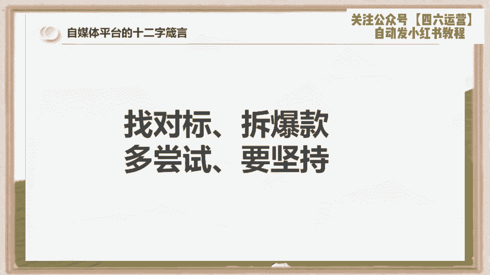

要说最近什么项目最火啊，那就必须要提到小红书电商。最近几个月呢几乎整个互联网都在讨论小红书电商。我关注的几个商业博主啊，包括一些付费社群都在讨论他。我朋友圈月入5位数甚至6位数的比比皆是。

这个项目在年初的时候，我其实就有让团队跟进测试，我还在市面上买了一些课程学习，到现在单人单店一个月能做个一两万块吧。今天我就用一个视频详细的给大家拆解一下，就是小红书电商到底怎么玩。

我会把整个小红书电商的流程，包括一些注意点，比如怎么开店，怎么选品，怎么做流量，一次性给大家讲清楚，你甚至都不用再去看别的相关视频和培训啊，你就跟着我的视频去按住坐骥，就足够你在这个视情上开始盈利了。

视频的结尾呢，我还会给大家准备一份资料，里面有我找的课程啊，对你运营小红书电商呢会有很大的帮助。有需要呢直接去拿就可以了。言归正传啊，整个项目的逻辑啊，其实也非常简单，它就三件事，第一个呢开店。

第二个选品，第三个流量，我们一个一个来讲，先说开店。呃，开店其实没什么好说的。那，首先就是打开小红书，然后点击左上角的菜单图标，再选择创作中心，然后点击更多服务这个选项，选择店铺，点击立即入住就可以了。

你就按他官方要求的提交资料入住就行了。我居然看到有人把小红书开店包装成一个项目拿出来卖。居然还有不少人买，这也是很奇特。这里跟大家说一下，小红书店铺的两种形式，个人店和企业店。

其中个人店有两种分别是个人店和个体工商户店，个人店只需要身份证加1000保证金就可以开通了。个体工商户呢还要多一个营业执照，企业店呢就多一点，企业店有三种，呃，有包括那个普通的企业店，有专卖店和旗舰店。

企业店都需要营业执照，而且还要缴纳600个年费。我们刚开始运营小红书电商的时候，你直接选择个人店就可以了。我们实测下呀，企业店和个人店一样，平台并没有对企业店有什么流量倾斜。

唯一的区别是个人店你只能开一家，而一份营业执照，你可以开三个店，你一个店如果都没做好，你开再多的店都是没有用的。而且小红书电商啊，我觉得是。

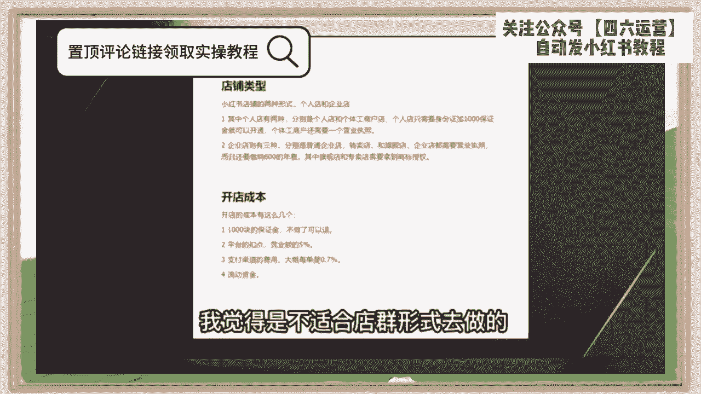

适合店群形式去做的。这是因为小红书的流量机制，它的电商自然流占比非常低。那你铺再多的店再多的货有什么用呢？所以只要你看到有博主跟你讲什么小红书店群，我都觉得是在扯淡。小红书是要做矩阵啊，但不是店铺矩阵。

而是账号矩阵。这个后面在流量获取那里，我会跟大家细说，开店的成本呢有这么几个。第一个就是1000块钱的保证金啊，不做了可以退。第二个呢是平台的扣点营业额的5%。第三个呢是支付渠道的费用，大概呢每单是0。

7，第四个就是自己的流动资金啊，一开始大家做呢可以有无货源的方式去做啊，对资金要求也不高。你刚开始呢准备个2000块3000块完全够了。呃，开完店以后呢，我们下一步就是选品，我们应该在小红书上卖什么呢？

选品其实也简单在其他平台上的爆款大概率在小红书上也能报。目前小红书呢我是推荐三个渠道进行选品的。第一个是通过某东某宝上面找那种小红书平台调性的爆款产品。呃，身边有做电商的朋友，他自己在某宝的店铺卖爆款。

搬到小红书上第一篇笔记就开。第二篇笔记单量就已经破百了。第二个呢是通过某音的那个精选联盟。你在某音的精选联盟排行榜，你可以看到现阶段哪些品卖的好，只要符合小红书用户调性的产品，直接搬运测试就可以了。

第三个就是某多多的这个销量排行榜，选择适合小红书的类目排行榜，从中选择相应的爆品搬运到小红书。整个选品的逻辑，就是我们要利用市场来帮助我们选品，而不是自己在那瞎想。

我们要借助大卖家的选品能力来弥补自己选品上的不足。所以我们只要判断一个东西啊，就是这些排行榜上的爆品是否跟小红书的人群有匹配的可能，如果有我就搬过来测一下，对吧？

相当于是借助了别人的能力来帮我们自己选品，这样反而是最快，而且是最稳妥的选品方式，肯定比你瞎测成功率要高很多。然后等你这个产品上架以后呢，就到了最重要的环节了，我们应该如何获取流量。

小红书它是个种草平台。你店铺九成以上的流量啊，都是来自你发发的笔记。这就是为什么我之选说小红书不要铺出店群，而要做账号矩阵，尽可能多的发笔记耗流量，它的通路就是。

用户通过你的笔记然后对你推的产品产生兴趣，然后到达你的店铺完成购买，你堆一堆店铺，对吧？你铺一堆店铺一个还不如多发笔记，多发几篇笔记的这个效果好。所以怎么在小红书上发笔记，对吧？

就是你小红书电商是否成功的关键。小红书这个平台，你直接发硬广，我觉得效果非常差，对吧？本来小红书的这个用户群体认知就比较高。你直接发广告没有办法获得信任的啊，更不要提转化了，你发笔记的时候。

一定要用一个素人的角度，你知道吧？就是用户的角度去切入，站在用户的角度去做种草内容，而不是官方视角，这才是真正有效的。呃，这种种草笔记怎么做，其实也很简单，就是去各大平台的商品评论里找。

比如某音某宝某东的商品买家秀找到好看的素材，你直接copy下来用嘛，对吧？文案呢在买家评价上去做修改。这些买家的评价呢就是商品用户的使用体验，天然的适合用来做这个中考笔记，而且可以说是举之不尽了啊。

然后呃当你单个账号的SOP跑通了是吧？我们就可以开始举阵引流了啊，通过批量上小红书账号批量发布笔记。

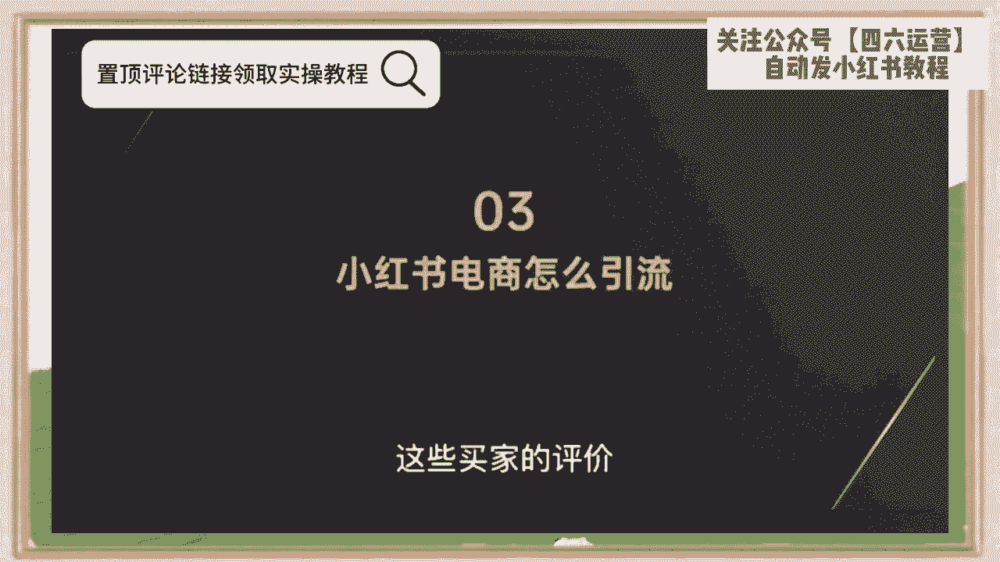

给我们的店铺来引流来放大。那基本上整个小红书的电商的运营啊，就是我上面分享的这些外面不管多少钱的培训啊，000块也好6000块、1万块也好，其实就是这些东西。有些培训可能还没有讲的清楚啊。

根据上面几个点，我给大家准备了一份资料，里面包括了小红书账号的起号运营的方法，以及一份小红书电商的视频课程。你如果打算经营小红书电商，你也不用看别的东西，就跟着这份资料做，足够你开始盈利了。有需要的啊。

点赞加关注，在评论区回复红书电商，我分享给你。😊，🎼要有自信啦，你是最好的，知道吗？😊，🎼，🎼，🎼你好，我叫阿强，我是咱们王岛主电商学院的小红书官方讲师。从今天开始就由我来和大家一起来呃学习我们小红书。

小红书整体的如何去做的，对吧？我们店铺如何去做。我们小红书的IP如何去打造，以及我们关于一些呃剪辑方面的问题都会跟大家讲的很明白，很清楚，好吧，呃。

那我们今天这节课先跟大家来聊一聊我们小红书的电商的整体的一些介绍，好吧，呃，那我们会从两个方面会跟大家具体来讲一讲。首先会跟大家来聊一聊为什么我们要去做小红书电商。

今天的主要目的就是跟大家来聊一聊我们整整堂这个我们的课程里面会按照一个什么节奏，什么步骤来跟大家呃讲我们的小红书课程。首先为什么我们要去做小红书呢？首先你要大家要知道趋势很重要。

小红书它目前算是整个互联网中风口已经是比较大的。但是最。大的流量大家可能也知道，肯定目前肯定是抖音，对吧？但是小红书它目抖音它已经处在一个风口，但是它在逐渐下降的。

而且小红书其实你会发现它每年它每个月的呃热度啊以及流量的都是一个处在一个。持续上涨的上涨的一个状态。所以说其实大家和我们一样，其实也是看到了小红书它的风口，它的流量。所以说我们才会去做小红书，对吧？

才会去越来越多人在小红书里面赚到钱，也有越来越多的人开始入局小红书。所以说趋势很重要。这个就是目前它的一个风口的趋势，所以我们也需要大家去顺势而为，而不是逆水行舟，对吧？那目前小红书它是一个什么平台呢。

首先第一个它是一个电商平台，对吧？我们可以在里面买东西，以及可以在里面卖东西，以及它是一个直播平台，对吧？它是一个买手平台，对吧？大家要明白这三个点，就很重要，以及目前小红书相对于其他的一些。平台来说。

比如说一类电商的淘宝、天猫、京东这些是稍微比较简单的，而且相对于抖音来说也是比较易上手，成本比较低的那它具体从哪两个方面来。首先它不需要大家去囤货，不像抖音天猫淘宝这些它需要大家有货源，有工厂，对吧？

它不需要你去说固定，我必须得去直播，对吧？直播卖货，这些都不需要我因为我们大部分做小红书的人都应该知道它是可以有一个叫做一键代发的，我们可以让别的平台帮我们发发货，我们自己不需要去发货。

以及它对于像抖音来说，抖音。如果说你不实拍的话，或者说你呃全部混检的话，它肯定会很容易被呃可被判为这种搬运啊，混检啊，会会被判为违规的。而小红书不一样。小红书我们前期做的话，不需要你去实拍，对吧？

而且不需要我们自己去买一样品。我们不需要花费大量的人力精力，我们去做混检就可以了，对吧？提供呃，你可以自己去寻找一些素材，通过这些素材做一个混检，做一个简单的混检，就能获得一些稍微大一点的流量呃。

形成呃出单等等等等，对吧？形成这个店铺的一些火爆的流量很简单，好吧，第三个点，它目前来说，竞争压力相对于来说也是比较小一点的。因为很多传统的电商的卖家呀，还没有开始完全的入局小红书这个平台。

还有很多人甚至都不知道小红书这个平台。而目前。呃，2024年也确实是小红书，它的一个新一轮的风口。所以说我们大家一定要抓住时间，对吧？抓紧时间去入住小红书这个平台。

也是目前我们呃大部分人想在互联网上翻身的一个机会。好吧呃，那这个就是我们跟大家讲一讲具体我们为什么要去做小红书的好吧，那接下来我会通过三个方面跟大家来聊一聊呃接下来的课程的内容，好吧。

首先呃先会简单的跟大家讲一讲我们的小红书店铺的如何去操作的，我会跟大家简单做一个预告，好吧，我们如何去看我们的课程，我们的一个正确的步骤，我们怎么去操作的，我会从几个步骤来跟大家来讲一讲。

首先第一个第一个我们肯定是开店，对吧？店铺的一些基础操作。我们对吧？不管说你目前以前有没有开店，或者说以前店铺操不操作。我们先如果说大家都没有的话，我建议大家先把我们这个开店的流程都给大家看一遍，我们。

开店的整体的流程以及店铺的一些技础操作。对吧那呃具体怎么去操作呢？我们会第第二节课里面会跟大家讲用什么账号去开店，用新号还是老号，对吧？第三节课第四节课我会跟大家讲讲我们如何去设计开店。

一个人如何去开多家店铺，我们后期想做矩阵，我们如何去操作。以及我们第五节课第六节课会跟大家具体来讲一讲我们如何完成店铺的一些技术操作，我们地址怎么去填写，以及我们怎么去发货呀，以及我们等等等等。

怎么去上品啊等等，都会跟大家讲这是我们第一部分第二部分会跟大家讲讲，我们怎么去选类目的，分析一下我们类目，对吧？我们类目其实也是很重要。我接下来也会跟大家讲下，其实我们这个方向其实永远比努力更重要。

我们要选对方向，这一一大点，我会具体跟大家讲讲如何去选类目的，以及我们选好类目之后，我们如何去养号呀，我们如何去找到我们的对标账号，别人学的好的，别人做的好的，他肯定是有一些好。

的地方我们可以借鉴的啊这两节课我会具体来跟大家讲一讲我们养好号之后，我们如何去选品啊，我们内目也想好了，那那我们得去选品，我们通过什么呃在什么地方选品呢？在淘宝抖音拼多多小红书里面都是可以选品的。

以及我们选品的一些底底层逻辑，对吧？以及我们用一些大数据来观察一下怎么去选品的问题，好吧呃，就是选品的问题，以及我们去选完品之后，我们怎样去做一些营销的活动，比如说上架优惠券等等等等。

我们通过手机端上架产品，对吧？电脑端上架产品，对吧？以及优惠券怎么去设置客服的聊天等等等等等。这些我都会具体细节方面跟大家讲一讲，以及我们这些品都上完了，店铺都看完了，那我们开始找素材，写笔记了。

我们如何去写写出我们的高效的笔记，写出我们爆款的笔记，找到我们爆款的素材，对吧？我们在哪些地方找呢？如何在拼多多淘宝里面找，以及在跟。😊，抖音小红书里面找素材，我们的封面笔记标题，我们如何去正确操作。

才能做出我们爆款的笔记，爆款的视频，对吧？我们手机端如何去发布笔记，电脑端如何去发布等等等等。这个我们会在找素材写笔记这里面跟大家讲的很清楚，以及我们会跟大家具体来讲一讲我们写完笔记。

我们笔记后端的怎么去分析它，我们获如何通过官方来获得更多大量的流量，我们小红书笔记流量整体的分析，以及小红书模板的如何去正确使用，我们会有大量的模板可以使用，以及小红书如何去日常维护，对吧？维护它。

对吧？让更多人吸引到我们的账户里面来呃，我们发了一条作品之后，如何去维护它，如何能给他获得更多的流量，人何如何把别人留下来，如何让别人来出单，对吧？小红书如何去使用1688拍单。

如何我们使用吞金吞金软件，以及我们如何跟厂家对接等等等等。这里面都会讲的很清楚，以及最后我会给大家讲一讲如何去发货的。小红书的订单。揭秘我们如何获得更多的私域呃，订单对吧？获得订单之后。

白讲呃发给人家第第三方平台，对吧？我们形成一键代发，以及如何我们使用呃处理店店铺的售后问题，以及小红书如何去报备店铺，对吧？这里面都会讲的很详细跟大家讲。

这是关于小红书店铺的一些呃操作的那店铺操作完之后啊，我们要打造自己的IP，对吧？我IP课程，我认为呃还有很多朋友跟我讲说确实想学IP的这个课程里面也会跟大家具体来讲讲如何去打造自己的IP的对吧？

什么是小红书IP如何确定你的赛道，找到细分领域，对吧？找到账号的精细化运营，以及怎么去选题的对吧？我们笔记内容如何制作账号笔记整体怎么去复盘，对吧？如何形成商务变现，私域产品如何发布，如何导流的对吧？

以及我们思域怎么去变现的这个是将近十节课程里面，我们会跟大家讲一讲小红书IP的最后我们会来讲到如何我们小红书素材的。文剪剪辑片对吧？我们如何去把人家的视频保留下来，我们如何去剪辑的？我们去如何去。

如果说后期我们自己去拍摄的，我们拍摄的工具，那么构图以及口播如何录制，拍摄素材初剪的，如何添加帖子啊，添加转场、特效、字幕、音乐、音音效、背景音乐，对吧？等等等等。这里面都会讲的很详细，好吧，好的。

那我呃这个就是咱们今天的课程，我们下节课会跟大家去具体来聊一聊，今天来跟大家讲一讲我们哪些账号适合我们开通我们小红书的店铺。我们会从三个方面来跟大家来讲讲我们这堂课。首先会跟大家讲讲。

不管说你人是在国内的，还是在国外的。我们都是有办法来开通我们小红书店铺的，或者说很多人想了解目前我的账号是一个新号，我们是呃或者是一个老号，我们到底我们的账号是否去可以去开通小红书店铺的对吧？

或者说呃目前我想了解一下我们的账号到底是否被限流的等等这些问题。我今天课程里面都会跟大家讲的很详细。首先呃不管说你是人在国内还是人是在国外的，其实都是可以去开通小红书店铺的。第一种情况，你如果人在国内。

在我们。中国大陆类对吧？有我们大陆的身份证的，对吧？那我们直接可以去用身份证开通一家个人店铺就可以了。小红书店铺跟其他平台的一些店铺开通店铺条件还是不一样的。它整体来说还是比较宽泛的。呃。

因为你像其他店铺的话，整个条件还需要你有营业执照，而小红书开通我们个人店的话，并不需要你去有营业执照，开一个个人店就可以了。有一个身份证就可以了。第二个，你如果说是在国外的对吧？但是你也有大陆身份证。

那没问题啊，我们也是可以用身份证，开一家我们个人店，好吧？呃，就是你首先第一个条件，你如果说不管人在国内还是在国外，你有身份证就可以开通了。第二个呃，你如果说人在国外，但是你也没有大陆的身份证，对吧？

没有大陆的身份证，那怎么办呢？我们就需要有一个海外的营业执照开通可以开通一个专卖店和一个旗舰店，我们也有学员，他是人在国外的，但是他有自己的货源，那我们自己有外国的。货源，那他想营销到中国来怎么办呢？

那就需要有海外的营业执照，就可以开通店铺，就可以呃营销到国内了。好吧，但是他只能开通专卖店跟旗舰店。好吧，呃，这个是一个条件，我们不管人在国内还是在国外都可以开店。第二个就是我们考虑到我们新号还是老号。

我们如何去开店的问题。不管说你是新号还是老号，其实我们都是可以去，如果说条件允许的话，都是可以去开店的好吧，呃，都是可以去发布作品的，老号首先我们分为你之前有没有发过笔记，如果说你之前没有发过笔记。

那没有问题，第一种条件，如果说你没有发过笔记之后，这个号之之前是我自己我自己在用的，我经常天天在要对吧？天天在刷一些我自己喜欢的内容，对吧？而且这个喜欢内容可能跟我自己接下来想做的类幕是有点区别的。

所以我们最好是要换一个专门的新号，专门的新号，因为可能这个标签就不精准了。跟我们未来想打进这个人群的标。肯定是有点冲突的，有点冲突的。因为我们自己用的账号嘛，标签啊什么都呃都都有了。

后续来说不太好养号的是吧？第二个呢，如果说你之前对吧？只是注册过，但是没怎么用的这种情况呢，可以用这种账号，我们因为这种后续是比较好养号的，比较可以自己自己使用的。如果说你之前发过一些日常类型的笔记。

一方面要看这个号自己刷的多不多。如果说你这个号刷的比较多，那我们就需要及时给他换掉对吧？因为你刷的多了，你这个发过笔记了，你经常标签我还是那句话，你标签乱了，标签乱的话，你想后期再样改过来。

那难度还是比你重新再培养一个号的难度要大的。如果说哎自己刷的不多，而且发的笔记啊，整体流量也不是很好的情况下，那因为他没有打上足够的标签嘛，那我们就可以继续使用。

另一方面呢要看笔记报没报粉丝账号的整体的粉丝数量是怎么样的。如果。涨的不多，刷的不多，笔记也没怎么报过。那我们可以删掉笔记。因为我刚刚讲到了，对吧你整体的流量不是很多，因为你没人打上足够的标签。

那我们就可以用。如果说你刷的不多，之前发了其他类型的笔记，且有了一定的粉丝基础，我打上人群标签了，人家都都都能刷到我这账号了，那我们就需要果断。😡，果断的换掉新号，要不然你这个老号。

后续如果说标签很乱的话，你你再想把这个标签给它改正的话，难度肯定是比你培养一个新号难度要大很多的。而且我们接下来也会跟大家讲一讲我们新号如何去养号的问题，好吧呃，这是第一第一个老号的问题。

如果说新号的话，其实我们自己如果说我们没有这些问题，我们自己做一个新号也是没问题的。我们会对吧？那如果说你还是拿不准我们自己到底是否用自己老号，那我建议大家直接就换新号。

找自己的家人帮忙注册一个新号就可以了。呃，找自己的家人，一定要是比较熟的家人。因为这个的话，后续还得考虑到一个银行卡，人家打的成交额，打到银行卡里面的问题。好吧，这是第一个新号老号的问题啊。

第三个我会跟大家讲一讲，如何去测试账号的是否被限流。呃，正常情况下，我们账号如果说没有出现大量违规的情况下，正常情况下是不会有太多限流的，大家不用太过于担心好吧，如何知道自己的账号被限流的。

我们可以通过这个方法。测试账号的限流方法，我们可以发布一个日常分享的一个笔记，发布什么都行，对吧？正常一点的笔记，日常的分分享的生活就可以了。看24小时内的流量情况。如果24小时后流量能达到50左右的。

对吧？那么正常流量是正常的账号流量是正常的。如果说连50都没有，可能只有一个两个这种呃流量的，那说明你一个账号可能会处在违规阶段的。好吧，如果说不正常被限流了，那我们怎么办？好吧。

上面之前可能有违规的或者存在潜在违规的。我刚刚讲到流量很低的，我们建议注销掉该账号重新注册就可以了。呃，重新注册完之后，这个会是一个新号，我们再做继续培养就可以了，好吧呃，这个就是大家呃跟大家讲一讲。

我们如果说我们怎么去选择账号，以及我们如何去测试账号的流量的，大家不用去担心，对吧？我们开一个新号，开一个老号的问题。我建议大家呢除非说你之前的账号。做的很好啦。

或者要不然你我建议大家还是去可以注册一个新号，重新养号。好吧，那我们今天这个第二节课程就到这边。今天我们来讲一下我们第三课程，小红书开店的一些基础的一些流程。

我们如何去开通我们的个人店个体店以及我们的一些旗舰店啊等等等等。好吧？我们先从我们的个人店开始来讲。呃，首先我们个人店的话是可以通过手机开通也是可以通过电脑开通的。手机开通的话。

我们就下载一个我们我们可以用小红书本身的账号，也可以或者说我们下载一个小红书的签翻。我接下来也会跟大家具体来讲一讲小红书签翻。好吧，我们需要的需要的证件，需要你有一个身份证以及有一个银行卡。呃。

但是这个一定要是同一个人才行，对吧？就身份证跟你银行卡绑定的是同一个人，呃，这个是必要的条件。因为它后续所以说这个如果说大家是用自己家里面，然后或者用亲戚绑定的这个身份证的，绑定这个账号。

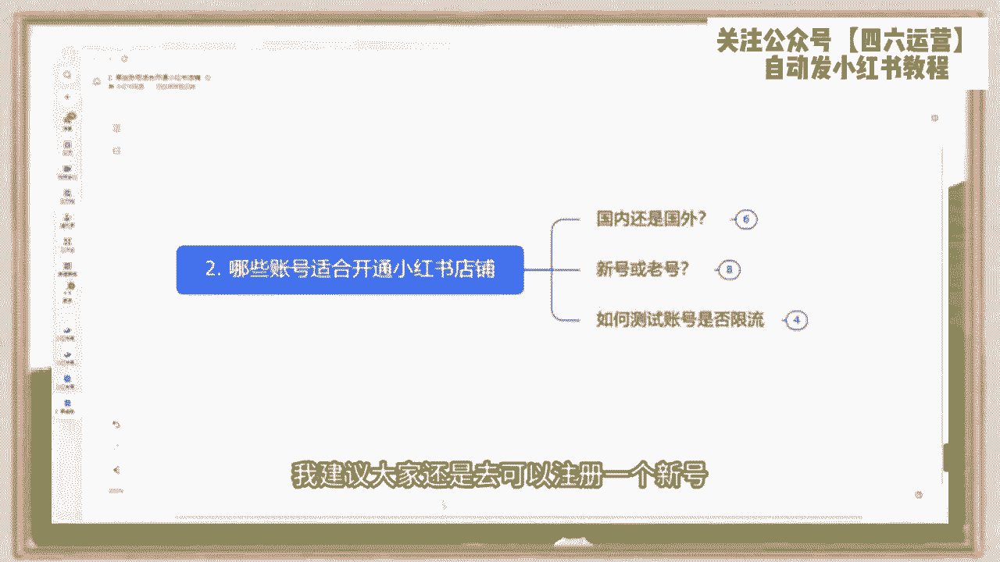

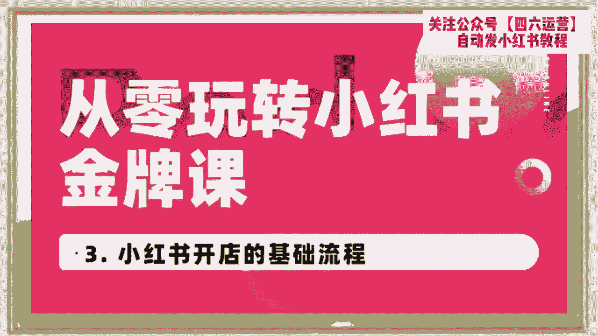

所以说一定要找比较熟悉一点的对吧？要不然后续会考虑到一个经济纠纷等等，对吧？这是第一个。第二个呢，就是我们开店过程中，经营的类目啊，其实可以前期随便选一个，先把店铺开通了再说。

反正呃后面反正可以随时再改类目，因为我们交如果说你想持续做的话，要交交保证金，对吧？但是我们在开店的过程中，保证金可以先跳过，先不用交，对吧？店铺可以随便取，后面我们后续我们再改都可以，好吧。

经营的地址呢也是可以随便填写的，这都没问题。好吧，那具体的开店步骤我来跟大家来讲一讲怎么去操作。首先第一步打开我们小红书的搜索栏，这就是我们普通的系统。打开我们小红书搜索栏，你看到了。

就是我们小红书搜索栏，我们在上面搜索开店两个字，搜索开店两个字，打开开店了，看到了开店，我们搜索开店这边有个小红书电商，小红书电商官方平台，点击开店，我们就点击这个就可以了，好吧。

点击开店之后点击立即开店这边跳出来之后，我们这边有个立即开店呃，我们可以先看一下给开店必要必看的一些材料费用。呃，正常情况下，开店是不需要。你如果说开个人店的话，不需要收费的。

0元就可以开开通了务费优惠流量扶持必备工具，选择立即开店，选择立即开店之后，我们选择店铺的类型，对吧？我们前期我们可以先选择个人选择个人店，吧？个人店的话，只需要你有身份证。如果说你想开一个个体店的话。

需要有营业执照以及运营人的身份证证件，这个的话是支持一部分的类目的对吧？但是如果说你想开通个人店，后期也可以转。😊，为个人个体工商户店都可以的。好吧。如果说你是企业的话，也可以开通企业店。

但是企业的话可能会以呃以及专卖店可能会呃考虑到一个税务的问题。好吧，关于开通店，我们点击店铺选择完之后，我们点击下一步，对吧？它会里面会有很多店铺的介绍，我们就选择个人店，选择嗯自己想要的店铺就可以了。

选择完店铺之后，我们选择点击下一步，点击下一步邀请码，我们可以跳过对吧？没有可以不填，这是关于服务商的呃，我们填写其中的一些信息，身份证的正反面照片啊，以及我们这边可以选择属于您星小小额交易。

依法无需要办理了，以及如果说我们是农副产品的，需要办理的。对吧开店必备的，我们这里面也是有一些开店必备的个人身份、个体户的企业的等等等等。电商我们去填写一些自己的一些信息就行了。很简单好吧。

不呃有很多信息，如果说你不需要可以跳过的，你可以先跳过，对吧？我们选择个人身份，个体店电商用品就可以了，选择立即开店。正常情况下，我们的店铺就可以开通了，好吧，这是我们开店的步骤。

那有几个注意点跟大家讲一讲。首先呃后续提现的金额会进入开卡身份证人的银行卡，所以说这个就刚刚跟大家讲过的，我们需要开卡人的身份证跟我们的这个银行卡需要是同一个人，好吧？呃，以及我们如果说多开店的话。

最好找熟悉的人来开对吧？亲戚朋友，个人店正常情况下，呃们当天时间，如果说你这些信息填写的都没有问题的情况下，当天他就可以下来的。小红书的名字，也就是店铺的名字，比如说需要注意的是提前查重，对吧？

我们小红书店铺的名字，也可以提。前可以前前期可以先随便选一个，后面也可以改对吧？但是7天改一次。比如说你这个小红司名称叫一1，那你这个店铺名称就叫111的店，个人店不需要缴纳600块钱的证件费用的。

好吧，这个是我们跟大家简单来聊一聊个人店保证金的话，1000块钱，大概在1000块钱左右，也不一定根据不同的类目来分，好吧，最低应该是1000块钱，这个有个平台的扣点平台扣点大概在每个月成交额的5%。

因为基本上所有平台它都会有一个平台扣点低于1万元的是不收这个平台扣点的一个自然月订单金额呃结算额小于1万1万0平台免收技术服务费，懂我懂我说的意思吧。假如说你这一个月整体的收入在小于1万元的。

成交额在小于1万元的，它是不收你的技术服务费的。结算额超过1万元部分，平台按5%收。比比如说你今天呃这一个月成交额超过了2万，那你2万，那里有其中的1万，你要收给平台一个。的服务费是吧。

1万元的结算金额已减去退款金额，技础服务费小于5%的店铺不享受万元。呃，以下的棉这个大概大家了解一下就可以了。好吧，这个是关于个体店的个体店的一些部分，大家可以去开店。呃，了解一下。

如果说你想开个体个体店的话，就需要我们实名小红书的账号呃，以及加上我们的营业执照，对吧？需要是同一个人的。就比如说你小红书是是是谁的？营业执照的法人营业执照上面的人最好是同一个人，就要同一个人。

然后我们可以通过手机开通手机，打开我们小红书的商家版，目前也叫小红书签翻。好吧，呃，小红书签翻给大家打一下吧。呃，后续也会跟大家具体来介绍签翻。然后大家可以下载这个手机开电脑开通的话，去开小红书呃。

签翻签翻的官网就可以打开里面去注册啊。好吧，我们的专卖店旗舰店。如果说你确实是有专卖店旗舰店，也是可以按照我们刚刚的步骤去开通的。呃，接下来讲一讲我们一些特殊的一些类目，可能是比大家比较想了解的。

比如说酒水啊、零食啊、水果啊，这些需要有营业执照加食品经营许可证，加上品牌授权的，这些基本上都需要。但是我建议大家就是如果说你不是特别擅长。这几个行业尽量就先别入局这些好吧。

美妆行业呢需要有化妆品备案凭证。家电行业呢需要有3C认证证书。3C数码的需要有3C认证证书，其他的类目的，都有具体的介绍，都能在我们小红书的类目里面可以找到。好吧。

然后如果说大家有任何关于类目不懂的好吧，我们接下来也会跟大家讲一讲怎么去选择类目的问题。好吧，那我们今天这堂小红书开店的一些基础流程，主要是跟大家讲一讲如何去开店，步走操作的。好吧。

那我们今天这个课程就到这边。大家好，今天我们来讲一讲我们的第四堂课，个人如何我们开通多家店铺，我们后期如果说一家店铺做好了，我们想开多家店铺，我们怎么去选择我们怎么去做举证的问题。啊。

我们会从几个方面跟大家来讲。首先第一个开多家店铺的前提，如何去开家多多家店铺，我们店群一些注意事项。我们先来看一下开多家店铺的前提，所有的。我们开通多家店铺的前提。

一定是你已经能把你手里面的一家店铺给它运营好了，我们再去做你连你自己手里面的第一家店铺还没有做好，你就想去大量的去铺大量去做，那是不现实的。你最终可能导致所有店铺都做不好好吧？呃，这个是第一个前提。

我希望大家听完我的课程之后，能把你的第一家店铺做完之后，出单了，能有稳定持续的出单了，我们再去大量的去铺店，好吧，这是第一个条件。第二个条件，你能有大量的闲余的时间空余的时间你去做，对吧？

我可能花一个店铺可能需要呃一个小时2个小时，但是你可能花两个店铺可能就需要3个小时呃，5个小时6个小时了，就可能不是一加一等于二的问题了。因为两个店铺你可能会发生的事情可能越来更多，好吧。

否则你要先全力做好一家店铺，先把一家店铺做好，先把它的整体的熟悉它的流程，整体的方法都给他熟悉了，对吧？我们再去做其他的店铺，我们再把其他店铺给大做好。我们再去铺铺大量的店，好吧，这是开多家店铺的前提。

我们要有一个稳定的出单。我们先稳定的能赚到钱，我们开店流程，我们的运营流程，我们笔记啊我们呃混检，所有这些我都能学会了，或者怎么去铺货，这些我都能明白了，我再去开多家店铺，好吧。

那我们如何去开多家店铺呢。首先流程流程方面，首先第一个小红书账号加实名账账号的注册加实名，对吧？我们用营业执照，这是第一个，我们可以用自己的家人重新注册账号，重新加实名。

重新呃用身份证注册小店店铺都可以对吧？这是第一个方法。第二个方法呢，我们用营业执照可以注册成企业号，企业号也可以多开小店，好吧，需要600块钱的保证金，对吧？再去再去开个体店。对吧这是流程。第二个呢。

我们每多一个营业执照，就是可以多开两家个体店的，懂我意思吧？就是一个营业执照可以多开两家个体店，对吧？营业执照可以在淘宝里面或者说拼多多找人代办，正常情况下，几百块钱就可以了，对吧？

几百块钱比如说你是做一个营业执照，可能只要1一两百块钱。如果说营业执照加食品经营许可证，可能四五百左右，这个是需要身份证的，以及需要你个人提供信息的对吧？这个只要你找一个可以做电商的呃。

营业执照就可以了，并不需要说你还是需要线下的，只要你同类目的就可以了。好吧，这是我们如何去开通多家的那我们开通多家之后，我们会有一个店群，那什么是店群呢？店群就是。

我一个店铺一个月能赚2万和一个月一个店铺，一个月能赚5000。你想你想你想要哪个？我问一下大家，你想要哪个，你想要一个店铺，一个月赚2万，还是想要一个月店铺一个月能赚5000。

相信大部分肯定都是想做钱者，但是难度以及付出的精力，都是呃可能是M倍。你比如说一个店铺我做2万。但是一个店铺你做4万，可能你花费的时间是远远不止这个5005000的4倍了，可能10倍都不止，对不对？

那我们可以放低标准呀？我们既然一个店铺能做到5000，但是我们做到5000做到1万，做到2万难度很大很很很高。那我们可以多做几个5000的店铺，那我们是不是一都都能起来了，懂我说的意思吧。

在小红书这个方面跟其他店商其实也是一样。你能做起来，其实简单，但是你想做好做大做强，做到一个比较好的头部来说还是难度比较大的。所以说它跟其他平台不一样的。就是他能迅速的去复制复制。我可能我说一个一个店。

一个月我能有5000块钱利润。但是我想一个月有2万块钱利润很难。但我可以做10个店，做20个店，每个店都有5000，这个难度肯定是比你能把一个店做到10万20万，这个难度肯定是要低一些的。好吧。

因为我们整体的流程来说，大家都熟悉了，好吧，这是第一个什么是店群，那我们多开店需要有哪些注意的事项的？首先一G一卡一账号，这个大家能明白什么意思吧？就是一部手机，一张电话卡，一个小红书账号对吧？

主账号建议我们一一个账号放在一个手机里面不要去一部手机去多个账号去切换，有可能啊会你正常情况下一个账号违规的话，可能会连同其他账号也会判定为违规，懂我意思吧？所以说我建议是一G一卡一账号。

目前小红书多台设备多个账号连在同一个wifi下是不会受什么影响的。如果你同一个wifi没有影响。但是你最好。不要把多个账号登在一个一个手机里面去，对吧？呃，而且呃正常情况下浏览器登录多个店铺。

一个电脑里面多登录一个店铺，多个浏览器也是没有问题的，好吧，赚钱呢其实就是一套行之有效的动作，持续复制就可以了。为什么说很多连锁店，很多连锁店可能一个连锁店可能能赚到一个一年赚到个几十万，很简单。

但是你让他赚几千万很难。但是他去做连锁了。这其实就跟我们做小红书店群其实是一样的道理。好吧，大家要首先要明白这个道理。我们再去做后面的操作。好吧，那我们今天这个个人如何开通多家店铺可程就讲到这边。

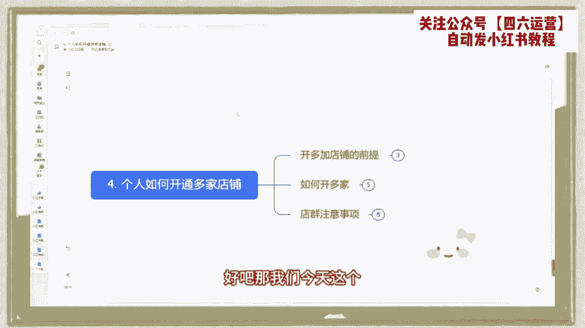

🎼大家好，今天来跟大家来讲一讲小红书店铺后台。我们如何去通过手机端设置一些内容的。好吧，然后我们会以视频的形式跟大家展示一下。首先呃我们打开的系统是签翻系统来给大家看一下小红书签翻来大家能看得见吗？

小红书签翻的系统。直接我们到应用商店里面去搜索小红书签翻就行了。这个是我们后台呃基本上会操作的。好吧，就直接到应用商店里面去搜搜索就可以了。我们打开之后大家可以看到我们打开之后，我们正常是这个页面。

这是我们创的一个新店，基本上没有什么操作的。这边有一个消息，我们点击消息，点击消息里面这里面就是我们客服接待的一些通知。如果说有人问我们店铺的一些问题了，我们就可以在里面去回复他，在里面去回复的。

这是客服接待的一些通知啊，都是可以在里面看到的，以及我们配置客服啊等等。这里面都可以看到，看到了吗？这是店铺的一些消息，一些通知，一些比如说你违规的通知等等，这里面都会有。

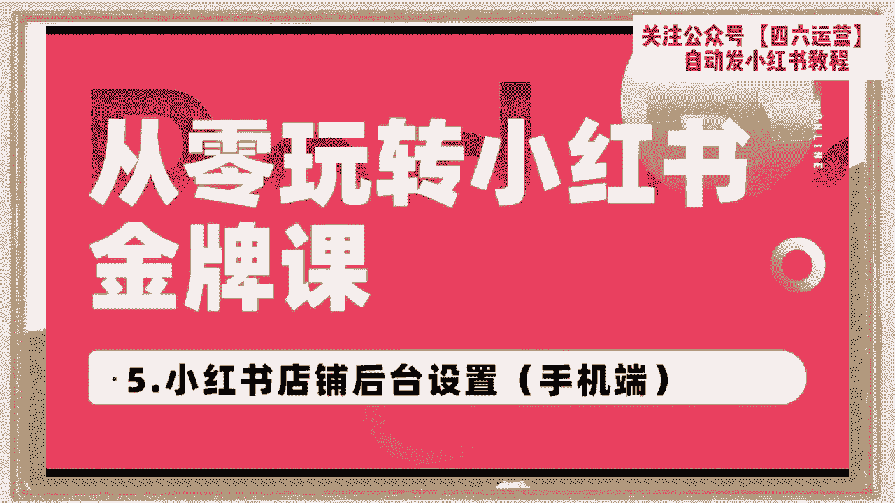

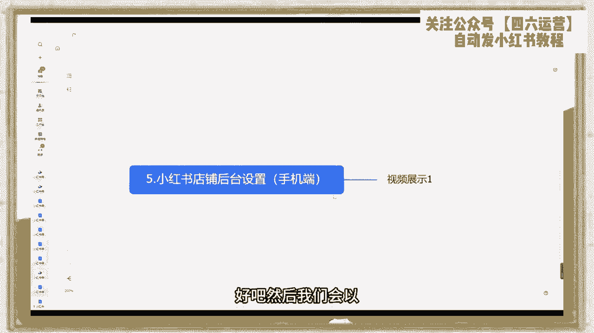

好吧，然后我们打开我们的首页，这里面有个区初始化，我们这边可以去填写一些信息，以及我们这边有个全部工具，我们这边可以发布作品啊，笔记管理啊、电脑端啊等等等等，这边都可以。我们点击。

全部工具这里面可以呃给大家看一下，点击全部工具这边有发布作品，全部全部发布商品，我们可以发布新的商品，我们可以管理全部的商品，全部的订单，对吧？售后的订单数据中心呃，商品笔记啊等等等等。

这里面都可以以及我们发布商品的类目啊，对吧？品牌类目啊，店铺的装修群管理呃，我们打开这边有个成长成长这边正常情况下，我们先要去把这些给它完成，对吧？才能继续后面的操作地址，对吧？我们这边有个地址。

对填写我们的发货地址，这是我们就是我们开店铺的第一操作，我们需要填写我们地址，好吧，我们这点击去完成，在这个地方也是可以去填写地址的，看到了吗？地址呢，我们这边可以这个时候我已经填好了，对吧？

我们正常情况下可以去填填具体地址怎么填的，这边可以看到我们联系人随便写我们自己就可以了。地址，中国大陆选择里改在的地区详细地址呢，其实可以随便填。因为我们是做一键代发的嘛，我们这个地址是是可以随便填的。

好吧，我们填写自己的手机号码，你就给买买家留言，一定要之前有这边是可以填写联系客服的。但是现在填联系联系不了了，我们里面一定要联系客服给地址，好吧，这是就是影响到我们一些退货的一些问题。

如果说我们这边填写联系客服的话，他这边平台是不给通过的。好吧，我们要在这个地方来填写地址。好吧，然后我们填写完成之后，这边可以填写我们的物流物流板块，对吧？物流板块填写我们的名称，继续去填添加就行了。

对吧？我们添加呃，这边是可以添加我们的运费版块的，你可以选择。如果说大家开过抖店的，这些应该都明白对吧？或者说你们不明白的话，我们可以添加运费模板，就比如说你是新疆西藏这些不配送的，对吧？

我们可以直接选择不配送。如果说需要付费的对吧？买家承担邮费的，我们也可以去这边去选择非偏远地区的，或者说全国包邮的这些模板，我们可以它本身它会有系统默认的，但是我们正常情况下就选择这个模板就行。

不是全国包邮嘛。因为这些地方我们都需要付邮费的，好吧，这些邮费。😊，也是比较高的。我们就这个是关于地址的选择，再看这边发布作品，看到了吧？

这个就是大家可能呃这边有一个优惠券可以设置优惠券的来给大家具体来跳一下，看一下这边有个营销，这边有个优惠券活动报名，对吧？点击进去，我们可以创建自己的优惠券，对吧？比如说你创建。

店铺通用的店铺通用的优惠券，指定商品的优惠券，店铺的新人券对吧？这些都是可以的。我接下来也会跟大家具体来讲一讲怎么去操作的全网自动推广的对吧？正在生效的已失效的等等。

这些都需要大家去了解的这边填完之后呢，地址填完之后，店铺的认证信息，对吧？我们需要去填写你是个人店啊什么店填写，然后缴纳保证金。如果说大家想长期在呃我们这个平台做的话，我建议大家还是需要去把保证金交了。

我们这边一定要注意，一定要去把这个微信支付给他打开，以及我们的支付宝支付，按照它上面的流程，对吧？你填写自己的身份证号码，以银行卡，只要在这里面操作，我们就可以人家就可以通过微信支付。

可以通过支付宝支付了，好吧，我们补交补交我们的店铺的保证金就可以了。因为根据不同类目，所以说它保证金也不一样。那这个就是我们今天的这个小红书店铺后台手机端的一些操作，大家多去琢磨琢磨多去摸索摸索。

基本上这个是。

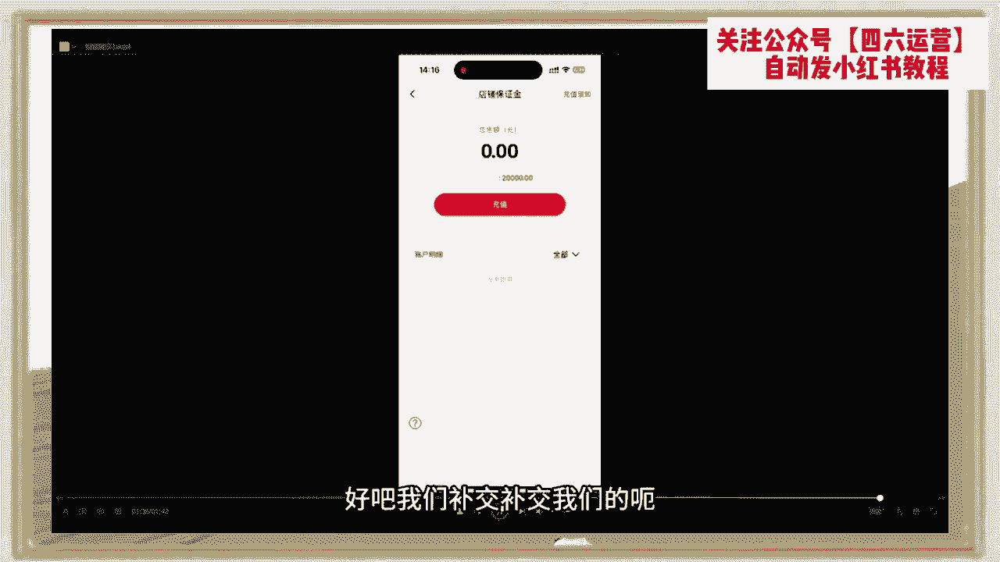

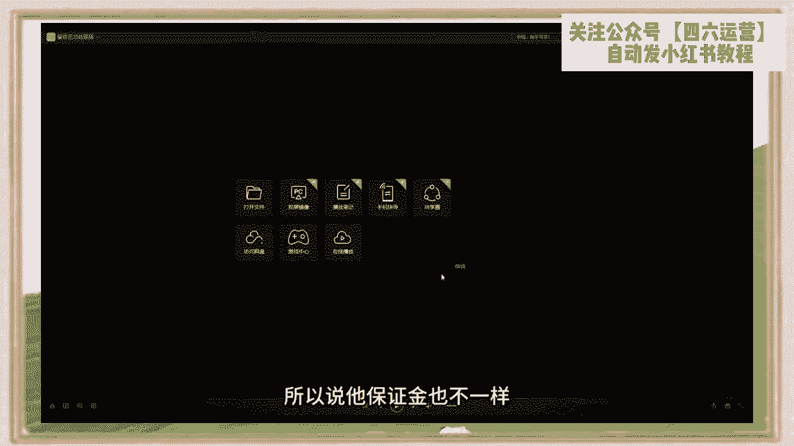

什么太大难度的。好吧，刚刚展示了一下如何去使用呃，如何去设置地址呀，如何使用优惠券。好吧，那我们今天课程就到这边。大家好，今天来跟大家来讲一讲我们的第六堂课，小红书后台的一些技术操作。呃。

我们如何通过电脑端来操作的。好吧，我们从几个几个方面来跟大家讲。第一个保证金方面开通方式，运费保的设置以及地址设置这几个方面都会跟大家具体来聊一聊，先来讲一下保证金，保证金的话，其实我前面也跟大家讲了。

我们前期的话是可以不用缴纳的。个人店的保证金在1000块钱左右呃，在1000块钱左右根据不同的类幕啊，它的保证金不同呃，我们来看一下，这个是我们的小红书签翻系统，我们打开小红书签翻系统。

我们搜索小红书签翻。这里面有个资金看到了吗？打开我们的首页这有个资金资金，这边有一个保店铺保证金管理店铺保证金，我们这边可以充值我们的保证金呃，待待补缴的这是因为我选的类目比较多选。

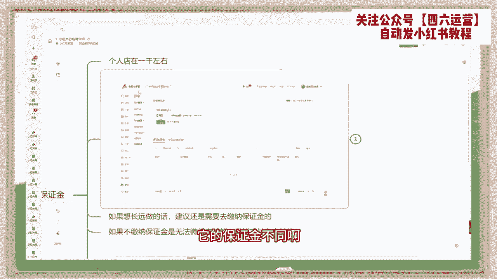

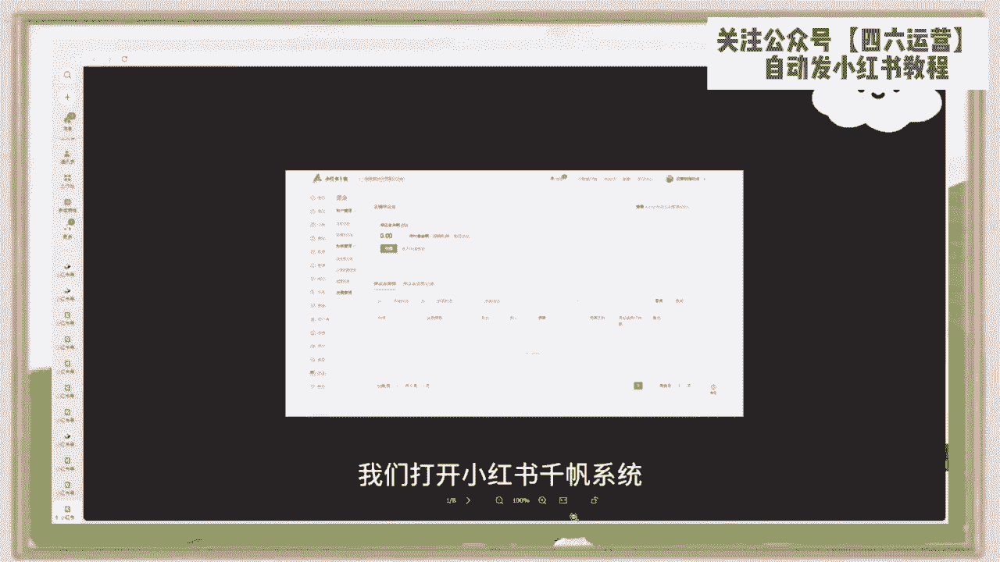

不同类目，它保证金不一样，我们只需要选择你自己的类目，然后缴纳相应的保证金就可以了。好吧，这边由我们缴纳已经缴纳完了，或者说保证金退款。这个保证金大家放心跟抖音其他平台也一样。他的保证金。

如果说咱们后期如果这个店铺不做了。他这个不管多少保证金，他是可以退的。但是这个保证金他也是会扣款的，他是会为了保证咱们店铺的一些客户他们的一些权益。就比如说呃答应人家这个退款了。

但是我们实际上没有退款的。以及实际上没有去操作一些，他会扣取的。但是正常我们只要在不违规的情况下，他在保证金是不会扣的，以及不会扣太多的。好吧，那我们也前期也跟大家讲了，前期是可以不用缴纳的。

但是我们后期如果说想要店铺做大的话，或者说我们想要开通一些其他的一些方式支付宝方式的话，想想要开通微信的话，那我们必须要缴纳，对吧？如果说想要长远做的话，建议还是要去缴纳这个保证金的。

就在我们这个入口去缴纳就可以了。如果不缴纳的话，保证金是无法微信支付的。现在有很多年轻人都是使用微信支付。呃，所以说呃你想要开通这个微信支付的入口的话，我建议大家还是需要去缴纳一下。缴纳完之后。

支付宝跟这些都可以支付了，这个是我们的一些保证金，大家可以看到，如果说我们个体店的话，基本上在1000块钱左右，对吧？当然有很多类目比如说二奢啊，这些全新奢侈品啊，珠付宝玉石啊，家用电器啊。

这些是我们个体店无法无法开通的啊，个人店无法开通的。我们个体店可以开通，你可以去开通个体店，我们正常类目的话，你看个人店的个体店的话也在1000块钱左右。企业店的话也就在2000块钱到1万块钱。

2万块钱不等。好吧呃，大部分的个人个人店的保证金以及个体店的保证金都在1000块钱左右。

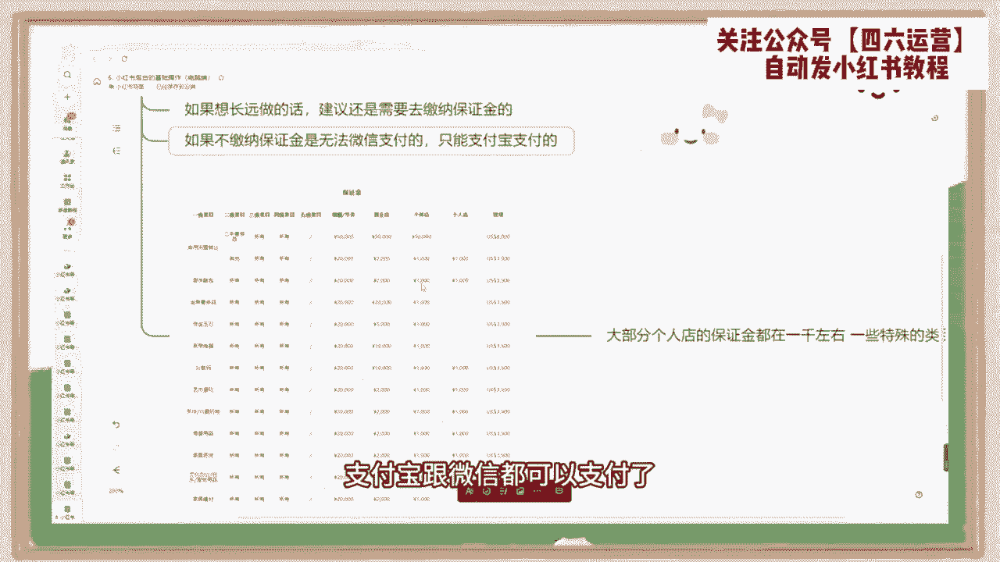

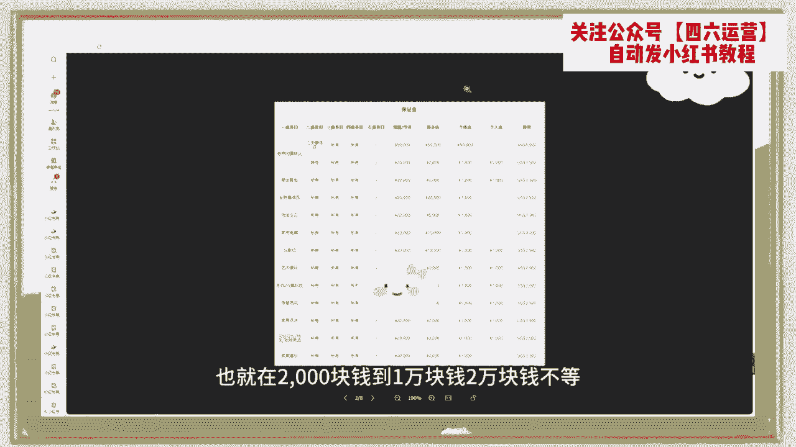

呃，一些特殊的类目除外，我刚刚也跟大家展示了，对吧？你如果说想要了解你自己的店铺的保证金，你直接去选择相应的类目就可以了。我们选择相应的类目，可以这边可以查询一下，对吧？你们都是有的，对吧？

以及我们的开通方式，开通我们的支付方式。刚才讲了一个微信支付一个支付宝支付。那我们在哪在哪设置呢？其实也是一样，大家放大看一下，我们打开我们的首页之后，这边有个资金，对吧？

也是刚刚的资金有个贷贷款关资金这边有个支付宝支付宝以及微信对吧？我们去开通就可以了，对吧？开通方式其实很简单，好吧，支付宝的话，微信的话，支付宝当天我们就可以直接去注册。

微信需要去微信的话是第二天他才能去设置的，好吧，第二天我们需要去缴纳保证金，提现金额是到法人的账户里面去。

我们注册这个是小店支注注册这个小店的身份证的法人里面去他的微信以及支付宝都是我们去按照他的要求里面去进行绑定就行了，只要填写。身份证以及呃如果说你开各店的话，需要有营业执照。好吧。

这是关于呃开通支付方式的两种方式，大家去开通一下就可以了。运费宝设置运费宝呢推荐大家开通运费宝是什么的。运费宝其实就是呃防止别人就退款啊，退货退款，我们这个运费，它能有一个保障。

也是后期别人就是人家7天无理由退货嘛，这种差不多跟抖音的7天无理由退货，淘宝填猫的一样，我们可以开通一下别人退款的话就不需要去考虑到一个运费的原因，推荐开通可能会影响到转化率的问题，来给大家看一下呃。

开通全店运费宝服务来放大给大家看一下，开通全店运费宝服务消费的退货，退换货成功后系统自动补贴，打消下单顾虑，对吧？提升订单的转化率，降低纠纷率，对吧？这个也是好的，对吧？大家点击开通就可以了。好吧。

这是这个也是在售后里面的，售后里面这边有个运费宝好吧，地址设置的话，前面也跟大家讲讲过了那个叫手机手机的。

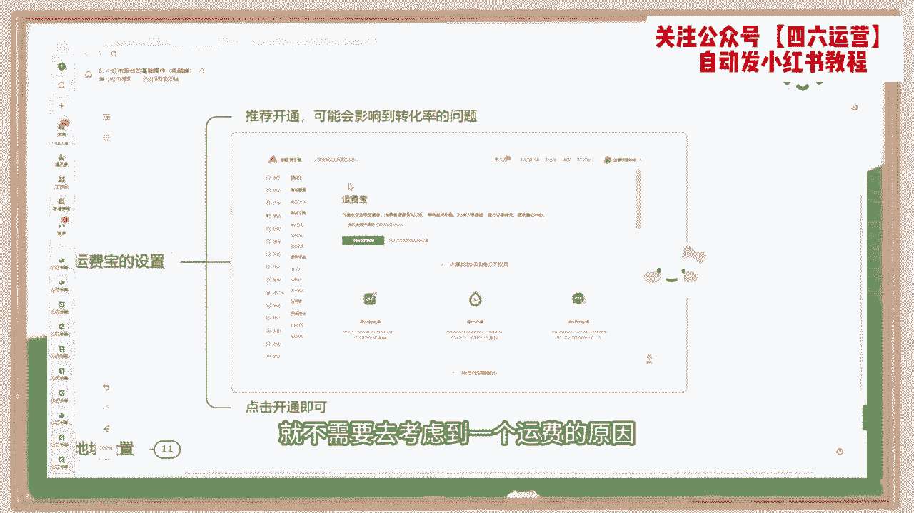

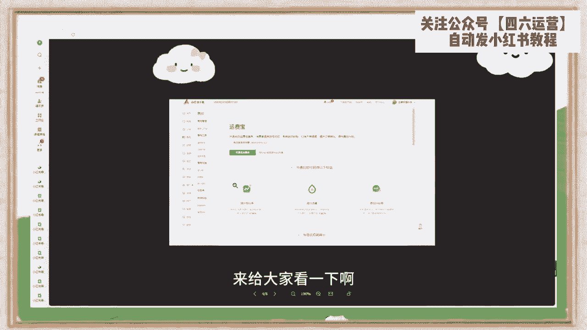

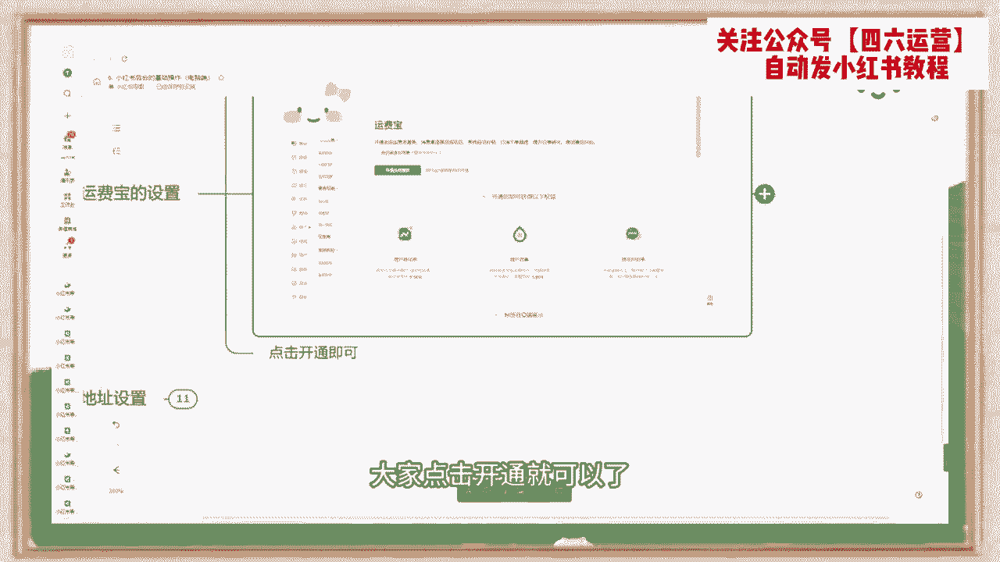

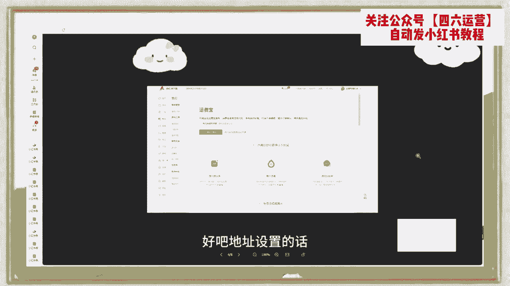

手机端的对吧？7天无理由退货自动可以自动同意退款的对吧？退货地址的话，最好填写一些偏远地区，后面加上联系客服，对吧？正确正确的地址，对吧？我们刚刚跟大家讲了，对吧？我们一定要去添加联系客服啊。

因为我们这个是一件代发的嘛，地址也在订单物流工具放大给大家看一下订单物流工具，这里面有个新建地址对吧？物流板块运费板块，我前面一节课手机端也讲的很清楚了，我们设计设置相应的地址，对吧？

我们地址填写填写我们这个相应的地址就行了，我们可以填写一个新疆的对吧？呃，这边的话物流模块对吧？如果说是无货源的同步的商家，如果说是有货源的，正常就填写就可以了，对吧？我们这边可以填写我们的运费板块。

如果说是无货源的商家，同步商家就可以了。如果说有货源的，我们正常去填写好吧，这个就是简单的跟大家讲一讲我们的一些地址的设置，运费宝的设置，好吧，然后这个就是今天的课程，好吧，那我们今天的课程就到这边。

大家好，今天。

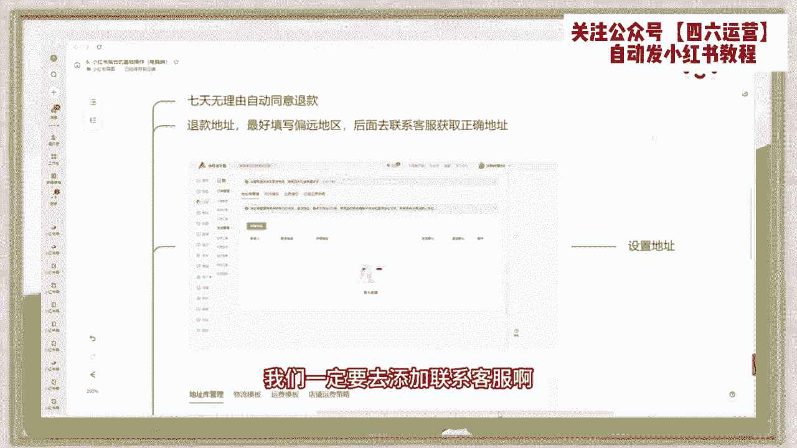

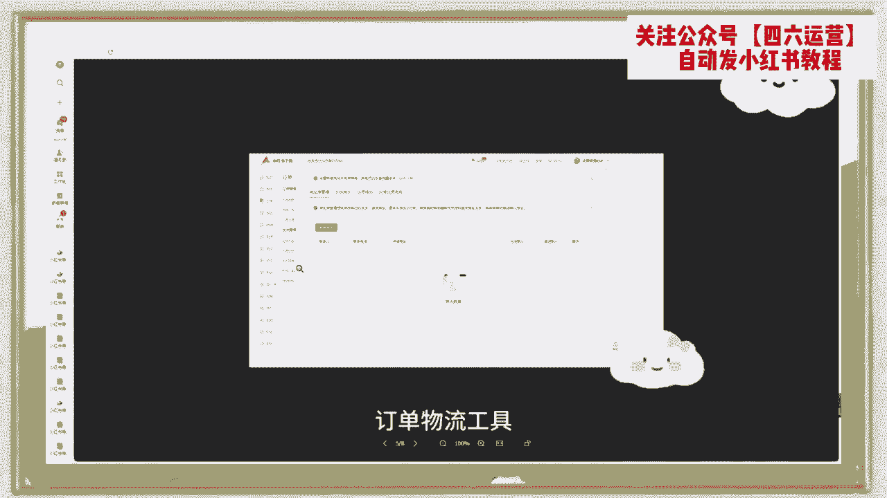

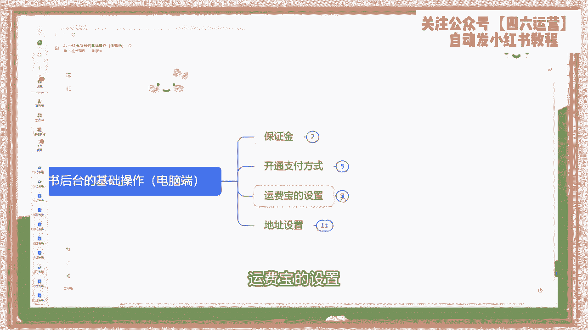

先跟大家来呃聊一聊我们第七节课小红书的类目，我们如何去选择和判断这个类目到底能不能做。好吧，我们从几个方面来跟大家讲。首先呃关于为什么我们跟大家讲选类目其实是非常重要的一件事情。

以及我们如何去挑选到一个适合我们自己的类目啊，或者说有哪些推荐不推荐的类目给大家展示一下，以及我们选类目的需要一些注意事项，是吧？呃，首先为什么我们要选类目啊，为什么我们说了类目确实很重要。

首先呃我再问一下大家，你认为做一件事情其实是什么最重要，是方向重要呢，还是努力更重要。有人说方向，有人说努力方向是最重要的。你如果说方向错了，后面你再努力，可能后面都是白费的，对吧？

选择其实在小红书在我们电商这个行业其实是大于努力的。你如果说选择错了，你这个类目选择错了，或者说你这个行业选择错了，那你想继续。

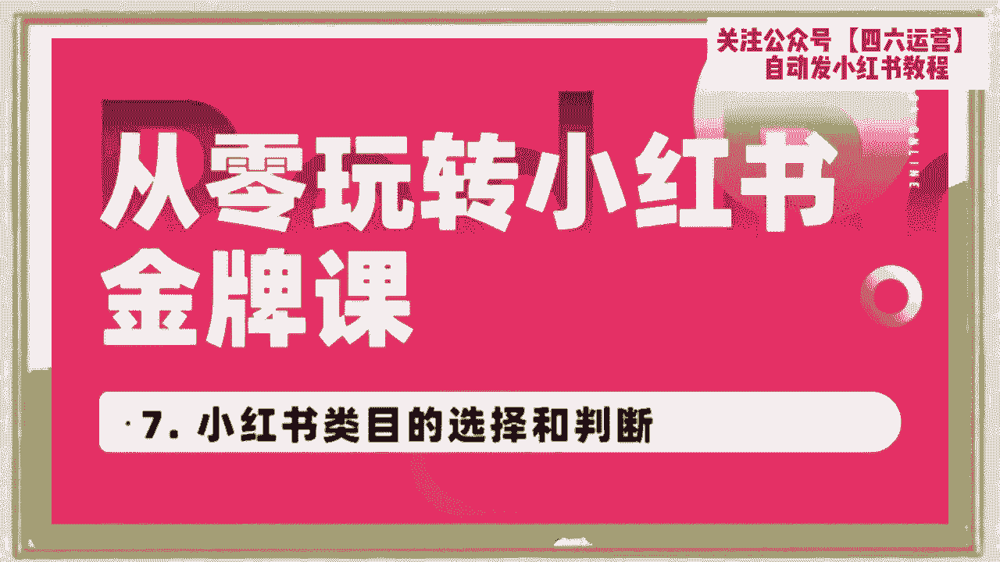

再付出再多努力，你也不一定能做出来，有人家方向做的好的来做出来效果好，对吧？为什么当下要去做小红书，而不是淘宝投抖音同你我们就选择了小红书这个方向呀，方向最重要，需要我们呃沿着大的趋势去顺势而为。

而不是逆水行舟。你说我们现在去呃去看淘宝，去看天猫好做嘛，非常非常不好做。因为现在这个就不是方向。我们可能付出比现在做小红书3倍5倍的努力，也不一定有做小红书还效果好，对不对？所以说方向很重要。

要不然努力来费。好吧，选类目就是一次选方向的机会，我们选择一个好的方向，对吧？那我们后面可能就是非常的顺畅，要不然后面可能如履薄冰，那我们如何选择一个合适的类目呢？我们从几个方面。

首先呃受众人群和平台的主流人群要相符合了。我们要知道小红书他目前的人群群体是哪些人，而我们做的这个类目是哪些符合哪些群体，对吧？小红书他目前的人群群体啊，年龄在18到40岁的年轻女性比较多。

对吧你可以发现你周围的很多女性基本上都在玩小红书，而男性真正玩小红书的其实很少很少。所以说要要要求卖给这个人群，他们喜欢的东西投其所好才行，对吧？你不能说我去卖给卖的比较多的都是男性的对吧？

确实你说可以做，但是卖给男性的并没有女性那么好卖，这个就是平台，对吧？为男性比较好呃，比较好卖的，有哪些抖音哎，还可以，对吧？但是小红书来说就是没有那么好做，对吧？反过来你要去卖男性产品的话。

必然不是很好卖，对吧？比如说茶具、鱼竿、帐篷、篮球鞋、数码3C对吧？汽车用品等等，这些你去卖，你说你能有像女性卖的那些产品，比如说衣服呀，母婴用品啊，宠物用品啊，对吧？水果啊吃的呀，这些对吧？

肯定是没有他们比较好卖的，所以说建议大家如果做的话，建议以这个目标人群为主，对吧？那我们呃能找到对标账号，对吧？第一个A类目不能做B类目能不能做，取决于有没有同行正在做，对吧？我们要了解的是这个类目啊。

目前有没有同行正在做，你去小红书里面找了一圈，你发现没有人做那这个类目我建议你不要去做，不要去找到这种你说这个冷门类目，对吧？人家做的很好了，且具备这个条件了，对吧？你也能想办法做得到，那么就能做对吧？

比如说货源笔记制作这些人家从来就没有人做过这个类目的，你再去做，那你那你你你就先不要把你当成这种能人来说好吧？一些冷门的类目也可以做对吧？冷门的类目，就是但是不是偏的啊，能不能做，就看有没有其他人做。

比如说你是说是一个冷门的，但是已经有人做过了，已经有人做起来，对吧？但是做人没有想象那么做，那我跟你讲这个也是可以做的，对吧？如果说从来没有人做出来，那你也不要去做，因为你肯定不是那个天选之子，好吧？

这个是我们通过对标账号的形式来找。找一找这个类目到底能不能做好吧。第三个呃，粗略的判断类目是否值得做的方法来给大家看一下。首先打第一步，我们打开小红书，搜索一下类目的名称或者产品的名称。

比如说你是做什么。你说女装的，我们搜索到女装，它的一个小的类目啊。比如说它是女装衬衫、女装开衫、连衣裙、卫衣等等。按照销量从高往低去排序，看看产品它的销量，对吧？前排产品，如果销量高才去考虑。

如果说不超过3000的对吧？说明产品的市场比较小，那咱们就换一个类目啊，以及我还要去1688里面看看能不能找到同款的货源，如果说可以，那咱们继续做，对吧？因为我们是做一件代发，并不是作有自己货源的。

得去看看他们平台有没有，它没有我们做的再好，我们平台做的再好。但是东西没有地方没有地方给我们去呃去发给人家，那肯定也不行。我们可以以女装童装玩具杯子为例等等。我们都可以去搜索以女装为例。

是一个热门的类目可以去做。但接下来问题是。女装里面要细分很多类目，比如说呃衬衫、开衫、连衣裙、卫衣等等。那我们以一个视频来展示给大家看。好的，呃，我们打开我们的小红书去搜索搜索我们想说的类目啊。

就比如说我们以马马面裙为例，比较火的马面裙？我们搜索马面裙110那116万加的笔记，说明这个确实能做。而且60万家的商品啊，说明这个这么多人做过那咱们肯定是有能做的，对不对？

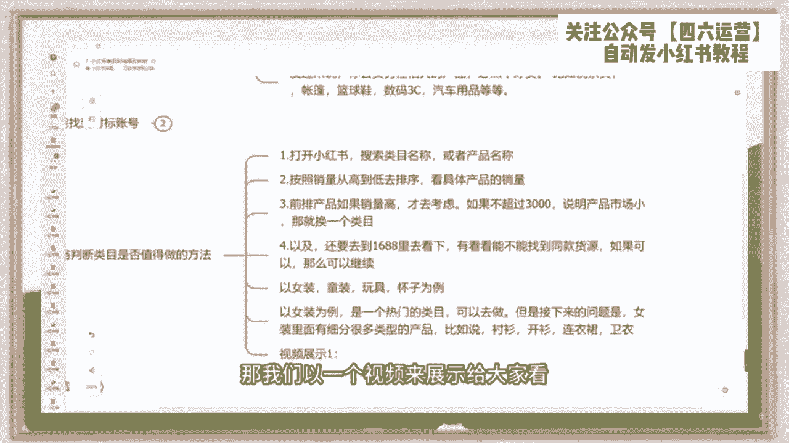

马美群，你看一下，这个是他的用户6000多对吧？6000多的点赞，以及我们点开他的这边有个商品，点开商品，我们看一下它的销量，我们一定要先啊点击销量看8000多人购买，4000多人购买。

我刚刚这边讲到了，你如果说不超过3000的，说明这个产品的市场小，那咱们就换内幕，但是你可以看到他的产品超过8000了，对不对？超过超过3000了，对吧？那我们就继续往下滑。

看到有很多很多他正常2000家2000家2000家加1000家，他最起码超过1000家了。那这个类幕就是能做的，以及我们打开他的视频，视频端能看到很多人他的播放量1点4万的点赞，看到了？

大几千的大几百的，说明这个是有流量的，整体来说是有流量的。你不像打开很多其实是没有任何流量的，那不能做这些都是我们有案例能找到的那他就是能做的好吧，这个就是我们去粗略的去判断一下这个能不能做，好吧。

以及呃小结给大家一个小结。第一个同行同行。😊。

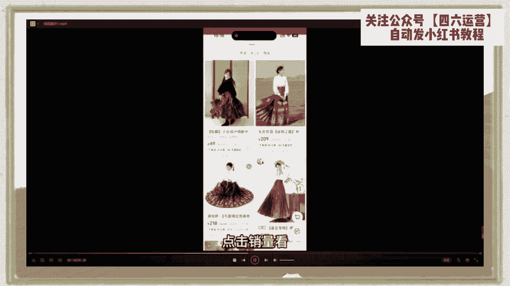

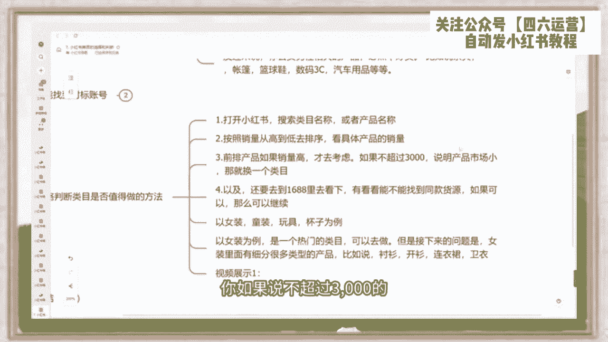

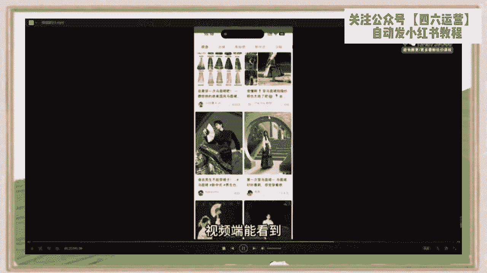

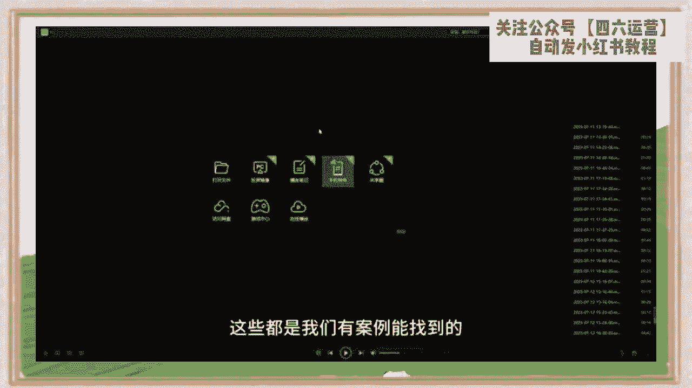

我们最好的老师，你要做的所有事情。其实你的同行已经做过了，而且已经告诉你这个怎么去做了啊，我们一定要去学会参考同行。我不管说所有的平台都是你一定要学会参考同行。第二个呢，所以要少靠自己思考。

多当你去没有做过这类视频。当你去没有做过这个东西的时候，你大部分时候只是想当然我们去多去实际调研，多件同行案例，多去积累同行案例，你就会发现原来这样也可以做好吧，多找同行就行了。

目前推荐的一些或者不推荐的内幕，具体有哪些给大家展示一下常见热门的内幕有很多好吧，常见热门的内幕，比如说服装的服装鞋包的啊，你服装鞋包、女鞋呃，女装、服饰配件、帽子、袜子，这些是关于女性的。

因为它主要的人群群体是女性嘛呃特点是爆款多，它是非标品。那什么是非标品。大家有没有知道的对吧？什么是非标品，没有一个所谓的标准的价格的。我这件衣服啊，我可以。卖多少钱，其实都合适。

我在地摊上面这一件衣服我可能卖个几10块钱，但是我在专卖店里面可能同样一件衣服，对吧？我可能卖到几百块钱，几千块钱，所以说它可以卖出高的溢价，高的利润的，它没有一个具体的标准的，而不像什么叫非标品。

就比如说一件纸巾，一包纸巾，你整多一两块钱，你最多了最多30块钱，但是不可能你说一包纸巾，一包1块钱的纸巾，对吧？我卖个10块钱20块钱，这种情况下是没人买的，而且衣服不一样，对吧？

几10块钱有人买几百块钱也有买几千块钱几万块钱都有人买好吧，但是同样一件衣服可能从一两百到几千上万都有可能好吧，这就是非标品。我们建议。大家去做一些非标品。因为我们可以把利润提高起来，对吧？

退缺点呢就是这斜士服包的缺点就是退货率稍微比较高。如果说你在抖音里面像女装的话，退货率可能达到百分之七八十都有可能在呃小红书里面能达到一个百分之四五十左右的，退货率比较高。

这个也是所有这个卖女装的都是常见的。因为你这线上看的很好看。但你线下如果说穿的话，可能并没有想象中那么效果好，那人家就退货。好吧，这个你得注意到退货的问题。

第二个家纺家纺比如说床单呀、床笠呀、四件套呀、毛毯呀、夏凉被呀、抱枕呃，地毯、地垫这些也是一些非标品，像床单这些家纺这些，其实你也有很贵的价格，对吧？换了一个品牌价格可定就不一样。

母婴用品、童装、童鞋、毛绒毛绒呃毛绒玩具这些，其实它也属于一个小的非标品。因为这些也跟服饰服饰这些相关的，每个节日它都会寄会六一儿童节或者说什么过年了，农年浓年我换一个。农农脸的这些童装呃。

有这些图案啊童装，那他就会有机会以及家纺百百货收纳、清洁水杯这些小的小的非标品，对吧？百货是抖音上面最大的类目，素材很多，我们去寻找素材，我们寻找类目的前提下，一定要是呃找到这个素材。

到底能不能有没有素材给到我们，价格是透明的，利润可能比较低，这个是它的特这是它的缺点，转化率也可能比较低，好吧，但是这也算一个小的热门的，水果特产零食应季的水果，比如说呃67月份的蜜瓜。

9月份的猕猴桃、凯特芒果，10月份的风水泥，12月份的甘南集橙对吧？这些等等等等，这些比较容易起好，发图文它就有流量。我把这个产品展示的非常诱人，那它就会有流量，好吧，对供应链的要求比较高。

如果说你不是一个源头厂家，或者说你这个不知道产品到底你发货的好坏，那我们是很难去做的，除非说你是源头厂家，或者说你对这个厂家确实了解熟悉，对吧？我们以前跟他和。做过，那我们可以没问题啊。

以及他需要营业执照以及食品经营许可证。好吧，这些都是我们需要去了解的。常见的一些热门的类目，大家可以截一下图，都可以看一下。好吧，以及呃小众类目的。比如说冷门的冷门的一些类目，冷门需要靠自己挖掘。

其实这个东西呢也是需要去大家长期哪个月的积累的。因为你也不知道这时候这个东西到底是不是冷门的，可能过了这段时间之后，它就不冷门了。好吧，往往竞争比较小，找到一个就能很吃香。

比如说香薰香薰的东西可能贵的也能很贵，几10块钱几百块钱。我们也有学员在做的香薰户外的折叠椅这些东西，但有有人想买买的东西，这个一套可能要几百块钱，几千块钱定制类的，比如说定制的戒指。

这些都是属于比较好奇的，比较新奇的，所以不大好找，所以大家建议先从热门的类目开始搞，不要一上来就从小小众类目一旦上来，我们可以搞热门的，可以慢慢去找到这种小众冷门的，或者你觉得这个可以我们可以去。

测试一下小众内冷门的类幕以及不推荐的类幕大大牌A货对吧？AA货的话，建议大家不要搞。因为一搞的话呃，风店可能性很大很大，大品牌的产品，需要品牌授权，一般人搞不到A货，建议大家不要搞什么莆田啊鞋啊。

这些不要搞大品牌的产品也不要搞临时需要品牌授权，对吧？需要营业执照，以及食品经营许可证，没有供应链不好做临时图书需要制造和出版物经营许可证，没有供应链也不要做美妆插在脸上的东西，知识要求都是非常严格的。

对吧？小红书群体购买美妆产品还是比较认品牌的，因为他们整体来说都是属于这种年轻化的女性还是比较认品牌的。你要是没有品牌的，人家不太认可男性产品，我刚刚讲到了鱼鱼竿对吧？帐篷等等，这些太小众的产品。

情趣内衣睡衣，这些内容容易插片违规的啊，爆款比较少的，而且购买频次比较低的，也不要搞手机壳饰品穿。传代价市场太卷了，很难出爆款，的手机壳这些对吧？别人都做了，已经做的很好了，你再去抢这个流量。

那肯定抢不过人家。好吧，这是不推荐的一些类目，一选择类目十。需要注意的一些事项。好吧，首先类目其实是没有优劣之分的。选择一个类目，我们一定要坚持去坚持去干。既然你选择了，那我们一定要坚持去干。

很多人选择一个类目，刚做了几天，发现我笔记没有流量，于是就想换一个类目，大家一定要消除这个想法，对吧？你你做几天，你可能刚开始做你账号标签还没打准的，不会游泳，我们换游泳池是没有用的，好吧。

出去反思为什么同样的类幕，同样的产品，别人能有流量，而你没有原因到底在哪里？我们去改不就行了嘛？一定不是类目的问题，所以不要着急换类目，想清楚是你账号权重够不够，你标签精不精准，你是老号信号。

你笔记是不是有问题，你的素材处理是不是不到位，不够吸引人，对吧？想一想自己的问题，不要想类目的问题，目一定要垂直，对吧？有两层含义。第一，后期选美的时候注意产品类目要一致，一个店铺一个阶段只做一个类目。

你不要跟我讲，你这个店铺做好几个类目，又做男装又。女装啊，又卖吃的，又卖衣服的对吧？不要做成杂货铺，什么都卖，这个是切记不要做的。好吧，第二个只做一个垂直人群，就算是女装也要划分年龄段。

年龄段他有15到15到220的对吧？18到20的20到25的、25到3035到40的等等，这都需要我们就划分的，或者说划分同一种类。比如说针对相相应的人群，同样是卖女装的，他有很多风格。

小香风夜店风上班欧慰傲风对吧？做账号的，就针对某一定特定的人群，你只要能把这个某一类特定人群给他圈定了，我们就不用担心再去做其他的了，就怕你做的很泛，做的很范，最终会发现你这个谁也卖不出去，好吧。

一定要抓准同一的人群，比如说我现在能有的货源，就是这种夜店风的那我就面对夜店风这个发发视频发素材，对吧？我就抓住这一步的人家收到我时后，就很吸引他，吸引他就能产生购买。好吧，特别第三点。

特别依靠品牌的类目，不要去做。比如说奶粉、尿不湿、化妆品这些日化三C数，人家看品牌的对吧？你如果说没有品牌资质，你做出来，人家百分之八九十是不认的，好吧，呃，这个就是几个简单的注意事项。

以及我们一些品类的类目，大家可以了解一下，一定要选择我们相应的类目坚持去干就行了。不要呃这个是最重要的，这个大家可以多花一点时间都没问题。好吧，那我们今天的课程就到这边。

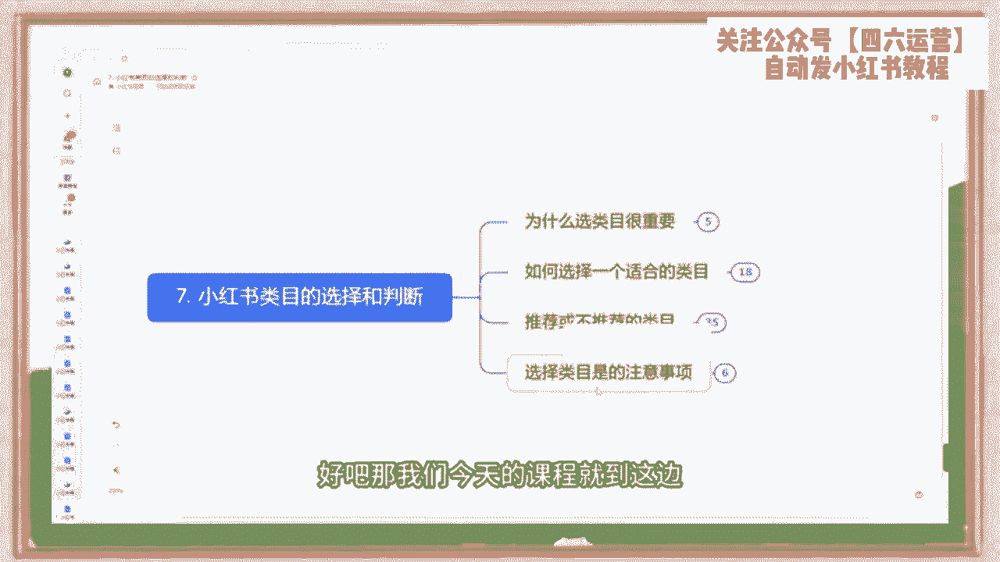

🎼大家好，我是阿强。今天来跟大家讲到一个非常重要的一节。我们小红书如何去正确的养号，对吧？大家一定要知道我上一节课讲了如何去选择我们正确的类目，先选择类目，养号其实也很重要的。你如果说号不养的话。

你后面想要去呃操作的话，其实比你不养号操作是呃养号是比不养号是要顺畅很多的，好吧，一定要养号，学会养号这个习惯，你后面去不断的铺号的话，你自己做的话，速度也会更快一点，好吧，呃。

那接下来我们会以四个四个维度来跟大家讲。首先小红书为什么要养号，对吧？大家先想一下什么是养号，我把我这个号养成这个他们喜欢的样的，对吧？养成我是正确会推给别人的样的，或者说我推推给推给我的。

也是这个标签的，为什么会说打标签呢，就打圈打造正确的标签。

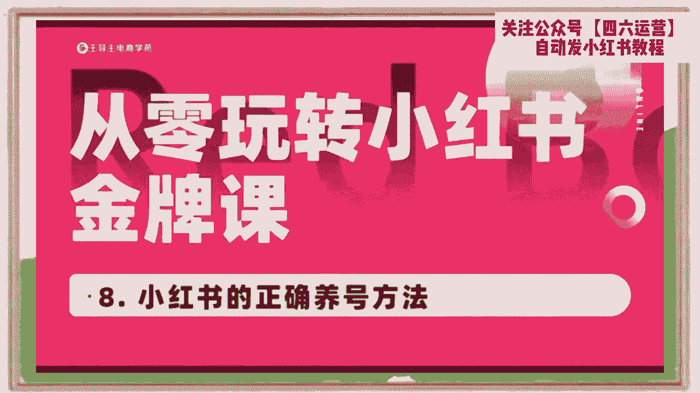

人家就会有更多我们这个同类型的人群点击刷到我们的号，要不然你看大量的假如说我这个条视频，我能有个1000播放量，但是有个900播放量都是跟我们这个无关紧要的，那你去转化。

那的难度跟你1000跟你500的播放量，能有400个人跟我这个标签是同样的。你说哪个转化效果好，肯定是500有400的这个效果好。所以说我们拿到一个手里面有个新号，一定要不要着急去发作品。

不要着急去营销，对吧？先学会养号新号，我们防止被判为营销号，前期不要着急，一上来就挂产品，一上来就卖货，对吧？一上来直接营销不养号也不自己用，对吧？我只你就是这样，很多人就是加号一个视频。

或者说我写好一个笔记，我直接发上去挂产品呃，我自己平常也不刷，只有当时我发产品的时候发作品的时候，我打开一下，这种情况下很很容易被平台判为营销号，然后期就不给你流量了，发一个视频可能只有几个流量。

几十个流量。对吧看一个笔记，基本上没有播放，没有观看，对吧？很容易出现这种情况，不要着急。前期我们一步一步来。为什么很多人说我前期呃发了话很多天都没有赚到钱，对吧？没有出单很正常，你太心急了。

那做所有事情并不是说星急就能成功的好吧，第二个方便我们找到同行的账号，对吧？我们新我们新号养号。第一个我们能防止呃平台判定我们营销。第二个我们也能养号也能找到同行，我们也能找到对标啊，找到对标怎么做的。

我们知道自己之后应该怎么做，好吧，那什么时候开始养号呢？我们要确定自己类目之后，确定完自己类目之后再去养号，不要着急养号养号，你不要上来，你类目还没确定，你怎么去养号啊，你都不知道你卖什么的对吧？

我确定我卖什么了。比如说我上一节课讲到的卖马面群的。那我就确认我卖这个女装，卖这个马面裙了，那我就开始通过马面群来养号了。呃，我们具体怎么去养号呢？首先第一步，我们先搜索其他同类目的账号。

比如说是卖卖马面群的那我们去先找到这些卖卖马面群账号，我们去搜索几下，多点击几下，再次打开小红书APP对吧？我们退出小红书APP我们第一步先搜索其他同类目的账号，我们搜索完之后。

我们退出小红书APP对吧？放一段时间，我们再打开APP打开小红书APP刷新首页，刷新首页页面，不要凭个人喜好去刷小红书，带着自己的目的对吧？去刷潜在的对标账号，对吧？我们刷开刷那个首页，刷首页。

如果说也有卖马面群的，我们点开对吧？如果符合对标账号的要求的。我们点我们可以点赞评论关注，给他安排上一键三连给他安排上，每天循环的11到311到3步对吧？1到三步。

然后大约3到5天111天的话3到5次就行了。吧，大概是这个操作，具体怎么去养号的。那我们如何判断养号成功呢？具体怎么判断养号成功呢？首先判断账号养成的标准在50%以上。

50%以上都是跟你这个刷到你刷到了这个发现页里面，这个发现页里面50%的都是跟你这个相同类目的相关的内容的推送的内容非常精准内容搜众人群也是也是你就是你想要的这个人群人群。

我刷你这个账号你就想象出来别人刷这个账号能不能刷到你就相当于如果说你能刷到别人，那别人也能刷到你就差不多这种这就是养号，好吧，我们能把号养成之后，那我们这个账号后期再去做账号。

那难度就比你不养号难度要好很多。好吧，那这个就是小红书如何去正确养号的方法，大家可以去学习一下，操作一下就行了。一定要实操好吧，那么们今天这个课程就到这边。🎼大家好，我叫阿强。

接下来这节课我跟大家来聊一聊小红书如何快速找到对标账号。呃，大家先要了解一下对标，我们为什么要找对标账号，对吧？找对标账号的一个目的是什么？我们讲呃去哪里找对标账号，以及他的找对标账号的一个步骤，对吧？

那我们接下来一步一步来跟大家讲好吧，首先你一定要明白一点是同行是我们最好的老师，我们为什么要去模仿他呢？因为因为你模仿他之后，别人之前的已经帮你踩好很多坑了，已经帮你铺好很多路了。我们再去做的话。

成功的几率也会更大一点。好吧，我们找对标的目的。首先第一个找对标的目的。首先第一个模仿对标账号我们可以给账号进行一个包装包装，比如说头像昵称简介，笔记风格，这些对吧？你可以了解一下别人是怎么做的。

别人是怎样引流的，别人是这些头像是不是怎么去打造自己的，打造自己的人设的。对吧这是第一个。第二个，根据小红书上面对标账号，我们可以确定自己的账号的运营方向，对吧？你可以看一下别人的运营方向是什么。

我们来确定自己的运营方向，对吧？我们可以进行其中的一些学习参考，针对什么样的人群做什么样的类型的产品，这些我们都是可以自己做到的。对吧因为你要知道，其实呃因为很多他们的面对的人群是什么？

我们如果说跟他同样的人群，对吧？那我们也是可以运用他的一些技技巧，一些方法的对吧？第三个，找到素材的来源，对吧？对标抖音，比如说抖音的对标账号，对吧？前期我们就不用去拍素材，对吧？因为别人。别人的素材。

抖音对标抖音对标它的很多素材我们可以拿到小红书里面去做的。只要人家没在小红书里面发过，我们可以做一些混剪，做一些剪辑，对吧？前期你自己去拍摄难度肯定是大的。时间成本，人力成本，拍摄成本很高很高，对吧？

所以说我们找到合适的账号之后，作为你素材的源头，你找到100个1000个抖音的同行，我们把它所有视频，每个视频剪下来个一秒2秒，对吧？我拼接在一起，那我就问一下，是是你是你找速找对标的速度快。

还是你拍摄的速度快，还是人家又要拍摄又要剪辑。但是我只要找到对标之后，我把它保存下来，我做一个适当的混剪，拍出去还有流量，对吧？你有可能拍拍出去之后，拍了大量的视频，还没有流量，有没有这种可能性，对吧？

首先总之我们要先去模仿，模仿到对方有几成功率，我们就能拿到几成的效果，我们模仿了对方五成功率，那我们做成这个呃概率，就最起码在50%以上，所以说别人这个同行。一定是我们最好的老师。

我们一定要学会学习他们，学习他们的一些好的方面。他的笔记是怎么发呢？他笔记发布技巧，他怎么去引流的，他怎么去引导别人购买的对吧？

他笔记他的主图封面是怎样吸引别人的他的视频的前三秒钟是怎样把人家拉到停留里面的，对吧？以及这些都是我们需要找找对标的目的，那我们讲一讲具体怎么去找呢？去哪里找呢，首先两个方面是目前来说找对标比较多的。

第一个小红书站内是可以找对标，我们可以搜索对吧？搜索同行对吧？我接下来会跟大家具体来讲一讲小红书怎么去找找对标的步骤，小红书站内的对标，抖音找对标对吧？抖音小红书站内那那对标。

就比如说他们的发拍的一些视频，他们的账号以及他们的一些笔记怎么写的。抖音就更多的，抖音就是视频，视频端对吧？抖音上面呃有些卖我们这些类目好的，后期我们完全是可以拉他们视频用的，对不对？

我们只要在不违规的情况下用，这些都是好的呀，这个是两个方。一个是小红书，一个是抖音，我们可以找对标，对吧？小红书找到对标的步骤，我接下来具体来跟大家讲讲。好的。

小红书呃目前找对标的方法就是第一个我们去小红书打开它的搜索页，对吧？搜索页搜索这个类目。比如说呃我前面讲的最多的马面群这个案例，我们也可以按照搜索马面群，对吧？在搜索结果中找到低于粉丝在1万以下的。

因为小红书整体的粉丝基础肯定是没有抖音答的。它1万粉丝以下的基基本上。处在一个快速上涨的一个阶段，最好你能找到的是也是人家通过混检搬运的账号，对吧？你就知道人家是怎么做的。

那我们按照他的模式一比一的复制下来，我们也能做起来，好吧，视频清晰度。一般他们是些混检的账号有几个特点。第一个视频清晰度一般视频不是很清晰。因为他们保存过来，他通过二次的路径没法保存这种原图的视频。

第二个全程不露脸，用一个表情包把点这很多这种案例都是因为他放了之后可能会影响到人家的版权或者人家发过来，对吧？你这个平台一查到不就违规了嘛，持续发布各种不同类型的对吧？带货笔迹时不时有个大爆款上千站的。

或者产品价格小位数呃，后面两带两位的呃，比如说小位数带两位产品价格99。99块的这种无规律的这种等等等等。这些都是他的一个搬运的一些账号的一些特点，好吧，大家可以了解一下。

第三个点赞我们找到这些账号之后，我们就把。点赞、收藏、关注对标账号的一些爆款的笔记。那我们下次可能耍到更多的像这种同类型的。因为他这个也是大数据平台，对吧？他会把更多相似的账号给它分享给我们是吧？

那接下来我来分享一两个视频，给大家看一下第9个。

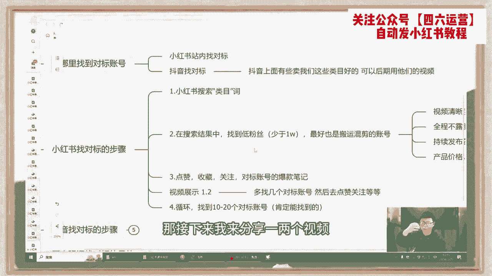

好的，我们来看一下这个视频，我们打开我们小红书的呃搜索栏，对吧？我们搜索麻面群，我们搜索麻面群，你看这边有很多跳出来的麻面群的视频，几百几千赞的几百站的都有。对吧这是第一步。

我们先搜索搜索我们看到有很多很多相同的视频的呃人账号，对吧？像很多种的，人家有露脸的，有不露脸的，我们尽量去找一些不露脸的视频，对吧？啊，多多类型的，像这个它就属于个人拍的个人拍的这种是账号。

我们如果说他这个效果好的，几千站的，我们也可以拿出来当一个全屏啊，我们去1688里面搜一下像这个它是属于摄影的摄影呢，我们就没必要作为一个对标账号的，然后以及像一些个人的账号，店铺的账号。

我们可以拿为作为对标账号，你像这个他也是摄影工作室的，我们也没必要去拿它当一个对标账号，像这个它是作为一个卖汉服的，我们也可以看一下点赞评论都挺高的。我们去看一下他的点赞评论，吸引的哪一部分人群。

跟我们是否相似的。我们相似，他就是属于一个爆款。那我们是否可以用他的这个去搜索一下这个产品的，278。你看他是店铺的产品，他自己卖的，对吧？这有可能是他自己。店铺的产品也有可能是他在网上网上盗的对吧？

🎼有很多很多账号，你像这个账号他不露脸的有两种情况，他粉丝比较多，基本上这个应该属于他自己拍的。他个人账号也有很多他这个所有账号都是从抖音里面搬过来的。很多很多接下来继续看啊，都是有大几千点赞的。

说明这个整个麻面群它就是一个爆款，像很多的不露脸的，对吧？不露脸的这些视频账号，对吧？它这个也是一个原创品牌的对吧？可以看一下它对表账号，我们就可以说一下宣品吧，爆品吧，好吧，很多很多都是大几千点赞的。

像这些对吧？看一下人家的图片怎么拍的，对吧？像这种我们就可以作为一个简单的对标账号这些。你像这种呃6万粉丝的，他的小清台里面写了哪些哪些产品呢，就是这有可能就是他自己个人拍的这种这种形式。

这种模仿我们也是可以作为模仿的对吧？很多像这种不露脸的，有这种露脸的，有可能也有很多不露脸的，或者说样用个特效把脸遮住的，像这种用个特效把脸遮住的这种，有可能这个视频就不是他自己。

🎼对吧在其他平台呢你看到了吗？把你他把人家视频拿过来，但是避免违规，那避免或者人家已经翻过来，那他得弄个特效，把这个脸给挡住对吧？像这种视频也是人物不露脸的对吧？介绍的。

人物不露脸的这种或者说有这种混剪痕迹的，很很有可能就是整条视频，他来说他就不是不是他自己拍的，也是混剪过来的，我们就可以参考它好吧，我们再来看第二个视频。你像这个就我们找到了一个对标账号。

他也是开店铺的对吧？他的店铺产品价格也在呃大几十到上00左右，你可以看到他很多作品人物脸脸像很多你不怎么露脸的对吧？很多很多很多，而且他的人物都是不一样的对吧？说明他这些视频很多都是混剪出来的。

这种说法就很像混剪出来的。很多你看他每个人物都不一样，看见了吗？完全。🎼就是这些，所以说这就是我们小红书可以多找几个对标账号，然后去点亮关注，它跳出来也会越来越多，对吧？

循环的我们找个10到20个对标账号，肯定能找到的对吧？一定要坚持去找，然后小红书如何。然们再看一下抖音如何去找到对标。首先其实也是一样的。我们去抖音搜索内幕栏，对吧？去搜索我们的内幕对吧？

切切到视频一栏，对吧？筛选不不超过半个月的视频，点赞量还可以的，对吧？高的视频不超过30万粉丝的低粉高赞的对吧？循环找一个10到20个，就像刚刚。

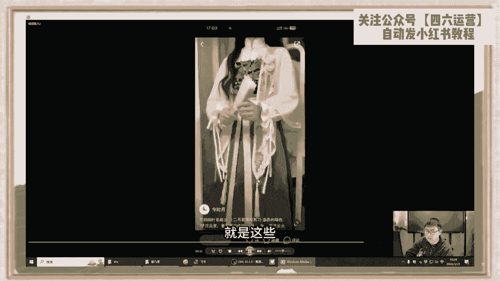

小红书一样的这个步骤，建议拿一个单独的抖音号也来最好拿一个新号，对吧？我们也可以拿一个新号去操作啊，抖音会持续推类似的账号，方便后续我们长期找到素材，对吧？其实它跟小红书一样，他也不会打标签。

打更种标签。对吧以及呃这个是找抖音的部队，不找抖音找对标的步骤。在最后我再强调一下找对标的目的啊，然后做小红书笔记带货，当下其实最有效最快速最最能够出单的方法，就是去跟爆款，对吧？找到对标了。

对标有爆款，那我们去跟对跟上人家的爆款，对吧？找到对标账号，这些账号可以持续给到你提供近期爆单的产品以及素材，对吧？爆流论的素材对吧？这个就是同行是我们最好的老师，好吧，大家一定要花时间去找对标，对吧？

按照这个步骤一步步去找对标。你在抖音里面，小红书里面可以模仿他们的笔记，抖音里面可以可以参考他们的素材对吧？选品可以用他们的品都可以好吧，那我们今天这个第九节课就到这边。大家好。

我们今天继续来学习我们小红书的课程中的第十节课，也是接下来几节课的一个铺垫。我们怎么去小红书选品，对吧？我们不管选品之前，我们一。要了解小红书选品的一个底层逻辑，它的一个重要性。

我们所有刚刚前期也跟大家讲了，选品方向不对，努力白费，你的内目不对，那你那你选品选品肯定不会太好的。你选品不太好，你的笔记啊，你的呃整个整体的视频来说展现的也不会说有太好的效果的，好吧。

所以说我们得一步一步来，我们先确定自己的呃，先确定。确定自己的类目，确定完之后找到自己适合的同行。找到同行之后，我们再去选择同行的爆品。我们自己再找到一些通过其他平台、淘宝啊、天猫啊、抖音啊、小红书啊。

拼多多等等，这些寻找这些同行的一些爆品，对吧？了解它的一些重要性，底层逻辑。那我们接下来就正式开始我们今天的课程。这要了解抖音的我们接下来要了解小红书选品的一个重要性和底层逻辑，具体来跟大家讲一讲。

首先大家要了解一下呃电商选品的重要性有多重要。我们做所有的电商做过我直播间做过电商的人都知道，没有没做电商，你今天跟我们一起学习了，你接下来也会知道所有电商的平台里面，不管说你是抖音淘宝。

还是目前我们做的小红书七分考选品，三分靠运营，对吧？你运营可能再牛逼再牛逼。只要你这个品不行，那你所有都是白费，选品是店铺的基础，选品是你整个。整个团队的基础，选品不对，整体努力都是白费的。

再厉害的销售也不可能把一坨屎给他卖给客户的。可以，但我说的这个是只是一个画画一个引号的。但是这个是说明毫无亮点的产品，我没有任何卖点任何没有任何亮点的产品，你是没法去在平台里面销售的。

所以我们一定要选好爆品，对吧？不去卖给客户才能后面操作才能更更简单一点，可能说你后面的笔记啊，视频啊，剪的一塌糊涂。但是你这个品是一个好品。

那我跟你讲你这条视频爆的可能性肯定也比你这条你这个品是是垃圾的品，但是你的视频讲的好效果也好，我敢怎么跟你保证好吧，这个是电商选品的一个重要性。那我刚刚讲那么多，那我们如何去培养选品的感觉呢？

首先确定好类目之后，我们要把大量的时间，大量的精力画在选品上面，你前期选品要画大量的时间，大量的精力，我们才能后面才能不走弯路嘛，我们要多看多对比好卖的。产品是看了众多的产品之后。

结合实际的情况选出来的，既不是瞎猫踩狗屎运卖出来的，也不是自己设计出来的。你不是工厂，我们大部分人都不是工厂，我们都是做一件代发的，你只负责进货。那我们进货的前提一定要把品选好，拿货去卖。

我们一定要选好品，我讲这么多目的就是跟大家讲，不要去着急，我们慢慢去选品，选品。对了，后面其他都好做，好吧，就是一个耐至态入性质去选品，然后跨平台选品的逻辑是什么？我因为我们要得得去好多平台去选品。

比如说淘宝啊、抖抖音啊、天猫啊、京东呃拼多多等等。你要知道这些平台他们的品都属于一个什么的等级，我来打个比方啊。比如说今天。你开的不是小红书的网店，而是开的是一家线下的女装店。那那么你需要去进货。

进货的时候呃，你是否会问拿货的老板娘说最近有什么款式好卖的呀。最近有什么是爆款的，老板娘肯定说最近我们家别家女装店最近从我家拿的ABC3个款比较多啊这时候你就知道了ABC是爆款，其他的款你就不拿了。

我们就不浪费钱了，我们知道别的家卖的比较多，那我们去拿拿到，我们面对人群是跟人家人群是一样的，都是同一家拿的货，而且都是卖女装的那我们就知道这个是爆款了，对不对？不是你觉得卖什么什么好卖，你就去卖什么。

而是别人都买什么市面上大部分人都买什么，那这个就是爆款，别人都卖什么，这个也是爆款好吧，你才去卖什么，相对于来说淘宝其实就跟那个老的步行街一样，你们自己去刷算算不到自己进不经常。

在一些步行街抖音就相当于万达广场。稍微高大高大上一点，价格也稍微贵一点。而拼多多就跟菜市场一样，里面价格都是很便宜，对吧？但是呃好货其实也是比较少的对吧？小红书就更像街边的一些精品店，价格比较贵。

但是东西还是比较好的，相对于抖音跟拼多多跟淘宝一样，大大家能理解了吧？至以我们在小红书里面选的话，尽量要去选一个一些精品比较好卖一点。因为整体来说，小红书的人群啊，它整体的消费水平还是可以的，好吧。

现在你要去开一家精品店，对吧？是不是应该从这些地方去吸取一些经验，看看你有什么是你的目标客户群体感兴趣的。你的目标人群是哪些，你去感兴趣就选哪些就行了，好吧，这是一个底层逻辑。

那我们看一下选品的基基本逻辑，基本逻辑，我们从三个部分来跟大家讲。首先第一个产品要有热度，要持续上升热度，比如说应应季刚需的产品来给大家举个例子看一下应急刚需的产品有哪些，对吧？比如说你是卖女装的。

对吧？夏天卖连衣裙基础款。T恤，春秋天春秋天卖长款的连衣裙，长袖的短袖，冬天卖马面裙、打底衫打底裤这些对吧？应季刚需的，大家一定要去学会运用。冬天我为什么说了呃过年期间卖对卖对联，卖红包卖的好的。

因为它是呃应季刚需啊。比如说你是冬天呃，你是卖羽绒服的对吧？肯定是卖的好的呀，你是卖这种服饰配件的，你夏天卖防晒面具吧？冬天卖围巾围巾手套对吧？夏天卖冰冰袜，冬天卖过膝袜，其实这都是差不多类目的。

而且都是能在自己人群来说其实都差不多的，有没有发现其实你同样的根据不同的季节你可以卖很多东西，关于服饰的等等的服饰啊搭配这些，比如说近期的热卖产品也有很多。比如说你是卖女装的。

最近网络上有哪个明星穿的哪款衣服啊，小众的衣服，但很好看，价格也很便宜，我们就可以在我们店铺里面做。比如说某某某某明星同款对吧？比如说前段时间比较爆火的。比如说我举例子，像繁花。

大家应该有看过繁花里面的唐嫣同款，对吧？抖音抖音小红书里面卖的很火很火，对吧？你就可以去卖，对吧？要慢慢培养自己的网感，对吧？什么东西火什么话题火，那代表的这个产品这个话题有流量。

那我们去卖这个产品就99。9%能卖得动。如何如何这个产品呃爆点跟我们的跟我们这个产品有关，你就去趁这个热度，对吧？新奇乐的产品造型新颖的吸引眼球的这些都都是可以去卖的好吧，就是产品有热度。

我们要有热度蹭热度，第二个产品好评率基本上要符合90%的要求，对吧？你可以发现为什么拼多多有很多人在不在拼多多选品。因为它里面好评率基本上有很多啊，我不是说分之百啊，但是有很多它好评率不达到90%。

达不到90%退货率第一个你容易上升，第二个你店铺的评分容易降低。第三个呢，你本身这个品可能质量。不好，你不好的前提下，你就不容易成为一个爆款。好吧，这是好评率，一定要达要求。第三个。

产品受众人群与你的目标人群要基本符合，对吧？我年龄段啊喜好啊，偏好这些都跟你要差不多，最起码差不多吧，不能相差太大，这是我们选品的一个逻辑。你不能说你是卖女装的，你去找到人家男装的店铺里面去选品。

你选一些男装，那肯定不行。我是卖这种上班主，你去卖一些夜店风的两个相差太大了，好吧好？这个就是选品的一个基基本逻辑。接下来我们的课程呢会具体来跟大家讲一讲，如何去通过抖音选品。如果通过拼多多选品。

如何通过淘宝，如果通过小红书站的选品。好吧，大家来继续来听我们的课程，那我们今天这堂第十节课就到这边。

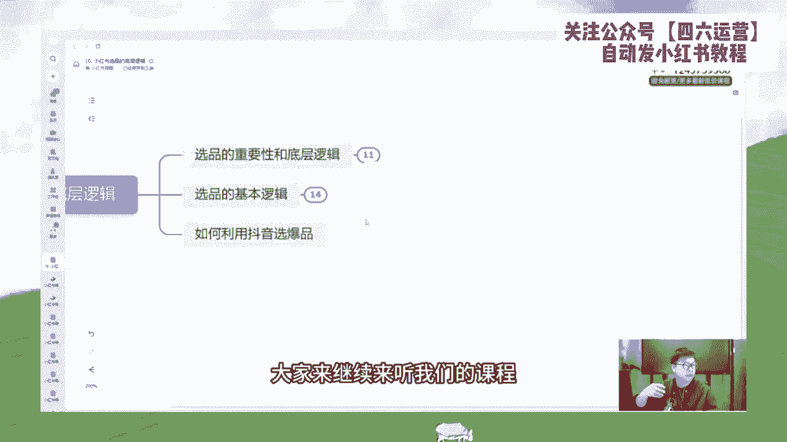