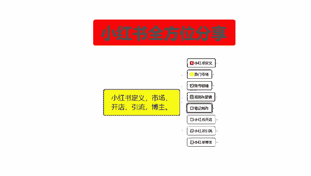
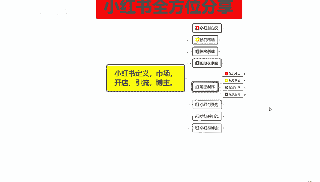
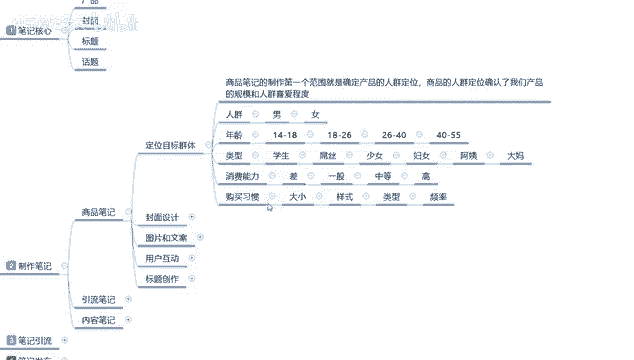
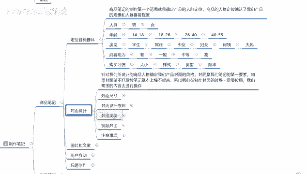
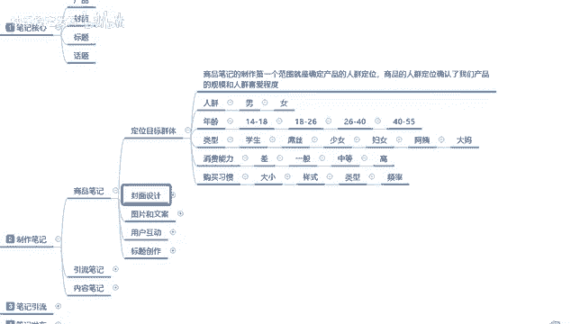

# 【2024版小红书体运营教程】全B站最良心的小红书开店运营教程！小红书体开店 起号真的快，赶快点赞收藏起来 - P10：8.小红书新账号笔记制作（2） - 快乐稳定发挥 - BV1AbtoebEjX

大家好，今天给大家分享的是小红书，全方位的一个整体分享。

第五大课是笔记制作的第二节内容。

今天的课时呢给大家分享的是制作笔记，这个内容呃，制作笔记呢，我们上一节呢是给大家分享了一个笔记核心，我们需要了解的一个封面标题和话题，加我们的一个内容延续，这节课的话是制作笔记。

笔记内容的话我们可以把它分为三个点，第一个呢是商品笔记，第二个是引流笔记，第三个呢是内容，笔记方式都是不一样的，商品笔记是我们小红书做店所使用的，引流笔记和内容笔记的话。

你可以把它理解为你做博主做引流都行，但是他们其实是一个整体啊，只是我们笔记所发送以后，所面对的用户不一样而已，我们正常做商品笔记的话，你里面也要做引流笔记和内容笔记，他们三个是一个整体。

你不能说我在小红书上面，我去卖产品，我光做商品笔记，其他笔记不用做，那是不行的，因为你光做了商品笔记以后的话，你在自然搜索里面的话，是没有流量渠道给你展示的，而且你前期的一个推广商品。

那个笔记发出去以后的话，你的账号没有选中关键词，没有选中你的笔记，核心词汇也没有全中，也就是说你没有排名在搜索商品里面的话，能搜到你的产品，每天可能就几个，就是你一天一篇新的笔记发出去的话。

正常应该是有1000个展示左右，但是如果说你发商品笔记的话，那你每天的一个点击频率可能就是在个位数，或者是没有，因为商品笔记的话，它是没有自然流量的，你要先做引流笔记和内容笔记。

有一定的用户权重以后再去做商品笔记，你的商品笔记才会有流量曝光，所以说额商品笔记引流笔记和内容笔记，他只是说针对于我们小红书上面，三个对应渠道而已，我们先来了解一下商品笔记啊，发放商品笔记的时候。

这里面的话其实分为五个点，五个点是哪几个呢，第一个呢是定位目标的一个群体，第二个是封面设计，第三个是图片和文案，第四个呢是用户的一个互动，第五个呢是标题创作，也就是我们笔记核心的几个点。

但是我们在制作笔记的时候，我们要把它分开进行计算，商品笔记里面第一个啊定位目标群体，商品笔记的制作，第一个范围，就是确定我们的一个产品的人群定位，商品人群定位，确认我们产品的一个规模和人群喜爱程度。

就是你后续发展呃，怎么说呢，你后续发展如果说想不是那种卖散货的，然后做个两个月直接关店的这种，那你的一个人群定位范围一定要精准，卖散货，做那个做个两个月就关店的那种的话，你就没有太大的必要了。

因为你是人越多越好，但是它整体转化率本来就不高，你的这种散货的话，你去出售的话效果也不是很好啊，但是你在小红书上面，你按照那种方式去做的话，你基本上是做不起来的，所以说我们在做目标群体定位的时候。

你的商品笔记一定要提前做好，这个人群定位的话，其实和其他的电商平台都是差不多，但是只是小红书，他给你把它归纳为社区群体以后，他的一个人群定位更精准而已，人群定位里面的话是人群年龄类型。

消费能力和一个购买习惯，人群划分男男性和女性，你卖产品的话，你在小红书上面卖男性产品也能卖，只是说市场流量没有那么大啊，基本上我们都是以女性群体为主，然后年龄的话是十四十八啊，十八二十六，26~40。

40~55这四个阶段，我们正常选择的话，一般都是18~26，26~44这两个阶段去调整，你如果说直接选择18~35岁的话，那你的产品包罗万象，那就是偏大年龄的，他不是怎么好卖，正常好卖的话。

就18~26，如果说你卖的是那种怎么说呢，就是综合化的，那就是26~40之间，基本上就是26~35，我只是给大家画了一个大概的一个范围之内，之后呢是类型学生屌丝少女，妇女阿姨。

那么这几个类型的一个人群选项额，你选学生的话，那基本上就是14~22，23左右的一个年龄范围，屌丝那种你就没办法去判断了，他们的话基本上都是16岁以上，25岁以下。

这帮少女少女和屌丝的话其实都是差不多的啊，这个的话其实可以留着吧，额往后续的话就是妇女阿姨和大妈，她们所面对的一个人群，年龄的话，妇女基本上都是26，27，一直到32岁左右啊，小孩子也有一定的年龄。

他们的话就是儿童服装，儿童饰品，儿童的一些配套设施比较实在，然后的话附带少量的美容美妆之类的产品，往阿姨大妈那边走的话，那你就是卖老年产品，说实话你在小红书上面卖老年产品的话不好卖。

因为受众人群的话超过45岁左右，基本上过了35岁，往45岁那边靠的话，呃这帮人群就非常少了，他们基本上买这类产品的话，可能偏向于35岁以下，就是30岁以上，35岁以下就看你们大家自己怎么去选。

然后这里呢还有消费能力差，一般中等和高端啊，这四个档次，四个档次的话，你如果说你是做学生，做14~18岁那种小小的一个装饰品，廉价的化妆品之类的，你可以去做，但是他的一个销量的话，说实话不是太好。

有销量，但是不是太好，你和那个18岁到25岁之间的这种，这帮女性用户就是少女啊，妇女之类，这帮女性用户的话差距很大，大概有40%左右的一个差距，就说别人卖1万块钱，你最多卖6000，然后一般中等和高。

那就根据他自己的一个自身环境去判断，那同时，这个里面呢还有一个购买习惯，大小样式类型和频率啊，都是小红书，对于你社区团队对你产品进行的一个评论分类，什么意思呢，这个定位目标群体啊是给系统看的啊。

你的系统会从这些五个大点里面选择一到两个，进行匹配，匹配完成以后的话，它会对应小红书等用户群体账号进行匹配，账号进行匹配以后，你发放的笔记的话，基本上就是对应账号的人去观看，而不会有其他的人进行观看。

所以说他会大极大的提高对你你的转化率，但是你的这个整体的一个曝光量就没有那么高，懂我意思吧，就是商品笔记里面你把目标定位群体，做完以后的话，你的转化率会提升，但是他的一个人群范围。

也就是呃展示范围会变小，啊有好处也有坏处，你们自己可以考虑一下。

然后呢是封面设计。

额封面设计的话，我就留到下一节给大家进行分享吧，因为时间关系的一个原因，时间不能太长，太长以后的话，那个视频没办法发送好吧，目标群体的话怎么说呢，定位目标群体，如果说你在做小红书卖商品。

你要提前做定位目标群体的话，那你的账号需要有一定的技术权重再去做，或者说是你直接先把啊目标群体定完以后，先不发商品笔记，先发引流笔记或内容笔记，有一定的权重以后再去发你的商品笔记，那样的话效果会好很多。

这个商品笔记的内容的话，说实在的，你账号没有做起来之前，你前期去直接去发送这个商品笔记的话，没有太大的效果啊，他不会给你引来额外的一个流量和转化率，虽然说他的转化率是非常高的，正常转化率。

商品比的一个转化率在6%到10%，也就100个人里面的话，有六个到十个人左右的一个成交，但是你没有曝光，就是小红书系统没办法给你进行排名进行推荐，因为你的那个基础属性值不够啊。

你做了商品笔记效果也不是太大，所以说我们前期定位的话，一般先做引流笔记和内容笔记，只是商品笔记的内容的话，他的选择性比较多，通过商品笔记来跟你讲，引流笔记和内容笔记的话，你们会好好了解一点好吧。

但是我们去做的话，你肯定是先做引流笔记和内容笔记的商品笔记，先不要着急去发送，那这节课呢就给大家分享到这，下一节课呢给大家讲解一下，那个商品笔记的一个封面设计，我们把哪些原则性的一个属性了解清楚啊。

