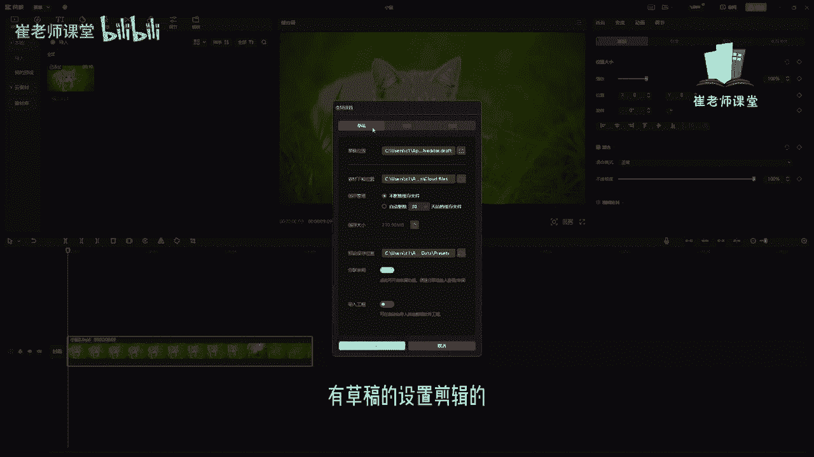

# 【2024版小红书体运营教程】全B站最良心的小红书开店运营教程！小红书体开店 起号真的快，赶快点赞收藏起来 - P10：8.菜单命令 - Sathenay - BV1uqHreLEER

创建剪映项目后呢，就进入到了剪映专业版的视频编辑界面，在上方这个区域啊，它是默认的以日期的方式进行自动保存的，可以选择单击，选中之后呢，按住删除键或者是delete键进行删除。

来对当前的剪辑项目进行重命名，这个删除键呢一般位于我们键盘的右侧，这个区域，或者是按住delete键也可以进行删除，删除之后可以进行重命名，同学们需要知道了解，紧接着在这个区域呢是菜单命令。

单击界面顶部的菜单按钮呢，可以展开下拉菜单文件，可以执行新建草稿导入导出等功能，编辑呢可以进行撤销恢复复制，剪切粘贴删除等操作，布局模式呢可以设置默认布局，或者是媒体素材优先，播放器优先属性调节优先。

时间线优先，更多操作可以查看用户协议，隐私条款，第三方版权也可以检测当前的使用环境，也可以查看版本号来查看是否需要更新，还有帮助有帮助中心意见反馈，比如说你经常遇到的一些故障或者问题。

可以进行反馈以及快捷键，后面会详细的给大家讲解这个快捷键的使用，还有关于在这里的呢可以设置全局。

设置单机之后可以对全局进行设置，有草稿的设置。

剪辑的设置，性能的设置，有兴趣的同学可以自行查看，然后在这里呢可以单击返回首页，单击之后呢就返回到了首页，也可以在这里选择这个叉号，也可以进行返回首页，然后还有退出剪映。

单击之后呢。