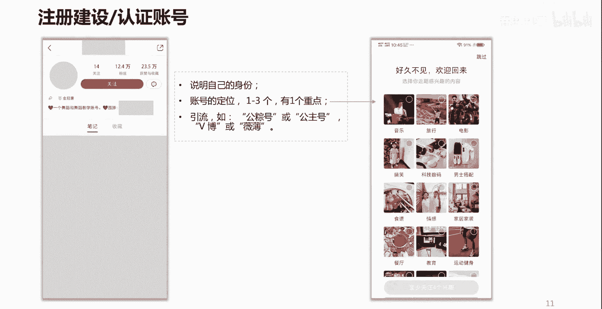
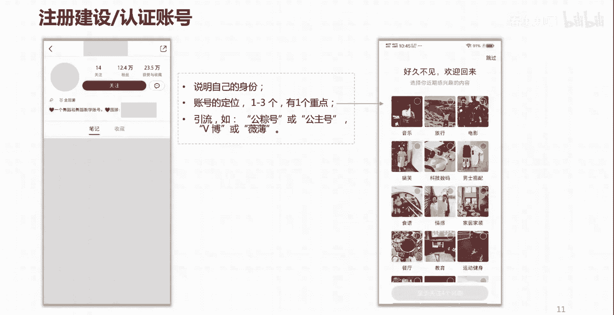

# 【2024版小红书体运营教程】全B站最良心的小红书开店运营教程！小红书体开店 起号真的快，赶快点赞收藏起来 - P10：P9小红书养号秘籍 - 春虫虫呀i - BV1hx4y1x7cz

那么了解了这个之后呢，接下来我们就要注册一个账号啊，注册一个账号。

那么大家看到这个账号呢，我们知道这是账号的一个主页，小红书账号的一个主页，那么在我们注册的时候呢，我们往往呢会遇到呃。

比如说头像啦啊，昵称啦是吧，还有这个简介，那么像这个地方呢。

我们一定程度上呢可以去进行一个什么呢，匹配的一个创作，比如说你分享的是美妆的。

那么就可以找公司的一个什么啊代言人啦啊。

或者是公司里有一个什么呢，有颜值啊什么的一个啊员工啦。

或者是什么哈，或者是自己的肖像啦，但是一定要记得需要有代表性的啊。

是要有代表性的，包括昵称也是要让人一看到你的昵称。

就大概能够感觉到你是做什么的啊。

这个账号简介呢，这个账号简介呢一定要记得要说明自己的身份。

有些企业或者有些个人呢在小红书上面呢。

并没有开通自己的店铺。

所以呢他可能需要往其他的平台呢，去进行流量的一个引出啊。

把流量引到其他的平台上，才能实现进一步的转化。

那么这个时候呢，你也可以在这个地方呢去做一个标注。

但是这个标注呢一定要注意，不要违反小红书平台的一个社区公约啊。

在一些呃字上面呢要注意好。

那么在我们用账号的，尤其是第一次用账号的时候呢。

也经常会遇到这样一个界面，就是让你选择自己感兴趣的一个类目啊，那么大家呢可以去选择什么呢，四个啊。

那么小红书虽然可以去选择四个，但是我要告诉大家。

如果你们是星座小红书账号的话，第一次做账号重点做第一类。

其他三类呢辅助去做，而且这四类之间呢要有关联啊。

要有关联。

你比如说我们在这选搞笑类啊。

这是自媒体类的是吧，哎那么还有什么呢。

男士搭配，因为时尚类的男士肯定也喜欢搞笑。

还有什么呢，他们也喜欢情感，还有什么呢，他们也喜欢运动对吧。

你可能要做一个什么呢，关联啊。

做一个关联，你可能有的人会说哎，时尚类的男士也可喜欢科技树吗。

这个呢稍微有一点牵强，因为不是所有的男士或者年轻的男士们。

都喜欢科技数码对吧。

所以说呢尽量呢能够哎呀自然地衔接在一起啊。

比如说搞笑啊啊男的啊，喜欢有趣的东西啊。

情感类的东西，我们可以进行一个自然的衔接。

那么重点呢我们及其中一类，比如说搞笑情感，这个呢。

我们刚才看了那个小红书内容的一个分类，它不是主要的一个类目对吧。

不是主要的类目好，那么什么是主要的类目呢，我们刚才说了是吧。

哎这个服装搭配，那么就把它作为我们账号的一个一开始啊。

或者叫什么叫初始化，或者叫冷启动的时候的一个什么呢，核心的一个账号内容定位，也就是意味着我的账号，一开始我所创作的笔记内容，就是围绕着这个方面去做。

当然啦我说的这个呢更侧重于个人账号。

如果你是企业账号的话呢，一定要记住基于你企业自身的产品。

自身的业务类型去选择啊。

那么这个呢就是我们在一开始做账号啊。

建设账号初始化的时候呢，要考虑的一个东西啊。

要考虑的一个东西好，当我们把账号注册好了之后。

我们刚才讲过了小红书的这个系统呢，它是一套智能算法的系统对吧。

我们创作的内容呢，它能够识别到我们内容的一个什么呢。

内容标签，那么我刚才也讲了，小红书对我们每一个用户呢也都有兴趣。

标签或者是账号定位方面的一个识别。

那么说到这个点呢。

有一个问题就来了，哎我自己做的这个小红书的账号定位。

它的智能算法，那个系统是怎么样才能知道呢。

他怎么知道的是吧，难道我得跑到小红书公司哎。

趴到服务器旁边跟他服务器说吗，那显然是啊。

不可能啊，那怎么办呢，所以这里呢我们呢有一个笨办法啊，就是什么呢。