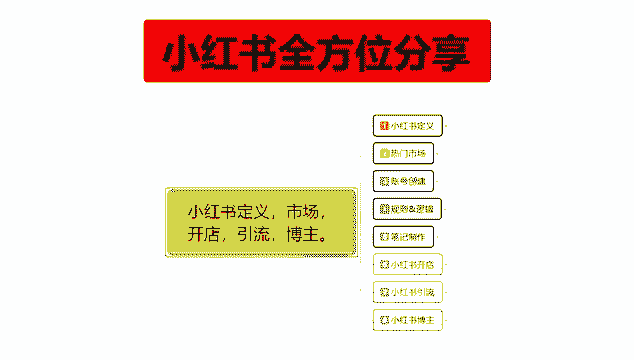
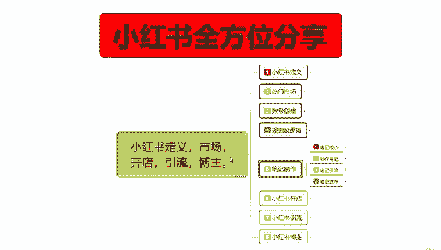
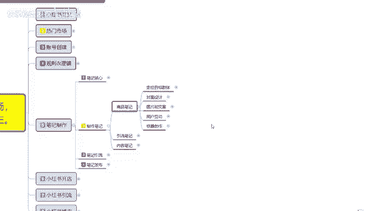
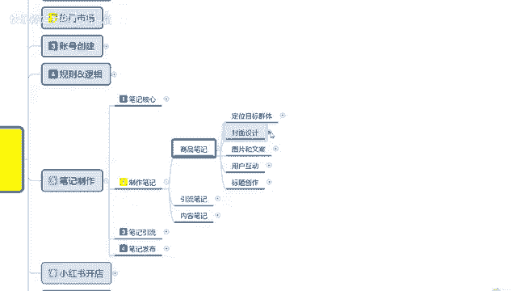
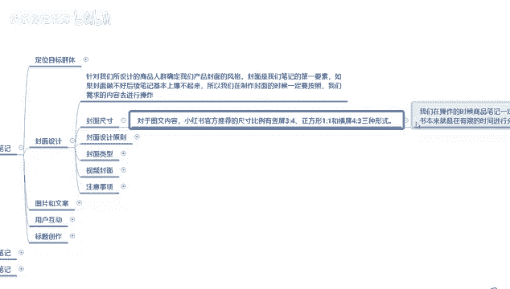
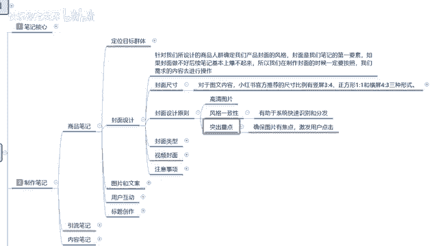
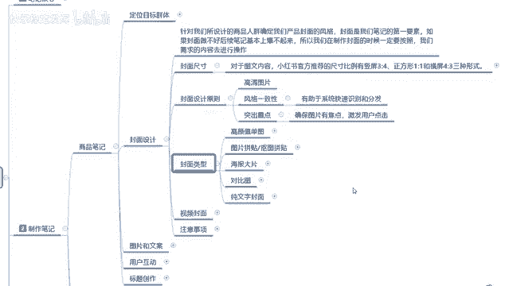
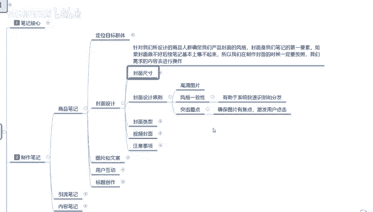
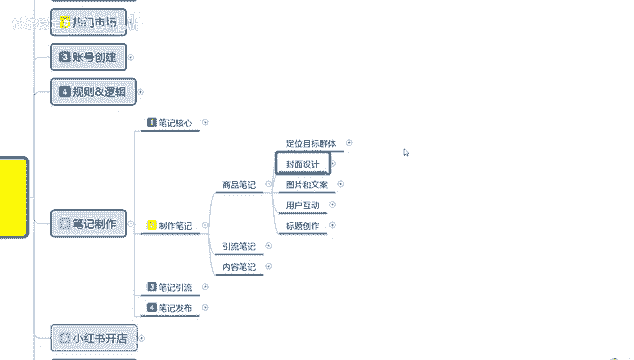

# 【2024版小红书体运营教程】全B站最良心的小红书开店运营教程！小红书体开店 起号真的快，赶快点赞收藏起来 - P11：9.小红书新账号笔记制作（3） - 快乐稳定发挥 - BV1AbtoebEjX

大家好，今天给大家分享的是小红书全方位整体分享的，第五大课时制作笔记的一个内容。

这节呢哥给大家分享的是制作笔记里面的一个。

第二点内容啊，封面的一个设计。

小红书啊，他的一个封面设计的话，主要针对我们所设计的商品人群，确定我们产品封面的一个风格啊，封面是我们笔记的第一要素啊，之前上课也跟大家分享过的，如果说封面做不好的话，笔记后续基本上包不起来。

所以我们在制作封面的时候，一定要按照我们需求的内容去进行操作，那这里面的需求内容是什么呢，就是下面这几个点，第一个封面尺寸，对于图文内容啊，小红书官方推荐的尺寸，它的比例是呃，竖屏三比四。

然后的话是正方形，一比一和横屏四比三三种方式，但是我们基本上去选的话，你不管是做小红书或者做其他的啊，你的笔记也好，你的视频也好，你的文案也好，只有一种方式啊，竖屏三比四的比例就是官方推荐。

他虽然说是有正方形和四比三，四比三的这种方式的话，但是我们基本上选的话，就说我们在操作时候，商品比例一定要选三比四的一个比例，没人喜欢像看电影一样啊，就是看小红书，本来就是有限的时间进行的一个分享。

所以说三比四的一个比例是最好的，你如果说非得把它做成横屏，那你整体的一个视频管感官效果，就是我笔记或者说视频的一个完播率。

基本上可能不到15%，正常的话都要接近30%到50%了，你的不到15%，那你后续的话就没有什么发展前景，所以说三比四组唯一的选择性啊，虽然说有多个选择，但基本上的话这个选择性只有三比四。

封面设计原则其实就比较简单了啊，图高清的一个图片，然后风格一致，然后呢突出重点，这三个重点就可以，这里面的话最主要的一点就是风格一致，这个风格一致的话，他所说的啊不是单篇笔记，是你整个小红书店。

就是你小红书账号里面的所有笔记，简单的意思就是说，你的这一个账号里面的风格笔记，你最少要三个月才能进行更换，三个月以内，你所发放的所有笔记，风格都要保持一致的一个风格特性，就是图片的背景文案。

然后的话呃选择图片的文案的图片文案，或者说是视频的一种格式类型，基本上都要是一致的，如果说你不一致的话，呃你在发笔记的时候，系统会给你卡壳，就是你的那个笔记发送以后的话，它会很缓慢。

你保证风格已知以后的话，你的笔记发放时间自己才能控制，而且系统录入的话是非常快的，他就直接给你判定为你自己之前所发的，大概内容延续或者是后续，也就是说你发出去以后的话，他还是会推给之前观看过你的人。

然后再额外给你添加一部分用户，如果说你的风格不一致的话，那他就是进行随机的一个匹配展示啊，这个意思大家要明白，就是你如果说你的风格不一致，你每次所发放的笔记风格不一致的话，他所面对的人群和展示画面。

会影响你整体点击率，他虽然说不会超出你的那个社区范围，但是社区范围它也是一个大的一个类目，懂我意思吧，你本来你是做女装短袖的，但是你的风格不一样，他下回可能给你推的就是女装长袖啊。

或者说是女装连衣裙之类的这种东西，你比方说推食品，你本来是推儿童食品，他到时候可能会给你吞成成人食品，所以说你的风格一致，给你直接再次投放，而不是给你更换一个类型投放，因为你上一次发放的数据。

如果说一般你第二次再次继续发放的话，他就会给你换一个渠道啊，这个就是小红书的一个匹配机制，大家一定要弄清楚这一点啊，就说我们在封面设计的时候，风格一定要一致，你这个风格一致，还有你的标题变动性的话。

就是不能太大的啊。

我后续呢是封面的一个类型，封面类型的话，这里面的话就是高颜值单图图片拼贴，抠图拼贴，然后的话海报大片对比图，纯文字封面这五个板块其实都可以，就说小红书在封面造型上面，是没有特定的那个规划的。

你怎么做都行，就看你自己怎么去啊，配你的产品或者说配你引流的内容啊。

都是可以的，基本上是没有什么太大区别的，只是说它所适用的一个范围不同，你比方说高颜值的一个单图，它比较适合的话就是美妆教程，家居装饰和穿搭分类的类似的一种笔记，你包括后续的图片拼贴，抠图之类的啊。

他就比较适合旅游美食等等海报大片啊，这后面都有给你们进行标注，你们可以去研究一下，过多的我就不一一进行讲解了好吧，再往后面走呢就是视频的一个封面，然后呢是注意事项，这两个的话其实和前面差不多。

视频封面的话就是你自己选择的一个类型，基本上就是四比三，其他的就不需要去考虑了，然后注意事项的话就是确保图片的一个尺寸，适当避免过度的一个压缩，压缩以后的话，那个图片它是模糊不清的。

然后呢标题风格与位置的话，对啧怎么说呢，看你的账号内容来定啊，风格保持一致就可以了，然后最后一点呢，就是封面图的一个像素要求是800×1200，合理的像素密度为150~300。

额超过这个范围或者小于这个范围的话，你的图片展示效果，在小说上面的话就不怎么好看了啊，这个就是注意事项需要你们了解一下，就说整个封面设计的话，你最突出重点的一点就是你的风格要一致，如果说你的风格不一致。

你其他的一个封面类型的选项啊，呃包括尺寸的注意事项，你暂时可以忽略不计，因为你的风格不一致，导致你整个账号的话，就是说小红书，他会在社区里面进行随机性的匹配，看你究竟适合哪一个人群，你风格一致。

如果说获得了一个好的数据属性以后的话，就是爆款笔记的概率比正常风格不一致，爆款笔记的概率大概要多接近一半。

这个呢就是封面设计好吧，那这一节分享呢就给大家分享到这，下一节呢给大家分享一下。

