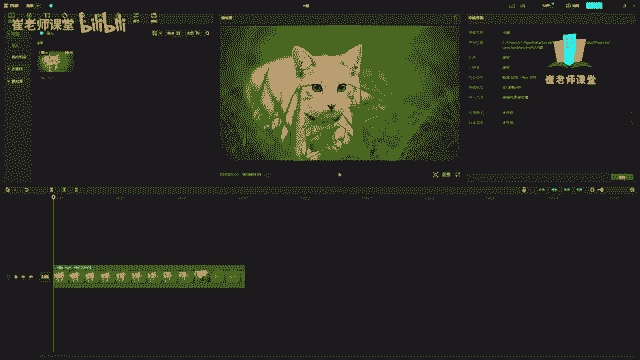

# 【2024版小红书体运营教程】全B站最良心的小红书开店运营教程！小红书体开店 起号真的快，赶快点赞收藏起来 - P11：9.工具栏 列表栏 素材库面板 - Sathenay - BV1uqHreLEER

编辑界面的上方呢被称为顶部工具栏，它包含很多工具来提供给大家使用。

有媒体音频。

文本贴纸，特效，转场滤镜，调节模板等工具，在左侧这个区域呢被称为左侧列表栏，它需要配合顶部工具来进行使用。

特别像顶部工具的这个分类啊。

单机不同的工具呢左侧列表栏选项也会不一样。

大家可以理解为是它们的分类，媒体的分类呢，有本地以及云素材或者是素材库里面。

音频的分类呢有音乐素材，音效素材，音频提取，抖音收藏链接。

下载文本的分类呢，可以有新建文本或者是花字文字模板，智能字幕识别歌词，本地字幕等等，像贴纸的分类，特效的分类分为画面特效，人物特效，转场的分类，滤镜的分类，调节的分类以及模板的分类。

紧接着在这个区域呢被称为素材库，面板顾名思义啊。

就是用来存放素材的区域，需要注意的是，我们顶部工具栏当中工具进行选项的时候。

素材库也会跟着变化。

列表栏进行选择的时候，选择分类的时候，素材库也会跟着变化，比如说媒体本地啊。

这是本地的素材库，还有云素材库。

需要登录抖音账号来进行查询，以及当前热门的素材库都能够提供大家选择，可以进行下载使用，也可以在这里小分类里面进行选择啊，有背景片头片尾，还有呢音频也可以进行选择。

将音乐的素材在素材库当中进行挑选，这个给大家先作为简单的了解，后面会用好几节课来重点详细讲解。