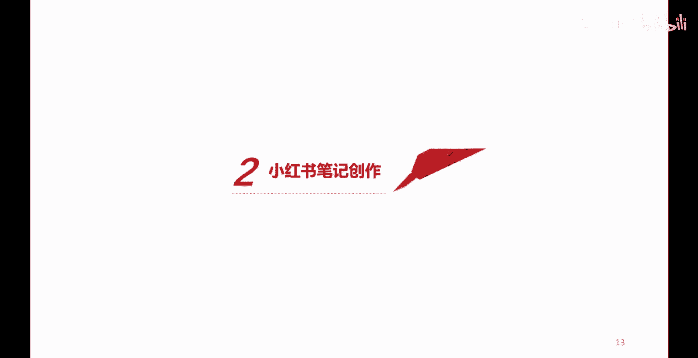
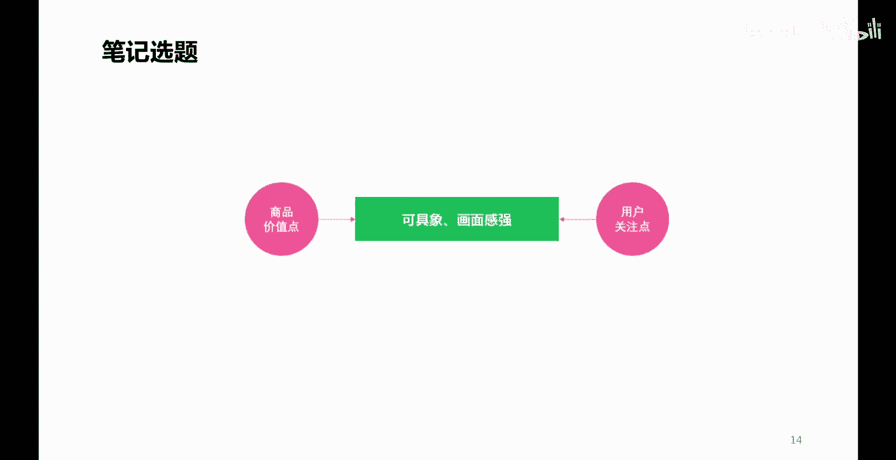

# 【2024版小红书体运营教程】全B站最良心的小红书开店运营教程！小红书体开店 起号真的快，赶快点赞收藏起来 - P11：P10小红书笔记内容选题核心方法 - 春虫虫呀i - BV1hx4y1x7cz

各位朋友大家好，欢迎来到本次课程，这堂课呢我们继续讲小红书的运营，那么接下来呢我们要讲的是小红书，在账号准备好之后呢，接下来我们就要进入到一个小红书，内容的一个创作环节，那么首先呢我们要再强调一个点。

小红书呢本身是一个内容电商平台，它通过笔记内容的创作呢来获取流量，获取更多的兴趣用户，然后呢将这些流量，这些兴趣用户呢去更好的转化成我们企业，或者是我们产品所需要的一个什么呢，实际的一个销售量。

那么小红书的笔记如何创作呢，那么接下来我们看首先第一个点，我们要考虑笔记的选题，笔记选题应该怎么选呢，不管我们做的是个人账号还是企业账号，我们首先能够明白的是，我们在创作一篇笔记内容的时候。

我们需要对什么样的商品，什么样的一个产品去进行一个什么呢，内容的一个分享创作，或者是内容的一个展示或者推荐介绍，那么这个商品本身它都有什么样的优势呢，比如说这个商品的材质，这个商品的原材料啊。

这个商品的什么呢，工艺啊，这个商品的什么呢，呃一些使用的一些方法，或者使用的一些感受，商品的，比如说这个服务啊这些等等的，都属于商品的价值点啊，那么同样呢我们可以将这些价值点呢去联系，去结合一下。

我们所针对的这样一个商品的，目标用户的一些兴趣的关注点，那么我们的目标用户，针对于这些商品消费的时候，都有什么样的一些痛点，或者有什么样的一些共性的行为特征呢，那么基于这两个点。

我们就可以联系出很多具象的一些选题点，那么我们就可以将这些选题点呢，成为我们一篇笔记的一个核心的内容构成，而且呢我们在创作笔记的时候呢，我们就要去思考我们即将要展现的这个商品，即将要创作的商品。

他的体现都需要在哪几个方面，我们是通过视频来体现呢，还是通过图片和文字的方式来体现呢，那么这就涉及到了我们商品，不管是图片还是视频方面的一个实拍，一个创作，当然如果你是个人账号啊。

帮助一些商家去实现流量，实现一些带货的话呢，你也可以要求商家来给你提供一些素材啊，那么当我们有了这样一些内容的时候呢，我们就要开始梳理我们这篇笔记的一个，整体的脉络。

我们就要去想用户在购买这些商品的时候，最核心最主要的关注点在什么位置，那么这个关注点呢，就可以成为我们这篇笔记的一个什么呢，首要的一个什么呢，内容诉求或者是一个切入点，甚至我们这篇笔记的标题。

也可以围绕着这个点去进行展开好，那么这个呢是关于一个笔记内容的一个选题，那我们找好了选题，捋好了这个创作的思路，接下来呢我们就要去看一下笔记，内容应该如何去创作。

