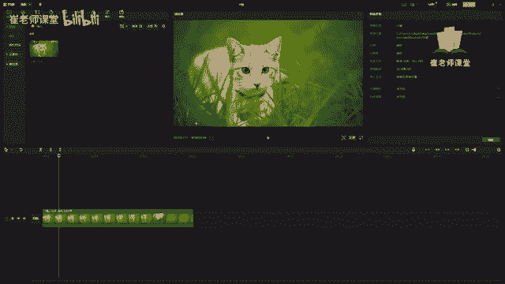
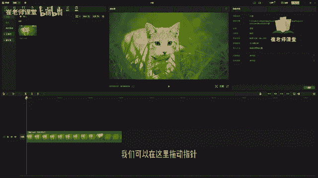
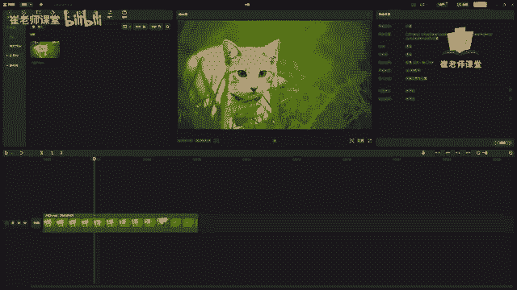
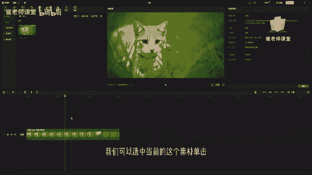
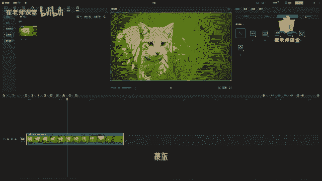
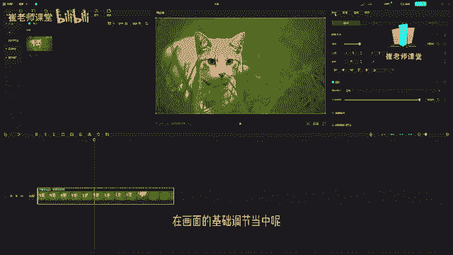
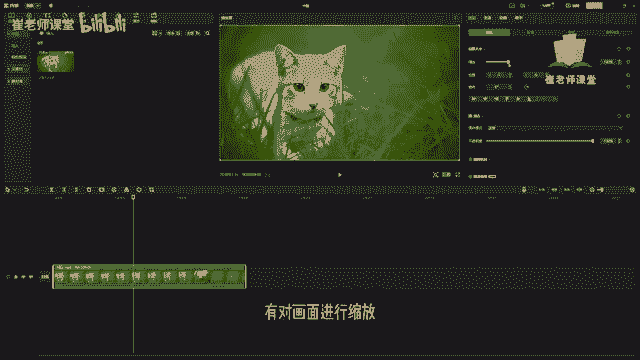

# 【2024版小红书体运营教程】全B站最良心的小红书开店运营教程！小红书体开店 起号真的快，赶快点赞收藏起来 - P12：10.播放器参数调节面板 - Sathenay - BV1uqHreLEER

在这个位置呢是播放器面板，我们可以在这里拖动指针。

然后选择播放，可以进行预览当前的素材。

也可以呢选择当前的素材库啊，来查找剪映给我们推荐的一些素材，可以将指针放在当前素材上面，按住空格键，它会在播放器面板上进行播放，Collection plate is never a，需要注意的是呢。

如果这个视频你是第一次打开的话，你需要进行下载才能够进行浏览，紧接着呢在这个区域啊是参数调节面板，它可以对当前时间轴中选择的素材，的一些基本参数进行调节，我们可以选中当前的这个素材。

单击你会发现有基础抠像，蒙版。

美颜美体等一些对画面的基础设置，在画面的基础调节当中呢。

有对画面进行缩放以及位置。

在这里不容易演示啊，咱们直接拖入一个素材吧，OK将这个小女孩进行拖进来，直接鼠标拖拽到时间，走路当中，松开鼠标就可以完成拖拽了，但是你会发现它整体是铺满了整个屏幕，我们要将它进行缩小。

首先呢可以在这里设置位置，X轴以及Y轴的变化，给大家做个简单的演示，比如说400Y轴呢是，-200，这个呢就是当前的位置默认的呢是零，就剧中进行显示，那么呢在这里可以设置它的旋转，它的角度有90。

也可以拿来进行鼠标，按住这个小按钮之后呢，可以在这里调整它的角度，在这里呢有左对齐，单击之后呢，就会发现当前的视频呢就被进行左对齐，还有水平居中对齐，右对齐，顶对齐，垂直居中对齐以及底对齐。

这是根据自己的需求来进行调整，另外呢在这里可以调整它的混合模式，学过PHOTOSHOP的同学们应该比较熟悉啊，在这里有几种常见的混合模式，后面都会和大家讲到啊，有变量，绿色变暗等等一些常见的混合模式。

在这个位置呢可以调整它的不透明度，默认的是100%，就是完全不透明，移动滑块呢可以调整它的透明度，往左滑，可以调整它的透明的度数，也可以呢在这里输入数值来调整它的透明度，另外呢还有视频防抖功能。

如果你当前的视频是人为进行拍摄的，它肯定会有或多或少的抖动，在这里呢可以修改防抖等级，默认的是推荐也可以设置裁切，最少也可以设置最稳定来进行设置，还有超清画质，视频降噪，视频去频闪等等啊。

但是需要VIP来进行操作啊，后期会给大家进行演示，这些呢就是参数调节面板的最基础的功能，像画面当中的抠像啊，蒙版啊，美颜美体啊，以及音频类的变速类的，动画类的，跟踪类的调节类的。

我们后期会用几堂课的时间详细给大家讲解啊。