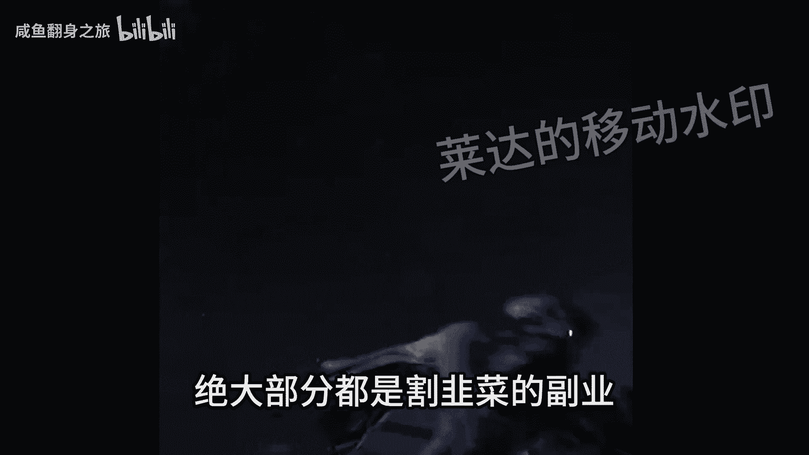
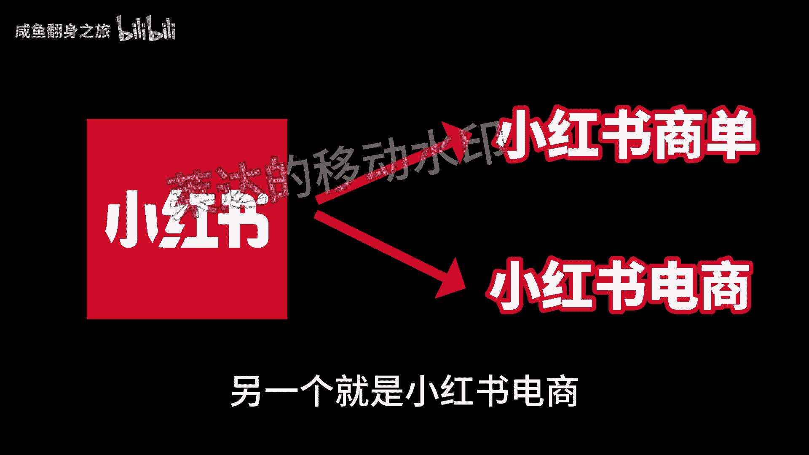
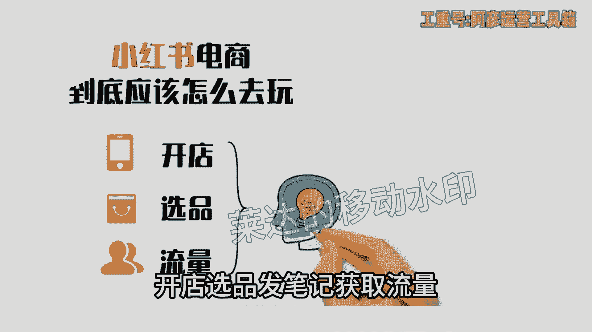
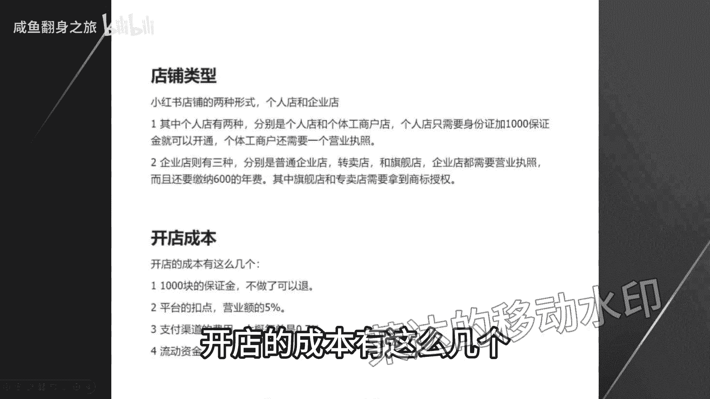
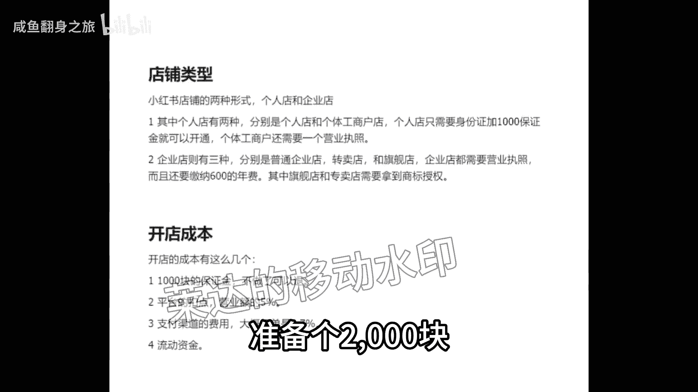

# 【2024版小红书体运营教程】全B站最良心的小红书开店运营教程！小红书体开店 起号真的快，赶快点赞收藏起来 - P12：3.靠冷门玩法月入过万，8分钟教会你做小红书电商和小红书商单账号，保姆级教程拆解 - 咸鱼翻身之旅 - BV1CQsre1EDo

未来两到3年有什么风口比较好赚钱呢，有没有什么副业可以赚到钱。

又不容易踩坑呢，像现在有很多人在网上去找副业兼职啊，还有些甚至还没做啊，就想着要准备去创业了，然后上当受骗的数不胜数，其实我研究了半年多的，网络上面各种各样的副业，基本上啊绝大部分都是割韭菜的副业。

什么打字赚钱，app签到，拍商单。

刻图兼职配音赚钱啊，在各大平台都充斥着这种广告，打着高收益低成本的幌子吸引你去做，然后坑你一笔会员费就跑了，像配音这种先坑你的设备钱，然后再坑你的课程，你想接单，不好意思，还要给平台缴费。

所以啊大家一定要擦亮眼睛，一个靠谱的副业，不可能是随随便便就能赚到很多很多钱的，在背后一定是要付出一定的努力，才能拿到你满意的收入，一定要具备以下这几个条件，第一个有技术含量，没技术含量谁都能做。

那还轮得到你啊，第二个要花一定的时间去学习和摸索方法。

因为成功肯定没有捷径，第三个就是收入一定要能大于你的投入，不然还做什么呢，那网络上的副业是不是就没有一个事能做的呢，不是不可能，除开那绝大部分割韭，绝对不可能，这半年多的时间。

还是让我找到了一个靠谱的副业啊，这也是我录制这个视频的目的之一，一方面给大家避一下坑，另一方面让大家了解一下这个副业，这个副业就是做小红书，别的也不多说了，我也才做三四个月不到，总共也赚了有十几个了。

你就跟着我的视频去按图索骥就足够，你在这个事情上开始盈利了，视频的结尾呢，我还会给大家准备一份资料，里面有我直播课程，小红书的话是可以做两种类型的哈，一个就是小红书商单号，另一个就是小红书电商。

首先来说小红书商单号，小红书账号只要涨到1000粉丝，就可以去接广告变现了，不需要你去做什么人设啊，IP啊，只要账号依靠内容涨到1000粉丝，就可以去开通蒲公英接甲方的软文广告来赚钱，千粉账号。

目前接一个商单的报价在200块钱左右，一个月接十几单是没有问题的，因为小红书平台甲方爸爸实在太多了，根本就不用担心接不到单子，想做好有两个关键点，一个是赛道的选择，一个是养号的流程。

赛道的话推荐你们去做娱乐八卦和爱豆追星，这两个赛道涨粉特别快，发布的视频，只需要去搬运和模仿爆款视频去剪辑就可以了，养号要注意的就比较多了，在注册账号的时候，不要用WIFI，全程用流量去注册。

前三天的时候啊，每天的早中晚，分不同的时间段去刷对标账号的笔记，每次刷半个小时就可以了，那说完商单，小红书电商可以说是今年最火的项目了，像我现在每天靠无货源模式，也能有这样的一个收入。

做到我这样也不是很难，像小红书电商整个项目的操作逻辑其实很简单，无非就是三个方面，开店咸品发笔记。

获取流量，我们先说第一个部分如何开店，这一步非常简单，打开小红书，点击左上角三条杠，找到创作者中心，点击更多服务，然后选择开通店铺，点击立即开店，再按照要求填写相关的资料就可以开通了。

新手直接申请个人店或者个体工商店就可以了，根据我这边的操作经验，个人店和企业店他的店铺的权重，店铺的流量是没有什么差别的，开店的成本有这么几个。

第一个就是1000块钱的保证金啊，不做了可以退，第二个呢是平台的扣点营业额的5%，第三个呢是支付渠道的费用，大概呢每单是0。7%，第四个就是自己的流动资金啊，一开始大家做呢可以用无货源的方式去做啊。

对资金要求也不高，你刚开始呢准备个2000块。

3000块完全够了，选品其实也简单，在其他平台上的爆款，大概率在小红书上也能爆，目前小红书呢我是推荐三个渠道进行选品的，第一个是通过某东，某宝上面找那种小红书平台调性的爆款产品。

第二个呢是通过某音的那个精选联盟，你在某音的精选联盟排行榜，你可以看到现阶段哪些品卖的好，只要符合小红书用户调性的产品，直接搬运测试就可以了，第三个呢就是某多多的这个销量排行榜。

选择适合小红书的类目排行榜，从中选择相应的爆品搬运到小红书，整个选品的逻辑就是，我们要利用市场来帮助我们选品，而不是自己在那瞎想，我们要借助大卖家的选品能力，来弥补自己选品上的不足。

所以我们只要判断一个东西啊，就是这些排行榜上的爆品，是否跟小红出的人群有匹配的可能，如果有，我就搬过来测一下对吧，相当于是借助了别人的能力来帮我们自己选品，这样反而是最快捷，而且是最稳妥的选品方式。

肯定比你下次成功率要高很多，然后等你这个产品上架以后呢，就到了最重要的环节了，我们应该如何获取流量，小红书他是个种草平台，你店铺九成以上的流量啊，都是来自你发的笔记。

这就是为什么我之前说小红书不要铺垫群，而要做账号矩阵，尽可能多的发笔记号流量，它的通路就是用户通过你的笔记啊，对你推的产品产生兴趣，然后到达你的店铺完成购买，你铺一堆店铺一个还不如多发笔记。

多发几篇笔记的这个效果好，所以怎么在小红书上发笔记，对吧就是你小红书电商是否成功的关键，小红书这个平台你直接发应广，我觉得效果非常差对吧，你本来小红书的这个用户群体认知就比较高，你直接发广告。

没有办法获得信任的，更不要提转化了，你发笔记的时候一定要用一个素人的角度，你知道吧，测试用户的角度去切入，站在用户的角度去做种草内容，而不是官方视角，这才是真正有效的嗯，这种种草笔记怎么做其实也很简单。

就是去各大平台的商品评论里找，比如某音某宝，某东的商品买家秀，找到好看的素材，你直接copy下来用吗对吧，文案呢在买家评价上去做修改，这些买家的评价的就是商品用户的使用体验。

天然的适合用来做这个中考笔记，而且可以说是取之不尽啦，然后啊当你单个账号的sop跑通了是吧，我们就可以开始矩阵引流了，通过批量上小红书账号，批量发布笔记给我们的店铺来引流来放大。

那基本上整个小红书的电商的运营啊，就是我上面分享的这些，外面不管多少钱的培训啊，3000块也好，6000块，1万块也好，其实就是这些东西，有些培训可能还没有讲的清楚啊，根据上面的几个点。

我给大家准备了一份资料，里面包括了小红书账号的旗号运营的方法，以及一份小红书电商的视频课程，你如果打算经营小红书电商，你也不用看别的东西，就跟着这份资料走足够，你开始盈利了，有需要的啊，点赞赞加关注。

在评论区回复红书电商。