# 【2024版小红书体运营教程】全B站最良心的小红书开店运营教程！小红书体开店 起号真的快，赶快点赞收藏起来 - P13：11.小红书新账号笔记制作（5） - 快乐稳定发挥 - BV1AbtoebEjX

大家好，今天给大家分享的内容是，小红书全方位的一个整体分享。

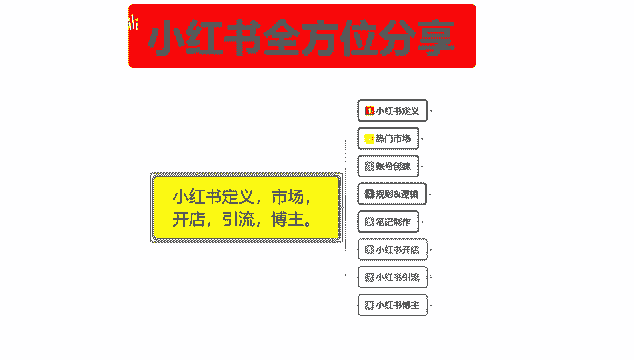

制作笔记的内容，这节课的话给教大家的是制作笔记，里面的一个用户互动。

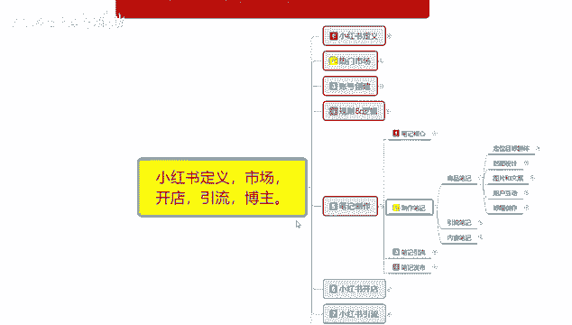

笔记制作发放推广完成以后的话，这个里面还有互动环节，互动环节里面包括文案互动，笔记互动和评论互动，他们三个的话基本上是一体的，只是它们所对应的一个方式不同啊，文案互动的话是通过账号。

就是我们小红书账号里面的文案，第一篇文案，第二篇文案，第三篇文案进行连贯式互动，你就相当于是小说连载一样啊，第一篇，第二篇，第三篇，第四篇这种连接方式，这个是文案互动，笔记互动的话就是说。

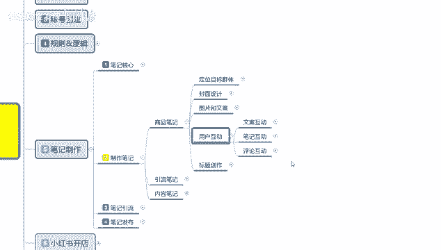

笔记内容进行互动。

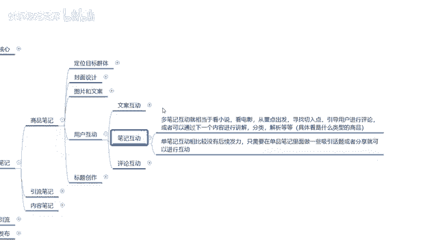

他和文案互动其实是差不多的，第一篇笔记里面是什么内容，第二篇笔记里面是什么内容，通过第一篇编辑笔记连续讲解，第二篇笔记只是说他们的连贯性没有文案互动，那么啊连载时间那么长，笔记互动的话。

那你只能通过第一篇或者跳到第三篇，第四篇或者跳到第六篇里面，选择一篇笔记进行双双篇笔记的一个文案互动，第一篇第二篇也可以啊，只是说他们的一个连贯性就没有那么长，就相当于不是连载类型的，然后呢是评论互动。

评论互动的话，就是我们笔记发放出去以后的话，我们在那个用小号去引导，或者说你没有小号引导，有其他用户对你的所发放的笔记内容，非常感兴趣，然后你要随时去进行跟进，这个里面的话。

它还需要注意的就是我们的一个回复速度，然后回复内容和重点，评价西吸引的一个重点和共同点等等细节，这样的话就说才会有更多的人进行继续，评论和分享，引导交流，分享的话才是评论互动的一个重重点啊。

就是先引导后交流，再进行分享，这三个点引导是什么意思呢，你的笔记发放出去以后，你在评论区里面用自己的主号，或者用自己的小号去进行内容评判，啊比方说大家有什么想法，有什么不同的看法等等之类。

这种引导引导过后，如果说有用户进行评论，评论以后，就是你和他进行交流，交流过后，然后是分享你们的一个总结，通过这种方式啊，当然这个不是一对一的用户频段，你是多方位用户评论，会有用户。

因为小红书的话本来就是一个大的一个范围，它不是光一个人去评论的，他是很多很多的用户去进行连载性评论，有些东西你要你就需要靠用户去猜测，他才有实质性效果，如果说你不靠用户去猜测，你光靠自己去编。

得把自己累死，你也只能报一到两篇的一个笔记，你后续的笔记你也不可能去那么做，而且他的一个时间特点的话是非常长的啊，得不偿失，没有必要，所以说我们只需要做引导交流和分享就行了，上面的两个点。

一个文案互动和笔记互动的话，额就是通过多的一个商品文案进行连续投放，引入话题进行评论也可以，你第二个文案互动也可以分为单点多点，就是说文案互动你不限制在一个账号里面，你可以跟第二个店铺。

第三个店铺也就是第二个账号，第三个账号通过这种方式进行文案互动也可以，但是它的局限性比较大，你的一个笔记互动的话，可以在单店里面进行进行转载，但是它的一个连贯性就没那么强啊，你可以把它综合一下啊。

这个这两个点是可以综合的，文案互动和笔记互动，它是可以综合的，就说你在一个账号里面进行文案，笔记的连贯性互动啊，又长后续内容又基本上差不多啊，讲解的是同一种类型的东西。

他这种方式的话比较适用于网红引流和博主，但是对于做店来说的话，额用处不是很大啊，就是小红书开店的话，你说这个文案互动和笔记互动话效果不是太大，你还不如做评论互动，效果是最好的，就是通过你的商品。

然后的话批判他的不足，或者说是优点之类的，做评论互动是最好的，你的文案互动和笔记互动的话，只适合做网红或者做引流啊，这个就是商品笔记里面的一个用户互动，后面一个内容呢是标题创作的一个方式。

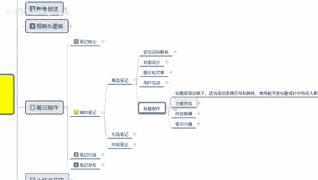

就是小红书的标题的话，说实话额没有那么太大的一个明确性。

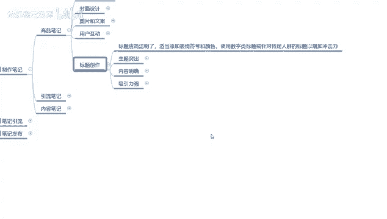

整体来说的话其实还是比较简单的，标题的话就说简单一点，你不要像做怎么说呢，就是相当于直接去卖产品的那种呃，标题的长尾词啊，各种词汇组合没必要在小红书上面，你标题创作你就记住一点，简单明了。

然后找一点吸引词汇的一个关键词啊，让新的用户你做商品笔记的话就没必要了，商品笔记你附带主关键词就行，然后其他的随便打点字啊，不要太离谱，都是可以的，但是你那个附带一定的引流内容就行。

如果说你做引流笔记和内容笔记的话，这个标题创作的话，那你就是呃引流词汇要多一点，然后附带一个主关键词就行，就说你没有必要打很长很长很长，懂意思吧，小红书的标题都是很短的，十来个字，二十十几个字左右的话。

基本上就差不多了，太长的话用户也不愿意去看，因为你的话会把你的那个文案的啊，主体内容给引偏离，然后主题突出里面的话，这个关键词它有一个正面的吸引词。

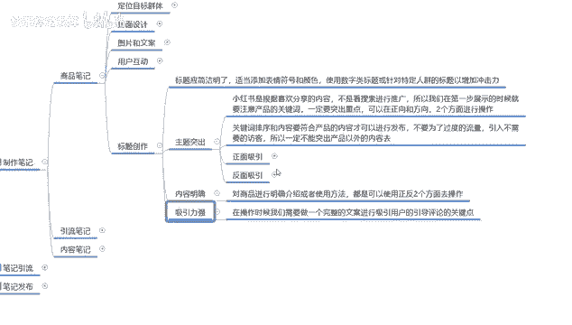

和一个反面吸引词汇两个词汇，这里的话我是把它做了一个大概的一个清单。

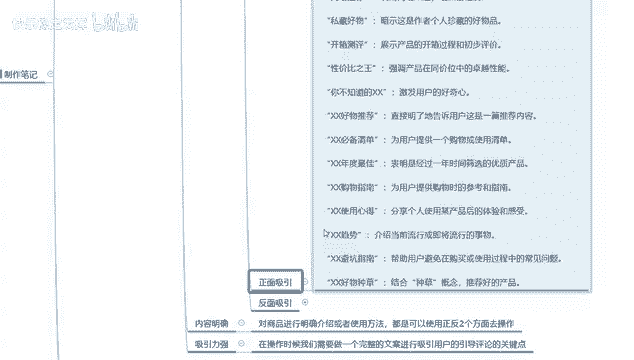

就是小红书上面比较呃容易出现的词汇。

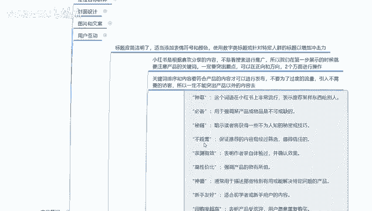

而且吸引的一个访客点击率比较高的，正面词汇的话，就是对这个笔记进行好的一个评论，反面词汇的话就是说通过反面嘲讽啊，也是一种好的词汇，只是说它的名词意思我们看成是反的啊，词汇内容的话。

我给大家把它整理出来，你们大家看一下就行，我就不1111讲解了，因为这种词汇的话，说实话你去呃网络上面做搜索的话有很多，我只是随便整理了一部分给大家。

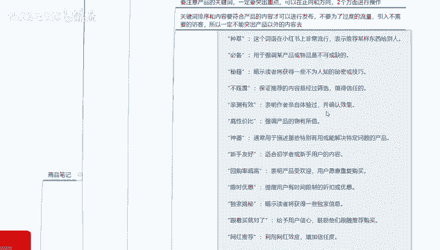

我从上面往下面呢给大家把它拉一遍啊，你们如果说感兴趣暂停使用什么词汇。

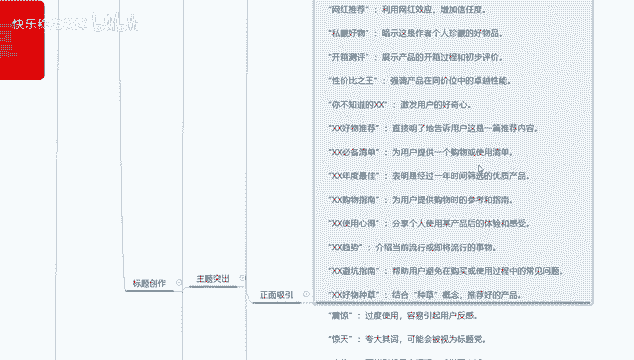

你们自己去了解制作一下就行呃。

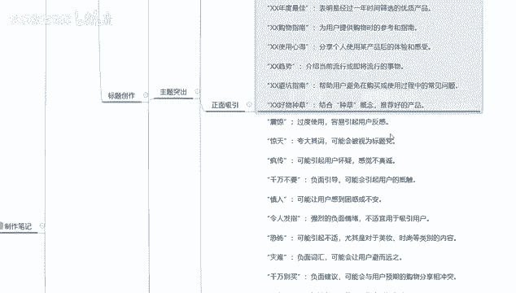

一直到毫无种草，这上面的话基本上都是正面性词汇，下面的话正经，这些的话基本上都是反面的一种额外宣传词汇。

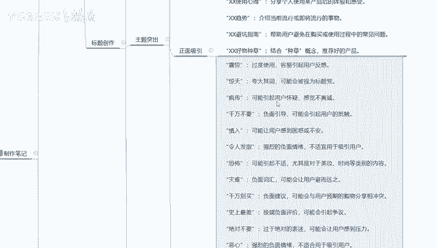

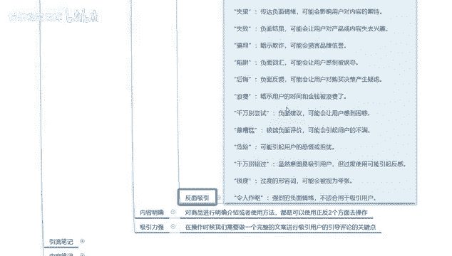

啊具体词汇内容有多少，我也记不清了，因为整理的时候也没记。

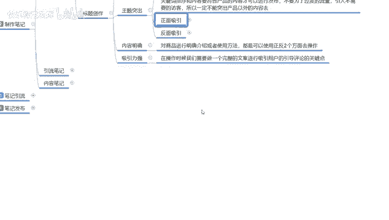

具体计算它到底有多少词汇的一个内容，就是只要是让你们了解一下，你做标题的时候包含一到两个这种词汇的话，基本上就没什么太大问题，然后的话把主关键词包含进去，然后啊再额外加几个修饰词上去就行了。

然后呢是内容明确，吸引力强，内容明确什么意思呢，对商品进行明确的介绍或者说使用方法都可以，然后这里面的话就是附带两个正反持续操作呃，强吸引力，就是说在操作的时候，我们需要一个完整的文案。

进行吸引用户的评论和引导，这个就是内容文案了，就是我们标题创作以后的话，你里面的内容也要展示先展示出来，如果说你的内容吸引力不够强的话，那用户没有粘稠度的啊，导致你后续的一些内容的话。

你没有办法持续持续的一个跟进和转化，懂我意思吧，就是用户看了第一遍感觉很新奇，买就买了，不买，那他下次也不会来了，所以说你的吸引力一定要把它拉到最大。

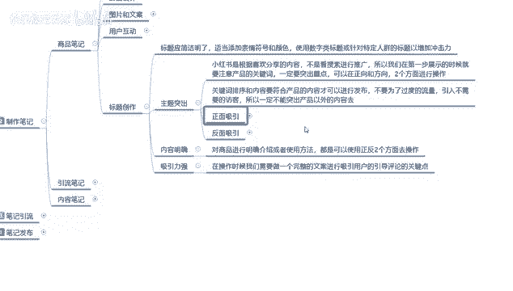

让用户有一个好奇心，或者说产品对比以后的话，对你的产品很有信心才可以，那这一个分享课时呢就给大家分享完了，就是商品笔记的一个内容。

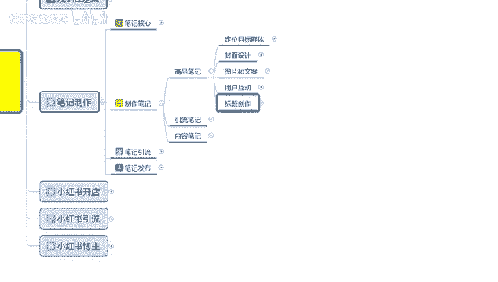