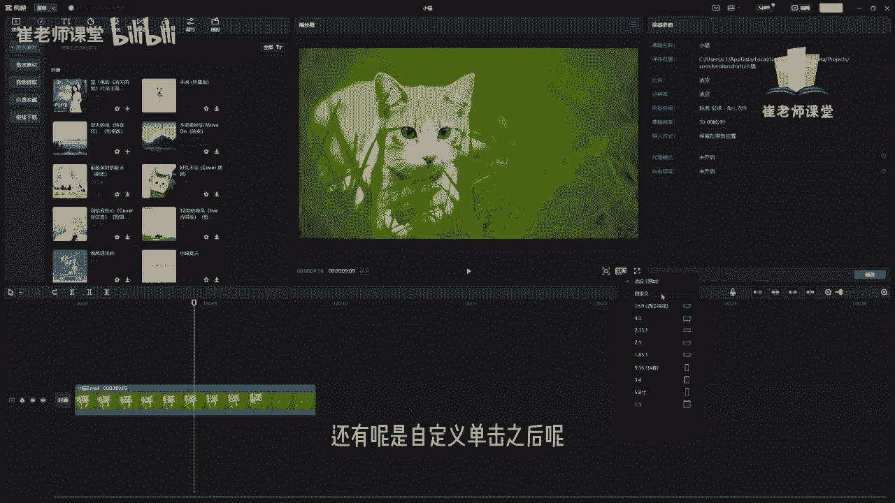
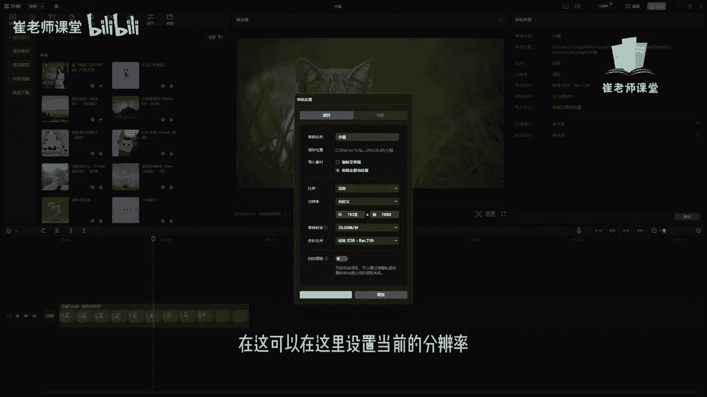
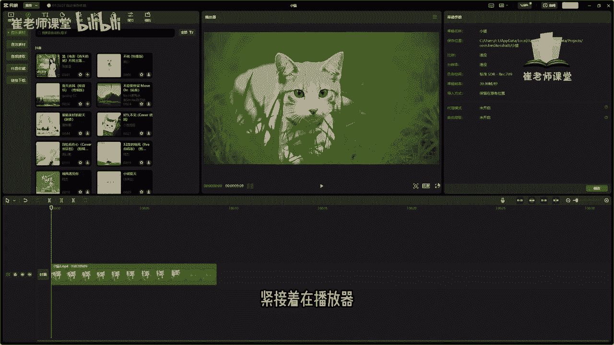

# 【2024版小红书体运营教程】全B站最良心的小红书开店运营教程！小红书体开店 起号真的快，赶快点赞收藏起来 - P13：11.播放器面板的功能 - Sathenay - BV1uqHreLEER

我们来看一下这个播放器面板，在这个位置呢是表示的，当前播放头需要播放的时间的位置，我们看一下在现在这个位置是零，那么呢我们可以进行拖动，在这里呢就显示了当前准备播放的位置。

在这里呢显示的是当前视频的总长度，需要注意的是呢，第一个是小时分钟秒以及帧，这个是需要大家熟悉，紧接着这个位置呢是当前音频的显示的参数啊，两个格呢是立体声，但是如果你是单声道呢。

它也是进行水平的进行播放的，紧接着呢这个呢它是播放按钮，单击之后呢，就会对当前视频进行播放，还有呢这个是类似于放大镜的这个效果啊，单击之后呢，可以对当前的视频素材进行放大的操作。

比如说你想看清楚当前视频的细节，可以进行放大，也可以进行缩小，也可以呢按住CTRL键加鼠标，滚轮键进行放大以及缩小，同时呢可以进行拖拽，当前的这个矩形的这个窗口啊，来进行观看，我们想要放大的细节。

紧接着呢这个是显示的当前视频的比例，单击之后可以查看当前视频的比例，比如说适应的就是原始的当前的主轨道的比例，单击之后啊，就会所有的视频都显示的是当前的比例，还有呢是自定义。

单击之后呢，可以设置当前视频的比例啊，可以在这里设置长度以及宽度，以及草稿以及帧率，还有色彩空间，在这可以在这里设置当前的分辨率。

也可以呢选择当前的一些预设，比如说16比九啊，当前西瓜视频经常使用的视频比例，还有四比三二的，三五比一，二比一等等啊，这些常见的一些视频比例，这些呢都是横屏的方式进行展现的，比如说我们可以看一下。

你会发现当前的视频啊，并不适配当前的画面比例，那么就可以对其进行拖拽来让它进行适配啊，这个是完全根据自己的需要，以及自己需要播放的平台来进行调整啊，因为我们调整视频比例之后呢。

整个素材都是跟着这个比例去进行走的，这个需要进行谨慎调节，在刚开始做视频剪辑的时候呢，我们要确定当前的比例，也就能够确定整个视频的基调啊，然后在下方的位置呢是竖屏的方式，就是我们平时使用手机的这个方式。

比如说常见的有九比16，就是常见的抖音啊，咱们手机的竖屏的方式，还有呢三比四，5。8寸，还有呢一比一，比如说我们设置为九比16啊，如果不太适配的话呢，可以进行拖拽，然后进行调整。

这个呢是完全根据自己的需求来去调整，当前视频需要导出的比例，紧接着在播放器最右下角的位置呢。

单击之后呢，可以进行全屏进行展示，可以单击播放来进行查看，当前视频剪辑的一些内容，也可以移动滑块来进行调整播放的时间，来进行选择性的播放。

