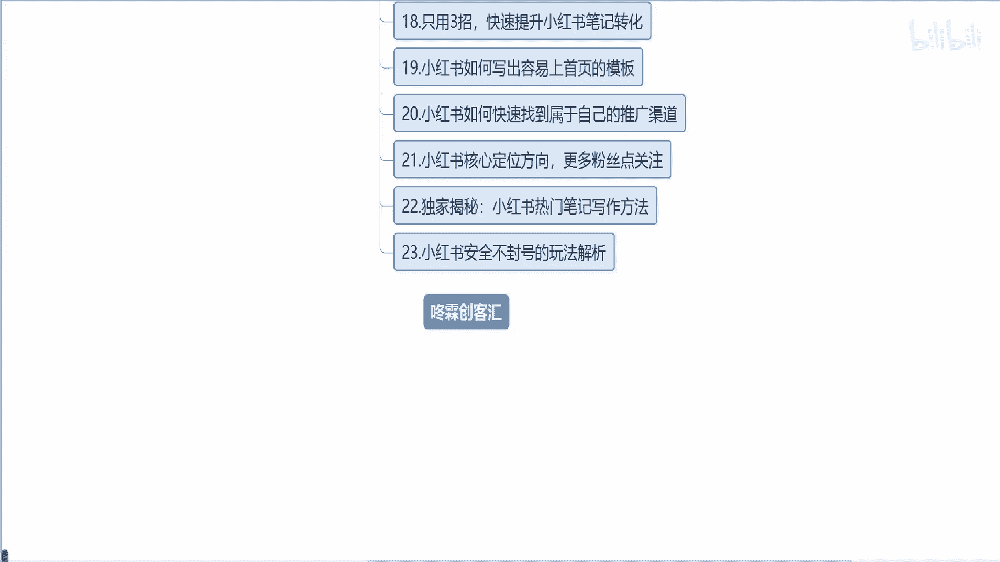

# 【2024版小红书体运营教程】全B站最良心的小红书开店运营教程！小红书体开店 起号真的快，赶快点赞收藏起来 - P13：小红书运营实战课程：从入门到精通系列1 - 听风的歌日记 - BV1mmvDeiENW

大家好，欢迎收看小红书运营实战，从入门到精通系列课程呃，如果有些小伙伴需要提前学习全套课程，系列课程的，可以直接关注呃，东林创客会获取全套课程，本系列课程呢总共分为23小节课，将会给大家讲解。

小红书平台的最新规则和注意事项，如何做笔记，首图如何挖掘关键词以及写出爆款标题，如何写出优秀的笔记内容，如何引流及变现等，全方位的运营实战技巧，接下来我们来看下课程大纲。

额第一节课主要给大家讲解小红书的基础知识，主要是呃一些最新规则和注意事项，第二节课给大家讲解小红书种草笔记，速成的一个四大步骤，第三节课呃，给大家讲解小红书挖掘关键词的一个方法，站内站内主要是这个。

第三节课主要是站内瓦解关键词，第四节课呢就是带大家呃玩转小红书的搜索，提高用户的质量，第五节课教大家如何精准引流呃粉丝，第六节课呃，给大家讲解小红书新手最容易忽略的坑，第七节课呃。

给大家讲解三种热门活动笔记的一个方法，倍增转化率，第八节课给呃大家讲解，如何快速做出小红书笔记首图，第九节课给大家讲解，五种爆款标题的一个咳模板，第十节课教大家如何正确和用户互动，增强粉丝粘性。

第11节课呃，主要讲解小红书呃，账号违规呃，怎么处理，第12节课呢主要是讲解小红书，笔记违规有哪些，就嗯十一十二节课，这两节课呢额不同点就是一个是账号违规，一个是笔记违规，第13节课呢。

主要是讲解笔记不会被限流的方法，第14节课主要讲解线上，线下行业关键词的挖掘方法，第15节课呃，讲解如何写出排名靠前的笔记内容，第16节课讲解呃如何在微信上留呃，微信联系方式不被屏蔽的方法，第十节课。

第17节课讲解本地关键词霸屏引地区粉，第18节课，教大家如何快速提升小红书笔记转化，第19节课教大家如何写出容易上首页的模板，第20节课，讲解如何快速找到属于自己的推广渠道，第21节课。

讲解小红书账号的一个核心定位，方向的一个方法，让更多的粉丝进行关注，第22节课讲解小红书热门笔记写作方法，第23节课讲解小红书安全不封号的玩法，以上就是本次系列课程的大体内容，各节课程会陆续更新上传。

欢迎大家收看，如果需要提前学习全套系列课程的小伙伴，可以直接关注东林创客会获取全套课程，今天的课程就到这里结束了。

