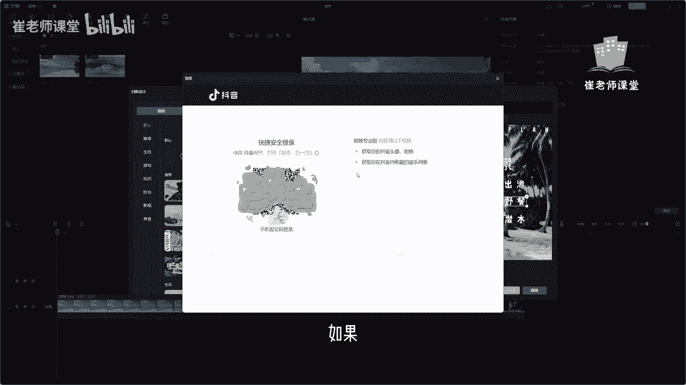

# 【2024版小红书体运营教程】全B站最良心的小红书开店运营教程！小红书体开店 起号真的快，赶快点赞收藏起来 - P14：12.时间轴面板 - Sathenay - BV1uqHreLEER

在视频编辑界面的下方呢被称为时间轴面板，是编辑和处理素材的主要工作区域，时间轴面板呢分别由真层和播放头组成，我们可以鼠标选中当前的播放头来进行选择，需要播放帧的位置，按住回车键或者是播放按钮进行播放。

另外呢我们将一个新的视频拖入到时间轴，会出现一个蓝色的西服线，鼠标松开就会新建一个层，新建的层呢，如果视频画面的大小，和下面的层的大小是一致的话，他会优先选择上面的层来进行播放，我们可以看一下效果。

紧接着在这个位置呢，可以选择关闭当前层的原声，如果你添加时间轴的这个视频里面有声音的话，可以在这里选择单击关闭原声，它会显示轨道已经静音，也可以选择开启原声，单机也可以呢选择隐藏轨道，单击之后呢。

它就会进行隐藏，只显示下面的层，选择把这个小眼睛按钮进行打开，就显示了当前的层，另外呢在这里有锁定轨道，单击之后呢，当前的这个层就没有办法拖拽移动，除非解锁轨道，单击就可以移动当前层位置。

在这个区域呢有封面，单机呢可以编辑封面。

这个视频封面呢一般指的是视频导出的封面，我们可以根据自己的需求来进行选择，可以从当前视频帧当中选择一个合适的帧，来进行，当做一个封面，选择一个比较适合的。

以及自己喜欢的来作为封面，也可以呢选择本地，在这里选择自己想要的一张照片来进行选择。

打开来添加至封面，比如说我们以当前视频帧为例，选择一个合适的视频帧，然后单击呢去编辑，单击。

可以在这里啊选择当前封面的模板，单击选择下载，然后可以根据自己的需求以及审美啊，进行选择自己喜欢的这种模板样式，然后在这里呢可以修改字体啊，比如说根据当前视频的内容来选择，适合他的封面的文字。

然后呢这些呢都可以进行修改，对视频封面的字体呢，可以设置为当前的字体样式可以选择，另外呢需要大家注意的是，如果有比较喜欢比较合适的字体样式呢。

可以在这里选择收藏，收藏的话一般是需要登录抖音账号的，这个需要同学们注意一下，如果你登录了抖音账号啊。

有一些自己比较喜欢的一些，无论是字体还是音频以及文字，还有一些特其他特效，只要都可以进行收藏，这样的话你换到手机端或者是用另一台电脑，如果登录的是自己的账号，这些收藏也会被显示，可以直接拿出来。

就能更加方便的找到，紧接着呢可以对当前字体设置它的颜色，还有阴影啊，一些字体的一些特殊效果啊，描边啊，背景啊等等，以及气泡啊，以及气泡的样式有很多种，完全根据自己的需求来进行选择，还有排列的方式啊。

它的布局的方式有居中，左对齐，右对齐等等，然后也可以在这里选择对齐啊，左对齐啊，居中啊，水平居中啊，右对齐啊，顶对齐啊，垂直居中等等，也可以对当前字体进行加粗，下面加横线，以及将当前字体变成斜线等。

一些常见的字体效果设置啊，大家完全根据自己的需求来进行选择，另外呢如果不想使用啊。

抖音带了很多的模板的话，大家可以在这里选择文本。