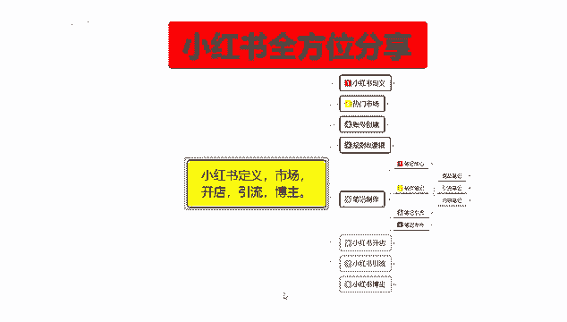
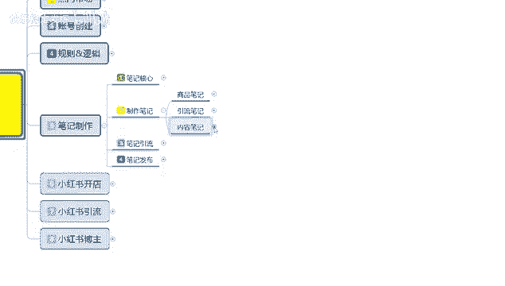
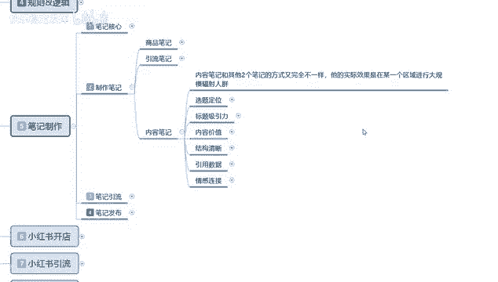
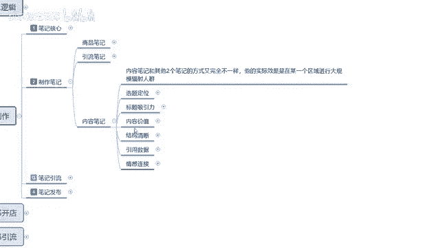
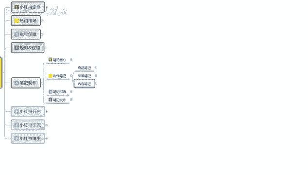

# 【2024版小红书体运营教程】全B站最良心的小红书开店运营教程！小红书体开店 起号真的快，赶快点赞收藏起来 - P15：13.小红书新账号笔记制作（7） - 快乐稳定发挥 - BV1AbtoebEjX

大家好，今天给大家分享的是小红书，全方位的一个整体分享，第五大课时笔记制作的内容，这一节的话给大家讲解的是内容笔记。

呃，之前已经给大家把商品笔记和引流笔记，给分享清楚了，这节的收获的话是内容笔记，它和商品笔记和引流笔记的话其实差不多，他的内容的话和引流笔记呃，相似度可以达到70%以上。

和商品比例的话就会差距比较大一点。

内容笔记和其他两个笔记的方式的话，他是说是完全不一样，但其实实际效应是差不多的，它的实际效果是在某一个区域进行，大规模的辐射人群，你比方说你要做呃，做网红做博主的话，你就需要去做内容。

比你如果说做引流的话，你只能去做引引流笔记和商品笔记，你做商品也是做商品笔记和引流笔记啊，你做业直接去想把流量引到别处去的话，你做引流笔记就可以，你商品笔记碰都不碰都行，但是内容笔记的话他不一样。

他是做网红博主的一个重要渠道。

简单点说你做引流笔记就是做引流的，做商品笔记，你要先做引流笔记，再做商品笔记，你就只在小红书上面开店了，如果说你直接选择内容笔记，那你就是准备在小红书上面做网红的，所以说它的一个整体内容的话。

其实基础属性和商品笔记差不多，但是它的内容，宣传属性和另外两个属性点的话，是完全不一样的，我们需要注重的就是这个不一样的地方。

首先我们了解一下啊，内容笔记选题定位啊，选题定位，选择你熟悉且对目标速度与价值的一个主题，可以是个人的一个经验分享，这个里面包含知识讲解，专业知识讲解，产品测评等等都是可以的。

因为你是准备去做网红做博主的，那你对于某一方面的知识点你必须要清楚，如果说你不清楚的话，那你这种笔记制作出去的话，你那种盲猜的心思去制作，别人会对你不是特别感兴趣，因为你没办法提供实质性的一个情报。

简单来说你做网红做博主，你就是一个情报系统，情报系统你能搜集方方面面的信息，结合自己的经验，然后分享给同样感兴趣的用户啊，这个就是网红博主的一个定位，第二个呢就是我们在选择定位的时候。

就需要确定这个笔记的一个作用，虽然说你是做网红的，但是做网红的，做博主的，你也有自己的一个清楚定位，清楚自己的定位，你是准备怎么变现对吧，第一个是推广商品，第二个是推广产品，第三个是推广分享内容。

通过分享内容的话，你就相当于是你们自己开公司，自己给自己推广产品，前期的话把这某一个账号包装成一个网红账号，网红账号，然后宣传产品，然后的话产品宣传出去以后的话，就开始推自己公司的呃，一些内容。

通过这种网红效应来提高你公司的名气，这是一种方式，如果说你是个人准备做网红，做博主的话，那你这里面无非就是两种，一种是推广商品，第二种，第二种的话就是接广告，所以说你前期你在做这个网络博主啊。

做内容笔记的时候，你一定一定要把自己的方式给选好，当然了，你先做账号全做，你才能选择你去推广商品，推广产品，或者说是推广分享内容都可以做，但是你要先把账号做起来，账号做起来的时候，你先专注一个点。

往一个点去发展是最好做的，你三步同时操作的话，你觉得我的账号做起来以后，我想做商品，做产品，做内容分享都可以，但是你后续的话你是需要去更正的，知道吧，因为你商品推广的那个笔记模式，和你那个产品推广。

接广告的一个笔记模式都甩飞，怎么说呢，受众群体不一样啊，因为小红书的话，他把这种受众群体的话划分的太细了，就是某一个社区里面一个小类目，小类目里面再分人群，人群里面再分年龄。

年龄在分消费层级和感兴趣的内容，那你做内容笔记的本来就是做网红的，那当然是越多的人看越好，所以说前期的时候你选择这些东西的话啊，不要太刻意，就稍微注重一下就好啊，往下面呢就是说它整体的作用。

是提升我们账号整体权重的，不管我们是做电也好啊，做网红也好，主播也好，还是其他的网络形式话题，都可以在这里进行定位，就是说内容笔记啊，他的目标性没有那么明确，就看我们就看我们自己需要什么。

然后你自己根据自己的内容去改编就行，那种笔记的话，它的发送方式和引流笔记是一样的，都是在小红书推荐笔记里面，就是你打开小红书以后，就是自己推荐给你的小红书，推荐给你的这种笔记，这里面笔记的话也是分两种。

一种的话就是那种金融聊天搞笑，一种的话就是内容笔记，内容笔记属于什么类型的呢，就是实用信息比较多的这种啊，这个就叫内容笔记，然后标题吸引和内容价值的话，基本上和商品笔记是一样的。

只是他宣传内容价值的方式啊，和商品笔记没有那么明显和直接，你要先介绍自己的产品来历用法等等，就是你每一篇笔记的话，就相当于是给自己的产品做一次宣传，商品笔记不一样，商品笔记的话。

他是宣传自己的产品的优点啊，往后呢就是结构清晰，引用数据和感情链接，这个的话就是你笔记的一个形式，什么意思呢，嗯结构清晰，就是说你的所宣传的内容要有逻辑性，你不能让用户以反推你的数据啊。

反推你的一个发放的笔记内容，别人就知道你这个发放的是错误的，那你后续的话肯定就没用了，第二个呢就是引用数据，如果可能的话，就是说使用数据和研究支持你的观点，然后的话增加内容的一个权威性，什么意思呢。

就是说做产品对比额，比方说平常用户之前的，你选定年龄范围之后的话，之前他们所使用的产品，或者说是某某某产品等等，不要直接去用，你可以用空白的，或者说之前有做或没做的，但是你不能直接做产品对比。

然后的话再使用自己的自己所推广宣传的东西，然后做反差对比就可以得到结果，最后呢是感情链接，尝试的话就说与用户建立感情的一个链接，这种方式的话，你就相当于是慢热型的啊，比较适合那种长期持久的推广商品啊。

或者是做引流啊，做博主啊，做感情链接啊，做感感情宣泄这种啊，比较适合这种，就是说这三个方式的话，其实就是三个步骤啊，三个方向你们自己去选，你做商品也好，做感情链接也好，或者说是做权威性的测试也好啊。

都是可以的，有内容笔记的话，整体来说和商品笔记有差距有点大，但是和引流比例的话，其实70%都是相同的，只是我们的一个侧重点不一样而已，引流笔记的话，他的一个属性点就没有那么精准，就说给谁看都是看。

但是内容笔记的话，你需要去对专业的人员有需求的人员去做，因为一个是做引流的，一个是做网红的啊，引流的话，他那个需求的人群人群量是1000个，人里面逮着一个是一个，逮着两个是两个，但是你做网红的话。

说实话就是类似于小红书，它整体的一个匹配机制啊，把人群划分为社区，社区里面感兴趣感，感觉同样话题有聊天的方式，然后的话对某一某一特定的区域，你们的兴趣爱好都在一起啊，做宣传，做了解，做推广的。

然后你就相当于是领路人，用户呢是刚介入，然后的话他想往这个方面去发展，去了解啊，提升自己的这个就是内容笔记，那今天的分享呢就给大家分享到这，这个呢就是说额笔记制作，我们在这里面的话主要是分为三部。

商品引流内容三个点，但实际操作的话基本上就是选两个点去操作，引流笔记和内容笔记，引流笔记和商品笔记，内容笔记和商品笔记这三个点去做啊，商品笔记永远是在最后的，而且你做引流笔记可以不做商品笔记。

也可以不做内容，比喻它都属于单独划分的一个范围，看你自己呃，就是说你自己在小红书上面，你到底想做什么样的一个渠道，就看自己怎么去选择，那这节课呢就给大家分享到这，下节课开始呢给大家讲解一下那个笔记引流。

