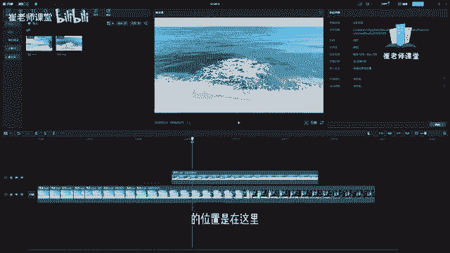
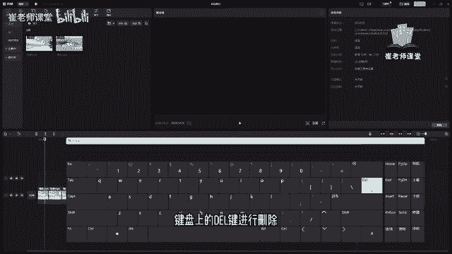
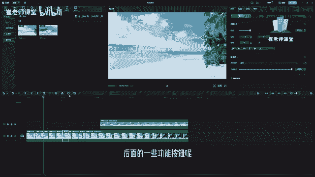

# 【2024版小红书体运营教程】全B站最良心的小红书开店运营教程！小红书体开店 起号真的快，赶快点赞收藏起来 - P15：13.选择 分割 撤销 恢复 删除 工具的使用 - Sathenay - BV1uqHreLEER

给大家介绍一下时间轴当中的常用的功能按钮，在这里呢可以选择当前的选择按钮，快捷键是A，单击之后呢，你会发现它类似于我们平时使用的鼠标的指针，选择工具呢，可以对当前的素材库。

或者是时间轴当中的素材呢进行移动调整，选择或者其他操作，另外呢可以在这里选择分割按钮，快捷键是B，单击之后呢，你会发现鼠标指针变成了一个，类似于刀片的形状，移动到时间轴之后，会发现有一个黄色的线条。

可以选择当前帧的位置，对当前层进行分割，单击可以进行分割操作，这两个工具按钮呢，可以按住AB快捷键来进行快速切换，紧接着呢还有向左全选以及向右全选，我们下节课来重点讲一下。

还有一个最常用的功能呢是撤销按钮，单击之后呢可以撤销上一步的操作，这个按钮呢也是经常使用的按钮，快捷键是CTRL加Z，这个快件呢需要大家熟悉的，那么为了照顾零基础的同学呢。

我们来说一下CTRL键在哪里呢，你们可以对应着自己的键盘，可以在左下角的这个位置就能够找到CTRL键，比如说对当前分割，然后可以按住CTRL键加Z键进行撤销，右下角的区域呢也是CTRL键。

一般的键盘上的CTRL键有两个进行相互对应，因为在这里使用的是windows的屏幕键盘，但是真实当中，我们使用笔记本或者是买的键盘的话，一般的CTRL键都会在这个区域啊，可以进找到。

如果你使用的是Mac电脑的话，在大多数的情况下，windows的CTRL键是等于Mac电脑的command键，撤销的快捷键是control加Z，那么如果使用的是Mac电脑呢。

可以单击command键加V键，也可以进行撤销，紧接着还有一个常用的工具恢复按钮，单击之后呢可以恢复被撤销的操作，比如说刚刚选择撤销了之后呢，可以单击恢复按钮进行撤销，为上一步的操作。

快捷键是Ctrl shift加Z，shift键和CTRL键一样啊，一般有两个进行相互定义，同学们可以根据自己的键盘来找一下，在这里呢是shift键，比如说选择切割，选择撤销，CTRL加Z进行撤销。

那么如何恢复撤销呢，可以按住Ctrl shift加Z键进行恢复当前的撤销操作，还有呢一个比较常用的工具分隔按钮，这个分隔按钮和这个分隔工具的区别是什么呢，首先这个分隔工具。

大家可以看到它是完全脱离于当前的播放头的，比如说你当前播放头的位置是是在这里。

那么我们就可以对这片区域或者是这片区域，任意一个区域进行分隔操作，那么当前的这个分隔按钮呢，它是依附于这个播放头的，比如说播放头在这个位置，那么单击分隔之后呢，它就会对当前这个播放头的这个区域啊。

进行分隔，紧接着呢还有新增加的功能，向左裁剪以及向右裁剪，下一集呢我们会详细的介绍，紧接着还有一个常用的功能呢是删除，首先啊需要大家切换到选择工具啊，选择当前的层之后呢，可以单击删除按钮来进行删除。

也可以呢使用快捷键删除键，或者是delete键进行删除，我们对应着自己的键盘，可以找一下，在一般在键盘的右上角的这个区域啊，比如说选中当前的区域，然后可以直接按住删除键进行删除。

也可以呢按住键盘上的delete键进行删除。

需要注意的是啊，如果你没有选中当前的区域的话，在这里是没有任何反应的啊，你选中之后呢，它会加粗两边的边框线，会提示当前这个视频的这个片段是被选中的，这个这个呢是需要同学们注意一下，后面的一些功能按钮呢。

