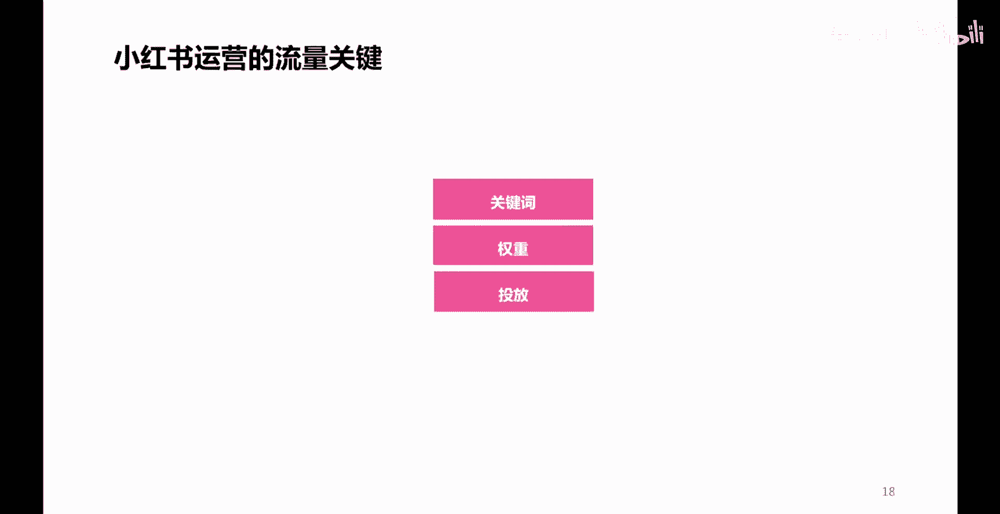
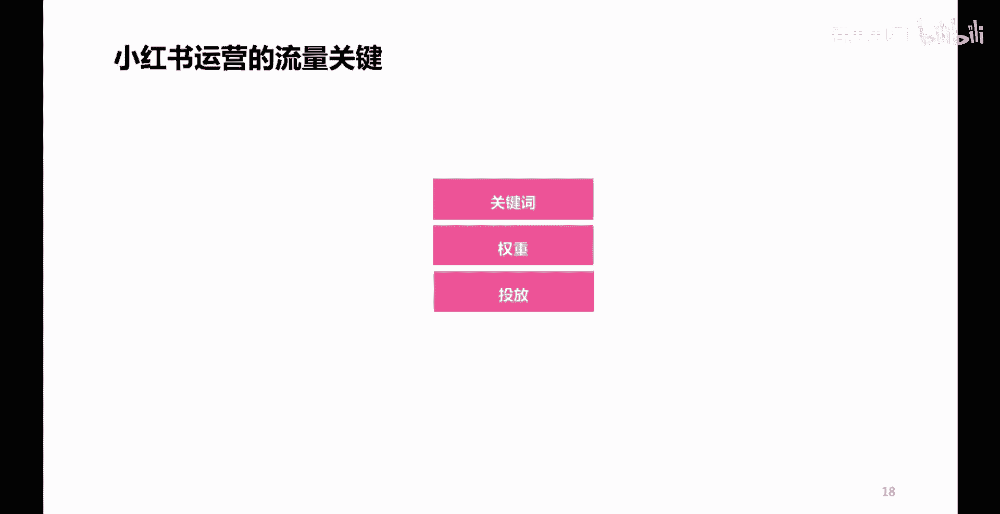
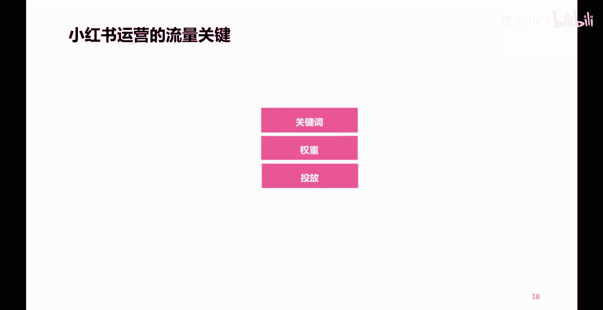

# 【2024版小红书体运营教程】全B站最良心的小红书开店运营教程！小红书体开店 起号真的快，赶快点赞收藏起来 - P15：P14影响小红书流量的三大关键因素 - 春虫虫呀i - BV1hx4y1x7cz

往下看，那么说到底影响小红书笔记内容的一个流量。

关键点在哪儿呢，啊或者说提升流量还有什么样的一些技巧呢。

啊就是这三个点，第一个关键词。

我们在写小红书内容笔记标题的时候。

或者是笔记内容的时候，或者是做图片。

做视频的时候，是否清晰，清晰匹配的体现了我们账号的垂直定位。

清晰地体现了相关的一些关键词，这个非常重要。

第二个是权重嗯，虽然呢有些人说这些账号不存在权重这一说，但是呢我告诉大家。

权重指的是什么呢，指的是你账号的一个活跃度。

你要记住我刚才说的一句话，任何一个平台都喜欢活跃用户。

所以你经常活跃啊。

有规律地去进行内容的更新发布。

一定程度上是有利于你这个效果的一个什么呢，提升的第三个点是投放啊。

大家都知道小红书呢。

笔记呢有一个投放的一个渠道呢叫做薯条，它呢是可以通过付费啊。

通过付费，一定程度上呢可以提高你一个笔记的效果的。

对吧，这个功能叫薯条，大家呢打开小红书啊。

笔记啊，在笔记浏览那个界面右上角有三个点。

点开之后呢就可以看到啊，下面底部呢有一个薯条功能。

它呢是可以付费啊，进行把笔记流量或者是点赞评论这些啊。

做到一个更好的一个提升的啊。

那么这三个点呢，也可以为我们小红书的笔记内容带来一个比较。

哎来说比较是更好的一个效果啊。

获得更好的一些流量啊，更多的一些流量啊。

