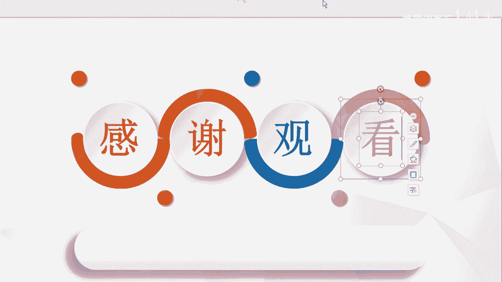

# 【2024版小红书体运营教程】全B站最良心的小红书开店运营教程！小红书体开店 起号真的快，赶快点赞收藏起来 - P15：小红书运营实战课程：从入门到精通系列3 - 听风的歌日记 - BV1mmvDeiENW

大家好，今天这节课呢给大家讲的是我们的小红书，那么首先的话呢，就是我们的小红书的一个热门排名，这个的话呢是重点跟大家讲一下，就是我们小红书的它的一些呃热榜，给大家先打开一个账号，我们的百度账号。

我们首先来去百度上面，去360上面去搜索一下，搜索一个小红书给大家看一下，呃我不知道大家呢有没有去平常去，就是去看一下，就是我们小红书的一些东西，那其实小红书的话呢。

它是最主要是以就是年轻化的一个方式去，主要去去定位的，那么以目前的这个2020年的一个，最新数据分析呢，呃抖音它的这个就是我们小红书，以及他的抖音啊，就是抖音小视频，他的这个定位的年龄段是非常相似的。

也就是他的这个定位段呢，基本是在九五后以及九零后这样的一个，非常年轻的一个群体，那小红书的话呢，一般的话呢，基本上我们都是要通过手机来进行刷取的。

那我们可以看一下它的一个官网里面的，一个社区精选，社区精选的话呢，一般呢它是一些挑选一些他们的不同领域的，比如说像一些嗯护肤领域的，还有一些家居领域的，都是来自于各个不同领域，比较热门的这样的一个领域。

它首先的话呢官网上面呢，它会呃给你摘取一部分。

那如果说你想要看更多的话呢，只能去下载他的app。

就是想要去通过手机端来吸引用户，因为现在的话呢电脑的话，电脑端已经很少有人去用了，所以一般的话呢都是以手机端为先，就像那个咸鱼淘宝是一样的，那么小红书它到底有什么样的一个优势呢，首先呢就是我们的小红书。

它是被称为是海外购物的神器的，那他的话呢在全球是有超过1亿这样的，一个年轻用户，那用户的话呢大多数是以大学生白领为主，而且都是挺有钱的，那小红书的话呢，它是由这个自营跨境电商。

第三方的一个品牌授权或者是直营，那UGC也就是我们的用户创造内容的口碑，来进行分享社区，那三部分的组成的话呢，小红书是在近一年的时间内呢，都是非常的火爆，传闻呢是之前一开始是由范冰冰带火起来的。

那么各大的这个美妆，还有快消品商家以及品牌呢都在疯狂抢占，就是做小红书的这种推广营销，那第二呢我们先来看一下，就是我们来重点去剖析一下，就是我们的抖音热门的一个规则，以及他的一些排名规则。

首先我们先来看一下，比如说我们在小红书里面去呃，搜索就是我们的这个服装，那么我们搜索到的这个商品的这个就是栏目，它是不一样的，就比如说我在第一个里面，我看到的是这个1688的服装探店。

那么第二个呢可能就是一个淘宝的一个的探店，这个的话它是呃不定数的，就像我们在抖音里面去搜索同样的东西，看到的视频也是不一样的，那么小红书的话呢也是呃用的这种方式，首先我们先来看一下。

就是我们小红书的这种各个栏目的，一个用户数据，首先呢，就是我们的是以小红书官方的数据来算的话，美妆和运动来说，那这个类目的话呢用数用户数是最多的，就是代表着美妆，在小红书上面是一个超精准的一个类目。

而且年龄的话呢都是非常的年轻化，都是在20岁到40岁左右，那正好呢是符合我们的消费能力段的，因为这个年龄段的一些人，他是有自己的一个呃收入标准的，也就是它是整个行业的一个消费主力军。

那第二呢就是注册小红书账号，那么小红书的话呢，它是对广告的监控是非常抵触的，曾经呢有出现过这样的一个情况，就是呃，有一个明星在小红书里面去发了一个广告，那这个明星的话呢，他的旗下下面的一个用户粉丝。

粉丝数呢是已经达到了是几10万的，因为当时是才才就是进入的这小红书，那小红书的话是直接把他封号了，也就是说呢，小红书他是不管你是明星还是普通人，只要你去发广告，他都会去进行封号。

所以的话呢我们在注册之后呢，第一步呢就要去完善我们的个人资料，把我们包装成一个完整的人，因为只有你把自己做成这个这样，一个普通的用户，他才会不会去封我们的账号的，那么第三呢。

就是我们如何在小红书上面去进行养号呢，那么我们在任何的平台上面，对于刚注册的小号呢，都是属于观察区，都是一些没有权重的账号，那么这个的话呢我们就需要在人家的平台上面，去防止大量的营销账号的存在。

也就是我们在新号去注册之后呢，啊我们先进行互动，再养号，再升级，再去做任务，那第二呢就是我们去写笔记的这样的一个，精准的方法啊，就比如说呢我们这样的一个案例，给大家放大一点，看一下，这个里面的话呢。

它的案例的话呢，就是一些分享的是一些母婴用品，那这个母婴用品的话呢，可以看到它这里面是放了一些呃，就是宝宝的一些用品，像奶嘴这些的，然后他这里面还弄了一些特效的一些花瓣。

然后这个里面的话它是有分好几期去做的，而且每次的话呢都会有人去看，其次的话呢像这个封面的话呢，它是把一些宝宝用的一些清单呢是放在上面的，可以看到这里面是有评分的，而且它这里面的标题也是非常的吸引人。

比方说像这个几毛钱一片的尿不湿，一天十几片都不心疼，还有就是一些两位数的这种高性价比的，一些宝宝好物，这些的话呢都是一些吸引人的一些关键词，这个我们都是可以去啊运用得到的，其次的话呢。

就是我们的小红书上热门的一些技巧啊，给大家看一下这个热门技巧的话呢，首先呢就是它的是有一些关键词的，比如说你在这里面去发一些秋季穿搭，比方说家常菜，这个呢都是属于我们的关键词，那么上热门的话呢。

关键词呢也是一个起着非常重要的一个作用的，就比如说我们在笔记里面去搜索关键词，比如说像洗发水，那如果说你想要排在第二位呃，就是我们的排行榜的第二位，那这个时候的话呢，我们就需要用不同的这种关键词。

以及文案去进行搭配，那么第二个部分的话呢，就是需要在我们的文案和标题当中呢，要带一些就是我们发的这些笔记或者是图文，以及我们视频核心的一些关键词。

那第三呢就是我们在我们的图文最后呢，一定要去再去加关键词，也就是重复去做这种关键词，因为他的这个视频啊，就是小红书以及就是其他的一些软文嗯，他的话就是都是以机器去审核的嘛，那么机器的话呢它是比较死。

它只能去通过关键词来判断我们这个账号啊，是不是能够很好用，那第四的话呢就是这个笔记的话呢，他去搜索关键词，比方说是在洗发水的时候呢，如果说他已经排到就是第二名了。

那么这个月的话呢基本就是已经流量很稳定了，那么我们如何去上这个热门呢，首先呢就是我们可以在视频的下方当中呢，可以去啊点击这个点赞收藏评论，或者是一些其他的，比如说转发。

或者呢就是我们在我们的小红书的平台当中呢，可以跟一些就是置顶的这样的一个评论，去进行互动，还有我们还可以去跟一些大的一些大，小红书的一些大V嘛进行一个互动都是可以的，那第三呢就是小红书的账号呢。

它也是可以按照等级以及发布的这个，笔记的数量来判定我们的这个权重的，那其实今天的这节课很简单，就是给大家讲的是我们的小红书，如何去上热门的一个技巧，那么也是呢，感谢大家的这个这节课的一个观心观看。

