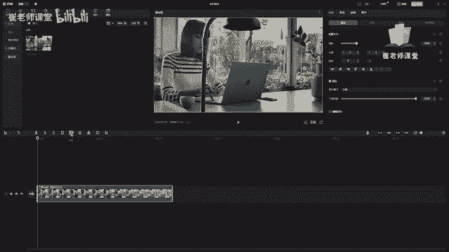

# 【2024版小红书体运营教程】全B站最良心的小红书开店运营教程！小红书体开店 起号真的快，赶快点赞收藏起来 - P16：14.定格 镜像 旋转裁剪工具的使用 - Sathenay - BV1uqHreLEER

在删除按钮后面呢，使定格工具，定格工具呢，可以在时间轴中自动生成时长三秒的定格素材。

注意啊，生成三秒的定格素材，它是以播放头的位置作为参照的。

选中播放头到合适的位置，单击定格工具。

它就会在后面自动生成时长三秒的定格素材。

给大家看一下，我们也可以拖拽素材来调整合适的时间。

紧接着镜像工具选中之后呢，素材画面会沿着水平方向进行反转。

选中当前素材。

然后呢在这里单击镜像工具，它会沿着水平方向进行反转。

就像平时照镜子一样，可以根据需求来进行调整。

还有旋转工具，旋转工具呢，可对被选中的素材画面进行旋转操作。

单击再次单击呢，它是以顺时针来进行旋转。

每次旋转呢它是以90度为单位。

可以在这里能够看到详细的旋转度数。

在这里调整也是一样的，然后进行旋转也可以呢。

在播放面板上面直接使用鼠标按住之后呢。

也可以进行旋转的操作，当然和之前给大家讲的详细面板，在这里设置旋转也是可以的。

紧接着呢是裁剪工具，单击之后呢，就进入到了裁剪工具的对话框，来进行对当前视频进行裁剪操作，大家可以发现在这里呢有八个白色的小点，我们可以拖动任意一个小点，来来对当前视频的裁剪比例进行调整。

拖动白色小点范围内的这片区域呢，可以进行移动来选择自己想要裁剪的范围，需要注意的是，默认的裁剪比例呢是自由，下面给大家提供了几种常见的裁剪比例，有一比一，三比四，四比三，16比九，九比16。

我们可以单击来进行选择常见的视频比例，也可以呢选择好常见的视频比例之后呢，进行拖拽来选择裁剪得或是位置，在这个呢可以移动时间滑块来进行浏览，当前视频的时间，然后可以根据视频来调整裁剪的位置。

紧接着呢在这里啊可以调整旋转的角度，可以对当前滑块进行往下往上来调整旋转角度，也可以呢直接在这里输入数值，如果想要精确的去调整旋转角度的话，可以在这里选择向上向上增加一度，向下增加一度等等操作。

如果对当前视频裁剪不太满意呢，可以选择重置单机，就返回到了当前素材的默认样式，然后可以再进行裁剪操作，如果对当前视频素材裁剪完成之后呢，可以单击确定按钮就可以裁剪成功。

