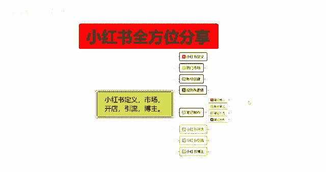
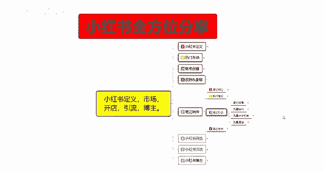
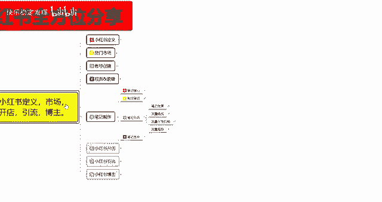
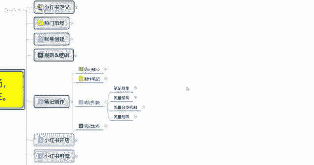
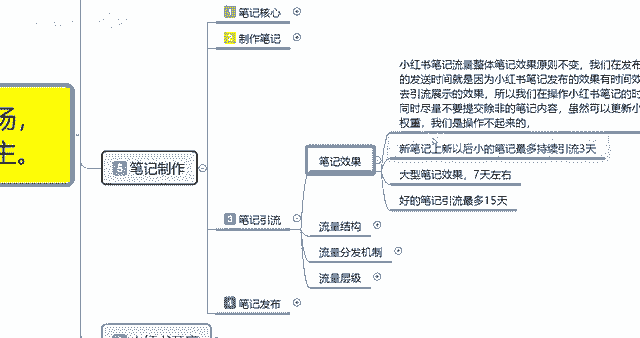
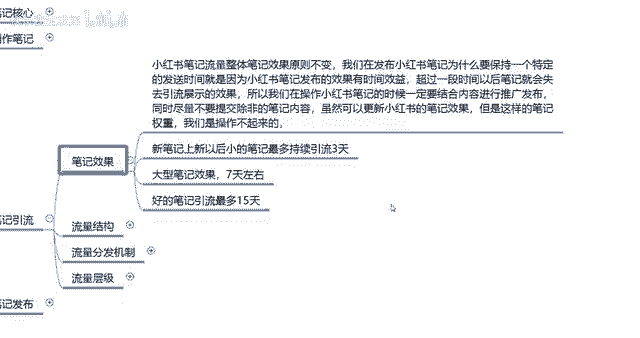

# 【2024版小红书体运营教程】全B站最良心的小红书开店运营教程！小红书体开店 起号真的快，赶快点赞收藏起来 - P16：14.小红书新账号笔记制作（8） - 快乐稳定发挥 - BV1AbtoebEjX

大家好，今天给大家分享的是小红书全方位的分享，第五大课时，这节课呢主要给大家分享的是笔记引流，这个笔记引流和制作笔记里面的一个引流，笔记是不一样的。

大家不要把它弄混了，笔记引流的话，它是我们整体笔记制作完成以后。

获得的一个效果，名字相近。

但实际意义和实际的一个理解的话，是完全不相同的。

我们先来了解一下啊，笔记引流里面，他可以就是说我们每次做完一篇笔记，发出去以后，可以获得什么样的一个效果啊，这个就是笔记引流的一个整体，这点呢我是给大家把它分了四个点。

我们先来了解第一个笔记的一个整体实际效果。

什么意思呢，就是说小红书笔记流量整体的话，笔记效果它基础的原则就是呃系统读取原则，它是不变的，我们在发布小红书的时候，笔记为什么要保持一个特定的发送时间，就是因为小红书啊笔记发布的一个效果。

他有时间效应的，超过一段时间以后呢，笔记会失效，失去引流的效果，也就是小红书系统他不主动给你推荐啊，推荐额外的一个流量，就是没有曝光了，你的其他曝光的话，就需要全部需要你的那个笔记排名和关键词。

搜索排名靠这两个，然后看你的账号整体排名，来给你增加这种流量的话呃，除了搜索，还有那个，关注收藏去找你，其他地方的话是看不见的，也就是说你没有官方流量的一个副词了，所以说我们在操作小红书的时候。

笔记一定要结合内容进行推广发布，同时呢尽量不要提交，除了非怎么怎么说呢，就是说除了你自己和自己相关，你比方说你做网红，那你就只能推你自己经常发的那些内容，你要做商品，那你就只能推广商品笔记。

或者说是引流笔记，就是经常发的这种类型，不能推广其他类型的一个笔记，你如果说推广其他类型笔记的话，呃系统第一个没无法判断，第二个给你的一个基础流量曝光不高，第三个你的整体点击率下滑以后，系统会给你降权。

也就是说他本来是给你1000，马上要升到1200了，他你下一个笔记发的，和你之前发的笔记内容不一样，他可能就给你降到七百八百或者是900啊，就会给你减，慢慢的进行减少。

所以说你如果说发相同类型的一个笔记的话，他会慢慢的增加，这是基础曝光量，然后这个小葫芦笔记我们发出去以后的话，它整体的一个笔记效果是有时效性的，什么意思呢，就是说新笔记上新以后。

你我们的账号他都是有权重的啊，你信号也有权重，老号也有权重，你超过做过使用过自己，有就是正常浏览观看过的账号，他都是有权重的，权重的话他把你分社区，分完社区以后的话，分类型类型就是你经常观看的是呃。

这个社区里面什么样的一个产品，这个产品的一个范围大概在什么地方，基本上的话，小红书他会给你的账号定位3~5个目标，正常的话只有三个，除非你看的特别杂的话，他会去把他就会把你分为五个群体。

但是基本上都是三个群体左右，就比方说你看的女装美食，还有那个汽车装饰品，那他就不会给你去推什么沙发呀，皮垫之类的这些东西，额也不会给你推医药用品，他只会给你展示三个主类目的一个产品。

如果说你经常观看一个类目的产品，他就只会给你推一个同样的，我们的笔记发布以后的话，你所引流的也是针对于这个方面进行拆分，那你每发送一篇笔记，一篇笔记，它只能持续三天，新账号只能持续三天，这三天。

如果说你引入到了其他渠道的一个流量的话，那你觉得你的这个笔记发出去有效果吗，对不对，它整体效果的话你就会大打折扣，你本来是发的是一个食品类的一个，然后你自己的兴趣选择是三个食品服装呃车展。

然后你发笔记本来发的是食品性内容系统，直接给你判定你最近经常观看汽车车载内容，他给你发过去，那你这篇笔记就是白费，就基本上就没有，不会给你带来什么样的一个点击效果啊，这个大家一定要弄清楚啊。

然后新笔记上新以后最多持续引流三天，根据你的账号权重来判断，有的笔记它可能会达到七天，最高的话也就是15天，两周，14天到15天左右的一个流量，而且这一个整体的话他还要根据你账号权重。

你自己的笔记引流质量，还有你的点击率，也就是小眼睛的数量，正常1000的曝光的话，你最少要有13%到15，你才能进入到第七天左右的一个引流，你超过20%或接近25%以后，你才能达到四五天，当然了。

你前期权重不够，你的笔记就算点击率到达了20%，你想把它做到15天的一个引流效果，也没太大作用，因为你的基础曝光量就那么多啊，给你推15天，每天给你一两千，一天涨个几十个，那你最多的话也就是说小眼睛。

也就达到500~700左右，你还要根据账号权重来的，所以说这个笔记引流效果里面的话，你不能光看只看一点啊，就是说每一篇笔记他最多给你推三天，然后我们一个账号里的话，就说你发布笔记以后。

一个账号每天基本上就是两篇笔记就够了，不能超过五篇，超过五篇就没权重了，最多两篇，而且每篇笔记的间隔时长，发布时间呢要三个小时以上，你的鼻翼引流效果才能达到最大，你包括商品笔记也是一样的啊。

商品笔记内容笔记和引流笔记，他们都是一样的，都是按照这个规则模式去走的，这个呢就是笔记效果三天的笔记，你数据做好了，你下一篇笔记发出去，他才会给你引流七天啊，当然了，如果说你的数据非常不错的话。

他也会给你强制性推广七天，但是七天以后的话，他就相当于是呃之前跟大家说的，你这个笔记发布出去以后的，除了靠搜索啊，靠其他的这个时间段一过，你就算这个笔记本来之前，已经报了2万到3万了。

然后你的账号里面的话有一定的粉丝量，他还会慢慢的增加悬疑，但超过这15天以后的话，他基本上就不会给你，再不会有自然的一个推广小眼睛了啊，这个大家一定要弄清楚啊，有好处有坏处，坏处就是对，怎么说呢。

对小红书这种大型店铺有做过一段时间，有规划的，有很大的影响，好处就是对于新手来说，这种方式的话，就是说会删除很多不必要的一个信息量，第一个是节约小红书，它系统的一个内存，就是说。

因为每天他发放的笔记都是几十上百万篇，那他这里面笔记有好的有坏的人，你一个人能看多少呢，你看不过来，他就把你分为社区，社区以后的话，他再把剔除掉，那些没有用的或者重复过多的一个笔记内容，以后的话。

剩下的就是精致的，他要提高他小红书平台自己的一个平台，人气和知名度，那他就得挑选精致内容进行流程，如果说每一个笔记基本上三天以后的话，你的留存只能在你自己的账号里面，它不会在大后大的一个后台数据里面。

再也是在垃圾场，需要去靠搜索才能把它搜出来啊，所以说有些东西的话，你们自己一定要了解，不是说你小红书你刚开始做笔记发布以后，你觉得没什么效果啊，今天发了，然后连续有三天流量，第四天没流量了，是什么情况。

自己都弄不清楚，就是因为你的笔记，你的账号全做，他只给你引流三天，所以大家一定要把这些东西弄清楚，那这一节分享呢就给大家分享到这，就是说笔记发布以后，你们一定要清楚他的一个时间效应啊，不要盲目的。

因为账号创建以后啊，笔记发布以后，没有什么十字星的一个小眼睛增长，这里面都包含因素是非常多的，但是最重要的就是时间效应，三天七天15天。

