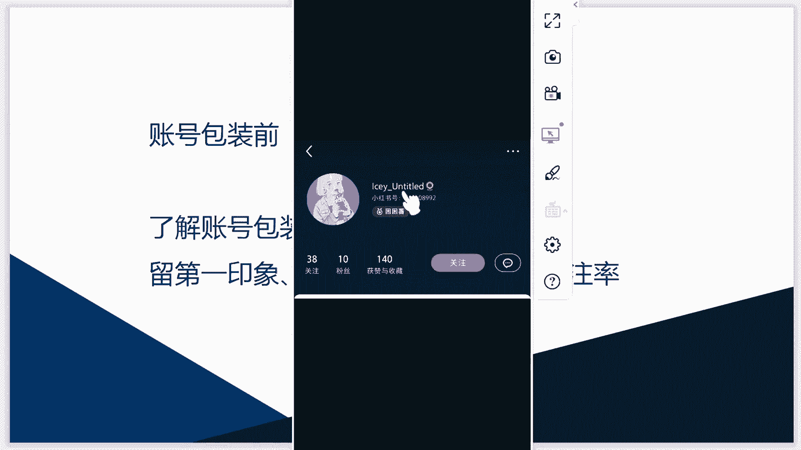

# 【2024版小红书体运营教程】全B站最良心的小红书开店运营教程！小红书体开店 起号真的快，赶快点赞收藏起来 - P16：小红书运营实战课程：从入门到精通系列4 - 听风的歌日记 - BV1mmvDeiENW

大家好，这节课呢我们要给大家分享的课程内容，是关于，如何在小红书当中来做好一个包装和定位，那么这节课我们将从以下的四个方面来说，首先我们谈到包装定位呢，就要提到我们的一些在包装定位之前。

所需要做的一些工作，那么第二点呢，就是关于企业账号的一个包装方法，第三就是关于个人账号的一个包装定位方法，第四呢就是我们引流账号的一个包装定位方法，那么在这里面在我们做这些包装定位之前呢。

首先就是要了解关于我们包装定位的一个好处，那我们都知道现在啊我们初次见一个人的时候，都是通过他的一个外貌，来判断这个人给我们的第一印象，所以说在这里面呃，他的一个第一印象就显得非常重要。

就像我们去见一个非常重要的客户，那在见客户之前呢，肯定都要通过呃自己的一番精心的打扮，这样才会给我们的用户来留下，一个比较好的一个印象，那么在这里面给小红书做账号包装，也是一样的道理。

那就是为了给我们的用户来留下，非常好的第一印象，那么在这里面我们可以给大家来看一下，关于我们的这个小红书，那这个呢就是在小红书当中。

给大家截取到的一个啊用户。

那么在这里面可以看到在他的这个主页当中，他的这个啊昵称，那我们从他的昵称可以看出来，他是做哪方面的这个内容的呢，我们可能不会知道，而且在他的主页当中，它的一个啊封面，这些图呢做的都是啊不是太美观。

只有一个它的这个头像，那么整体看上去呢给我们整体的观感，就是啊给我们所传达的这些信息是不明确的，那么在他的这个账号当中，对于这个哦图片这个美感呢，我们也是啊体会不到的，所以说在这里面呢。

这个呃他留给我们的第一印象可能就不会啊，很好，那么假如我们在这些啊，包装这些账号包装的时候做得很好的话。

那么我们可以给大家来看一下，那么这三个呢，就是对于我们的账号包装做得比较好的几个哦，在小红书上面的几个账号，那第一个可以看到我们的这个后古旅拍，那首先从他的这个昵称，还有他的头像当中。

就能看出他是一个做旅拍的这么一个账号，还有从他的一个个人的简介当中，可以看到他的这个呃调性呢是比较的年轻，个性和潮流的，而且他的一个啊主要的这个作用，主要的一个啊用途就是用来拍婚纱照。

那么在他的啊这个背景当中，也是啊添加了一个婚纱照的照片，那通过这一个简单的这个展示呢，就可以看出来它的一个账号的整体风格，一个整体的质感是一个怎么样子的，那我们的用户如果通过你发布的一篇笔记。

来点进到你的主页当中，看到了这么一个漂亮的一个啊账号的简介的话，那肯定就会啊对你进行一个过多的关注，那如果进到你的主别当中，看到我们所传达出的一些内容，是自己比较感兴趣的。

那肯定就会对你进行一个点击和关注，那么我们这个后古语拍做的是比较好的，那同样的我们的后两个账号呢做的也是比较好，他们也是根据，也是我们的在这个婚纱摄影这个领域当中，做得比较好的，那我们可以看到啊。

这个come on，这个摄影它也是啊这个背景图呀，头像呀，还有他的昵称呀，都是非常明确的传达出他账号啊，所做的一些东西，还有我们的这个克洛伊婚纱摄影，那他呢也是啊比较好的。

我们可以看到在他的这个啊背景当中，在他的背景图片当中，还有这个更懂你的美，那在他的啊这个简介当中，也是填写了关友们克洛伊所传达出来的，一些品牌精神，所以说呢，这三个账号给我们留下的第一印象。

都是比较好的，我们都是比较的喜欢这些啊，很漂亮的这些主页，那么好的，好看的这些主页呢都会给人啊眼前一亮的感觉，而且再加上我们亲戚的昵称，一个头像的啊，和我们昵称相互这个配合，来给出的一个明确的这个定位。

那简介与定位相呼应，那整个账号传达出给我们的感觉，他就是在这个领域当中是比较专业的，我们是啊比较幸福的，所以说这个就是我们想要做账号包装定位的。

一个啊必要性，那么接下来就是对于我们账号定位的一个概念，那很多人都在说要做好我们的账号定位，要一定啊，把我们品牌的一些好的东西传达给我们的用户，那么在这里面对于账号定位的一个概念，它到底是什么呢。

那么在这里面给大家说的两点，第一点就是我们要在我们自己所从属的，这个范围内，这个领域当中来进行创作，那第二点就是要追逐要坚持垂直度的一个原则，那么在范围内进行创作呢。

大家很好理解，就比如说刚才我们给大家举到的这几个例子，那他呢都是在啊这个婚纱照拍摄这个领域当中，那他就是啊对于我们这个领域来进行一个。

内容的输出，那第二点这个垂直度原则呢。

就是在我们的账号的这个啊所传达的这些定位，我们要在这些领域当中来进行一个呃内容的啊，不断输出，要深耕于我们这个领域，它的垂直度是一定要强的，那么除了这个，我们给大家举到的这几个例子之外呢。

在小红书当中做的比较好的。

这些账号还有很多很多，那么大家呢也可以在小红书上面来进行一个啊，比较好的，做的比较好的账号的一个啊，这个找寻来模仿一下，来把自己的账号做得更好，那么这个还是关于我们账号垂直度的一个概念。

它是指我们的账号啊只专注于一个细分领域，只把这个是只专注于一个细分领域，要把这个用户群体来进行一个拆分，那做到垂直且专注，一定要在我们的这个所从属的这个领域当中，做到啊专业程度比较好的这么一个地步。

那我们的用户才能对于你这个账号产生一个啊，想关注，对你的账号进行一个关注，那么在这里面给大家举到的啊，关于账号垂直度的这几个例子呢，可以看到我们的第一个给大家举的例子，就是关于我们在这个呃读书这个方面。

他所做的这个账号，那我们可以看到他的一个名字呢是疏影，他的一个头像是疏影，那他的一个账号昵称是疏影知了，那他的一个简介就是关于啊读书，读书读书都是关于一个书本的读后感。

还有关于我们对于书本的知识的一些领悟，一些解读等等，那他在这个领域当中就是啊比较的内容度，比较的垂直，那这个呢是关于我们美妆的一个领域，那可以看到在他的这个简介当中，也可以一眼就能看出来。

他是从事于啊美妆这个领域的，是美妆的一个爱好者，那在他的一个内容的分享当中呢，也是关于啊美妆的一些相关知识，那在美妆的这个领域呢，它的这些内容输出呢，也是围绕着这一个话题来进行展开的。

那么除了我们这些之外呢，还有我们的啊这个萌宠这一类，那这个账号就是我们的萌宠部落，那在他的账号当中也可以看到，也是关于我们萌宠这一个大类的一个内容分享，所以说从这一个啊账号垂直度可以看出来呢。

我们也给从三个账号当中也可以看出来，对于我们啊账号的垂直度，如果做得比较好的话，也可以把我们这个账号打造成一个，行业内比较专业的啊，比较好的一个账号，那这样吸引的这些粉丝呢也是比较多的。

那从这个账号可以看到36。30。60000，47。3万，还有我们的六点，还有我们的6万等等，那他的这个粉丝度呢，都是粉丝的数量呢都是比较好的，所以说对于我们的账号垂直度，还有我们的这个账号的一些。

在范围内进行一个创作，这两个方面呢，大家是啊要做我们的账号定位是要首先明白的。

那么这一节课呢就是主要的给大家来说了一下，关于我们在做账号包装定位之前呢，首先就要了解到我们关于账号包装定位的，一个好处，就是可以留下一个好的第一印象，对于我们账号的一个展示，来增加我们的这个关注率。

那么在这里面也给大家举到了比较好的。

这个小红书账号首页的一个展示的情况，那么除了这个之外呢，还有对我们账号的一个定位的一个概念，给大家进行了一个简单的一个说明。

那么对于这些呢我们的账号定位方面来说，首先就是对于我们账号的垂直度一定要做好，那么这节课就是主要的给大家说了这么多，在下一节课当中呢会给大家来介绍一下，其他的几个方面，就是关于我们的啊企业账号。

个人账号，还有我们的引流账号，在我们的包装定位方面所需要用到的一些方法，那么这节课呢就是暂时的给大家分享到了，这么多，那也欢迎大家来持续的关注一下，我们下节课的课程在这里面呢。

啊希望大家可以通过这节课的知识点，会对于我们账号的定位包装，有一个呃大概的一个了解。

那么这节课先到这里。