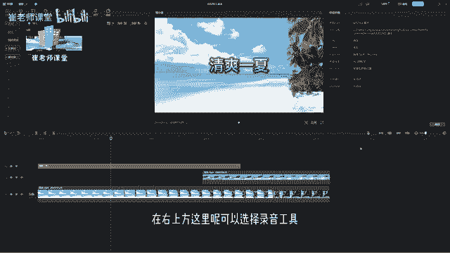
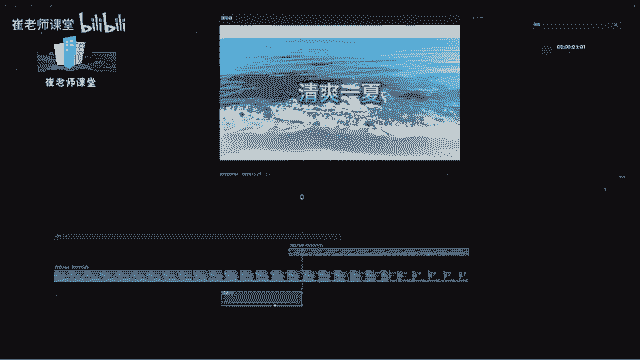
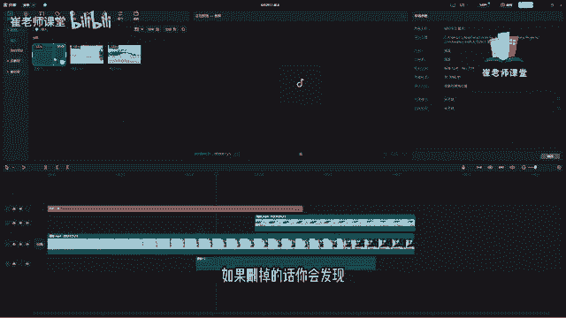
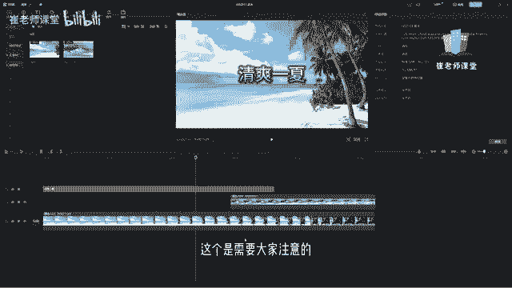

# 【2024版小红书体运营教程】全B站最良心的小红书开店运营教程！小红书体开店 起号真的快，赶快点赞收藏起来 - P17：15.录音工具的使用 - Sathenay - BV1uqHreLEER

在右上方这里呢可以选择录音工具，单击之后呢可以对当前录音工具进行设置，红色的按钮呢单击可以进行开始录制，下面的区域呢是显示当前输入设备的状态情况，如果当前输入设备能够正常的使用的话。

上面会显示当前音量的波形，大家可以在设置的时候可以在这里进行测试，如果你发现当前的输入设备，没有办法正常的运行啊，就是在这里啊，没有办法直接进行显示，你说话的时候会显示波形，如果没有的话。

可能是你的输入设备没有选对，在这里单击可以选择当前的输入设备，因为每个人的电脑情况不同，输入的设备显示的名称也会不一样，大家在这里啊找到自己的电脑上面的输入设备，如果你有外接声卡的话。

在这里可以找到当前的声卡，也就是线路，然后进行测试一下，当前的输入设备是否能够正常运行，可以在这里看到当前的波形能够正常显示，就说明当前输入设备是完全可用的，然后在这里呢可以调节输入的音量。

就输移动滑块，可以调整音量的大小，也可以呢，在这里直接输入数值，数值越大，输入的音量也就越大，数值越小，输入的音量也就越小，这个是需要大家注意一下，也可以在这里选择单击上下箭头来进行微调。

在这里呢可以选择回声消除，可以进行勾选，也可以进行取消，开启之后呢，将避免扬声器产生的回声问题，扬声器呢在这里重点的是纸巾箱，如果你没有戴耳机进行录制的话，会多多少少的会有一点点回声。

在这里可以选择回声消除来进行消除回声问题，在这里呢有草稿静音，开启后呢会将声音片段所有声音进行关闭，因为在使用录音工具的时候，大多数的情况下都是进行后期配音的工作，所以呢将草稿静音呢。

可以能够让我们快速的能够进入状态，大家可以根据需求进行选择，打开或者关闭，在这里可以单击开始录制，他会进行倒计时，来给我们三秒的时间准备录制单机，还会进入三秒倒计时，然后呢。

单机结束按钮可以结束录制，也可以呢，按住空格键也可以进行结束，大家会发现录制结束之后呢，在下方的区域会建立一个音频的层，我们选择关闭之后来进行看一下，一般录制的情况，会在这里会显示当前录制的波形。

但是你会发现在这里为什么没有波形呢，明明说话了呀啊因为我连接的外接的声卡，而且用的这个录屏软件它没有办法显示啊，有的时候显示，有的时候不显示，在这里大家需要知道一下就好了啊。

在这里一般的话我们录制的时候录制成功的话，肯定会有波形，咱们可以在这里进行拖拽，上下拖拽或者往下拖拽来进行调整声音的大小，默认的话一般默认的音量是0dB啊，dB呢是音频单位，后面会详细的给大家讲啊。

这这样的话就对当前的音频进行录制成功了，大家可以看到录制完一个音频之后呢，会在草稿箱里面显示当前录制的音频，需要注意的是，你不要把这个草稿箱里面的，这个音频文件给删掉了，如果删掉的话。

你会发现单击确定删除素材，当前的音频就没有了。

