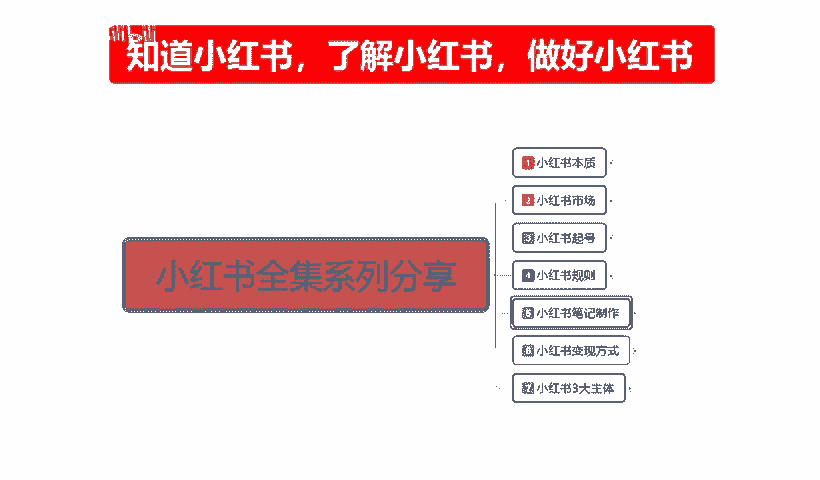
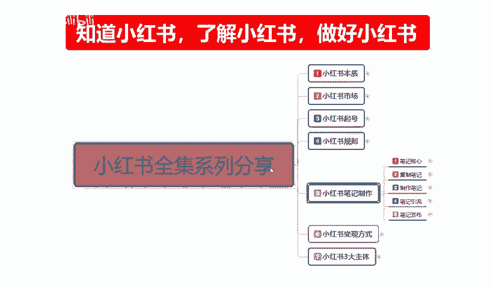
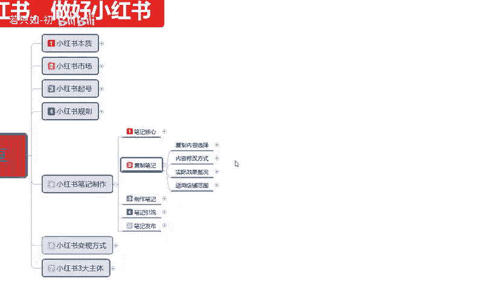
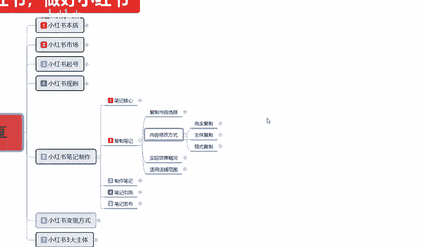
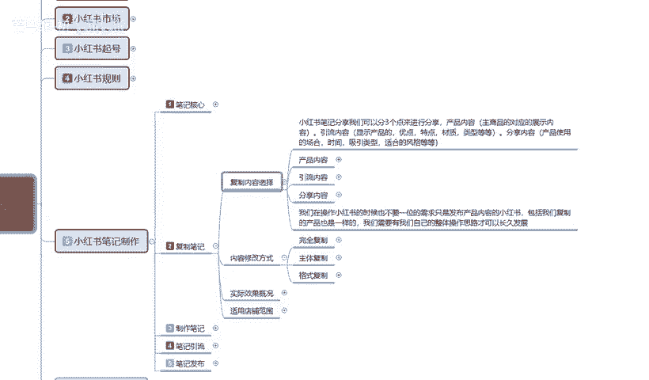
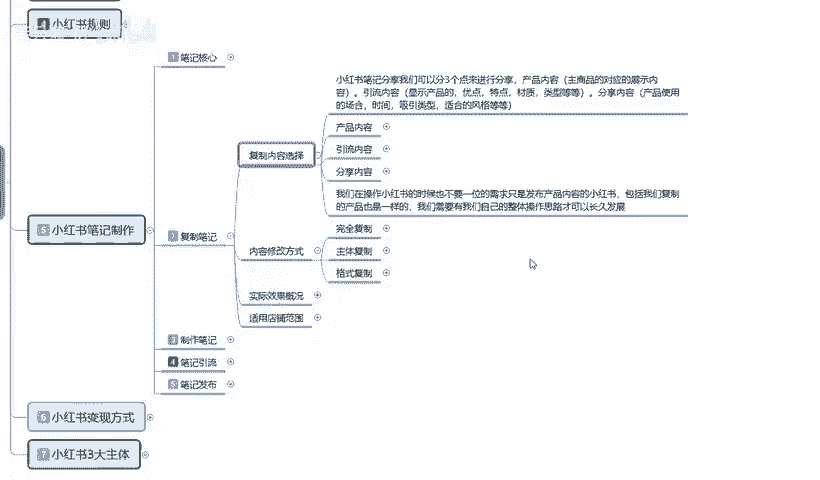
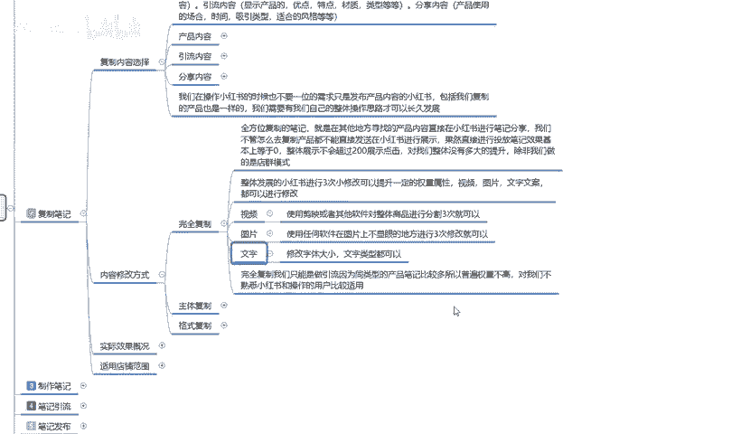
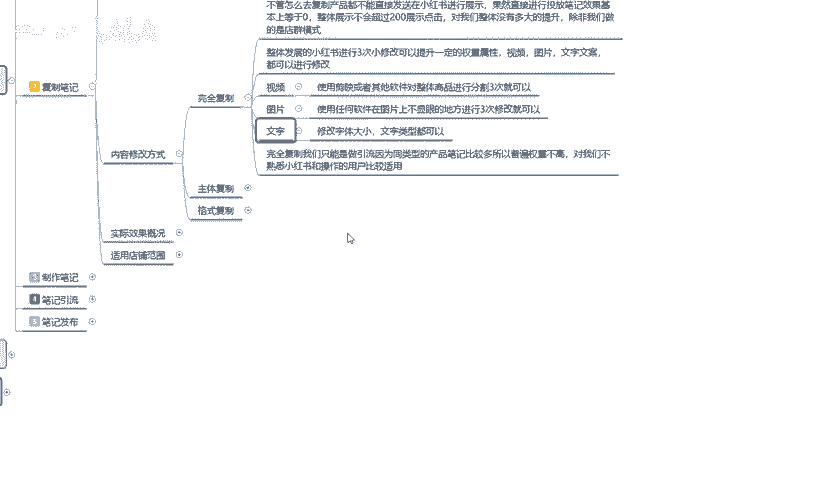
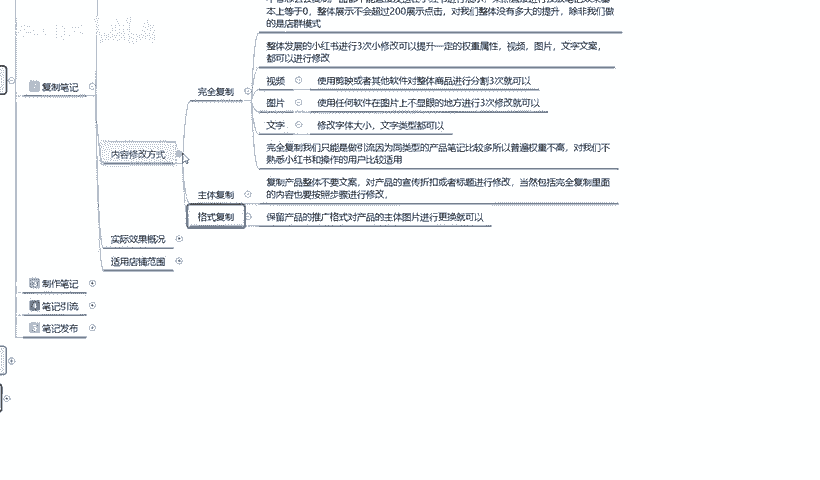
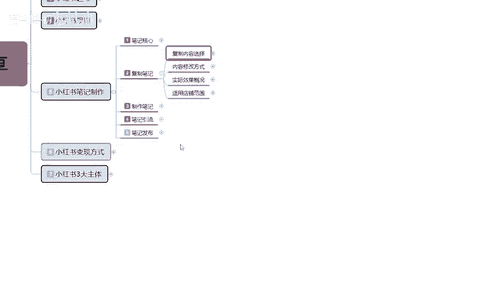

# 【2024版小红书体运营教程】全B站最良心的小红书开店运营教程！小红书体开店 起号真的快，赶快点赞收藏起来 - P17：16、新手小红书运营-小红书复制笔记：引流内容 - 若只如-初 - BV1MM4m1274h

大家好，今天给大家分享的是小红书全集系列第五大课时的小红书笔记制作。

啊，当然了，这一节课呢也是。

父子笔记的第二个内容，应该说是第三个内容。

内容的一个修改方式。呃，包括之前呢给大家讲解的呢，我们都是。啊，一步一步来进行讲解的这一节课呢也是结着结合我们上一节课的一个内容进行下面的一部分的讲解。

上节课呢主要说。是给大家进行了一个。

我们内容复制啊所需要选择的。产品内容引流内容以及分享内容。给大家进行了一个分享。这些呢主要呢就是。我们在内容选择完成以后啊，对于内容进行的一部分修改。这里呢我也给大家案列了三个点。第一个呢就是完全负责。

第二个就是主体负责，第三个是格式负责。

这三个点他们有什么区别呢？首先我们来了解一下什么是完全复制啊。完全复制的话就是整体发展的小红书啊嗯进行就是对小红书整体发送的一个笔记进行。三次的一个小修改啊就可以提升它的一一定的权重属性，包括。

怎么说呢？就让系统判定我们重复的。内容发布的一个。笔记内容在系统整个小红书平台系统里面不是那么过多啊。只需要呢对我们全完全复制过来的一个产品。你比方说你从1688上面拿货。

或者说从抖音上面截取的别人的资料，把资料复制过来以后进行三次的一个小修改就可以了。这里面的话它就是包括我们的视频也好，图片也好，文字文案都可以进行修改，只需要修改三次就行。首先呢是视频。

视频的话就比较简单了，你用手机修改也行，用电脑修改也行。一般的话呃前期操作，你为了方便的话，我们都是用电脑。但是你用手机修改的话也是一样的，下个简辑就行。

或者其他的一个剪辑软件对整体商品就是把我们的这个笔记，你要修改的内容。如果说是视频。你把视频放上去，放到简易里面，你把它的格式啊，在这个里面的话，我因为这个的话是非常简单的。大家随便说一下。

基本上都有这样的一个类似教案，我就不交了。就是你只需要把它进行三次分割就行了啊，别的都不用操作，你什么抽增啊之类的。太复杂操作，你们也不需要去操作了啊，只需要把它进行三次分割。

基本上就不会有太多的一个重复量。就是把一个整体的视频把它剪切成三段。就行。啊，就是让系统去识别我们的时候。嗯嗯。怎么说呢？就是我们要欺骗小红书的一个系统。因为小红书它所有的内容的话，它都是按照你的。

发布的笔记发布的视频啊，他都是按照读秒读帧里视频里面的内容进行区分的。我们把它。一个完整的视频，把它分成三段。分解。然后再组合再发上去的话，它在里面的话，我们就会多一些操作的痕迹。操这个操作的痕迹的话。

说实话就算有5万个、10万个同类型的一个产品。我们在去操作的时候，只要进行了这一步动作，我们最少可以排除90%到95%的一个重复数据量。啊，因为你再次重复，你进行修改过，再次重复的一个概率。

它是非常小的。所以说我们只需要这一点呃，了解这一点就行了。就说我们完全复制的，你也不能说是直接把人家拿过来，然后。你不管是分享也好，复制也好，粘贴也好，拿过来，你直接拿到自己的那个账号里面去发。

第一个它的权重属性本来就不搞啊，它整体本来就没有太大的一个权重属性。我们再这么操作的话，那权重就更低了，对吧？所以说我们拿过来以后的话，为了避免系统对我们进行的一个。常规操作的一个规避。

它系统重复的内容发多了以后，他直接给你屏蔽掉。他连基础的一个属性都不会给你的啊，他还要进行审核。懂意思吧？就是说我们把它修改以后的话，你就可以。随便修改一下啊，就可以进行发送。

它的一个整体效果量的话还是有，但是不多。第二个就是图片同样的一个操作啊，使用任何的一个图片软件。你不行的话，你拿个截图，你把它截下来，你再放上去，都比你直接把别人的图片给抠过来哈。

然后放上去效果要好得多。呃，在不显的地方上面，你拿个图片修改器。随便点两个小黑点，点两个小白点在上面。基本上我们拿肉眼去看的话，是判判断不出来的。他只有说是通过系统。电脑的后台扫描系统才能百分百还原。

进行修改和视频一样，他也是说。改完以后啊，只需要2到3次的一个操作，排除95%的竞争对手啊。文字同样的，比是说文字它更简洁一点啊，我们把文字复制下来，把文字的字体改一下，文字的大小改一下文字的一个。

显示形式、繁体啊、简体啊这种你把它改一下都行。你横着放斜着放都行。你这种文字改的话，比视频和图片的话呃，效果还好一点。虽然说同样的文字，但是它整体展示的一个文字效果大小之类的，这不一样。

它系统判定你就是一个全新接近全新的，比如说同类的一个内容吸引力有没有啊，就看别人发的早或者发的晚，或者说它的一个同等形式下，它的一个。整体规划怎么样，就是看内容了啊，内容不行的话也没用。

完全复制到我们在这个的话，说实话他只能做。引流，因为的话同类的一个产品笔记比较多，所以普遍的话，它本来本身权重就不高。对我们不熟悉小红书和整体操作的话，就是说呃新用户比较适合你拿去做店群呢也可以。

店群的话，你可能直接就复制过来啊，连修改都不用。但是现在做店群的话，小叔叔做店群基本上100个里面看能不能做起来那么一两个店啊，就是100个店里面。一两个有销量，整体来说的话基本上没。

没用好吧。第二个就是主体负责。

主体复制的话，包括格式复制，这个的话其实和完全体复制的话是有区别的。主体复制的话，因为完全体复制我们只需要进行小的一个范围修改。整体一个笔记文案的话，我们花个一两分钟就能解决。但是主体复制的话。

它就不一样了啊。主体负责什么叫主体负责呢？复制产品整体不要他的文案，文案我们自己去编对产品的一个宣传和折扣，或者说标题进行修改。就是我把他的图片文案进行的。仿超过来以后，我们再对他进行一个小范围的手术。

把对我们有用的留下啊对我们没用的把它修改掉，把我们自己的产品的一些内容放上去。就可以了，或者说是我们把它的标题也给改掉。尽量的话就是不要重复。你如果说想蹭他的流量啊。你用完全体复制就行。

你不想称他的流量。你只想要它的一个文案格式，包括它的视频的录制方法。视频的话可能你们使用完全复制多一点。主体复制的话呃比较适用于图片和文字。因为你去做视频的话，你没有有些东西没办法操作。

别人视频是一整套完全的系统下来的。啊，主要的话就是针对图片和文字，而且小小红书里面。文字文案的一个描述和图片文案的一个描述占比在超过85%。反而视频没有那么火，视频的话一般都是抖音比较火啊。

最后一个呢就是格式复制。格式复制的话，这个怎么说呢？嗯，就是。不要他的产品。保留产品的一个推广格式，对产品的主图，图片进行更换，保留它的文案，就是它的文案非常精彩，但是它的图片一般。

而且它的图片跟我产品不符。我们把图片换掉，把它的文案，包括它里面的内容。把主关键词。啊，就是我们产品的名称，或者我要宣传的东西进行切换就行。这个呢就是说格式复格式复制。整体的话说实话啊。

内容修改的一个方式的话还是比较简单的。只是说我们不管是。把别人的笔例怎么复制过来，你都要进行修改。你如果说不进行修改的话，它基本上百分之百有重复，只是说看这个重复。

后面是1万家还是2万家或者是10万家的一个产品。没意思吧，就算是你自己的产品。啊，你自己的产品，你对外没有公布过的那种，别人也能找到。说说你对你的产品的话，你。一定要进行修改啊。

这个呢就是这一节给大家讲的一个整体的小红书笔记的一个内容修改方式。它们比较简单，但是实际效果的话还是非常不错的。因为你能避免90%到95%那种店群。呃，因为小红书之前的话，他那个为了上产品。

他有很多店群。店群里面，他不管是自己有货的或者自己没货的，他们会在全国各地自主要是能给他提供产品图片产品资料的，他就能去帮卖。

知道吧？他卖了以后，你帮我发货，赚到钱了，我赚我的，你赚你的对吧？你产品一件赚多少钱，我从我这边我从中间赚赚差价啊，就相当于属于黄牛的一种形式。这个就是店群，而且店群的话它一个店。

可能有1000多款产品。一个人可以开多了，一个人可以开十几二十个。你多了以后，有的做电影群的群体做捐电影群的一般都是一两百个电器部。10两0百个点赞成以以前的他光店铺里面的产品可能都是20万往上走。

所以说在这种情况下，小红书它的系后台系统，但不管它有多发达啊，它的内存空间不够的。他要判断这么多的一个笔记内容发送。我刚刚才只是给大家说了一个商品的一个内容。那商品里面的话，它还有笔记啊。

笔记一个产品按照他们的趋势的话，一个产品一天可以发5次。他虽然说发不了那么多，但是他用格格式批上去操作的话，那20万乘以5次就是100万了。同内部的一个产品。你想想我们有多少竞争，而且这只是一个群体。

淘宝前期那么小红书前期刚开始的时候。它整体的一个用户量的话，就是商家入驻量大概到了20万。那我们算一下你同类的一个产品有多大的一个规模市场，对不对？那么我们避免了95%的一个重复市场以后的话。

我们才有新的一个竞争空间。如果说没有这一步操作的话，我们后续的一个小红书啊，我们想去操作。嗯基本上。做不了的。他这个的话哈模式和以前的淘宝吸取用户进来，就是和十几年前淘宝的一个模式是一样的。

前期我们他做店群的话，可能会赚一部分钱，但是到中后期的话，基本上就是全部淘汰掉了。但是系统又需要他的一部分商品在里面给他撑他的一个整体支架。就是后台支架商品的一个支架，这个支架它又不能撤掉。如说。

他只能把他的。重复的多余的或者说是没有作用的一些产品，一些笔记，一些内容给它屏蔽掉。我们避免这一部分的一个数据量就行。好吧，这个呢就是内容修改的一个方式。

下节课呢给大家讲解一下我们整体的一个实际效果概况，就是笔记复制啊，我们不光要复制他的笔记，我们还了解这个笔记复制过来以后，对我们整个店铺有一个什么样的一个实际效果。

好吧，那这节课呢就讲到这里。