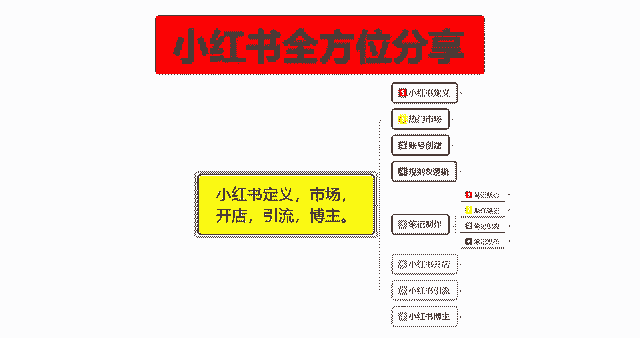

# 【2024版小红书体运营教程】全B站最良心的小红书开店运营教程！小红书体开店 起号真的快，赶快点赞收藏起来 - P18：16.小红书新账号笔记制作（10） - 快乐稳定发挥 - BV1AbtoebEjX

大家好，今天给大家分享的是小红书，全方位分享第五大课时制作笔记的一个内容啊。

这节课的话是给大家讲解一下，我们笔记引流里面的一个流量分发机制。

这个流量分发机制是什么，你们大家一定要弄清楚啊，流量分发机制它是什么呢，它就是一篇笔记，发布之后会被系统拆分为多个标签，然后再推送给最近有同样内容喜好的一个用户，就是系统判定的个人喜爱一篇笔记的话。

你就说不管它是图片还是文案，都会被系统按照标签去区别和理解，它是系统操作的，不是人为操作的啊，因为人为做不到，每天去拆分那么多的一个笔记内容，而且他也会麻木，别人也没必要，也没义务去给你做。

所以说他基本上都是用小红书的一个后台系统，电脑自行计算啊，来去给你判断的，那他这个判断里面的话，他就有评分啊，本质上呢这种啧怎么说呢，就是按照标签匹配以后的，本质上它也是一种内容。

标签与用户标签进行了一个匹配系统啊，然后系统根据用户的一些呃行为规范交互行为，或者说是呃各取所需选择性的内容，给这边笔记打上内部的一个分数系统，给你的笔记打上分数，然后给用户打上分数。

再来决定是否需要推送给更多的用户，这个评分体系的话，在小红书里面被称为cs算法啊，这个CES算法的话，其实呃基础评分的话就是点赞一分，收藏一分，转发四分，评论十分关注八分。

他呢先通过这种基础的一个评分数据，把你的账号给你列一个分数排名，分数排名过后呢，然后再计算你的点击率，互动率，完播率和互动值这四个大点啊，上面的CES是也是一个大点，但是他们是综合性的评分。

通过这五个大点来计算，你的一个账号的一个权重，就说等，但是呢他无论是数据比指标怎么变化，就说小红书他的数据指标随便他怎么变，内容核心算法的话，还是考察笔记带来的一个粉丝交互行为。

就是你和粉丝之间的一个互动，这是最核心的一个因素啊，因为粉丝交互行为的话，他直接反映了笔记内容的一个质量，即便是粉丝不多的一个达人，就说你想做网红之类的啊，在得分优质的情况下。

笔记也会被平台系统推荐给更多的一个用户啊，形成阶梯式算法的一个推荐，他就是靠这五个点，先SCES，然后点击率，互动率，完播率，互动值CES里面的话，主要计算的话就是点赞一分，收藏一分，转发四分。

评论十分，关注八分，当然了，这些平均算出来的分数，他也只是你的综合考量中的一项啊，点击率算一下互动率，算一下完播率，算一项互动值，又算一下，这就是五项内容，你五项内容都达标，算优质了。

系统就会给你推荐更多的一个用户和访客，这个小红书的一个流量分发机制啊，它类似于抖音，最大的区别就是说对于账号粉丝的一个反馈，如果说你们做过抖音的话，基本上都知道，如果说是抖音账号的老粉丝。

对于新账号的作品数据反馈不理想的话，可能也会影响该作品的一个推荐流量，就说你前期你本来是非常火的一个视频，或者说是博主之前发的视频很多都火了，但是你后续发出去的那个呃新的视频的话，粉丝交互行为不高。

你就可能看到他之前的作品可能有几10万的赞，他新发布的作品可能只有几百几千个，而且后续就悄无声息，自己搜都搜不到，除非你去他的后台去观看才有，这个就是小红书的一个交互行为啊。

而小红书它整体的话更关注所有用户测评，因为他的话呃，对针对用户的一个细分是更明确的，它不像抖音，抖音属于大数据，它的用户流量太多了，而且每天观看的人也太多了，而且每个视频他就就占了一个整个屏幕。

但是小红书的话一个笔记是1/4，一个屏幕里面基本上有4~5篇笔记啊，所以说他的曝光量和留存量的话是比抖音来说，竞争力就没有那么大，懂我意思吧，去抖音的话，你我们正常的一个流量交互的话。

抖音的他给你推多少就是多少，除非你自己去花钱去买流量对吧，但是小红书不一样，小红书的话他给你了以后，他里面还有竞争，因为他给的基础流量多，你比方说你是抖音用户，你新建创建了一个账号。

然后去发这种推广的话，他最多给你30个到50个的一个技术曝光，能有一到两个点击就不错了，一到两个点击里面，然后的话偶尔有那么一个点赞，但是小红书的话，他基础曝光值的话可能是1000到2000左右。

你看我们大家自己的账号做的怎么样啊，这个就是流量分发机制里面所需要了解的，那这一节呢就给大家分享到这，下一节的话给大家分享一下，小红书里面的一个流量层级，流量层级的话基本上分八级。

你可以参考一下你自己在哪个阶段啊，如果说你不突破流量层级的话，你的一个笔记达到上限以后的话，呃，小红书系统它也不会给你再额外的进行推广啊。

