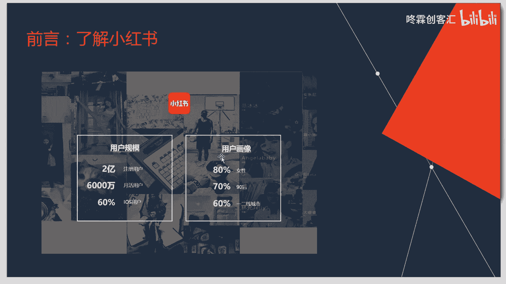
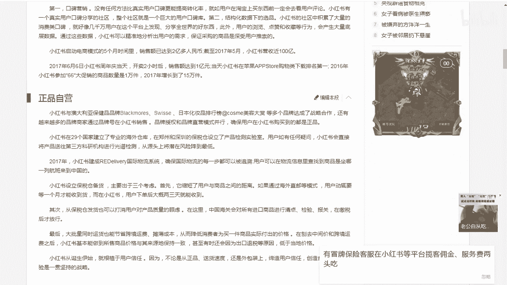
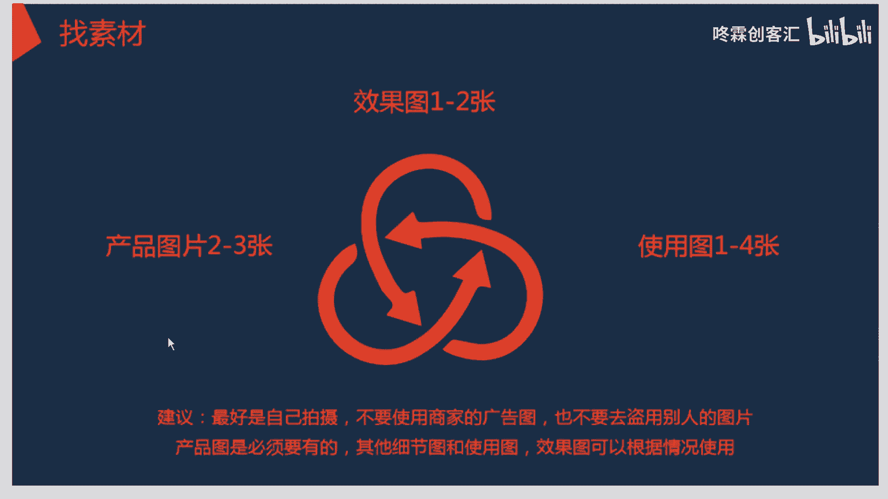
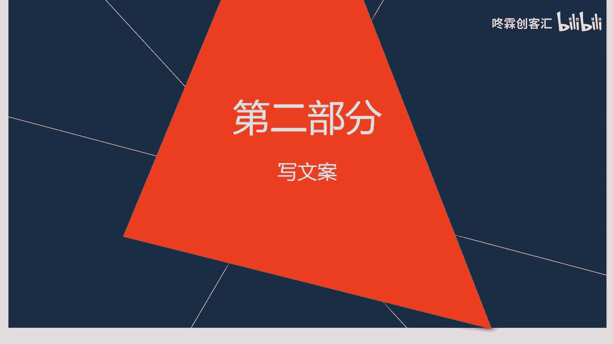
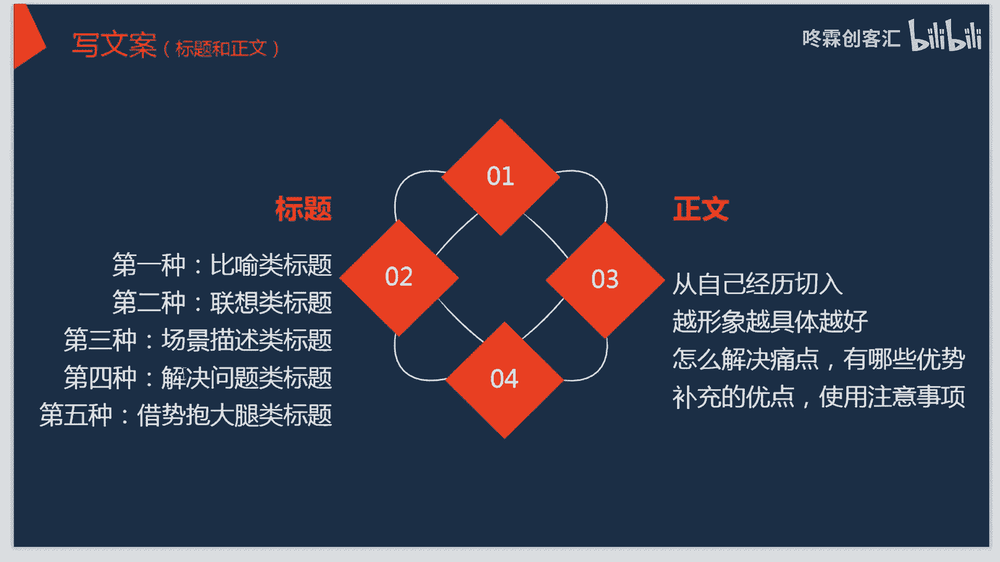
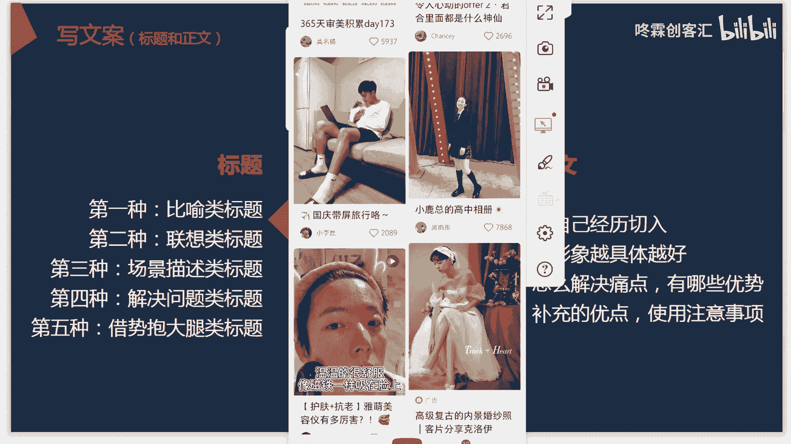
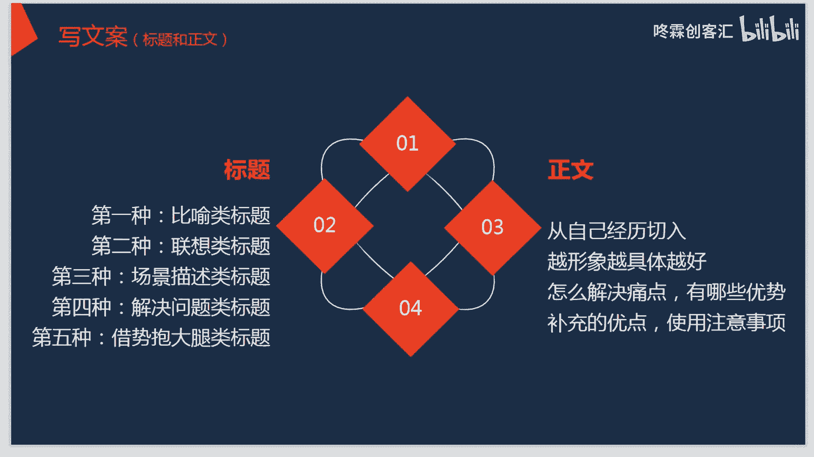
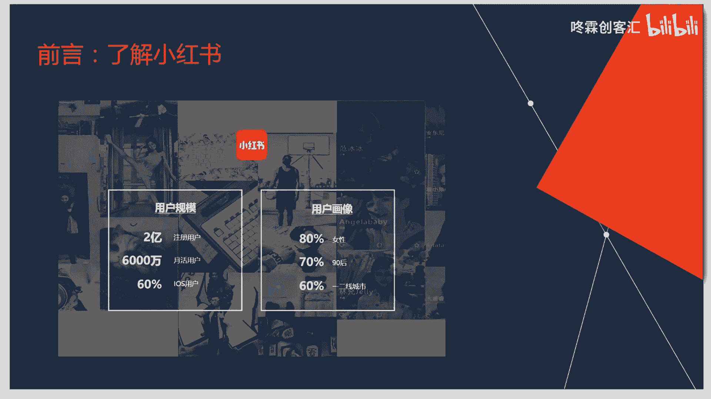
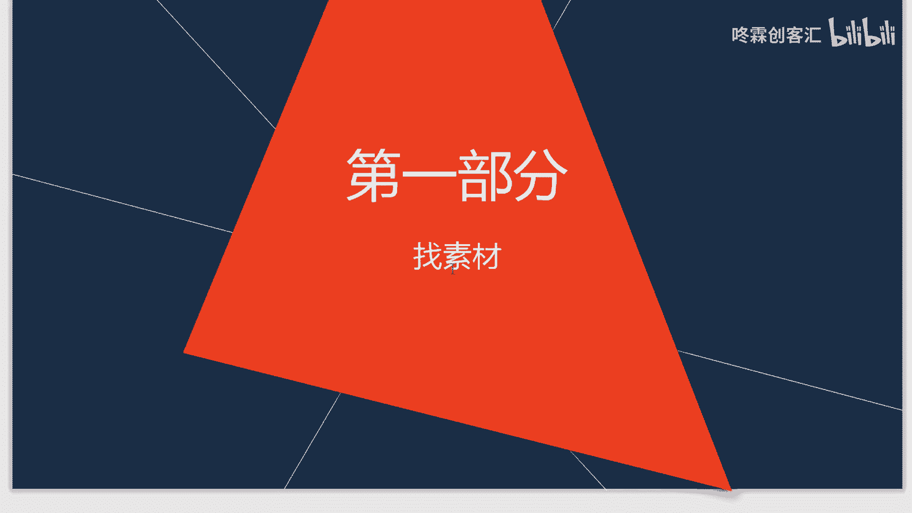
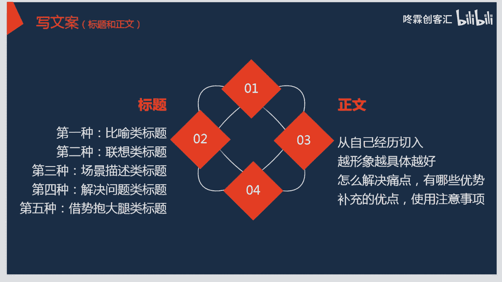

# 【2024版小红书体运营教程】全B站最良心的小红书开店运营教程！小红书体开店 起号真的快，赶快点赞收藏起来 - P18：小红书运营实战课程：从入门到精通系列6 - 听风的歌日记 - BV1mmvDeiENW

大家好，这节课呢我们主要是想给大家来分享一下，在小红书这个平台当中，如何在上面来写出一款爆款的笔记，那我们都知道在小红书这个平台上面呢，我们输出内容的一个主要的方式，就是通过笔记的这个方式。

那首先我们就要强调一下，关于啊写好一款笔记的重要性了，那么这节课呢就将来给大家介绍几种方法，那么首先我们对于小红书这个平台，想要在小红书这个平台当中，输出自己比较优质的这个笔记的话。

那对于他平台的调性就是要有一定的了解，那么在这里面对于小红书平台的了解呢，可不是我们通常啊简单的，对于一个小红书的一个认识，那可能大家都会来对于小红书这个app，进行一个下载。

那下载之后对于一个平台进行一个啊，内容的简单浏览，那么在这里面浏览过后呢，自己的账号信息输入过后就来啊，在这个上面发表这个内容了，那么在这里面要给大家强调的一点，就是我们要了解一个平台。

首先就是要对于它的啊各个方面，通过一个数据的总结，来进行一个比较深入的了解，因为这样了解过后，我们才会对于小红书这个平台，有一个呃特性的一个把握，能够很好地知道在这个平台当中。

它的一个具体的特点到底是什么，那知道了它的特点之后，再有针对性的去输出一些内容的话，那可能达到的效果就会比较的好一点，那么在这里面呢我们给大家列举了，我们可以看到课件上面的这幅图。

那对于小红书的这个平台的调性呢，可以看到它的这个用户规模是比较大的，而且啊无论是注册用户还是我们的越活越，就是活跃用户都是比较多的。

那么在这里面呢，我们现在的这个小红书他的这个活跃用户啊，比我们刚才所看到的那个2亿人还要啊，更多一点，所以说呢这个平台当中，它的用户的数量是非常庞大的，那么在这里面这个就是关于小红书的一个简介。

那么我们可以看到小红书的一个啊，发展的一个历程，它的一个基本的信息，那么在这里面我们知道了，小红书是一个比较大的啊一个平台之后呢，我们就要对他用户画像进行一个了解。

那么在这里面在小红书这个平台当中，它的一个女性用户是超过了80%的，而且女性用户的一个年龄层次，年龄层次都是比较年轻的，那九零后的呢占到了70%，而且是现居啊，一二线城市的呢也是达到了60%。

所以说在小红书这个平台当中，用户规模比较强大，那用户是啊大多数都是女性，而且都是比较年轻的，居住在一二线城市的这么一些女性，那么这个就是关于小红书基本情况的啊，一个了解。

那么了解了小红书的这个平台之后呢，接下来就是要对他内容的一个分析，那在小红书这个平台当中，它是主要针对于我们比较年轻的女性群体呢，它所推出的内容，也是我们这些女孩所啊偏爱的啊。

比如说他会提供一些啊时尚护肤，还有美食，运动健身读书宠物啊，还有其他的一些，我们女孩子比较喜欢的一些内容，所以说呢在小红书这个平台当中，他就是抓住了用户的这么一个特性，对于我们女孩子所感兴趣的这些内容。

都进行了一个啊这么一个重点的一个，内容的一个输出，那么我们在知道了小红书的一，个大体的情况之后呢，就是要对我们自己输出这个内容，来做一个规划了，那么在这里面我们对于小红书这个平台当中。

它的一个笔记内容的一个输出，我们可以从这三个方面来进行一个啊，这个内容的啊这个创作，那我们可以看到我们可以选择官方的一个话题，那在我们小红书这个平台当中，它官方呢会啊定期的发布一些啊这个话题。

那我们可以根据官方的这个话题来进行一个哦，一个话题的关键词的裂变和延伸，并与自身的内容相结合，和我们官方的这个话题相挂钩，那这样的话，官方推荐我们的内容的可能性就会比较大一点。

那么第二个呢就是关于我们啊，可以发一些自己啊想宣传的一些品牌，与我们的啊其他的这些话题呀，官方的话题，热门的话题相融合在一起，那第三点呢就是刚才所提到的，关于热点类的这个内容。

那我们在发布自己的内容的时候呢，可以跟上我们现在社会当中比较火的这些热点，还有我们在小红书当中比较啊活的一些热点，那这样的话我们的内容的一些啊，用户的观看人数也会比较多一点。

那这个是关于我们笔记内容的一个简单的介绍，那么我们呃知道了笔记内容是一个呃，什么样的方向之后呢，首先就是要对我们的啊，这个笔记具体的怎么操作呢，那么在这里面，首先我们需要给大家说到的是这四个方面。

那第一个就是关于素材的这个找寻，第二就是关于啊笔记，文案的一个怎么写作的一个方法，第三呢就是关于图片的一个制作，第四个呢就是最后一步，我们写好了一篇笔记之后，就需要来进行一个检查，并进行一个优化。

那么首先我们在做笔记之前，就要明白我们的目标人群是谁，要做一个什什么样子的内容，那我们刚才也分析过了，在我们的小红书当中，她都是啊女性群体是比较多的，所以说呢在这里面。

我们可以来发表一些女性比较感兴趣的，这些话题，那我们在这里面呢，第一步就是关于我们发表笔记内容，素材的一个找寻，那么我们首先来看一下，关于第一部分的这一方面的知识，那首先对于这个素材呢。

我们可能会在笔记当中来配上几个图片，那首先就是我们啊想要宣传的这个产品的图片，那关于产品的图片呢，我们可以选两到三张，那还有我们的产品的效果图，那也可以选择一到两张，还有关于产品的使用图也可以选择啊。

1~4张，这个是在我们发表笔记之前呢，对于这些在笔记当中所涉及到的一些产品呀，或者是其他的一些啊相关东西的一个照片，我们是要准备好的，那么在这里面对我们的啊产品图，效果图。

还有使用图都会啊进行一个分类的啊一个保存，然后我们在写笔记的时候，直接点击上传就可以了，那么对于这些素材的这些寻找呢，我们对于图片的拍摄最好是啊自己实际拍摄的，那不要使用商家的一个广告图。

也不要去盗用别人的一个图片，因为自己拍摄起来才显得比较的这个真实，而且我们的啊如果是介绍一个产品的话，那它的一个产品的啊图片呢是肯定要有的啊，其他的这个细节图，使用图和效果图。

都可以根据这个情况来进行一个使用，那么这是关于在找寻素材方面，我们对于图片的一个选择，那图片选择好了之后，就是要对我们的啊笔记内容的一个大概的思路，进行一个构思。

那么在这里面对于这些内容进行构思的时候呢，就要考虑到我们可以从哪几个方面来说，在这里面我们可以先啊，比如说我不是介绍一款啊护肤品，那么在这里面可以以一个比较啊真实的啊，几一个案例来进行一个引入。

然后再说一下关于这个护肤品的它的一个效果，使用的一个感受，注意的一个事项等等，那么在这里面对于不同的产品，他的一些笔记的一些具体的思路呢，都是要根据自己的啊这个实际情况去进行一个，这个创作的。

那么在这里面对于素材的这一方面呢，就是对于图片，还有我们呃笔记的一个思路，大家要进行一个啊提前的一个思考。

那么第二个部分我们这些素材找好了之后，第二个部分就是要对我们笔记内容的一个，真实的一个输出，那就是写文案的这个部分，那对于写文案这个部分来说呢是比较重要的，因为它是我们爆款笔记的啊一个形式，它是主要的。

就是靠我们文案来进行一个啊内容的输出，我们的用户想要了解你这个东西，肯定是要看一下你的笔记里面到底写了什么，那这个呢文案就是能够啊，代表我们所输出的内容的一个质量的好坏的，那么在这里面对于文案的写作呢。

我们可以从这个标题和正文两方面来进行着手，那么在之前的文案的写作课程当中呢，关于这个标题和正文也给大家提到了很多很多，那么在这里面在小红书这个平台当中，关于标题的创作呢，我们给大家分了以下五种。

那么关于正文呢，也是给大家啊说了这个呃四点需要注意的地方，那么首先我们来给大家说一下这个标题，那么在小红书当中，它的第一种比较受欢迎的标题呢，就是比喻类的这个标题。

因为这个比喻类的标题在小红书这个平台当中，它是比较的啊，具体形象能够非常的啊吸引人的，所以说这个比喻的标题呢，在小红书当中是比较受欢迎的，对于这一类的标题，大家也去啊，可以去进行一个参考。

那么在这里面呢可以给大家来看一个例子，那这个就是在我们小红书当中，它的一个社区精选方面的一个网页的一个内容，那么我们可以看到这个标题，那圆圆的我怎么像旺仔呢，那这个呢就是啊用一个比喻类的一个标题。

把自己啊和这个旺仔进行一个比喻，那这个也是比较的啊，在小红书当中也是比较有趣的这么一个标题，那除了这个标题之外，还有我所说到的这个联想类的这个标题，那这个呢也是比较火爆的一个标题。

那么第三个呢就是关于我们场景描述类。

还有第四个解决问题，那第五个届时抱大腿，那么在这里面呢，我们可以看到这个是我们小红书的一个界面，那对于这些比如说像解决问题类的，那在这里面可以看到，那别再画啊，无效妆，别再无效化妆。

为什么你化妆只是想变白，那这个就是关于我们，比如说像一些问题的解决方面的一些标题，那么还有其他的一些标题等等，都可以在我们的啊小红书当中来进行一个啊，这个找寻，那么我们在呃写笔记的时候。

这个标题呢也可以参照我们这几类这个标题，来进行一个啊这个标题的一个写作就可以了，那么关于这个标题呢，我们都是这个仁者见仁，智者见智的这么一个过程，所以说在这里面，我们要根据自己不同的一个内容的输出。

来进行一个标题的啊一个这么一个写作。

那么这节课呢关于我们的呃，在小红书当中。

我们首先给大家提到了啊，首先是简单的给大家介绍了小红书的一个调性。

那还有就是关于我们呃写出爆款笔记的，第一个部分就是对于啊素材的一个找寻。

那么在找素材的时候，我们对于在包款笔记当中所需要用到的，这个图片呀，还有构思啊，都可以在事先来进行一个啊，在脑海当中进行一个思路的一个架构，那么除了这个呢，还给大家说到了关于我们在写文案的时候。

这个标题的啊几种类型，那么在下一节课当中，我们会给大家来说一下关于爆款啊，笔记的一个正文的一个写作，那么这节课呢就先给大家啊说到这。

