# 【2024版小红书体运营教程】全B站最良心的小红书开店运营教程！小红书体开店 起号真的快，赶快点赞收藏起来 - P19：10. 小红书选品的底层逻辑 - 小袁运营 - BV1Px48eQEai

大家好，我们今天继续来学习，我们小红书的课程中的第十节课，也是接下来几节课的一个铺垫，我们怎么去小红书选品对吧，我们不管选品之前，我们一定要了解小红书选品的一个底层逻辑，它的一个重要性。

我们所有刚刚前期也跟大家讲了，选品方向不对，努力白费，你的类目不对，那你那你选品选品肯定不会太好的，你选品不太好，你的笔记呀，你的呃整个整体的视频来说，展现的也不会说有太好的效果的好吧。

所以说我们得一步一步来，我们先确定自己的呃，先确定确定自己的内幕，确定完之后找到自己适合的同行，找到同行之后，我们再去选择同行的爆品，我们自己再找到一些通过其他平台，淘宝啊，天猫啊，抖音啊，小红书啊。

拼多多等等这些寻找这些同行的一些爆品对吧，了解他的一些重要性。

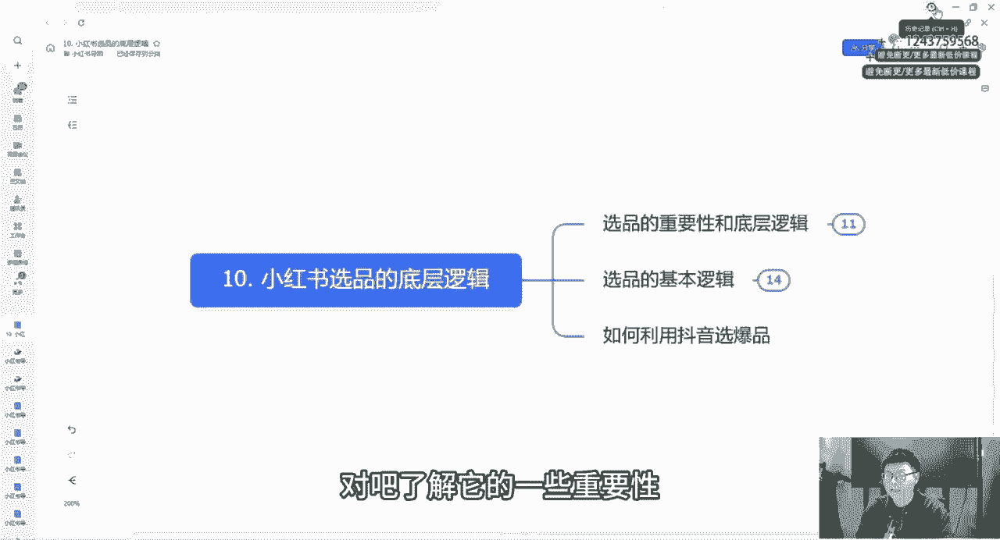

底层逻辑，那我们接下来就正式开始，我们今天的课程，先要了解抖音的。

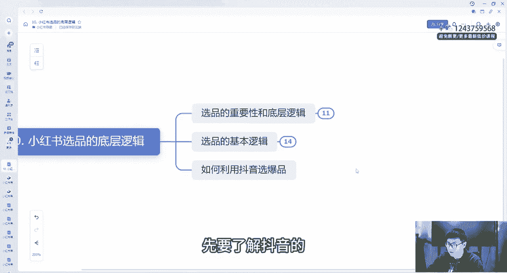

我们接下来要了解小红书，选品的一个重要性和底层逻辑。

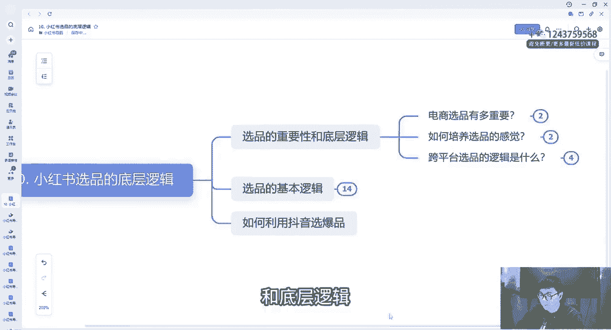

具体来跟大家讲一讲，首先大家要了解一下呃，电商选品的重要性有多重要。

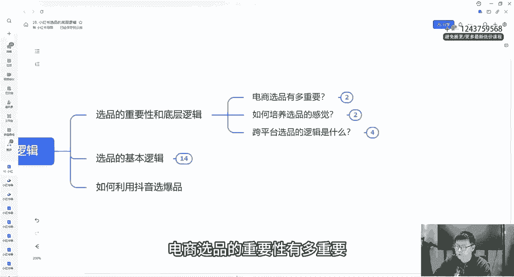

我们做所有的电商，做过我直播间，做过电商的人都知道，没有没做过电商，你今天跟我们一起学习了，你接下来也会知道所有电商的平台里面，不管说你是抖音淘宝，还是我目前我们做的小红书，七分靠选品，三分靠运营对吧。

你运营可能再牛逼再牛逼，只要你这个品不行，那你所有的都是白费，选品是店铺的基础，选品是你整个整个团队的基础，选品不对，整体努力都是白费的，再厉害的销售也不可能把一坨屎给他，卖给客户的可以。

但我说的这个是只是一个话，画一个引号的，但是这个是说明毫无亮点的产品，没有任何卖点，任何没有任何亮点的产品，你是没法去在平台里面销售的，所以我们一定要选好爆品对吧。

不去卖给客户才能后面操作才能更更简单一点，可能说你后面的笔记啊，视频啊，剪的一塌糊涂，但是你这个品是个好品，那我可跟你讲，你这条视频爆的可能性肯定也比你这条，你这个品质是垃圾的品，但是你这视频剪的好。

效果也好，我敢这么跟你保证好吧，这是电商选品的一个重要性，那我刚刚讲那么多。

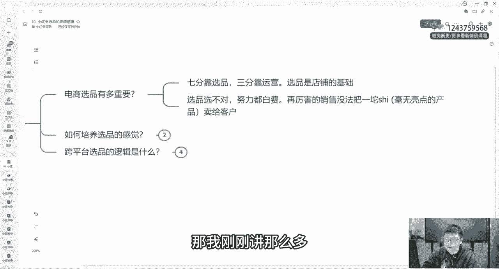

那我们如何去培养选品的感觉呢，首先确定好类目之后，我们要把大量的时间，大量的精力花在选品上面，那你前期选品要花大量的时间，大量的精力，我们才能后面才能不走弯路嘛，我们要多看多对比。

好卖的产品是看了众多的产品之后，结合实际的情况选出来的，既不是瞎猫踩狗屎运卖出来的，也不是自己设计出来的，你不是工厂，我们大部分人都不是工厂，我们都是做一件代发的，你只负责进货。

那我们进货的前提一定要把品选好，拿货去卖，我们一定要选好品，我讲这么多，目的就是跟大家讲，不要去着急，我们慢慢去选品。

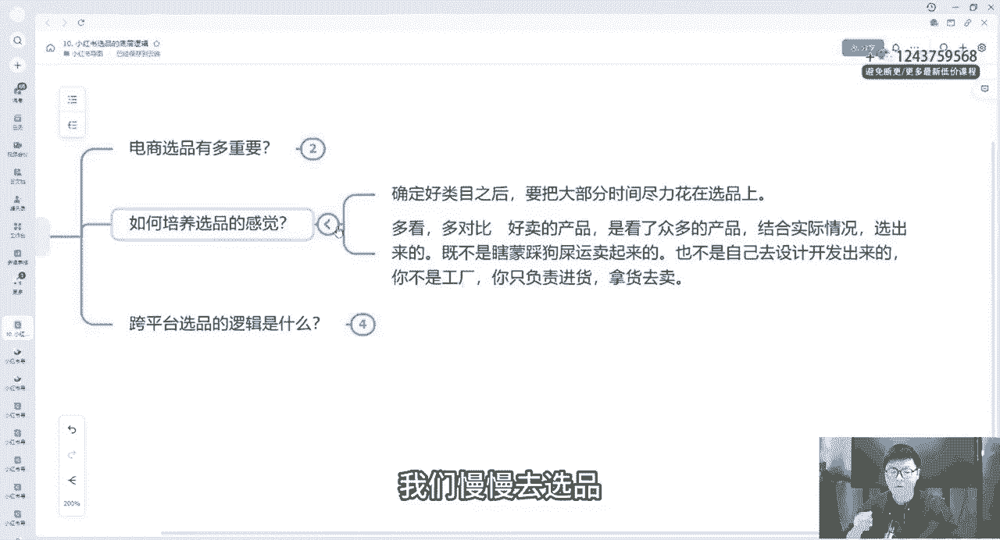

选品对了，后面其他都好做好吧，就是选一个奈子动态的入性质去选品。

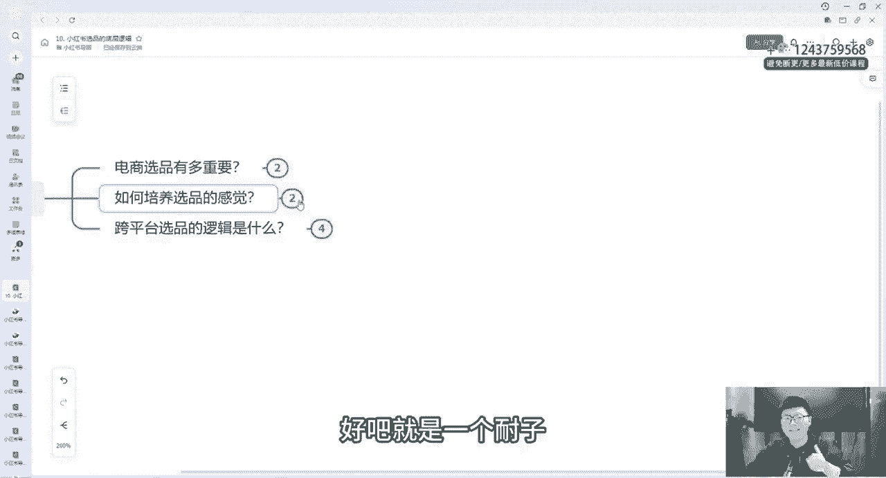

然后跨平台选品的逻辑是什么，我因为我们要得得去好多平台去选品，比如说淘宝啊，淘抖抖音啊，天猫啊，京东啊，拼多多啊等等，你要知道这些平台，他们的品都属于一个什么样的等级，我来打个比方啊。

比如说今天你开的不是小红书的网店，而是开的是一家线下的女装店，那那么你需要去进货，进货的时候呃，你是否会拿问拿货的老板娘说，最近有什么款式好卖的呀，最近有什么是爆款的，老板娘肯定说。

最近我们家别家女装店，最近从我家拿的ABC3个款比较多啊，这时候你就知道了，ABC是爆款，其他的款你就不拿了，我们就不浪费钱了，我们知道别的家卖的比较多，那我们去拿拿到。

我们面对人群是跟人家人群是一样的，都是同一家拿的货，而且都是卖女装的，那我们就知道这个是爆款了，对不对，不是你觉得卖什么什么好卖，你就去卖什么，而是别人都买什么，那市面上大部分人都买什么。

那这个就是爆款，别人都卖什么，这个也是爆款，好吧，你才去卖什么，相对于来说，淘宝其实就跟那个老的步行街一样，你们自己去刷刷，刷不到啊，自己金门金堂啊，在一些步行街抖音就相当于万达广场。

稍微高大高大上一点，价格也稍微贵一点，而拼多多就跟菜市场一样，里面价格都是很便宜对吧，但是呃好货其实也是比较少的对吧，小红书就更像街边的一些精品店，价格比较贵，但是东西还是比较好的。

相对于抖音跟拼多多跟淘宝一样大，大家能理解了吧。

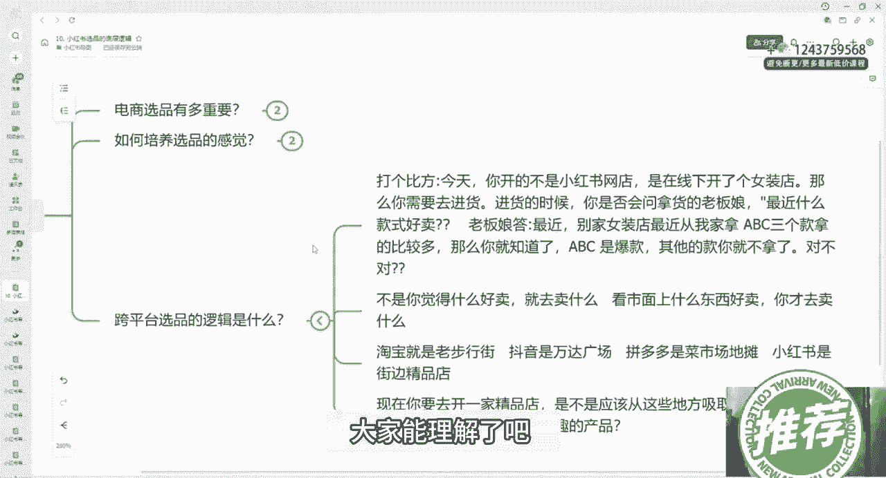

所以我们在小红书里面选的话，尽量去选择一些精品比较好卖一点。

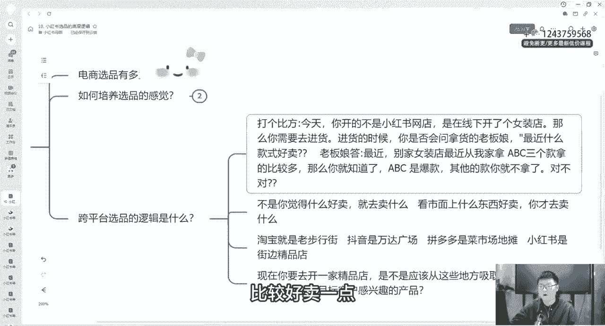

因为整体来说小红书的人群啊，他整体的消费水平还是可可以的好吧，呃现在你要去开一家精精品店对吧，是不是应该从这些地方去吸取一些经验，看看你有什么是你的目标客户群体感兴趣的，你的目标人群是哪些。

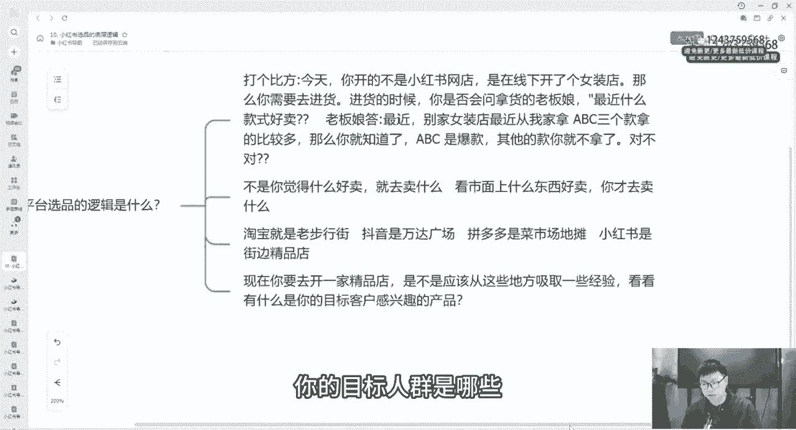

你去感兴趣就选哪些就行了好吧，这是一个底层逻辑，那我们看一下选品的基基本逻辑。

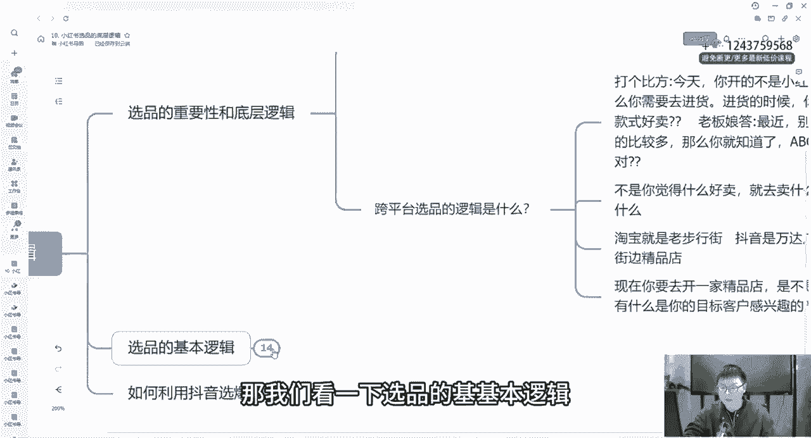

基本逻辑我们从三个部分来跟大家讲，首先第一个产品要有热度。

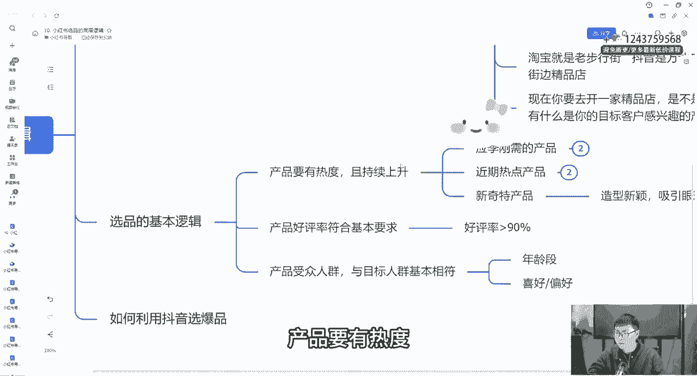

要有持续上升热度，比如说应应急刚需的产品来给大家举个例子。

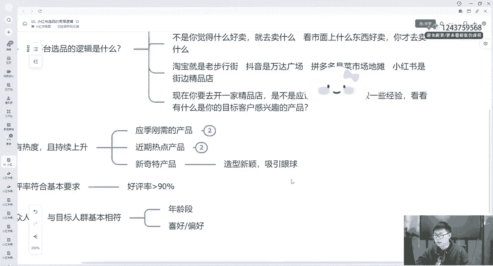

看一下应急刚需的产品有哪些对吧，比如说你是卖女装的对吧。

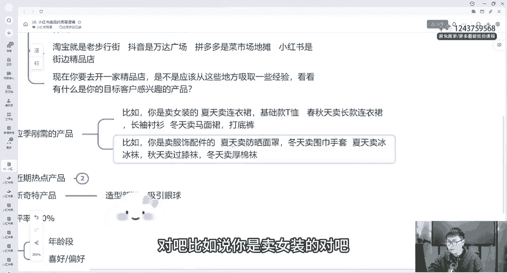

夏天卖连衣裙，基础款T恤，春秋天春秋天卖长款的连衣裙，长袖的短袖，冬天卖马面裙，打底衫，打底裤这些对吧，应季刚需的大家一定要去学会运用，冬天我为什么说了呃，过年期间卖对卖对联，卖红包卖的好的。

因为对他是呃应季刚需啊，比如说你是冬天呃，你是卖羽绒服的对吧，肯定是卖的好的呀，你是卖这种服饰配件的，你夏天卖防晒面具，那冬天卖围裙，围巾手套对吧，夏天卖冰冰袜，冬天卖过膝袜，其实这都是差不多类目的。

而且都是能自在自己人群来说。

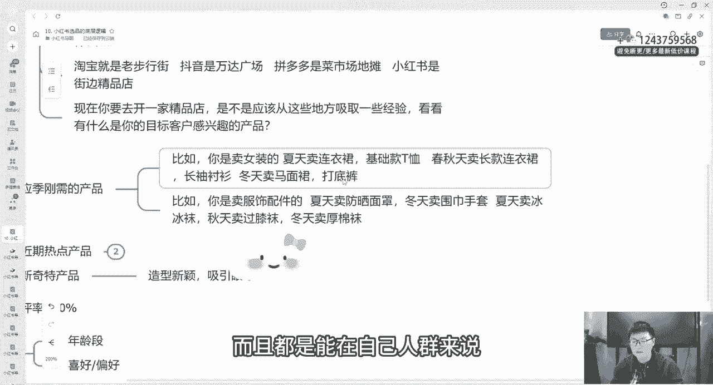

其实都差不多的，有没有发现其实你同样的根据不同的季节，你可以卖很多东西，关于服饰的等等的服饰啊。

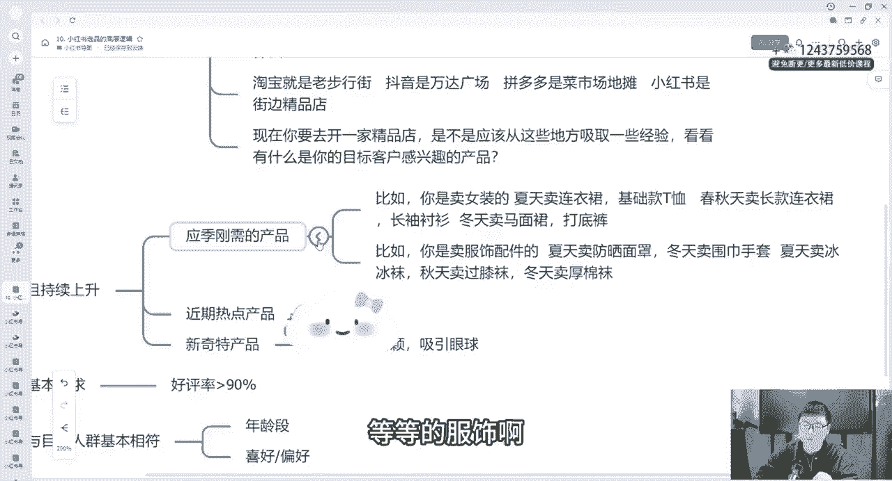

搭配这些，比如说近期的热卖产品也有很多，比如说你是卖女装的，最近网络上你有哪个明星穿的哪款衣服啊，小众的衣服，但是很好看，价格也很便宜，我们就可以在我们店铺里面做，比如说某某某某明星同款对吧。

比如说前段时间比较爆火的电视剧，比如说我举个例子，像繁花，大家应该有看过繁花里面的唐嫣同款是吧，抖音抖音小红书里面卖的很火很火是吧，你依旧可以去卖对吧，要慢慢培养自己的网感对吧，什么东西啊。

火什么话题火，那代表着这个产品这个话题有流量，那我们去卖这个产品，就99。9%能卖得动，如何如何，这个产品啊爆点跟我们的跟我们这个产品有关，你就去蹭这个热度对吧，新奇的产品造型新颖的吸引眼球的。

这些我们都都是可以去卖的好吧。

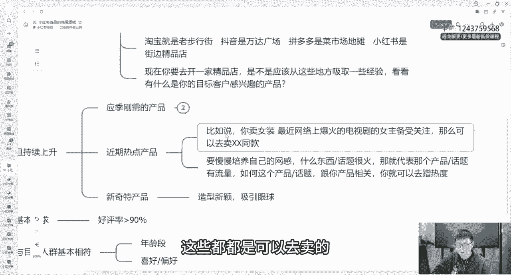

就是产品有热度，我们要有热度蹭热度，第二个产品好评率，基本上要符合90%的要求对吧，你可以发现为什么拼多多，有很多人在不在拼多多选品，因为它里面好好评率基本上有很多啊，我不是说百分之百啊。

但是有很多它好评率不达到90%，达不到90%，退货率低一个你容易上升，第二个你店铺的评分容易降低，第三个呢，你本身这个品可能质量就不好，你不好的前提下，你就不容易成为一个爆款好吧。

这是好评率一定要达要求，第三个，产品受众人群与你的目标人群要基本符合对吧，我年龄段啊，喜好啊，偏好这些都跟你要差不多。

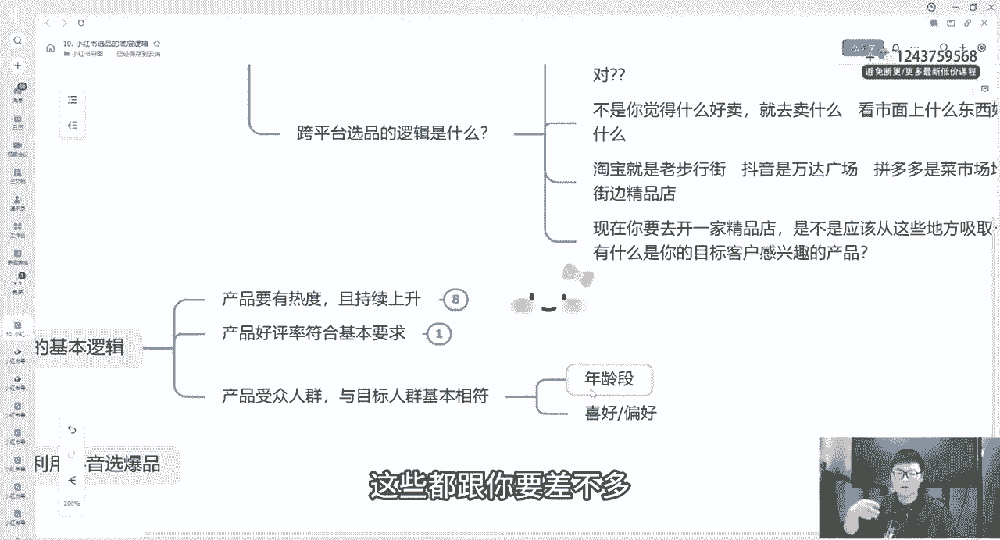

最起码差不多吧，不能相差太大，这是我们选品的一个逻辑。

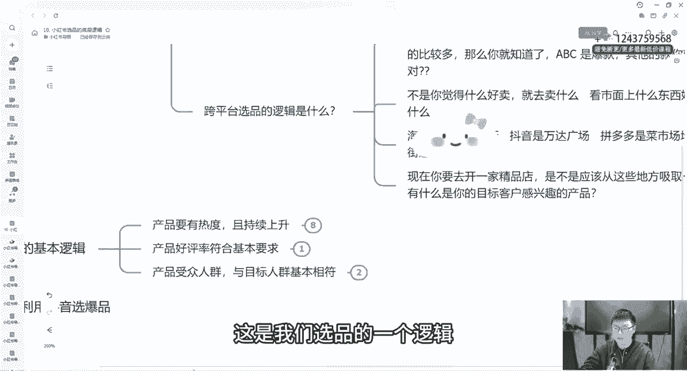

你不能说你是卖女装的，你去找到人家男装的店铺里面去选品，你选一些男装，那肯定不行，我是卖这种上班族，你去卖一些夜店风的，两个相差太大了，好不好，这个就是选品的一个基基本逻辑。

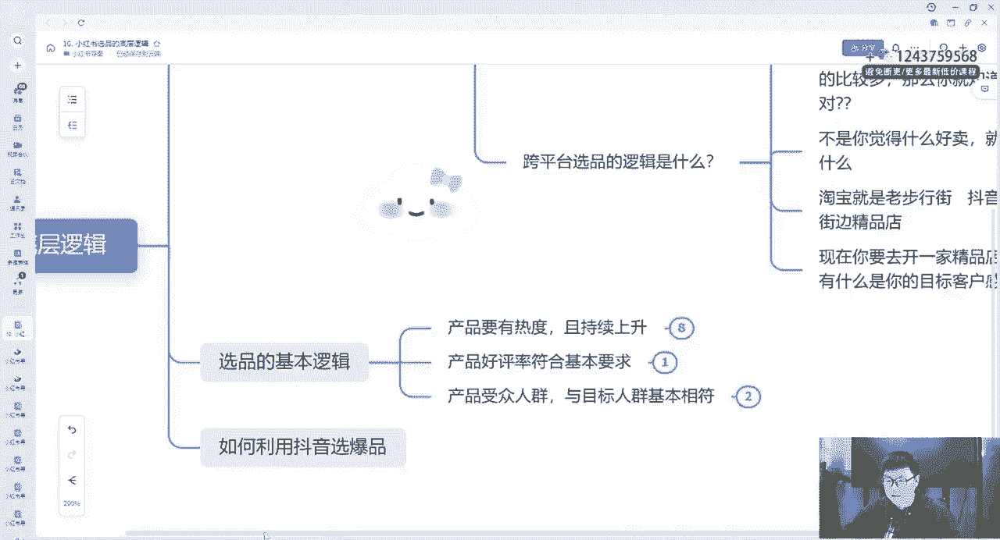

接下来我们的课程呢会具体来跟大家讲讲，如何去通过抖音选品，如何通过拼多多选品，如何通过淘宝，如何通过小红书站内选品，好吧，大家来继续来听我们的课程。

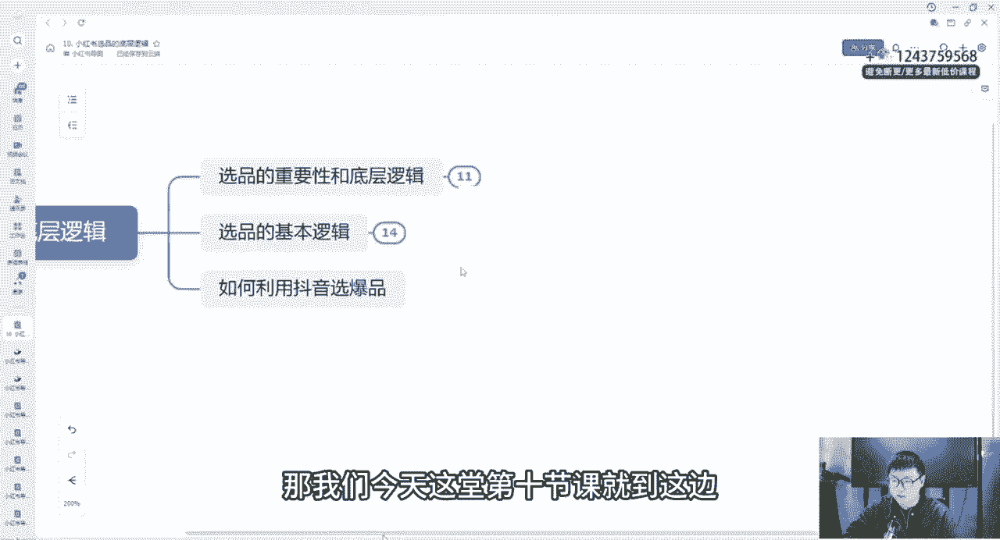