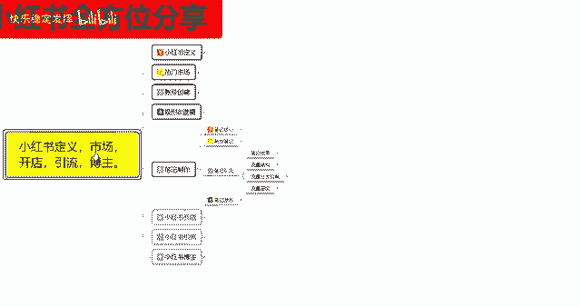

# 【2024版小红书体运营教程】全B站最良心的小红书开店运营教程！小红书体开店 起号真的快，赶快点赞收藏起来 - P19：17.小红书新账号笔记制作（11） - 快乐稳定发挥 - BV1AbtoebEjX

大家好，今天给大家分享的是小红书，全方位的一个整体分享，第五大课时笔记制作的一个内容。

这节课呢主要是给大家分享一下，我们这个小红书的一个流量成绩，流量成绩是什么意思呢，就是我们小红书账号它有一个隐藏的流量层级，数据额流量乘积的话一共分为八级，它限定了我们笔记发放以后获得的一个流量。

也就是技术曝光获得的一个小眼睛数量。

这八个层级是怎么计算的呢，就是第一层级，第二层级的话，基本上都是我们刚创建账号的时候，自己发布笔记，笔记数量的话，我们获得的一个小眼睛数量是零到200，然后的话你往后面发多发两篇，或者说多等个几天。

基本上的话笔记浏览量的话，下眼镜基本都在200到500之间，第三层级是500到2000，第四层级是2000到2万，第五层级呢就是2万到10万，基本上到第五层级，往后的话啊，自然流量你就已经到达顶峰了。

你无非就是第五层就接近往第六层级去靠啊，不会再超过这个数据了，第678，说实在的，往678层级去靠的话，你在小红书上面你有需要有一定的资金投入，就是和官方去合作，然后让官方官方呢帮你再额外的推成流。

推荐流量才可以，不然的话基本上没办法去到达678，三个成绩呃，我们来了解一下，就是每一个层级所对应的，我们账号属性的一个内容，因为你只有了解你自己，账号和自己发布的一个内容，发布出去以后。

系统给你的一个评判，然后的话再确定自己在哪个层级才可以，因为你后续如果说怎么说呢，你就是笔记做的再好，你的等级层级达不到的话，那你后续获得的一个相应级数量，他也不会超过你现有成绩的一个上限。

我们先来了解第一层级啊，就是笔记的浏览量零到200，这个之间就是说只要你的笔记没有违规，就是你发布的笔记没有违规词，不管内容怎么样啊，基本上都有200左右的一个阅读量，就是小眼睛。

你第一篇笔记基本上都有200左右，除非你发第二篇，第三篇是在一天之内连续发放，后面两篇笔记的话，一个浏览量的话大概在50~70左右，或者说是你复制的别人的一个呃笔记，然后自己来画这种的一个笔记的由。

来量的话也会比较低，就是说基本上你不管怎么去操作，只要笔记你发出去没有违规啊，基本上都有200左右的一个浏览量，就是说如果多篇笔记阅读词序经常一直，你怎么不管怎么去发，都在200左右。

就需要关注你是否收到违规的一个战争信啊，如果说没有的话，就说你的一个笔记质量肯定是有问题的，第二个呢就是第二层级，笔记浏览量在200到500之间，这种的话就是说属于正常的一个流量范围。

大多数的账号的话流量都能到达第二层级，如果说长期稳定在这个区间的话，你就要查自己的那个笔记里面的一个互动率，就是评论区活动活跃度，然后的话查你的垂直度，原创度以及内容的一个质量，就说你的笔记的话呃。

发出去以后可能是不温不火，然后的话有人看，但是的话没有人进行评论，这个时候我的话就需要我们自己用小号啊，去做引导，做评论，你不能说小红书的笔，你发出去以后让用户在里面啊自娱自乐，这种的话，很多时候的话。

小红书的笔记你都需要去做引导的，这个呢就是第二层级，基本上浏览量的话，也就是小眼镜数量在200到500之间，这个时候如果说你的评论区里面，连两到三个的一个评论都没有的话，那你的笔记你想往下一成绩突破。

根本就不可能第三次升级啊，笔记浏览量的话是5000到2000，这个说的是小眼睛数量，而不是说系统给你的一个技术曝光量，基础曝光量的话，大概你往上面要乘以10%到15%，就是乘以十到十五十五倍啊。

也就是说你的点击率的话起码要在15左右，11以上，你才有可能获得2500到2000的一个点击率，你包括后续的也是一样啊，2万到10万，他给你给就相当于你有10万个小眼睛的话，他就是系统已经给了你。

110万以上的一个展现曝光量，不然的话，你是没有办法达到10万的一个数据量的，而且你的点击率的话要在11%以上，就说第三层级的话，这种账号的话就说账号状态是正常的，笔记内容质量只能说是一般啊。

就说还凑合，但是你的一个互动力点点击率，相比大盘的一个平均数据的话就偏低了，就说你在整个行业内幕里面，你的点击率的话没有达到大盘的一个整体需求，就是没有偏高啊，你只是说在正常范围以内。

所以说他给你的一个小引擎数量的话，也就是2000到500之间，流量的话就只能进入第三层级，如果说达到这一层级的话，你基本上你的账号就在小红书里面，已经超过了80%的小红书账号，当然了。

你跟那些其他的账号没办法去进行对比啊，这80%的话基本上都是普通用户，然后的话平常没事的时候发一下，他可能都会获得500到2000的一个展示量，如果说你要在小红书上面，你要去想套现赚钱啊，卖货啊之类的。

你最少也要到第四层级，第五层级才能，第四层级笔记浏览量的话是2000到2万，这个时候就已经说明你整个账号，就说你每篇笔记发出去发出去的话，你的笔记浏览量的话，小眼睛数量大概在2000到2万之间的话。

那说明你已经获得了一个不错的数据，就已经超过了85%，接近90%的一个小红书账号了，简单点说，如果说你的数据超过2000以后，你往2万之内发展，就已经可以往小报方面去操作了，就这篇笔记已经开始小。

开始报了，只是还没爆起来，然后的话如果说你在三天之内没有抱起来的话，那你往后续的话，他嘴最多给你推七天，那也就是达到上限，也就只能获得2000到3000左右的一个效应金，如果说你慢慢的报起来以后。

超过5000到接近1万的时候，就已经开始爆了，他的数据是持续爬升的，他最多的话可能会给你推四五天，四五天，如果说你还不能突破2万的话，那你就只能在第四层级待着，如果用户反馈的话仍在增加，就是说平台的话。

它会持续给你流量，只是说这个流量的话它会变缓慢啊，就相当于你前面的笔记，可能发出去三天就没有引流了，这篇笔记发出去的话，可能会在3~7天之间，如果说你在3~7天之间，能突破2万的数据的话，就会进入第五。

成绩到2万到10万，他就会给你推广15天以上，如果说你达不到的话，基本上就是最多七天在2万左右，或者说是1万左右，一个小眼睛数量，第五层级笔记浏览量的话就是2万到10万，第五层级浏览量的话。

也就是说我们自然占流量的最后一关啊，依然是用户和互动的一个数据，决定你是否进入下一个层级，流量达到这个成绩的话，笔记已经比较粗重了啊，基本上已经超过了98%，正常情况下，你已经超过了98%。

的一个小小红书用户了，也可能的话有一定的粉丝比例基础，以及权重比例较好的一个账号，可能会比你高，就是那些已经开始在小红书上面，走红的一些账号，正常的话我们自然流量的话，基本上就只能到达这个阶段。

2万到10万的一个小眼睛数量，你再往上面走的话，你需要去一个额花钱做推广，不然的话你想往外面突破的话，到第六第七，第八的话基本上上不去，第六层级，就是说已经进入到热门笔记的一个门槛，到达这个阶段的话。

笔记已经具备了一定的稀缺性，就是说你的一个内容发出去的话，你本来就已经吸引了很多同类型的一个用户，而且你在这一某一个社区里面啊，已经快接近顶点了，什么意思呢，就是说你这个社区的话，对于你来说。

你已经可以往前100去排了，往这个方面去排的时候的话，小红书系统，他还会去从其他的渠道给你额外进行引流，到达这个阶段的笔记的话，就说稀有性已经非常高了，就是你的内容质量已经非常不错了，用户互动率啊。

数据啊都比较好，然后呢也是从这一成绩开始，测试更多用户的一个后台数据端，就说你的你的账号，已经被小红书系统认定为优质账号，然后你每次发放的笔记的话，他会帮你优先推荐给喜爱的人，或者说是类似喜爱的人。

就是看到的人会更多，基础上的基础的话，你就是达到了10万到100万之间，那他给你，你就是不管你怎么去操作，你的笔记发放出去以后的话，只要不是乱发的小红书笔记，他基本上就是第一时间就给你推荐出去了。

而且这个流量暴增的是非常快的，而且你基本上所所所有发生的笔记，都能维持在七天以上的一个数据量，然后达到他的一个整体数据需求量的话，他会给你连续推广15天，就是你已经被小红书系统已经认可了。

往后走第七层级，第八层级基本上都是一样的，只是说第七第八层级的话，你在小红书上面很难看到，因为这种的时候已经是小红书官方大力支持的，这种基本上就已经是属于说小红书里面呃，至尊级别的了啊，这个时候的话。

你就已经不再愁什么用户啊之类的，因为适合你的用户基本上都已经被你吸引过了，也都观看过你的产品，往七八层级去靠的话，你就需要去跟小红书官方平台合作了，而不是说靠自己自娱自乐，然后的话花点钱啊，再往上面推。

那推不上去的，基本上到达第六层级，你花点钱还可以，但是到第七第八层级的话，你花钱都做不上去的啊，那需要你有有渠道，有资源才可以，这个呢就是小红书整体的一个流量成绩。

主要呢就是让你们了解一下我们自己的笔记，发放出去以后的，你在哪个范围之内就说不要盲目的追求呃，笔记发送的质量，然后觉得自己笔记发出去以后没有什么效果啊，它的效果是有的，只是说你所在的账号权重不够啊。

那这节分享呢就给大家分享到这，下一节开始呢给大家分享一下。

