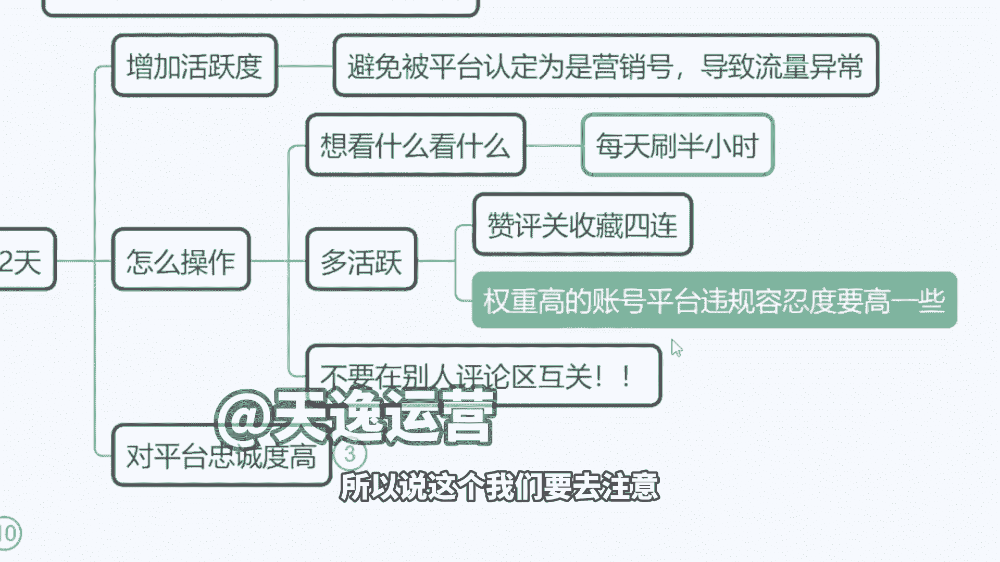
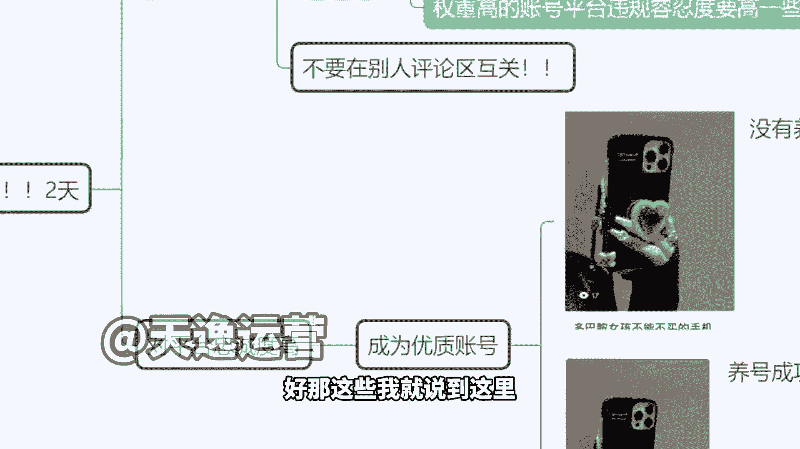
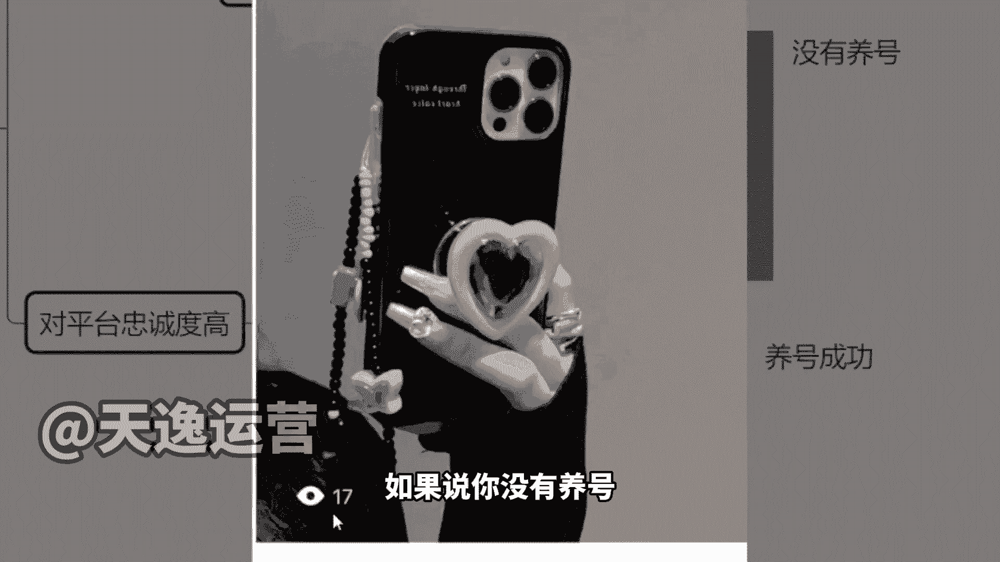
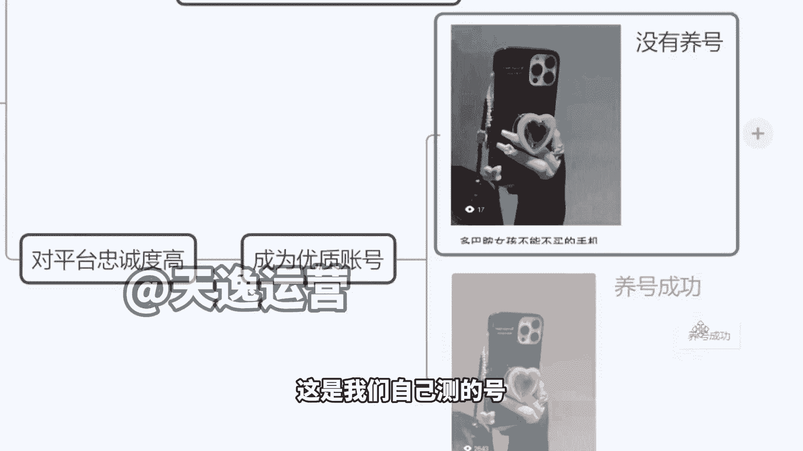
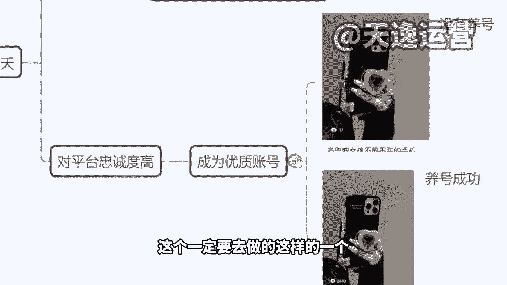

# 【2024版小红书体运营教程】全B站最良心的小红书开店运营教程！小红书体开店 起号真的快，赶快点赞收藏起来 - P19：2.小红书如何养号 - 桂兰姐有公主病 - BV1W742ewEr3

那么我建议大家啊一定要去养号，一定要去养号，然后这个养号怎么去做，来这样我我给大家总结一下吧，你们为什么没有播放量啊，啊我把这几个跟大家说一下，你们就应该更清楚来播放量，少的原因啊。

第一个首先你在注册账号的时候啊，就是我们在注册完账号的时候没有养号，然后直接去发作品，导致我们账户活跃度不够啊，平台认为你是机器号，或者说认为我们是营销号，认为我们是僵尸号，他不可能给你流量啊。

这个活跃度是不够的，然后第二个这个情况的话呢，就是嗯我们的账号属性没有转过来，账号属性问题啊，第三个作品内容啊，作品有违规额，这个东西的话，其实很多时候啊，有同学说老师我作品没有违规呀。

平台没有给我发违规提醒，他，只是因为你的账号已经给你限流了，他压根就不提醒你了啊，像这种账号没有接收到提醒，不代表你的作品就是好的，那这个内容违规是一个第四个啊，内容不好啊，就是你的内容质量不高。

然后还有一个你的品类，你要卖的这个东西，你要做的这个方向不是平台需要的，这些都可能导致我们没有播放量啊，都会导致没有播放量，来，我待会给大家讲一下，就是我们播放量正常应该是多少啊。

来我先说一下这个养号的问题啊，养号的话，其实就是等于说我们把账号活跃度提升上来，让平台认为我们是优质账号，然后给我们变现的机会，就像我刚刚讲的，如果说你不去养号，你账号没有活跃度，平台觉得我们是营销号。

对不对，那么他不会轻易的给咱们流量，那怎么做，现在有很多刷号的，我跟大家讲一下，很多刷号怎么刷，人家有自己的机子啊，就每天会自动去浏览作品，浏览半个小时就提升活跃度，但是这种机子刷号它是不能去点橱窗。

他就点不开购物车的，那如果我们之后想提升自己的活跃度，想让平台认定为我们确实是个真人账户，那么你就需要这样，你随便去刷视频，每天刷够半个小时，明天起啊，然后呢看到喜欢的不管什么类目，跟我们做的没关系啊。

就不管看到什么类目，你觉得还不错的，都去点赞评论，关注收藏，个别作品，最好是多刷一点带货的作品啊，然后到人家的店铺里面去浏览一下，到别人的产品那里去加点购物车，不用下单购买啊，就加购物车就可以了。

记住没有加购物车就行了，当我们有这个类似于真人的行为之后，那平台会判定为我们是健康账号啊，那这个时候即使说我的作品有违规行为，那么也没有关系，因为平台会给你发提醒，告诉你你的这个文章里面哪些文字。

或者说这个图片是违规的，请下架修改后重新再上传，那如果收到这个通知，代表我们的账号是OK的，是健康的，是还有机会挣能挣钱的，但如果说违规了，平台连提醒都不提醒，说明这个号没有用了，你就算他用了两年。

用了3年无所谓，我不要这个号了啊，我就直接注销了就算了，因为这个号他又不值钱，另外有一个很关键的点，因为咱们也知道啊，你要接商单，要接那种三百五百的广告，最少1000粉丝，那么很多人为了涨粉，快速涨粉。

他会干嘛发到别人评论区去啊，互关秒回这个东西千万别做，你做了一次这个号废掉了啊，我跟大家讲，千万不能这么做啊，因为现在平台对这个识别非常严谨，它跟抖音不一样，你但凡到别的评论区去引流。

这属于恶意引流行为，那么你的流量，你的粉丝如果说是从评论区来的，这个是无效粉丝是没有用的啊，这个是不可以的，我们的粉丝有效粉丝是什么，必须是用户，他在推荐页随缘刷到你的作品，点开你的作品。

看了你的作品之后，然后再点的关注，那么这个才叫有效粉丝啊，因为现在做的人越来越多，平台慢慢的专业化了，他对这个考核越来越严谨了，所以说这个我们一定要去注意啊。

一定要去注意好，那这些我就说到这里啊，那接下来我要也跟大家说一下。

就是这种号，如果说你没有养号。

你的播放量也许就这样的，17个，看到没有同样作品，这是我们自己测的号啊。

我们自己学生测的号一模一样的作品，换了一个号发，你看养过号的2000多就完全不一样，同样的内容文字图片改都没改，再发了一次，另一个号2000多了，一个播放量啊，2000多一个播放量是吧，是这样的啊。

来那么这个的话呢就是属于我们一定要去做的，这个一定要去做的这样的一个行为。

