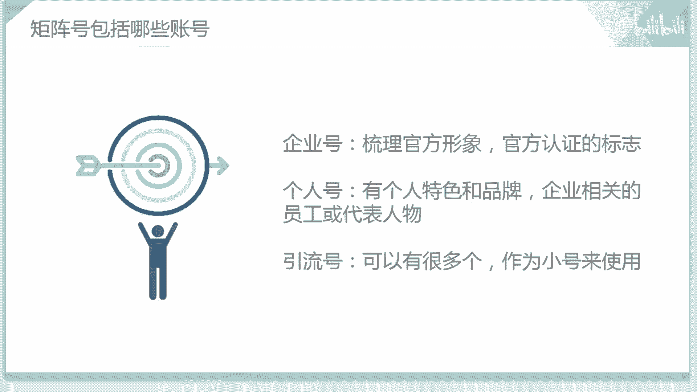

# 【2024版小红书体运营教程】全B站最良心的小红书开店运营教程！小红书体开店 起号真的快，赶快点赞收藏起来 - P19：小红书运营实战课程：从入门到精通系列7 - 听风的歌日记 - BV1mmvDeiENW

大家好，这节课呢我们要给大家分享的课程内容，是关于在小红书当中的一些获客的玩法，那么这节课我们会将从以下三个方面来展开，第一个方面就是关于在小红书这个平台当中，自建矩阵号的一个推广玩法。

第二个就是关于两种官方效果广告的玩法，第三就是关于在小红书当中，社区投放的一些玩法，那么首先呢我们都知道，小红书现在是比较火爆的一个APP，在他的这个平台当中，它是以图文输出为主。

那最最近呢也是增加了这个视频的一个比例，那和抖音这个平台不同的是，在小红书当中，用户注重的是分享关于生活当中的吃穿用，而抖音上面呢分享的是一些剧本呀，或者是啊关于一些其他方面的，有剧情的这些东西。

那么从某种意义上面来说呢，小红书和我们的大众点评是比较的相似，都是凭借着点评来增加吸引我们的用户的，那点评呢正是凭借店铺排名和用户评论，去分级各类店铺，在小红书上面，我们可以看到。

很多的用户都在这个平台当中来进行，一个产品的一个点评分享，发布各类的一个笔记，来分享自己使用过的一些店铺里面的产品等等，那我们的用户如果想了解某一个品牌的话，想知道它的一个产品使用效果的话。

就可以到小红书上面来搜索一下相关的笔记，那比较真实的一个使用感受呢，就会啊被推送到我们的用户面前，那么在这里面，小红书这里面使用的一个核心的营销方法，就是通过用户的口碑营销。

那这个口碑营销呢是比较的受大众这个信服的，也能而在很大的程度上来吸引我们的用户，因为这个口碑营销体现的都是比较啊真实的，所以说小红书在现在发展的呢都是比较好的，而且在这个小红书当中，它是呃使用的。

这些用户呢都是比较的啊，大多数都是女性，也算是一个女性社区，也是一个年轻人的社区，所以说在这里面，它就体现了一个年轻人的一个色彩鲜明蓬勃，有生命力的这么一个特色，那么在这里面我们的小红书在这个上面。

它的一个使用人群的年龄段，是14岁到35岁之间，那可以看出来这个小红书的呃，在小红书这个平台当中，年轻人还是比较多的，那么这节课呢我们先从第一个方面来说起，就是关于啊自建矩阵号的一个推广玩法。

那么在这里面我们可以看到，我们在之前的啊课程当中也给大家说到了，关于我们新媒体矩阵的一个打造，给大家说到了我们的外矩阵，还有我们的内矩阵，那么关于我们的小红书呢，它就是属于我们内矩阵的一个搭建。

就是在小红书这一个平台当中，来，建立起，关于我们啊品牌的各个不同的小红书账号，所以说在这里面，它就是属于一个内矩阵的一个搭建，那么在这里面关于这个矩阵号呢啊，我们可以看一下，在这里面我们可以啊。

在小红书当中来打造我们的企业号，个人号和引流号这三个不同类型的小红书账号，那么对于我们的企业号呢，它是对于我们官方形象的一个树立，是一个官方认证的一个标志，那比如说我是啊某品牌的一个企业号。

那它的一个企业号的名称，肯定就是以我品牌的名称来命名的，那这个也是一个官方认证的一个标志，那个人号呢它是有个人特色和品牌的，但是它发布的一些内容，是要和我们啊这个品牌相关的。

那这个个人号可以是啊企业的员工，或者是他的代表人物等等，所以说在这里面，我们的个人号和企业号两个要相互配合，才可以达到一个很好的我们矩阵号的一个搭建，那第三个呢就是关于我们的引流号。

那引流号可以有很多个，也可以作为这个小号来使用，那这个引流号就可以通过啊，这个账号的这个作用，来进行品牌的一个不断的啊用户的增长，那这个就是关于我们矩阵号，包括的这三种类型的账号。

大家是要清楚的，那么在这里面呢我们知道了这个之后，首先就要给大家来看一下，关于我们在小红书上，小红书当中这个伯爵旅拍，那大家肯定都听说过这个伯爵旅拍这个品牌，那这个伯爵旅拍这个就是它的一个企业号。

但在这个企业号上面呢，他的粉丝啊不是很多，但是通过打造一个摄影师的个人IP，来获得一个巨大的流量，反向植入引流，致使我们的伯爵旅拍企业号，这种别样的打法呢是比较的这个受欢迎的。

而且这种玩法对我们的借鉴意义也是比较大的，那么在这里面呢，我们可以给大家来看一下，关于伯爵旅拍的这个企业号，他的一些情况，那这个呢就是我们的伯爵旅拍，在小红书当中它的一个首页我们搜索伯爵旅拍。

可以看到他的一个官方账号，那点击进来之后呢，就可以看到他的这个粉丝数呢。

是已经达到了这个21。3万，他的获赞与收藏呢也是比较多的，那么在这里面，这个伯爵旅拍作为这个企业号来说呢。

他的粉丝量可以看到，在可能和其他的这些啊品牌比起来呢，他的粉丝不是很多，但是它可以通过打造我们摄影师的一个。

个人特色来获得一个巨大的流量，那在这个当中呢就可以看到我们的伯爵旅派，在这个拍摄婚纱照的过程当中，每一个婚纱照这个风格都可以啊，来吸引很多不同的这个用户，那我们可以看一下它置顶的这个风格。

置顶的这个婚纱照的这个风格，那可以看出来呢。

这个就是我们在啊拍婚纱照的时候，伯爵旅拍所展示的这些婚纱照的风格，那么对于我们的这个照片呢，在这个笔记当中也进行了一个详细的解释，那如果我们用户看到了这个的话，那想要拍一个同款的婚纱照的话。

就可以来联系我们的伯爵旅拍了，那这个呢就是我们啊伯爵旅拍。

企业号的一个特色，就是通过各种婚纱照风格的一个展示。

来吸引不同的这个用户，那可以看到有很多不同的这些美美的结婚纱照。

都可以在我们的企业号当中来进行一个展示。

那在企业号里面，它主要展示的就是关于我们各种不同的风格的。

一个婚纱照，那这个就是对于我们的企业号，那如果我们大家在运营其他品牌的时候，在打造企业号的过程当中，我们可以在企业号里面发布一些，来对于我们这些企业有正面宣传的这些啊，视频啊，图文也好。

反正就是在我们的啊这个企业号当中。

来打造这个品牌就可以了，那么我们这个是企业号的一些情况，那么说完了这个企业号呢，大家刚才还给大家说到了，关于我们的这个个人号，那在这里面呢我们也是拿这个伯爵旅拍来举例，那个人号呢。

就是啊这些发表和我们这些品牌相关的。

一些笔记内容，那除了我们的啊这个伯爵旅拍的官方账号之外。

我们在这里面还可以给大家来看一下，关于我们在这个伯爵旅拍这个小红书当中，关于伯爵旅拍话题的这个笔记，那在这里面呢就可以看到。

这些呢都是有关于伯爵旅拍的一些呃，小红书的笔记分享。

但是呢可以看到他的这个账号呢，不是我们官方账号所发布出来的。

是由我们个人的，关于这个品牌的一些意见的发表，那这里面就是属于个人号对于企业的一种宣传。

所以说呢这个就是我们的企业号和个人号，两者要进行一个很好的一个配合。

这样就可以把我们的啊这个伯爵旅拍这个品牌，在小红书这个平台当中来宣传的更加的啊，这个客观立体，能让用户感受到一个真实的啊，一个很好的一个啊。

啊这个效果的这个展示。

那么这个就是关于我们伯爵旅拍的一些情况，那除了这个伯爵旅派之外呢。

在小红书当中还有很多其他的一些品牌。

那么除了这个啊，我们还给大家举到了这个亚门这个例子，那雅门呢他在小红书上面是非常的火爆，他是啊以官方账号为准，来号召每一位员工呢都打造出个人号，让个人与品牌官方打配合，流量互补来流量互补来进行增粉。

那么在这里面也可以看一下，这个亚门的这个账号。

那么我们也可以在小红书当中来搜索一下，关于他这他的这个账号的一些情况。

那我们可以看到关于这个啊亚门的这些情况呢，这些都是关于它产品的一些笔记的一个分享。

那在这里面可以看到他的点赞量呢。

都是比较多的，可以看出也是非常的啊受大家来欢迎的。

那通过各大的啊这些用户的一些宣传呢，我们还可以看到这里面还有这些啊。

明星对于这些产品的一些宣传，那这样子对于这些产品的效果呢。

就会达到一个很好的这个作用。

那通过这两个例子呢。

不论是我们的这个啊伯爵旅拍也好，还是我们的这个亚门也好，他们两个都是通过企业号和个人号两种，这个宣传的方式相配合的一种啊宣传方式，来给我们的企业来打正面的宣传，所以说在这里面。

这种方法呢也是可以供大家来进行一个参考的。

那关于我们这个呃自建矩阵号的一个操作呢，就是通过利用多个账号来进行一个品牌的宣传，那多个账号可以有我们的企业号，个人号，还有我们的引流号等等，那在这里面主要的给大家说到了，关于我们企业号。

首先在企业号里面发布内容的时候，一定要树立我们官方的正确的啊一个形象，那个人号可以发布一些对于产品的使用感受呀，它的一些啊体验呀等等，来对于品牌进行一个测评，来进行一个正面的笔记的一个输出。

那这个就是这两个号的一些作用。

那么这节课呢关于我们在小红书当中，一个矩阵号的一个搭建方面的相关知识呢，就给大家先说到这，在下一节课当中呢，我们还会给大家来继续的进行一个深入的分析，那么这节课呢就先到这。

