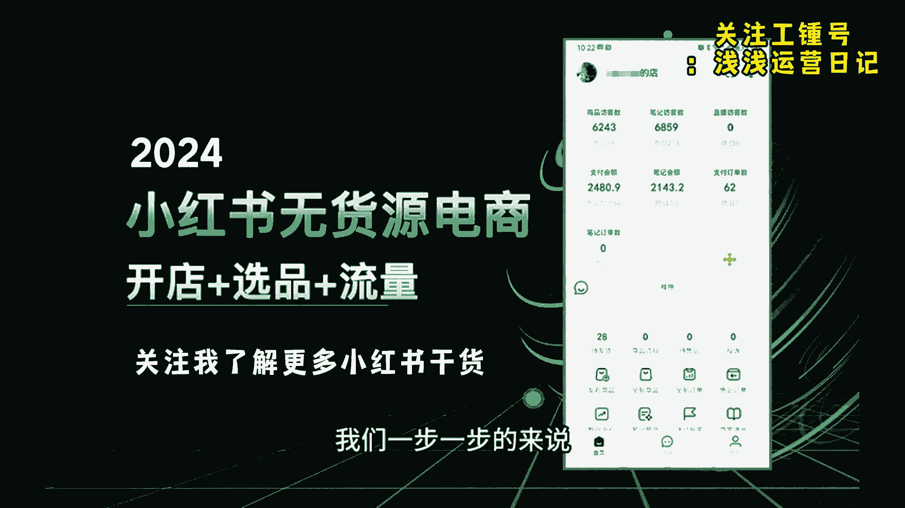
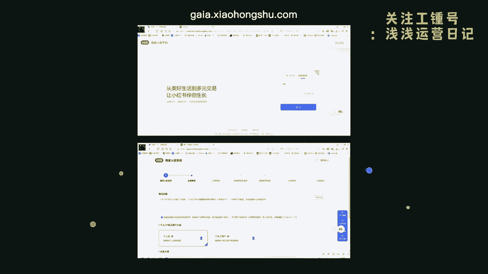
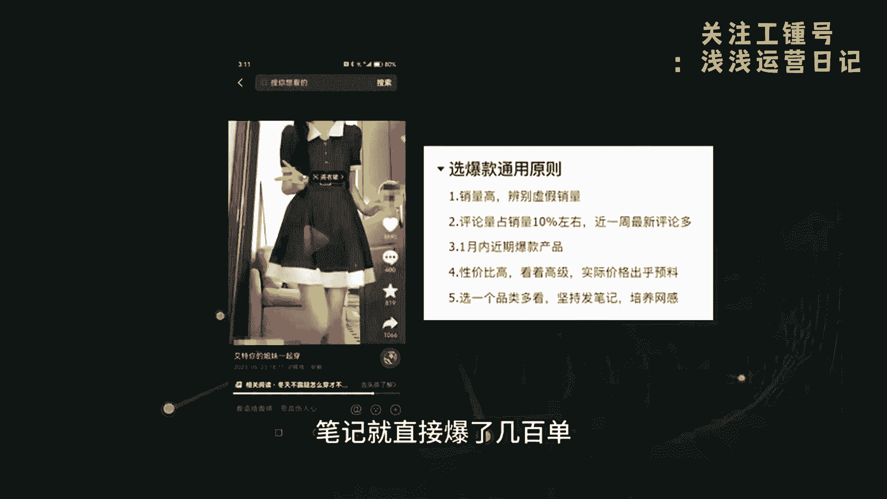
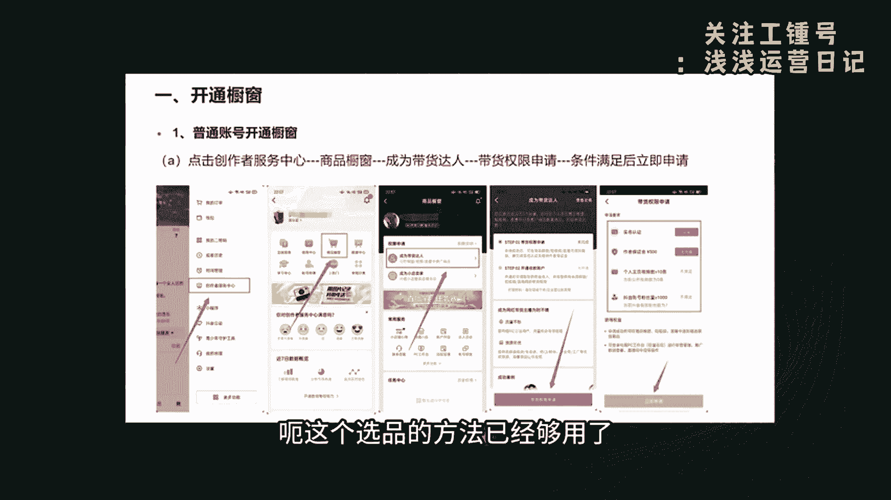
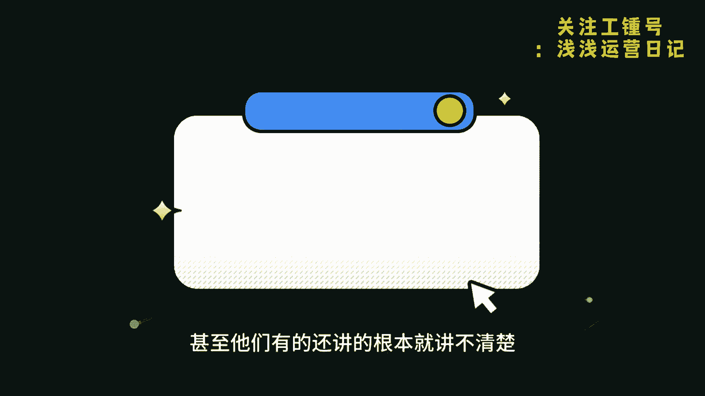
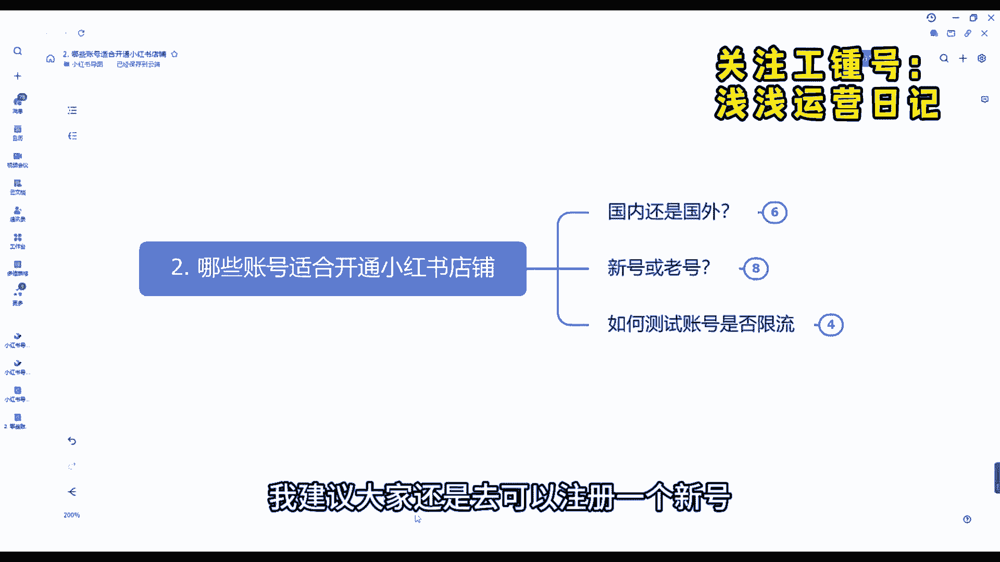
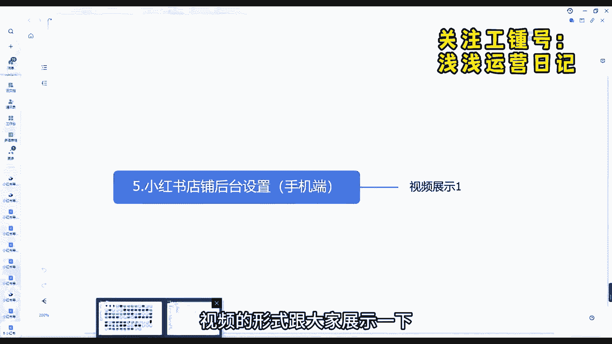
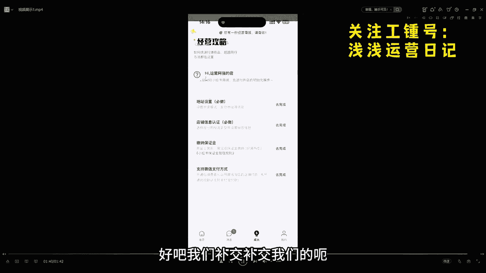
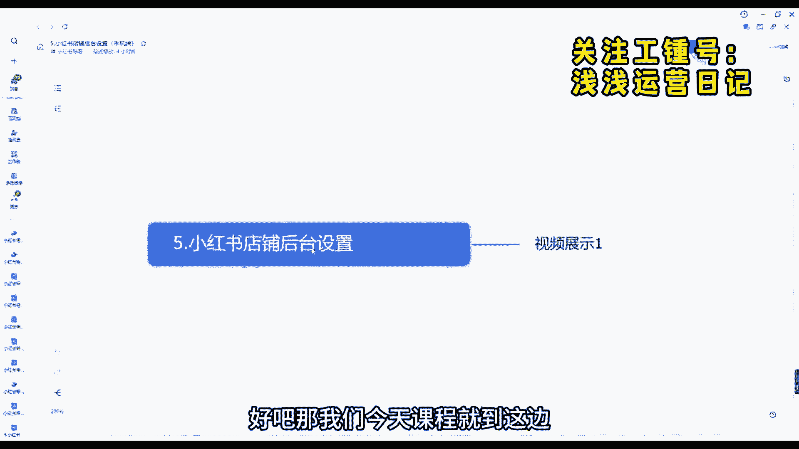

# 【2024版小红书体运营教程】全B站最良心的小红书开店运营教程！小红书体开店 起号真的快，赶快点赞收藏起来 - P1：小红书开店 - 万物都是彩色的 - BV1s6421Z73L

最近小红书电商真的是太火了，看我关注的市面上那些付费社群就知道了，小红书不管是做无货源电商还是做虚拟资料，都是他们现在主力的售卖项目，我去年年底自己做的时候还没有这么火，自己也是实操了三个店。

挣了大概有十几万块钱，然后现在店已经给朋友接手做了，我等于是入个股就拿点分成，上个月我也是出了一套实战免费的实战课程啊，在圈子里传的也是比较广，我决定现在录一个视频。

详细给大家拆解一下小红书电商到底怎么做，其实小红书电商就几个比较重要的流程，包括开店啊，选品上架，发笔记，搞流量，然后就是出售，我给大家一次性讲清楚，接着奏乐，接着舞。

就是市面上任何小红书课程都是这个流程，你就直接按着步骤，然后从零到盈利，就按着这个做nice，首先给大家讲一下，这个小红书无货源电商的整体的逻辑，它其实非常简单，就是我们从拼多多等第三方平台选产品。

然后把链接挂在我们自己的小红书商城上，价格上呢多加40%以上，这个自己定，然后发笔记引流量，有人买就从第三方平台发货，我们正中间这个差价呃，整个流程就三个步骤，开店选品流量，其中选品是核心。

我们一步一步的来说。

7chase，先说开店，开店是最简单的步骤了，直接用自己注册的这个小红书号开通，然后手机开通也可以，推荐是用电脑，因为开通完有一些这个必要设置，可以直接做完，官方网址，在这里只需要一个身份证。

按提示一步一步来，就需要注意的是，开店分个人店，个体店和企业店，就普通人先开个人店就行了，个体店拿营业执照可以开三个店，就后边我们要开多店的话，你可以选择升级个体店，企业店是开品牌店。

自己要有授权或者渠道，我建议新手先开一个个体店，玩熟就可以了，有经验的话可以做多账号，但是不是那种传统电商的铺货玩法，我们是多账号发笔记的矩阵玩法，那种店群模式不适合小红书这种种草的平台。

还有一些开店必须设置的东西，一个是支付宝，微信，这个是必须要开通的呃，开通以后别人才能付款下单，第二个是保证金，1000块钱，就是押金，退店的话全款退，第三个是平台要扣除5%的服务费。

第四个是各种软件费用，比如上架呀，一件代发呀等等，大概有0。5%每单，这个成本大家可以先开个店做做试试，就无货源的成本，其实已经算非常低的店铺开通以后，第二个步骤就是选品，选品就很直接了。

我们就做女性相关的产品，因为小红书用户群体，就是18~34岁的女性，发作品就记住一点，别人发什么爆款，我们就发什么，就搬别的平台，爆了的东西，我们大概率也能爆，目前选品的方法就四种就足够大家用了。

第一就是某宝的店铺畅销品，别人店铺卖的爆的品，你也拿来发，第二就是拼多多的畅销排行榜，就是经过数据验证的畅销品，选一些短期流行趋势爆款来发，第三是搬运抖音，还有小红书博主的爆款品牌发。

我之前的这个店搬的抖音的，一个几万赞的爆款的裙子，就是开店第二天笔记就直接爆了几百单。

呜呜呜，就不同平台之间他其实是有信息差的，他的作品能爆，你发你也能，第四就是抖音精选联盟，其实抖他就是抖店的畅销榜，和拼多多是一个原理，但是他需要这个开通橱窗，不过上面那三个选的这个选品的方法。

已经够用了，如果有抖电的同学也可以用这个方法，所以选品就是这么个逻辑，就是一定要选爆品，就大家一定不要自己乱发，永远不要相信自己的审美，不是一定要用别人和市面，市面这个市场测试出来的数据来为自己所用。

这样成功率就会高很多很多，这是最稳妥最省力的方式，比自己瞎琢磨强太多太多了，最后频选好了，就要说到流量，流量就是变现，因为我们能否爆单，就看笔记流量能否爆发，大家都知道这个小红书。

它不是淘宝那种传统电商，它是一个种草平台，它的流量来源，不是靠你上下几千个那种产品铺货铺出来的，而是靠发笔记的数量来的，只有多发笔记，笔记爆了才能有更多的人买，你这个叫产品。

所以多发笔记就是唯一要做好的东西，每天坚持发就行了，而且小红书这种种草平台自然流量它非常好，非常公平，根本不用付费推广，付费的效果反而没那么好，发笔记的内容也很简单，就直接去下载对应这个产品的某宝。

或者是拼多多店铺的详情图，还有好的这个买家秀呃，文案就直接拿别人的改一下，你就以一个个人体验的视角给别人推荐种草，就实在不会，你先关注十个同行账号，别人怎么发，你就学着怎么发就行了，等把一个电玩熟了。

就可以多个店搞起来，呃，多发笔记，把流量池子扩大就行了，呃市面上就是所有的培训呢，其实就这一套玩法，甚至他们有的还讲的根本就讲不清楚。

就上面说的就是这个一个整个的大概流程。

从今天开始，就由我来和大家一起来学习我们小红书，小红书整体的如何去做的对吧，我们店铺如何去做，我们小红书的IP如何去打造，以及我们关于一些呃剪辑方面的问题，都会跟大家讲的很明白，很清楚，好吧呃。

那我们今天这节课先跟大家来聊一聊，我们小红书的电商的整体的一些介绍好吧，额，那我们会从两个方面会跟大家具体来讲一讲，首先会跟大家来聊一聊，为什么我们要去做小红书电商，今天的主要目的就是跟大家来聊一聊。

我们整整堂这个我们的课程里面，会按照一个什么节奏，什么步骤来跟大家呃讲我们的小红书课程，首先为什么我们要去做小红书呢，首先你要大家要知道趋势很重要，小红书它目前算是整个互联网中，风口已经算比较大的。

但是最大的流量大家可能也知道，肯定目前肯定是抖音对吧，但是小红书它目抖音它已经处在一个风口，但他在逐渐下降的，而小红书其实你会发现，它每年他每个月的和热度啊，以及流量的。

都是一个处在一个持续上涨上涨的一个状态，所以说其实大家和我们一样，其实也是看到了小红书它的风口，它的流量，所以说我们才会去做小红书对吧，才会去越来越多的人在小红书里面赚到钱。

也有越来越多的人开始入局小红书，所以说趋势很重要，这个就是目前它的一个风口的趋势，所以我们也需要大家去顺势而为，而不是逆水行舟对吧，那目前小红书它是一个什么平台呢，首先第一个它是一个电商平台对吧。

我们可以在里面买东西，以及可以在里面卖东西，以及它是一个直播平台对吧，它是一个买手平台对吧，大家要明白这三个点就很重要，以及目前小红书相对于其他的一些平台来说，比如说一类电商的淘宝。

天猫京东这些是稍微比较简单的，而且相对于抖音来说也是比较易上手，成本比较低的，那他具体从哪两个方面呢，首先它不需要大家去囤货，不像抖音天猫淘宝这些，它需要大家有货源，有工厂对吧，他不需要你去说固定。

我必须得去直播对吧，直播卖货，这些都不需要我，因为我们大部分做小红书的人都应该知道，他是可以有一个叫做一件代发的，我们可以让别的平台帮我们发发货，我们自己不需要去发货，以及他对于像抖音来说。

抖音如果说你不实拍的话，或者说你是全部混剪的话，他肯定会很容易被呃配，被判为这种搬运啊，混检啊，会把会被判为违规的，而小红书不一样，小红书我们前期做的话，不需要你去实拍对吧，而且不需要我们自己去买样品。

我们不需要花费大量的人力精力，我们去做混检就可以了对吧，提供呃，你可以自己去寻找一些素材，通过这些素材做一个混剪，做一个简单的混剪，就能获得一些稍微大一点的流量啊，形成啊出单等等等等对吧。

形成这个店铺的一些火爆的流量，很简单好吧，那第三个点，它目前来说，竞争压力相对于来说也是比较小一点的，因为很多传统的电商的卖家呀，还没有开始完全的入局小红书这个平台，还有很多人甚至都不知道小红书平台。

而目前呃，2024年，也确实是小红书他的一个新一轮的风口，所以说我们大家一定要抓住时间对吧，抓紧时间去入驻小红书这个平台，也是目前我们呃，大部分人想在互联网上翻身的一个机会，好吧。

呃那这个就是我们跟大家讲一讲，具体我们为什么要去做小红书的好吧，那接下来我会通过三各方面跟大家来聊一聊呃，接下来的课程的内容好吧，首先呃先会简单的跟大家讲一讲，我们的小红书店铺的如何去操作的。

我会跟大家简单做一个预告好吧，我们如何去看我们的课程，我们的一个正确的步骤，我们怎么去操作的，我会从几个步骤来跟大家来讲一讲，首先第一个第一个我们肯定是开店对吧，店铺的一些基础操作我们对吧。

不管说你目前以前有没有开店，或者说你以前店铺操没操作，我们先如果说大家都没有的话，我建议大家先把我们这个开店的流程，都给大家看一遍，我们开店的整体的流程，以及店铺的一些基础操作对吧。

那啊具体怎么去操作呢，我们会第第二节课里面会跟大家讲，用什么账号去开店，用新号还是老号对吧，第三节课第四节课我会跟大家讲讲，我们如何去设计开店，一个人如何去开多家店铺，我们后期想做矩阵，我们如何去操作。

以及我们第五节课，第六节课会跟大家具体来讲一讲，我们如何完成店铺的一些基础操作，我们地址怎么去填写，以及我们怎么去发货呀，以及我们等等等等怎么去上品啊等等，都会跟大家讲，这是我们第一部分。

第二部分会跟大家讲讲我们怎么去选类目的，分析一下我们类目对吧，我们内幕其实也是很重要，我接下来也会跟大家讲啊，其实我们这个方向其实永远比努力更重要，我们要选对方向，这一一大点我会具体跟大家讲讲。

如何去选类目的，以及我们选好类目之后，我们如何去养号呀，我们如何去找到我们的对标账号，以别人学得好的，别人做的好的，他肯定是有一些好的地方我们可以借鉴的啊，这两节课我会具体来跟大家讲一讲。

我们养好号之后，我们如何去选品啊，我们类目也想好了，那那我们得去选品，我们通过什么啊，在什么地方选品呢，在淘宝抖音拼多多小红书里面都是可以选品的，以及我们选品的一些底底层逻辑对吧。

以及我们用一些大数据来观察一下，怎么去选品的问题，好吧，呃这是选品的问题，以及我们去选完品之后，我们怎样去做一些营销的活动，比如说上架优惠券等等等等，我们通过手机端上架产品对吧，电脑端上架产品是吧。

以及优惠券怎么去设置客服的聊天等等等等等，这些我都会具体细节方面跟大家讲一讲，以及我们这些品都上完了，店铺都开完了，那我们开始找素材写笔记了，我们如何去写，写出我们的高效的笔记，写出我们爆款的笔记。

找到我们爆款的素材对吧，我们在哪些地方找呢，如何在拼多多淘宝里面找，以及在更多抖音小红书里面找素材，我们的封面笔记标题，我们如何去正确操作，才能做出我们爆款的笔记，爆款的视频对吧。

我们手机端如何去发布笔记，电脑端如何去发布等等等等，这个我们会在找素材写笔记，这里面跟大家讲的很清楚，以及我们会跟大家具体来讲一讲，我们写完笔记，我们笔记后端的怎么去分析它。

我们获得如何通过官方来获得更多大量的流量，我们小红书笔记流量整体的分析，以及小红书模板的如何去正确使用，总共会有大量的模板可以使用，以及小红书如何去日常维护对吧，维护它对吧。

让更多的人吸引到我们的账户里面来，呃，我们发了一条作品之后，如何去维护它，如何能给他获得更多的流量，人和如何把别人留下来，如何让别人来出单对吧，小红书如何去使用1688拍单，如何我们使用吞金吞金软件。

以及我们如何跟厂家对接等等等等，这里面都会讲的很清楚，以及最后我我会给大家讲一讲如何去发货的，小红书的订单，揭秘我们如何获得更多的私欲额订单对吧，获得订单之后白奖啊，发给人家第第三方平台对吧。

我们行程一件代发，以及如何我们使用呃处理店店铺的售后问题，以及小红书如何去报备店铺对吧，这里面都会讲的很详细，跟大家讲，这是关于小红书店铺的一些呃操作的，那店铺操作完之后啊，我们要打造自己的IP对吧。

我IP课程我认为呃还有很多朋友跟我讲说，确实想学IP了，这个课程里面也会跟大家具体来讲讲，如何去打造自己的IP的对吧，什么是小红书IP，如何确定你的赛道，找到细分领域对吧，找到账号的精细化运营。

以及怎么去选题的对吧，我们笔记内容如何制作，账号笔记整体怎么去复盘对吧，如何形成商务变现，思域产品如何发布，如何导流的对吧，以及我们思域怎么去变现的，这个是将近十节课程里面。

我们会跟大家讲一讲小红书IP的，最后我们会来讲到，如何我们小红书素材的混剪剪辑篇对吧，我们如何去把人家的视频保留下来，我们如何去剪辑的，我们去如何去，如果说后期我们自己去拍摄的，我们拍摄的工具。

那构图以及口播如何录制，拍摄素材，初剪的如何添加贴纸啊，添加转场特效，字幕音乐一音效背景音乐对吧等等等等，这里面都会讲的很详细，好吧好的，那我呃这个就是咱们今天的课程，我们下节课会跟大家去具体来聊一聊。

今天来跟大家讲一讲，我们哪些账号适合我们开通我们小红书的店铺，我们会从三个方面来跟大家来讲一讲，我们这堂课首先会跟大家讲讲，不管说你人是在国内的还是在国外的，我们都是有办法来开通我们小红书店铺的。

或者说很多人想了解，目前我的账号是一个新号哦，我们是呃或者是一个老号，我们到底我们的账号是否去，可以去开通小红书店铺的对吧，或者说呃目前我想了解一下，我的账号到底是否被限流的等等这些问题。

我今天课程里面都会跟大家讲的很详细，首先呃不管说你是人在国内还是人资在国外的，其实都是可以去开通小红书店铺的，第一种情况，你如果人在国内，在我们中国大陆内对吧，有我们大陆的身份证的对吧。

那我们直接可以去用身份证，开通一家个人店铺就可以了，小红书店铺跟其他平台的一些店铺，开通店铺条件还是不一样的，它整体来说还是比较宽泛的，呃因为你像其他店铺的话，整个条件还需要你有营业执照。

而小红书开通我们个人店的话，并不需要你去有营业执照，开一个个人店就可以了，有一个身份证就可以了，第二个你如果说是在国外的对吧，但是你也有大陆身份证，那没问题啊，我们也是可以用身份证开一家我们个人店好吧。

呃就是你首先第一个条件，你如果说不管人在国内还是在国外，你有身份证，你就可以开通了，第二个你如果说人在国外，但是你也没有大陆的身份证对吧，没有大陆身份证，那怎么办呢，我们就需要有一个海外的营业执照开通。

可以开通一个专卖店和一个旗舰店，我们也有学员，他是人在国外的，但他有自己的货源，他们自己有外国的一些货源，那他想营销到中国来怎么办呢，那就需要有海外的营业执照，就可以开通店铺，就可以呃。

营销到国内了好吧，但是它只能开通专卖店跟旗舰店好吧，额这个是一个条件，我们不管人在国内还是在国外都可以开店，第二个就是我们考虑到我们新号还是老号，我们如何去开店的问题，不管说你是新号还是老号。

其实我们都是可以去，如果说条件允许的话，都是可以去开店的，好吧呃，都是可以去发布作品的老号，首先我们分为你之前有没有发过笔记，如果说你之前没有发过笔记，那没有问题啊，第一种条件。

如果说你没有发过笔记之后，这个号之之前是我自己，我自己在用的，我经常天天在游对吧，天天在刷一些我自己喜欢的内容对吧，而且这个喜欢内容，可能跟我自己接下来想做的内幕是有点区别的。

所以我们最好是要换一个专门的新号，专门的新号，因为可能这个标签就不精准了，跟我们未来想打进这个人群的标签，肯定是有点冲突的，有点冲突的，因为我们自己用的账号嘛，标签啊，什么都呃都都有了。

后续来说不太好养号的好吧，第二个呢，如果说你之前对吧，只是注册过，但是没怎么用的，这种情况呢可以用这种账号，我们因为这种后续是比较好养号的，比较可以自己自己使用的，如果说你之前发过一些日常内停的笔记。

一方面要看这个号自己刷的多不多，如果说你这个号啊刷的比较多，那我们就需要及时给他换掉对吧，因为你刷的多了，你这个发货笔记了，你经常标签，我还是那句话，你标签乱了，标签乱了话，你想后期再养改过来。

那难度还是比你重新再培养一个号的，难度要大的，如果说哎自己刷的不多，而且发的笔记啊，整体流量也不是很好的情况下，那因为他没有打上足够的标签嘛，那我们就可以自继续使用，另一方面呢要看笔记报没报粉丝账号的。

整体的粉丝数量是怎么样的，如果涨的不多，刷的不多，笔记也没怎么报过，那我们可以删掉笔记，因为我刚刚讲到了对吧，你整体的流量不是很多，因为你没人有打上足够的标签，那我们就可以用，如果说你刷的不多。

之前发了其他类型的笔记，且有了一定的粉丝基础，我打上人群标签了，人家都都都能刷到我的账号了，那我们就需要果断果断的换掉新号，要不然你这个老号后续如果说标签很乱的话，你再想把这个标签给他改正的话。

难度肯定是比你培养一个新号难度要大很多的，而且我们接下来也会跟大家讲一讲，我们新号如何去养号的问题啊，好吧呃，这是第一第一个老号的问题，如果说新号的话，其实我们自己如果说我们没有这些问题。

我们自己做一个新号也是没问题的，我们会对吧，那如果说你还是拿不准，我们自己到底是否用自己老号，那我建议大家直接就换新号，找自己的家人帮忙注册一个信号就可以了啊，找自己的家人一定要是比较熟的家人。

因为这个的话后续还得考虑到一个银行卡，人家打的成交额，打到银行卡里面的问题，好吧，这是第一个新号老号的问题啊，第三个我会跟大家讲一讲，如何去测试账号的是否被限流，而正常情况下。

我们账号如果说没有出现大量违规的情况下，正常情况下是不会有太多限流了，大家不用太过于担心，好吧，如何知道自己的账号被限流呢，我们可以通过这个方法测试账号的限流方法，我们可以发布一个日常分享的一个笔记。

发布什么都行对吧，正常一点的笔记，日常的分分享的生活就可以了，看24小时内的流量情况，如果24小时后流量能达到50左右的对吧，那么正常流量是正常的，账号流量是正常的，如果说连50都没有。

可能只有一个两个这种额流量的，那说明你一个账号可能会处在违规阶段的好吧，如果说不正常被限流了，那我们怎么办好吧，上面之前可能有违规的，或者存在潜在违规的，我刚刚讲到流量很低的，我们建议注销掉该账号。

重新注册就可以了啊，重新注册完之后，这一位是一个型号，我们在做继续培养就可以了，好吧呃这个就是大家呃跟大家讲一讲，我们如果说我们怎么去选择号账号，以及我们如何去测试账号的流量的，大家不用去担心对吧。

我们开一个新号，开一个老号的问题，我建议大家呢，除非说你之前的账号做的很好啦，或者要不然，你我建议大家还是去可以注册一个新号。

重新养号好吧，那我们今天这个第二节课程就到这边。

今天我们来讲一讲，我们第三课程，小红书开店的一些基础的一些流程，我们如何去开通我们的个人店，个体店以及我们的一些旗舰店啊等等等等，好吧，我们先从我们的个人店开始来讲呃。

首先我们个人店的话是可以通过手机开通，也是可以通过电脑开通的，手机开通的话，我们就下载一个，我们我们可以用小红书本身的账号也可以，或者说我们下载一个小红书的千帆，我接下来也会跟大家具体来讲一讲小红书。

千帆好吧，我们需要的需要的证件，需要你有一个身份证以及有一个银行卡呃，但是这个一定要是同一个人才行对吧，你身份证跟你银行卡绑定的是同一个人呃，这个是必要的条件，因为他后续。

所以说这个如果说大家是用自己家里面人，或者用亲戚绑定的这个身份证的，绑定这个账号的，所以说一定要找比较熟悉一点的对吧，要不然后续会考虑到一个经济纠纷等等对吧，这是第一个。

第二个呢就是我们开店过程中金利营的类目啊，其实可以前期随便选一个，先把店铺开通了再说，反正呃后面啊反正可以随时再改类目，因为我们叫如果说你想持续做的话，你要交交保证金对吧，但是我们在开店的过程中。

保证金可以先跳过，先不用交对吧，店铺可以随便取，后面我们后续我们再改都可以好吧，经营的地址呢也是可以随便填写的，这都没问题好吧，那具体的开店步骤，我来跟大家来讲一讲怎么去操作。

首先第一步打开我们小红书的搜索栏，这是我们普通的系统，打开我们小红书搜索栏，你看到了，这是我们小红书搜索栏，我们在上面搜索开店两个字，搜索开店两个字，打开开店了，看到开店，我们搜索开店。

这边有个小红书电商，小红书电商官方平台，点击开店，我们就点击这个就可以了好吧，点击开店之后，点击另一即开店，这边跳出来之后，我们这边有个立即开店呃，我们可以先看一下，比开店必要必看的一些材料费用。

而正常情况下开店是不需要你，如果说开个人店的话，不需要收费的，零元就可以开，开通了，服务费优惠，流量扶持必备工具，选择立即开店，选择立即开店之后，我们选择店铺的类型对吧，我们前期我们可以先选择个人。

选择个人店，那个人店的话只需要你有身份证，如果说你想开一个个体店的话，需要有营业执照以及运营人的身份证证件，这个的话是支持一部分的类目的对吧，那但是如果说你想开通个人店，后期也可以转为个人。

个体工商户店都可以的好吧，如果说你是企业的话，也可以开通企业店，但是企业的话可能会以额以及专卖店，可能会呃考虑到一个税务的问题好吧，关于开通电，我们点击店铺选择完之后，我们点击下一步对吧。

它会里面会有很多店铺的介绍，我们就选择个人店，选择嗯自己想要的店铺就可以了，选择完店铺之后，我们选择点击下一步，点击下一步邀请码，我们可以跳过对吧，没有可以不填，这是关于服务商的呃。

我们填写其中的一些信息，身份证的正反面照片啊，以及我们这边可以选择属于零星小小额交易，依法无需要办理了，以及如果说我们是农副产品的，需要办理的对吧，开店必备的，我们这里面也是有一些开店必备的个人身份。

个体户的企业啦等等等等，电商我们去填写一些自己的一些信息就行了，很简单好吧不呃，有很多信息，如果说你不需要可以跳过的，你可以先跳过对吧，我们选择个人身份，个体店电商用品就可以了，选择立即开店。

正常情况下我们的店铺就可以开通了，好吧，这是我们开店的步骤，那有几个注意点跟大家讲一讲，首先呃，后续提现的金额会进入开卡身份证人的银行卡，所以说这个就是刚刚跟大家讲过的，我们需要开卡人的身份证。

跟我们的这个银行卡需要是同一个人，好吧，呃以及我们如果说多开店的话，最好找熟悉的人来开对吧，亲戚朋友啊，个人店，正常情况下，我们当天时间，如果说你这些信息填写的都没有问题的情况下。

当天他就可以下来的小红书的名字，也就是店铺的名字，比如说需要注意的是提前查重对吧，我们小红书店铺的名字也也可以提前，可以前前期可以先随便选一个，后面也可以改对吧，但是七天改一次。

比如说你这个小红书名称叫111，那你这个店铺名称就叫111的店，个人店不需要缴纳600块钱的证件费用呢，好吧，这个是我们跟大家简单来聊一聊个人店，保证金的话，1000块钱大概在1000块钱左右。

也不一定根据不同的类目来分好吧，最低应该是1000块钱，这个有个平台的扣点，平台扣点大概在每个月成交额的5%，因为基本上所有平台他都会有一个平台扣点，低于1万元的，是不收这个平台扣点的。

一个自然月订单金额呃，结算额小于1万1万时，平台免收技术服务费，懂我懂我说的意思吧，假如说你这一个月整体的收入在小于1万元的，成交额在小于1万元的，他是不收你这技术服务费的，结算额超过1万元。

部分平台按5%收，就比如说你今天呃啊，这一个月成交额超过了2万，那你超额2万，那里就有其中的1万，你要说给平台一个5%的收服务费好吧，1万元的结算金额已减去退款金额，技术服务费小于5%的店铺。

不享受5万元和以下的棉袄，这个大概大家了解一下就可以了好吧，这个是关于个体店的个体店的一些部分，大家可以去开店呃，了解一下，如果说你想开个体个体店的话，就需要我们实名小红书的账号呃。

以及加上我们的营业执照对吧，需要是同一个人的，就比如说你小红书是是是谁的营业执照的法人，营业执照上面的人最最好是同一个人，就要同一个人，然后我们可以通过手机开通手机，打开我们小红书的商家版。

目前也叫小红书千帆好吧，呃小红书千帆给大家打一下吧，后续也会跟大家具体来介绍千帆，然后大家可以下载这个手机，开电脑，开通的话就开小红书呃，千帆千帆的官网就可以打开里面去注册了好吧，我们的专卖店旗舰店。

如果说你确实是有专卖店，旗舰店也是可以按照我们刚刚的步骤去开通的，呃接下来讲一讲我们一些特殊的一些类目，可能是比大家比较想了解的，比如说酒水啊，零食啊，水果啊这些需要有营业执照加食品经营许可证。

加上品牌授权的，这些基本上都需要的，但我建议大家就是，如果说你不是特别擅长于这几个行业，尽量就先别入局这些好吧，美妆行业呢需要有化妆品备案凭证，家电行业的需要有3C认证证书。

3C数码的需要有3C认证证书，其他的内幕的都有，具体的介绍，都能在我们小红书的内幕里面可以找到好吧，然后如果说大家有任何关于内幕不懂的吧，我们接下来也会跟大家讲一讲，怎么去选择类目的问题，好吧。

那我们今天这堂小红书开店的一些基础流程，主要是跟大家讲一讲如何去开店，步骤操作的好吧，那我们今天这个课程就到这边，大家好，今天我们来讲一讲我们的第四堂课，个人如何我们开通多家店铺。

我们后期如果说一家店铺做好了，我们想开多家店铺，我们怎么去选择，我们怎么去做矩阵的问题呃，我们会从几个方面跟大家来讲，首先第一个开多家店铺的前提，如何去开家多多家店铺啊，我们店群一些注意事项。

我们先来看一下开多家店铺的前提啊，所有的我们开通多家店铺的前提，一定是你已经能把你手里面的一家店铺给他，运营好了，我们再去做，你连你自己手里面的第一家店铺还没有做好，你就想去大量的去铺，大量的去做。

那是不现实的，你最终可能导致所有店铺都做不好是吧，呃这个是第一个前提，我希望大家听完我的课程之后，能把你的第一家店铺做完之后出单了，能有稳定的持续的出单了，我们再去大量的去铺垫好吧，这是第一个条件。

第二个条件，你能有大量的闲余的时间，空余的时间你去做对吧，我可能花一个店铺可能需要呃一个小时，两个小时，但是你可能花两个店铺可能就需要三个小时，四哦，五个小时六个小时了，就可能不是1+1=2的问题了。

因为两个店铺你可能会发生的事情，可能越来越更多好吧，否则你要先全力做好一家店铺，先把一家店铺做好，先把它整体的熟悉它的流程，整体的方法都给他熟悉了对吧，我们再去做其他的店铺，我们再把其他店铺给他做好。

我们再去铺铺大量的店，好吧，这是开多家店铺的前提，我们要有一个稳定的出单，我们先稳定的能赚到钱啊，我们开店流程，我们运营流程，我们笔记啊，我们和混剪，所有这些我都能学会啦，或者怎么去铺货。

这些我都能明白了，我再去开多家店铺好吧，那我们如何去开多家店铺呢，首先流程流程方面，首先第一个小红书账号加实名账，账号的注册加实名对吧，我们用营业执照，这是第一个，我们可以用自己的家人重新注册账号。

重新加实名，重新呃，用身份证注册小店店铺都可以对吧，这是第一个方法，第二个方法呢，我们用营业执照可以注册成企业号，企业号也可以多开小店好吧，需要600块钱的保证金对吧，再去再去开个体店对吧，这是流程。

第二个呢，我们每多一个营业执照，就是可以多开两家个体店的，懂我意思吧，就是一个营业执照可以多开两家个体店是吧，你也知道可以在淘宝里面，或者说拼多多找人代办，正常情况下几百块钱就可以了对吧。

几百块钱和比如说你是做一个营业执照，可能只要个一一两百块钱，如果说营业执照加食品经营许可证，可能四五百左右，这个是需要身份证的，以及需要你个人提供信息的对吧，这个只要你找一个可以做电商的呃。

营业执照就可以了，并不需要说你还是需要线下的，只要你同类目的就可以了，好吧，这是我们如何去开通多家的，那我们开通多家之后，我们会有一个店群，那什么是店群呢，店群就是我一个店铺一个月能赚2万和一个月。

一个店铺一个月能赚5000，你想你想你想要哪个，我问一下大家，你想要哪个，你想要一个店铺一个月赚2万，还是想要一个月店铺，一个月能赚5000呃，相信大部分肯定都是想做前者。

但是难度以及付出的精力都是呃可能是N倍，你比如说一个店铺我做2万，但是一个店铺你做4万，可能你花费的时间是远远不止这个五千五千的，四倍的，可能十倍都不止，对不对，那我们可以放低标准呀。

我们既然一个店铺能做到5000，但是我们做到5000，做到1万，做到2万，难度很大，很很很高，那我们可以多做几个5000的店铺，那我们是不是一都都能起来了，懂我说的意思吧。

在小红书这个方面跟其他电商其实也是一样，你能做起来其实简单，但是你想做好做大做强，做到一个比较好的头部来说还是难度比较大的，所以说它跟其他平台不一样的一点，就是他能迅速的去复制复制。

我可能我说一个一个店，一个月我能有5000块钱的利润，但是我想一个月有2万块钱利润很难，但我可以做十个店，做20个店，每个店都有5000，这个难度肯定是比你能把一个店做到10万，20万。

这个难度肯定是要低一些的好吧，因为我们整体的流程来说，大家都熟悉了好吧，这是第一个，我什么是店群，那我们多开店需要有哪些注意的事项呢，首先一机一卡一账号，这个大家能明白什么意思吧，就是一部手机。

一张电话卡，一个小红书账号是吧，主账号建议我们一一个账号放在一个手机里面，不要去一部手机，去多个账号去切换，有可能啊会你正常情况下一个账号违规的话，可能会连同其他账号也会判定为违规，懂我意思吧。

所以说我建议是一机一卡一账号，目前小红书多台设备，多个账号连在同一个WIFI下是不会受什么影响的，如果你同一个WIFI没有影响，但是你最好不要把多个账号登在一个，一个手机里面去对吧。

呃而且呃正常情况下浏览器登录多个店铺，一个在电脑里面多登录一个店铺，多个浏览器也是没有问题的，好吧，赚钱呢其实就是一套行之有效的动作，持续复制就可以了，为什么说很多连锁店。

很多连锁店可能一个连锁店可能能赚到一个，一年赚个几10万很简单，但是你让他赚几千万很难，但是他去做连锁了，这其实就跟我们做小红书店群其实是一样的，道理好吧，大家要首先要明白这个道理。

我们再去做后面的操作好吧，那我们今天这个个人如何开通多家店铺，课程就讲到这边，大家好，今天来跟大家来讲一讲小红书店铺后台，我们如何去通过手机端设置一些内容的好吧，然后我们会以视频的形式跟大家展示一下。

首先呃我们打开的系统是这千帆系统，来给大家看一下小红书千帆，那大家能看得见吗，小红书千帆的系统，直接我们到应用商店里面去搜索，小红书签帆就行了，这个是我们后台呃，基本上会操作的好吧。

这直接到应用商店里面去搜搜搜索就可以了，我们打开之后，大家可以看到，我们打开之后，我们正常是这个页面，这是我们创的一个新店，基本上没有什么操作的，这边有一个消息，我们点击消息，点击消息里面。

这里面就是我们客服接待的一些通知，如果说有人问我们店铺的一些问题了，我们就可以在里面去回复他，在里面去回复他，只是客服接待的一些通知啊，都是可以在里面看到的，以及我们配置客服啊等等等，这里面都可以看到。

看到了吗，这是店铺的一些消息啊，一些通知啊，一些比如说你违规的通知啊等等，这里面都会有好吧，然后我们打开我们的首页，这里面有个区初始化，我们这边可以去填写一些信息，以及我们这边有个全部工具。

我们这边可以发布作品啊，笔记管理啊，电脑端啊等等等等，这边都可以，我们点击全部工具，这里面可以呃，给大家看一下啊，点击全部工具，这边有发布作品，全部全部发布商品，我们可以发布新的商品。

我们可以管理全部的商品，全部的订单对吧，售后的订单数据中心呃，商品笔记啊等等等等，这里面都可以，以及我们发布商品的类目啊对吧，品牌类目啊，店铺的装修群管理呃，我们打开这边有个成长成长，这边正常情况下。

我们先要去把这些给他完成对吧，才能继续后面的操作地址对吧，我们这边有个地址填写我们的发货地址，这是我们这是我们开店铺的第一操作，我们需要去填写我们的地址好吧，我们就点进去完成。

在这个地方也是可以去填写地址的，看到了吗，地址呢我们这边可以，这个时候我已经填好了对吧，我们正常情况下可以去填填，具体地址怎么填呢，这边可以看到我们联系人随便写，我们自己就可以了。

地址中国大陆选择了应该在的地区，详细地址呢其实可以随便填，因为我们是做一件代发的嘛，我们这个地址是是可以随便填的好吧，我们填写自己的手机号码，就给买买家留言，一定要之前有这边是可以填写联系客服的。

但是现在联系联系联系不了了，我们一面前一定要联系客服给地址好吧，这是就是影响到我们一些退货的一些问题，如果说我们这边填线联系客服的话，他这边平台是不给通过的好吧，我们要在这个地方来填写地址好吧。

然后我们填写完成之后，这边也可以填写我们的物流，物流板块对吧，我物流板块填写我们的名称，继续去添添加就行了对吧，我们添加呃，这边是可以添加我们的付运费板块的，你可以选择。

如果说大家看过抖店的这些应该都明白对吧，呃或者说你们不明白的话，我们可以添加运费模板，就比如说你是新疆西藏这些不配送的对吧，我们可以直接选择不配送，如果说需要付费的对吧，买家承担邮费的。

我们也可以去这边去选择非偏远地区的，或者说全国包邮的这些模板，我们可以它本身它会有系统默认的，但是我们正常情况下就选择这个模板就行了，布置全国班游嘛，因为这些地方我们都需要付邮费的好吧。

这些邮费也是比较高的，我们就这是关于地址的选择，再看这边发布作品，看到了吧，这个就是大家可能呃这边有一个优惠券，可以设置优惠券的，来给大家具体来跳一下，看一下，这边有个营销，这边有个优惠券活动报名对吧。

点击进去，我们可以创建自己的优惠券对吧，比如说你创建店铺通用的店铺通用的优惠券，指定商品的优惠券，店铺的新人券对吧，这些都是可以的，我们接下来也会跟大家具体来讲一讲，怎么去操作的，全网自动推广的对吧。

正在生效的以及失效的等等，这些都需要大家去了解的，这边填完之后呢，地址填完之后，店铺的认证信息对吧，我们需要去填写你是个人店啊，什么店啊填写，然后缴纳保证金，如果说大家想长期在呃我们这个平台做的话。

我建议大家还是需要去把保证金交了，我们这边一定要注意，一定要去把这个微信支付给他打开，以及我们的支付宝支付，按照它上面的流程对吧，你填写自己的身份证号码，以银行卡，只要在这里面操作，我们就可以。

人家就可以通过微信支付，可以通过呃支付宝支付了好吧，我们补交补交我们的额店铺的保证金就可以了。

因为根据不同的类目，所以说他保证金也不一样，那这个就是我们今天的这个小红书店铺，后台手机端的一些操作，大家多去琢磨琢磨，多去摸索摸索，基本上这个是没什么太大难度的好吧，刚刚展示了一下如何去使用呃。

如何去设置地址呀，如何使用优惠券好吧。

