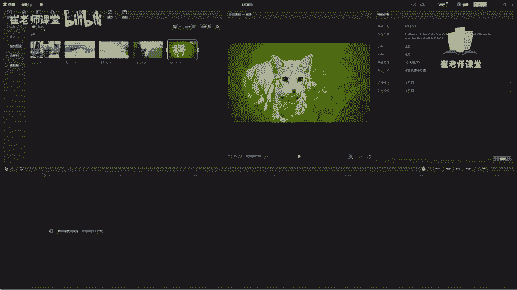

# 【2024版小红书体运营教程】全B站最良心的小红书开店运营教程！小红书体开店 起号真的快，赶快点赞收藏起来 - P20：18.导入素材以及查看方式 - Sathenay - BV1uqHreLEER

在素材箱区域呢可以单击执行导入的操作，可以导入的文件呢有视频音频图片。

单击导入，选择当前素材所在的文件夹的位置，就可以查看到当前的素材，之前第一节课都和大家讲过，我们要在剪辑之前呢要把素材进行整理，这样的话能够方便我们的工作，需要注意的是。

在这里呢能够查看当前所有文件的格式，这些格式呢在之前的视频当中也详细的讲过，如果遗忘的同学，可以翻开之前的视频去看一下，如何进行导入素材的操作呢。

可以选择当前的素材单击，然后选择打开当前素材就导入进了素材库中。

也可以呢选择导入，在这里选择当前素材。

双击也可以导入进素材库当中，另外还有呢比如说你打开的是。

外部的文件夹选中想要导入的素材，直接把它拖拽到素材库当中，也可以进行导入，当然哈也可以直接导入。

在时间轴当中也是一样的，我们先将它进行删除。

选择导入，在这里给大家介绍一下常见的导入技巧，比如说在剪辑视频当中，不可能是只有一两个视频。

对不对，那么在这里直接选择素材，选择打开，选择素材选择打开就比较麻烦了，比较繁琐，那么如何进行导入多个素材呢。

选择导入啊，大家可以在任意空白处，鼠标按住左键不放，一直拖拽，你会发现有蓝色的一个矩形区域啊，如果是在蓝色矩形区域范围当中呢，可以进行选择，松开鼠标，就把所有矩形范围内的素材都会进行选择。

然后选择打开，就可以将多个素材导入到素材库当中。

那么选择导入在这里呢，我们会发现直接鼠标拖拽进行选择的话，也是不太方便的，那么如何选择多个连续的素材文件呢，什么是连续文件呢，比如说从这里到这里这个位置，或者是从这个位置到这个位置，你用矩形选框的话。

不太容易选择，你看啊，如果选的话，只能选选中在这个区域啊，那么如何从这里选到的这里呢，可以按住shift键，比如从这里，然后选择这里，大家看一下，按住shift键选择。

同时呢可以将它进行选择多个连续的素材文件，紧接着如何选择多个不连续的文件呢，不连续的文件，比如说选择海浪，海滩这两个关于海面上的风景的这些素材，可以直接按住CTRL键选择，也比如说我只想选择这个素材。

这个素材和这个素材，那么怎么选择呢，可以按住CTRL键选择这个素材，然后选择这个素材，选择这个素材，也可以自定义的去选择当前素材嗯，它是能够啊进行多个素材的不连续选择啊，这个操作呢不仅仅是在剪映当中啊。

你学习的任何视频剪辑软件，在导入素材的时候呢，基本上也是这样的操作，这是对于一些零基础的电脑的小白来说，咱们稍微讲的比较细一点啊，但是我相信这些绝对是对大家有用的。

然后可以选择打开看一下，就将当前的不连续的素材导入进了素材库当中，那么如何将导入进素材库的素材。

拖入到时间轴里面呢，很简单，可以直接选择当前素材进行拖拽，就投入在素材库当中，也可以呢在这里呀选择呃这个加号啊，就添加到轨道，单击就添加到轨道里面，但是呢使用最多的还是直接进行拖拽。

就可以创建新的轨道，创建新的层。

这个很容易理解啊，那么如何进行分割素材呢，视频剪辑剪辑，那么肯定要用到剪，对不对，之前和大家说过，有很多剪辑种方法，比如说，有分割可以进行分割，这个适合对于当前视频素材进行快速的剪辑，来使用。

快捷键是B也可以呢配合着播放头来选择分割，也可以进行剪辑。

将素材导入进素材库当中呢，你会发现在上方的这个区域啊，可以查看导入素材的样式，单击之后呢可以选择，比如说宫格，然后呢还有列表能够查看当前的时间线，可以根据自己的喜好以及工作习惯来进行调整，还有排序。

单击之后呢，可以在这里啊进行对当前导入的素材进行排序，比如说你的素材比较多的情况下，可以设置导入时间，或者是创建时间以及名称的排序，文件类型的排序，时长的排序，以及根据尺短到长或者是长到短来进行排序。

还有呢单击全部呢可以进行查看，比如说只查看视频，或者是只查看音频，或者是只查看图片啊，因为我们的图片没有进行导入。

我们选择导入吧，导入一我们导入当前的音频以及图片。

选择打开选择全部，然后可以查看视频，查看音频，查看图片来进行快速的找到我们想要的素材，然后呢可以在这里啊，单击可以进行搜索素材的名称，比如说你的素材比较多的情况下，可以在这里选择搜索名称，比如说小猫啊。

我们回车键诶，能够找到当前有关小猫名称的所有素材，然后进行选择，你会发现除了导入的本地素材呢，有比较详细的查看方式，其他的素材呢也会有查看的方式，比如说但是最多的呢是以搜索框。

比如说直接进搜索或者是选择查看的方式，全部或者是可商用来进行呈现的。

