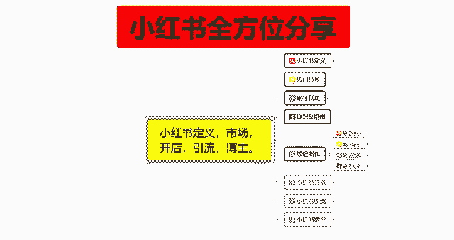
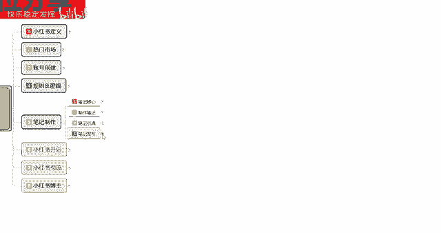
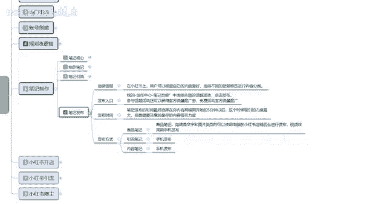
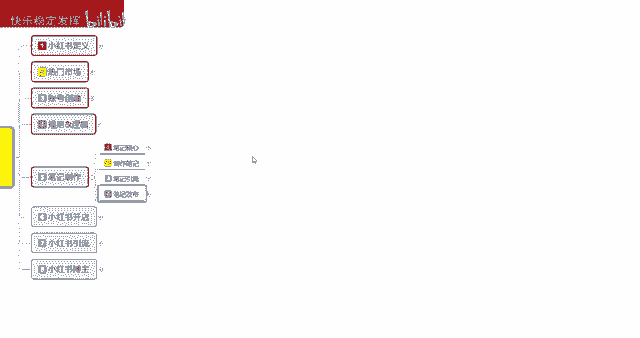
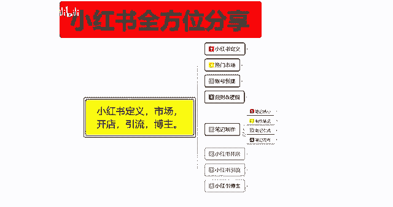
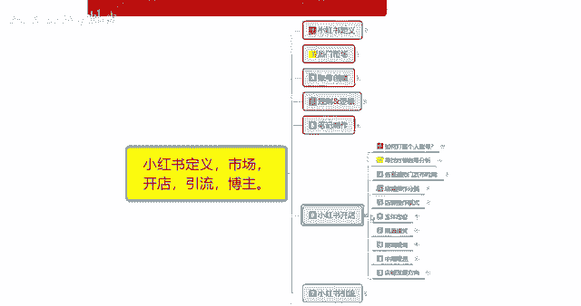

# 【2024版小红书体运营教程】全B站最良心的小红书开店运营教程！小红书体开店 起号真的快，赶快点赞收藏起来 - P20：18.小红书新账号笔记制作（12） - 快乐稳定发挥 - BV1AbtoebEjX

大家好，今天给大家分享的是小红书全方位整体分享的，第五大课时呃，最后一节课笔记的一个发布技巧，这个里面的话笔记发布。

就说我们正常的一个小红书笔记啊，你制作完成以后，他不是随意的去发放的。

因为你的发放，说实话他有一个权重的额笔记发放啊，选择话题里面的话，就是说在小红书上面，用户可以跟自己自己的一个兴趣爱好，选择不同的一个话题标签进行内容分类，这个就是我们账号创建之初，所选的一个社区范围。

然后呢进入发布入口，这个发布入口的话，它是商品发布的，商品发布里面有额外的一个权重，然后或者说是你在电脑端上面去操作的话，它有一个那个小红书等呃任务，每周任务，每月任务，每日任务等等，这些任务的话。

他会给你额外的一个流量扶持，就是给你基础的曝光量增加，如果说你的笔记数量还可以的话，那你可能就就直接跳到第二层级，第三层级去了啊，就不会是在第一层就晃动发布入口，在什么地方呢，就是创作中心笔记灵感里面。

然后呢选择自己适合这个话题，点击发布就可以了，参与话题活动的话，就说获得官方的一个流量推广券，这个流量推广券的话就是被动给你使用的，然后这个给你增加额外的一定曝光，量量不大，但是比没有要好很多好吧。

对前期刚开始创建的账号来说的话，还是比较有用的，然后呢就是发布时间，笔记发布时间的话，最好的话就是说选择在你的一个内容高峰期，开始以后啊，5分钟，这个时候吸引力度是最高的，就是小红书的用户。

慢慢的已经开始登录小红书账号，去观察他们自己感兴趣的内容，那你新的一篇笔记内容发出去以后的话，然后通过自己官方的一个流量推广件，获得更高的一个权重曝光啊，但是有一点啊。

这个就需要你自己注意你自己的一个笔记状态，就是说笔记，你不能光为了完成系统给你发布的任务，而随意的去发送笔记，这种笔记发出去的话基本上没有作用的啊，而且会浪费你自己的一个曝光流量。

没必要就说你要把笔记的一个内容整理好，吸引力度做起来以后的话，获得点击率超过同行，在你同频同层次的一个数据量以后的话，那你做爆的几率就会高很多，最后呢就是发布的一个方式，笔记商品笔记啊。

引引流笔记和内容笔记的话，这个发布方式是不一样的，商品笔记建议大家使用电脑，然后引流笔记和内容笔记的话就是手机发布，当然了，如果说你商品笔记用电脑，手机发也可以，效果也还不错。

但是的话它的编辑就比较麻烦，为什么说是引流笔记和内容笔记的话，呃建议手机发布呢，你就说所有的资料你全部在电脑上面，编辑完以后，把数据全部传到手机上，再用手机去发的话，效果会好一点，因为现在使用PC端。

这个人比较少，基本上的话都是使用手机端，手机端的一个用户量的话是非常大的，但是PC端的一个用户量的话，说实话以商家为主，用户的话，基本上现在没有谁去用那个呃，电脑去观看小红书，除非是他在上班时间摸鱼啊。

上班时间摸鱼的话，去看看小红书啊，找找自己感兴趣的内容，还可能，但是如果说你正常用户的话，他基本上很少使用电脑端的，就看你自己的一个受众目标群体，自己是否能够把准确的一个目标定位啊，给找准确。

不然的话你基本上不是太好弄，这个呢就是整体的一个笔记发布啊。

这一套笔记制作的内容啊，是比较多的，所以说的话我是分了很多小节，给大家进行了分享，这里面包括你的一个笔记核心，你要了解知道啊，自己的笔记首先是封面，然后是标题，这两个点你做不好。

后续你基本上做好了也没有什么作用，然后笔记制作的时候，你们需要注意的一些违规词啊，啊自己需要注意的一些违规事项都了解一下，然后笔记引流，你所发布的一个流量入口在什么地方对吧，你自己要知道你笔记做完以后。

你又往什么地方去发，对不对，你不能说你做个商品笔记额，前期上来就直接怼，那肯定是不行的，基本上要先发那个引流笔记，然后再去做商品笔记，你的商品笔记不能急着去推广的。

你不能说我小红书上面我开店开了一个星期，我还没开单啊，这种的话你不现实的，因为你小红书的账号全程都没拿起来，你想开单不可能啊，包括你店铺的一个技术数据都没做好，然后你做网红做引流的对吧。

你觉得小红书我开了好几个小红书账号，然后发的笔记啊，也没得到引流效果啊之类的，其实就是你自己很多基础东西没有把控好，把这些东西全部整理好以后的话，你的小红书笔记其实发布出去很好做报的啊。

你不说都做到10万以内，你基本上小红书笔记，你自然发出去有个三千五千左右的一个小眼睛，数量很简单的一个账号，做到这种程情况的话，基本上就是半个月到一个月左右，前期基础做好以后的话很容易。

如果说你前期基本上没有基础没有做好的话，基本上就要两个月左右啊，才能做到接近5000到2万之间，当然了，你有些内容你做不好的话，那也没办法啊，这个根据个人，根据个人选择的一个社区范围去确认和推广。

那这节分享呢就给大家分享到这，下一节开始呢给大家分享的是小红书开店，就是小红书上面我们整体要开店以后的话。

店铺应该怎么去操作啊，这里呢也是一个大课时，内容的话是非常多的，额我会一节一节的给大家进行分享。

