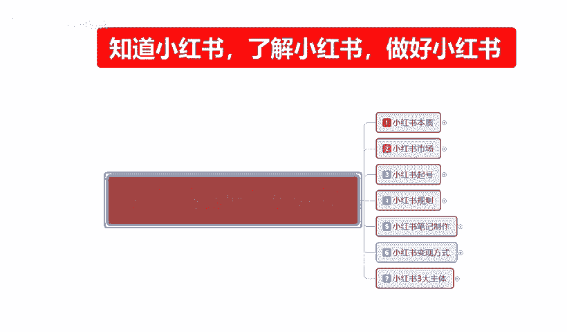
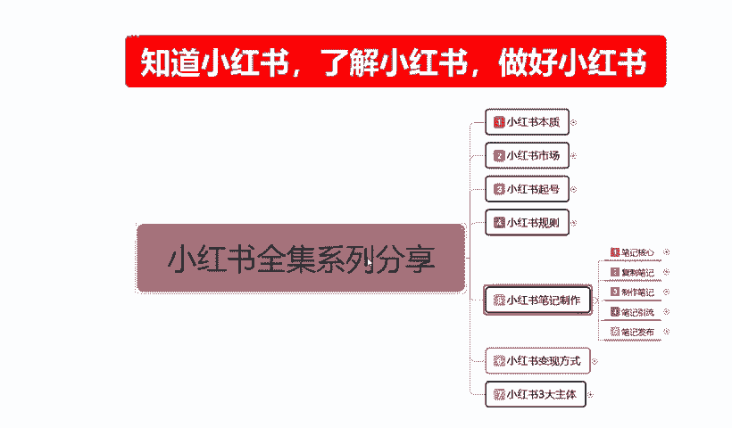
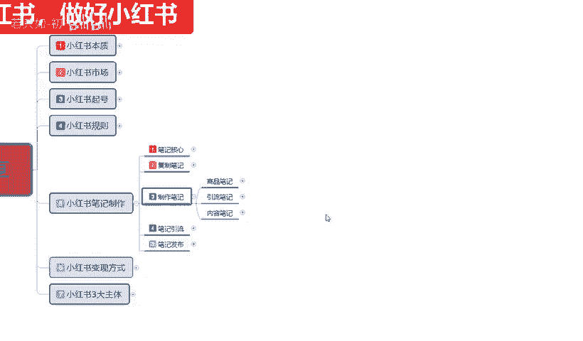
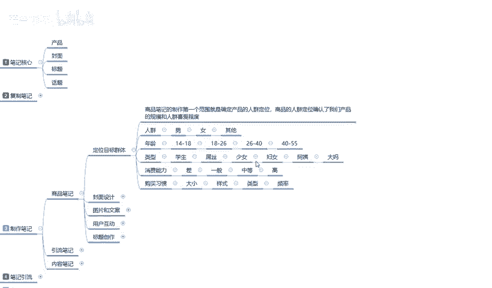

# 【2024版小红书体运营教程】全B站最良心的小红书开店运营教程！小红书体开店 起号真的快，赶快点赞收藏起来 - P20：19、小红书【商品笔记】制作：定位目标群体 - 若只如-初 - BV1MM4m1274h

大家好，今天给大家分享的是小红书全集系列的第五大课时，小红书笔记制作。

第三点内容。

制作笔记小红书制作笔记啊。这个的话和之前给大家讲的那个复字笔记，它是不一样的。复制笔记的话只是说我们在前期嗯对小红书不理解不了解。和对自己不信任的一个。自我感官上面啊进行了一个优化。制作笔记的话。

它适用于的话就是说我们小红书前面店铺前期的一些基术已经全部做完以后。我们开始需要推广自己的一个产品。推广自己的产品也好，或者说是你从别的地方拿的产品过来也好，觉得这个产品能卖。

就说我已经给自己定位全部找准了以后啊，我要开始卖我的商品也好，我要做我的一流也好，我要做我的内容也好。我不管我们大家是真的在小红书上面去。卖产品也好啊，卖内容也好，卖情怀也好。不管你是做什么？😡。

你都有一个主体，那么所有的主体都是围绕这个笔记来制作的，也就是小红书最重要的一点，笔记制作。它和复制册的笔记的一个区别在什么地方呢？复制笔记你是把别人的东西拿过来，放在自己的一个账号上面进行推广宣传。

然后进行销售。制作笔记不一样，它是根据我们自己自身的一个产品啊，我们去做它的一个商品笔记也好，引流笔记也好，内容笔记也好。第三个点，围绕我们单独的一个商品进行的一个推广和宣传。目的性明确啊。

实用性效果好。同时呢。容易爆款。他整体来说的话，比父子笔记要好报得多。为什么父字笔记里的爆款就可能不到。千分之1，但是我们自己制作的笔记，你可以达到。1%到2%的一。概率就是你的账号整体起来以后。

内容发的好，笔记做好了，很容易就把访客，还有我们的一个粉丝数量，包括你引流的数量，就是很容易去吸引一。对这个商品也好，对我们个人也好，对我所发的内容感兴趣的。人群也好啊，很容易吸引到。

但是它有一定的制作难度啊，那这节课呢给大家主要就是讲解一下我们制作笔记里面。的一个商品笔记怎么去操作？整体的制作笔记里面我还是给大家分了三个点。第一个就是商品笔记，第二个是引流笔记，第三个是内容笔记啊。

还是和之前一样，我们先看商品笔记。

啥民币呀。我们在制作商品笔记之前，我们要先确定5个点。第一个定位目标的一个群体。第二个封面的一个设计，怎么去创作？第三个是图片和文案。最后呢是用户我们和用户之间的一个互相沟通。因为笔记里面的话。

它就和抖音类似的。啊，别人给你评论留言，你怎么去给别人用户互动？最后一个就是标题的一个创作。为什么把标题放到最后啊？虽然说我之前在给大家讲笔记核心的时候，也给大家说过啊。比较核心的这几个点。

我不知道大家忘了没有。封面是第一要义，标题是第二要义。对吧产品和话题就是我们中间的一个互动环节。是补充物是。联合剂啊增强用户对我们的一个信任，包括一个喜爱程度。那首先我们来了解一下啊。

商品笔记的一个定位目标群体，它是怎么个定位？商品笔记里面啊。😡，定位目标群体就是我的产品已经选好了，或者说我要宣传的内容也选好了。啊，我要推广的一个方式我也选好了。那首先第一个点。

我们要选择定定位目标人群。这个定位目标人群。第一个在这里我给大家重复一点啊。小红书平台。上面我们一共要定三个点。第一个。用户的人群。第二个商品的人群。第三个是我们自身店铺的人群。

那制作笔记它对应的是什么呢？对应的是用户人群，就是笔记制作出来以后，它是由我们通过这个呃所定位的人群，通过我们账号的一个调节去选择用户。我们这些产品。我发的所有笔记，对面向的用户是什么样的人群。

在这个里面，商品笔记的一个人群的话是确定我们的一个产品，也是确定用户的一个人群。这两个要两相结合，相互匹配啊，才能达到精准人群。精准人群结束以后的话，我们的店铺会定型达到第三阶段啊，店铺人群定位。

只有通过这三个阶段的一个人群，因为我们才能把自己。这个整个小红书的账号权重给提升起来。首以我们来了解一下啊，商品笔商品笔记制作。第一个范围就是说确定我们产品的一个人群定位。

商品的人群定位确认了我们产品的规模和人群的一个喜爱程度。就是我们把产品选择明确了以后，其实我们就已经把我们的市场选择好了。那我们在市场里面的话，其实这里面还有人群的年龄。啊，人群的性别、年龄。

类型消费能力和购买习惯这五大点。这五大点分别是什么呢？人群。男性女性，其他小儿、小孩、老人啊。或者说是。呃，男性之间给朋友互相购买东西，女性之间给朋友朋友互相购买东西，一个人群选择范围非常重要。

小红书是以女性为主，但是女性给男性买东西的概率也有啊，虽然说没那么大。那么我们在选择产品的时候，有些朋友的话，他可能喜欢做冷门产品，因为冷冷门产品的市场虽然是小，但是它的转化率。

包括它的利润是非常可观的啊，这是看我们自己大家。怎么说呢？商品选择的怎么样了啊，在这里我就不过多重复。所以说我在这里的话，就是说把人群的一个范围是把它单独划发划分开了，男女和其他三个选择类型。

男性的我们只做就只做男性，女性就只做男女性。如果说男性和女性满不满足不了，因为我在这个地方给大家划分的这个男女的话，它是有年龄限的，18到35只做这个范围之内。

低于18、高于35都是其他类的一个性别范围。因为他们的话我们要去。啊，大范围耍网，为什么他们的。人体用户对比男性和女性用户的话少很多。18到35小户是3亿用户里面可能占2。5亿，剩下5000万。

可能的话就在其他范围内。所以说其他的话要全抓，你再从其他里面去挑挑年龄挑类型，挑消费能，力挑购买习惯。那你说实话，你的店铺做的太精准了啊，意思就是说。你起步很难，后续发展更难。

因为你整体就没什么人来观看你的产品，那你能卖的出多少呢？对吧？所以说我们在选的时候，三个里面只选其一啊，要不做男性产品，要不做女性产品，要不做其他产品。产品定位选择好以后选年龄。年龄的话。

在这个里面有1814到18、18到26、26到444到55。我只是给大家划分了大概的四个范围。这四个范围就是我们要所选择的一个年龄。因为14到18的话，他们属于。小孩子。小孩子的一个消费能力平均的话。

他普遍不会太高。18到26有一定的消费能力，但是比较理性。什么样理性化，不是太舍得花钱。花钱他的目的性很强，要达到什么目的才可以。24到2626到40比较随意，为什么？有一定的精济基础实力啊。

比较在乎实用型的一个产品。40到5处5，那就是捡便宜了啊，或者对自己觉得有用的东西，什么滋病啊啊保养啊、年轻、美化等等这些。啊，显得有气质啊之类的。所以说我们在选择完性别以后的话。

选年龄只能做这一个范围之段之类的啊。你超过这个范围段之内以后的话，你比方说我选个女性18到26，我去做26到40的一个产品的一个笔记去做推广。笔记的格式形式的话，都是按照26到40岁。啊。

进行的一个笔笔记发布的一个文案去操作不一样。为什么说我们制作笔记的时候，一定要先选选择这些东西啊？每个年龄阶段。他所喜爱的内容不一样，喜爱的风格不一样，喜爱的画风不一样。虽然说他都有包含性。

但是我们要找准确性的。啊，就是说我们要先了解这些东西。第三个就是类型。选完人群选年龄，年龄选完选以后选类型，类型什么？学生屌丝少女妇女阿姨懂吗？这个里面的话，其实在年龄阶段里面，它有不同的一个基础。

你比方说学生14到18，基本上全是学生。啊，你现在的话，你不像以前现在初中毕业的很少，基本上都是高中以后。再正常一点，熟悉一点的话，就是我如果说选14到18这个范围的话，基本上都是初中生。

他没有高中生以上。他玩小红书的这个范围的年龄，14岁以后到18岁以后的话去做小玩小红书的基本上都是小女孩。男性基本上为0。从18岁以后才会有慢慢的有男性用户进来。啊。

这个大家一定要把这个小红书的一个特点给他家弄清楚啊。小红书的特点的话，我相信大家对小红书进行一定的了解的话，也是比较熟悉的啊。就是说在这里呢不过多的一个讲解啊，学生也好，屌丝也好，少女也好，妇女也好啊。

他们在小红书里面的目的是非常明确的。就是说我们在选择人群年龄类型以后的话，选择的是消费能力什么意思呢？你选择了前面三个以后，你还要观察他的消费能力能不能购买起我的产品。你做产品也好，你做内容也好。

你做其他的一些宣传也好。那么我们选的话消费能力差的我们不考虑。一般的说实话，你要是卖大众类的一个产品，啊，产品不贵。就是底价低于20块钱以下，或者低于50块钱以下都可以去做。

但是如果说你的产品单价又高啊，人群选择年龄的话，你有只能往这个方面去靠的话，我建议大家不要在这这个地方去卖这个东西啊，你再再想想其他办法去卖。而且这个要根据产品的一个特定去选。如果说我们盲目的选择的话。

说实话你这个产品卖不出去。啊，对于一般的消费能力来说的话，他对这个产品的一选择可有可无的那你说实话，这个产品真不好做。然后是中等和高。正常来算的话。

小红书里面的女性的用消费能力基本上都是在中等和偏高的这个范围之内。这两个选项又是不一样的。高等的一个选项，你的产品必须要做的精致，精美，有自己的特点，有自己的历史等等。啊，就必须要自己的产品。

要对他非常了解，而且自用的一个范围，自用的一个场合。也就是说我们在做这个。年龄选择特说内容笔记啊这一部分的。消费高的这一部分，它主要最在意的就是内容笔记。通过内容笔记引流到引流笔记再到商品笔记这个方式。

但是中等的话就可以直接从引牛比记开始，直接到商品。因为他的选择性是很多的。最后一个就是购买习惯，大小、样式、类型和频率。这个的话说实话啊。这个是判断用户的一个能力的。就看我们用户他喜欢的一个。

简单的说就是投气床。你卖产品的话，你店铺里面的产品可能达到6到10件，1515件左右。但是我们正常卖的话是卖一件。那么你在这个里面选择的时候一定要对应啊，先选前卖4个，最后对应大小样式类型频率。

大小是什么呢？产品的大小样是什么？产品的样式。类型啊。实用性、经济性啊实惠性。这个病例我们产品的一个商品折扣价格格是打边了。最后一个是频率，频率是什么？小红书网购频率。

他一个月在给小红书专面购买多少块健产品？啊，是靠这些东西来定位的。好吧，这个呢就是整体商品品比例的一个定位目标群体。我们只有了解了用户的一个需求以后，我们才能根据我们的产品选择用户。选择完用户以后。

选择他们的年龄，选完他们的年龄以后，选完他们的一个类型，类型选完以后查看消费能力。然后根据这一些综合数据就能确定我们对应的一个消费人群是什么样。消费人群对应了以后的话，就先根据年龄选择设计的封面行驶。

封面的形式和标题的一个展示。最后选内容，这几个方面相结合，就是一个好的。笔记。当然了，这些听着很复杂，其实做起来的话，我们把目标一个个定下来以后，其实非常简单啊。

就看我们自己大家有没有这一个理解能力来跟着一起操作，好吧。那么因为时间的原因，这节课呢就到这里，下节课呢给大家讲解一下什么是封面设计。

