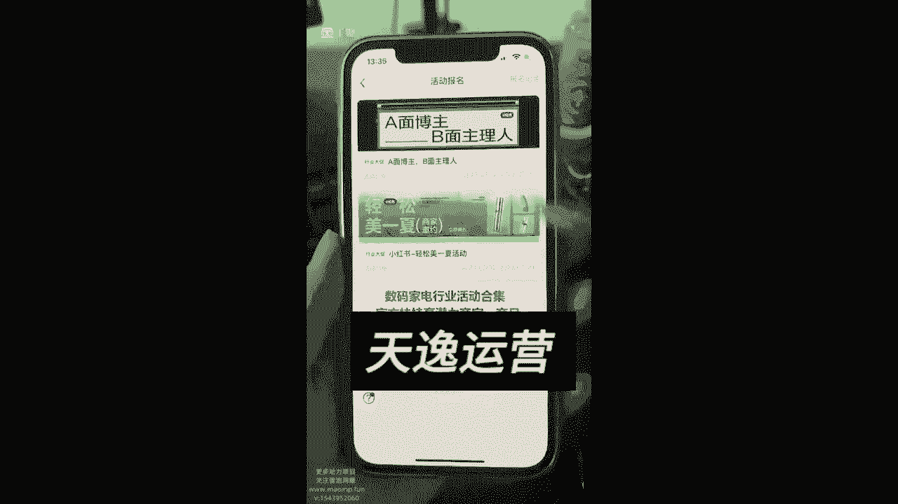
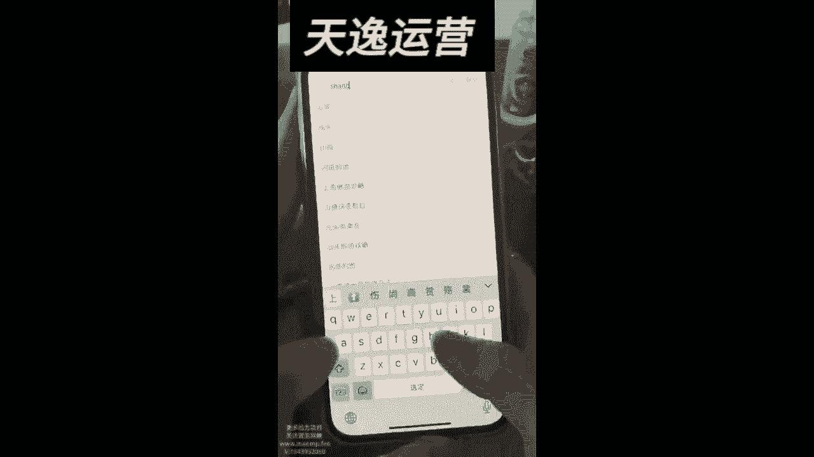
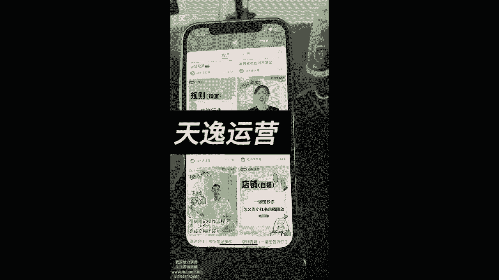
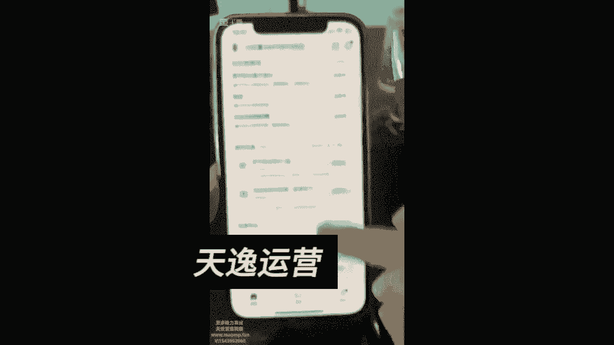

# 【2024版小红书体运营教程】全B站最良心的小红书开店运营教程！小红书体开店 起号真的快，赶快点赞收藏起来 - P20：如何增加笔记曝光度 - Sathenay - BV1ajsJecEJB

这节课给大家讲讲如何增加笔记的曝光，在小红书上面发布笔记的时候。

你们会发现左下角是不是有一个小眼睛，然后我跟大家讲啊，左下角那个小眼睛的话越多。

这代表着你的笔记呢点开的人数越多，那你挂了商品之后才有增加下单的几率。

那今天我给大家分享一个很关键的，增加曝光度的方法。

第一个的话呢，就是咱们需要下载一个小红书的商家版后台。

因为咱们是卖货的嘛，所以说必须得有这个小红书的商家版的后台，然后呢我们打开之后来看一下。

这个是这个商家版后台是什么样的，打开之后你们会看到一个这样的界面，那我们在界面的话呢，我们平时要注意几个点啊。

比如说的话，你看这里边有一个东西叫什么数据中心，你们的话平时多去看看这些数据中心。

你看你经营的一些支付订单数，支付金额，商品的访客人数，包括的话你的流量的情况，这里边的话全部都有多少人访问了。

笔记的访问人数，直播访客人数全部都给到你了，所以说这个数据平时你们没事的话，可以多去看一看，然后的话呢，比如说我今天增加了多少店铺的曝光度。

笔记的曝光度，这个都讲的很详细，那我们今天的话呢，给大家第一个就是增加曝光度的方法是什么呢。

如果说大家想去增加这个曝光度，非常关键。

就是我们去参加平台的活动，在哪块儿去参加平台活动呢，这块大家看没看到有一个东西叫活动报名。

你们点击进来之后，这里边有很多很多的活动。

对不对，这些活动报名全是免费的，就像到了三八节，双11，双12，6月儿童节，或者是有一些嗯那种嗯五余一二，这里边的话都会有变种，各种各样的一些节活动。

你感觉哪一个适合你，那你就去参加这里边的话，怎么关注这个活动呢。

你就每天把这个页面打开看一遍，你们就每天关注一下这个页面，你去看一下。

要不然的话呢大家要去关注另外一个账号，你说我没有办法去关注的特别及时，那也可以你们去搜索另外一个账号。

这个账号以前的名字叫小红书商家学院。

但是呢现在的话它叫做商家课堂署，我给你们搜一下啊，商家课堂。

商家课堂署这个账号，你们关注一下这个账号里面呢。

它这里面有很多的官方的活动，这就是官方的小红书官方账号。

这里边的话有一些玩法，还有呢一些活动哎。

他这里边的话全都会给你更新，但我觉得这个它不够及时，如果说你们想要及时去关注的话。

还是按照我刚才上面跟你讲的这个这个方法，那如果说你们不想去错过这些活动的话。

就按照我说的这个东西，一般来说的话有什么活动呢，那刚才那个页面上都会最及时的通知大家。

你们平时想参加什么活动，就去参加活动的话，肯定是有流量的。

第二个的话呢是获取曝光度的方法，我们的话要做的东西叫什么呢。

去完成一些新手任务，来我们来看一下新手任务啊。

大家会点开这里，然后呢我们回到这，大家往下面拉一下啊，你们会看到这里有一个成长任务。

对不对，这里面会有一个新手的成长任务，看没看到。

他说会倒计时的，过了就可能没有了，然后呢你们要在规定的时间内完成，你看他给到你这个流量。

他是会给到你一定的流量的，来我们来看一下啊，比如说我点击立即报名，然后呢你去完成这些活动，你去完成这些活动，他就会有一些相应的流量给到你。

你们可以看到这个规则，对不对，他这边的话是会告诉到你的。

然后怎么样去参加这个活动，看到了吧。

然后呢哎本来的话这个任务的话，你们可以看到他有个曲线，本来那个曲线上面他会告诉你。

每个阶段他给你多少的流量，因为我刚才添加了报名这个活动。

所以说他就没有了，正常，你们的话在这个页面去参加新手的一些活动，新手任务只要你们去完成。

他就会给到你相应的一些流量，这个的话大家可以去完成平台说了给你。

他还是会给到你的，前期的话这个活动你们可以去参加一下，然后呢这个里边的话。

刚才大家看到一个曲线了吗，我不想本，本来想给你们看看，你按照那个曲线，按照它这个东西完成。

这个完成应该会给你一千一千的流量，下一个完成的话应该是挂商品链接。

他会给到你1万的流量，所以说平台说给了你。

