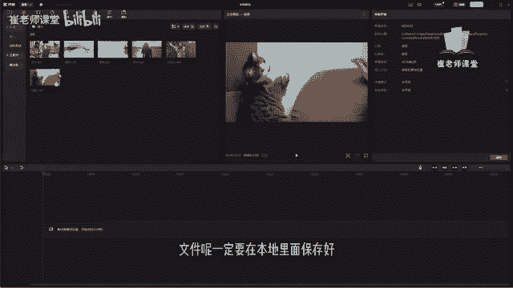
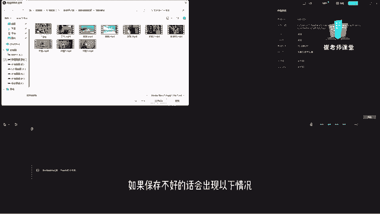
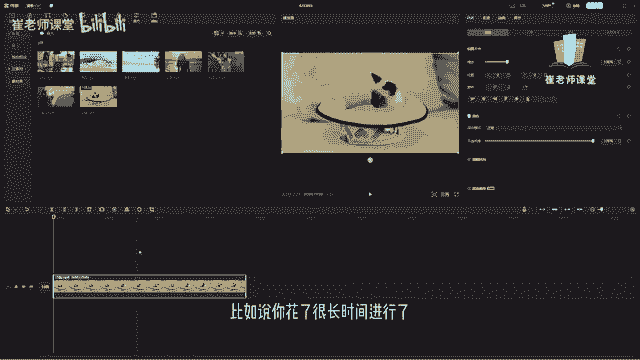
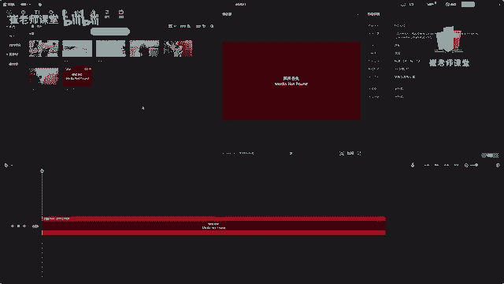
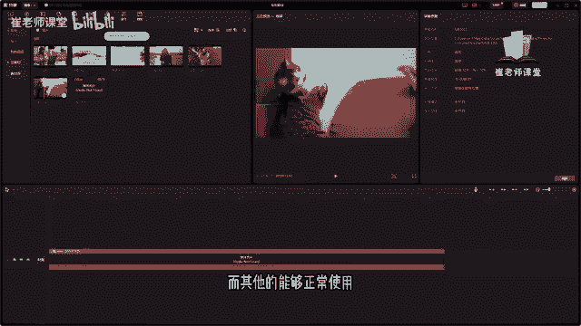

# 【2024版小红书体运营教程】全B站最良心的小红书开店运营教程！小红书体开店 起号真的快，赶快点赞收藏起来 - P21：19.导入的素材注意事项 - Sathenay - BV1uqHreLEER

需要注意的是呢，我们导入进素材库的这些文件呢，一定要在本地里面保存好。

比如说我们选择导入是在当前文件夹里面，那么你就需要把当前文件夹的这些素材，一定要保存好啊，如果保存不好的话。

会出现以下情况，比如说我们选择这个小猫，我们选择导入到素材库当中，把它拖到时间轴里面，比如说你花了很长时间进行了一次视频剪辑。

那么呢你将刚刚导入素材库里面的这个小猫，无意当中给删除了，那么在当前视频编辑界面当中，素材库里面这个文件还有吗，我们找一下，你就会发现当前的媒体就已经丢失了，因为刚刚的那个小猫的那个文件视频。

我们给删掉了，它会提示媒体丢失，所以说和大家之前说过，我们在剪辑视频当中呢，一定要对自己的文件进行整理，放在合适的位置啊，尽量不要放在C盘里面啊，放在其他的盘符，一定要记得及时的归类并且保存好。

比如说有时候你花了很长时间去剪辑的视频，但突然有了一段时间，你需要进行重新去剪辑，或者是添加一些新的内容，在原来的工程文件上去修改一些新内容，你会发现如果这些文件你被误删了。

那么整个工程文件就没有办法使用了，你会发现啊，只有它进行丢失了。

而其他的能够正常使用，是因为当前的导入的文件夹里面，只有刚刚的那个文件被删掉了啊。