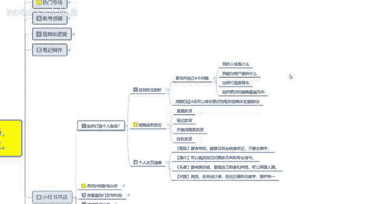

# 【2024版小红书体运营教程】全B站最良心的小红书开店运营教程！小红书体开店 起号真的快，赶快点赞收藏起来 - P21：19.小红书爆款店铺打造步骤（1） - 快乐稳定发挥 - BV1AbtoebEjX

大家好，今天给大家分享的是小红书全方位整体分享的，第六大课时，小红书开店啊，因为这一整套课程的话，前面五节已经讲完了，这一节开始呢给大家分享的，就是我们小红书实操部分的一个整体内容。

首先呢是小红书的一个开店。

呃废话不多说，我直接开始我们的正常课程，小红书开店的话。

这个说实话啊内容是比较多的，我给大家把它分了九个大点啊，九个大点里面的话，每个点位里面还有小点，需要我们自己个人的话就是去好好研究一下，了解一下啊，首先第一个点呢，就是说如何打造自己的一个个人账号。

因为你小红书开店的账号，和其他的账号是不一样的，你账号的设置啊啊调整，基本上都有有很大的区别，包括寻找对标账号，赛赛道的一个热门发布时间，店铺操作分类店群操作的一个模式，主体的一个定位。

然后流量模式前期规划，中期规划，包括最后的一个店铺发展方向，我们都需要个人自己去好好了解一下。

我们现在看一下啊，如何打造自己的一个个人账号啊。

个人账号的话就是说你要明白三个点，第一个呢就是说我们自己的一个，自我定位的一个剖析，第二个呢就是明确自我的一个定位，第三个呢是个人主义这主页的一个搭建啊。

做定位剖析是什么意思呢，首先你要问自己四个问题啊，你自己的人设是什么，我能为用户提供什么，如何打造差异化，然后的话如何更好的明确，我自己要走的一个赛道方向，就是自己给自己先做个定位啊。

通过自己的产品内容去往后面操作的时候，你要去怎么做你的产品推广对吧，把自己的赛道明确方向，你要做低端中端高端三个层次阶段，你要选择他们的一个消费能力在什么阶段，对不对，那你因为我们你小红书开店的话。

你基本上都有自己的一个产品，你没有产品的话，那你就是需要去那个一件代发平台自己去找，这种的话就是说一件代发的话，你在小红书上面做也可以做，就是个搬运工嘛，只是说赚的少一点。

然后你的一个基础设施啊啊投入也少一点，就看自己怎么去明确自己的一个赛道方向嘛，啊想明白这四点的话，你就说你自己后续的一个整体思路，就基本上都有了，自己知道该怎么去做。

只是说内部优化的话还需要去学习而已啊，第二个呢就是明确自己的一个自我定位，自我定位里面的话就是说你是准备直播卖货，还是说笔记卖货，或者说是关键词搜索，关键词搜索的一个卖货，或者说是你做关键词排名去卖货。

第四种方式啊，他们可以归纳为一体，但是你要选择一个主攻方向，什么意思呢，就是说这四个方式你都可以去操作，但是你要从里面选一个，你自己认为自己能做好的一个主攻方向，直播卖货对吧，你自己有颜值，有口才对吧。

在小红书上面，你开个店以后的话，然后通过直播的方式，然后偶尔发一篇笔记，吸引固定的一个粉丝量，介绍自己的产品，在直播间里面直接卖就行了，一个是最简单的，但是他对个人素质和自己的一个口才，要求是最高的。

呃包括你的一个嗯直播间的一个设置啊，背景，你这个的话说实话，你个人如果说以前在别的公司做过的啊，对这个有了解的可以，如果说你没有做过的，然后自己只有产品，那你在直播间卖货也可以对吧。

介绍自己的产品还不会吗，那剩下的就看自己的口才啊，编辑能力或者是账号的一个创建，维护能力怎么样，第三个呢就是个人主页的一个搭建，个人主页里面的话就是名称简介，头像封面这几个点呃，名称呢要有特色。

就是说能让粉丝快速的牢记，你就你自己给自己取个别名啊，别名的话你的后续大账号也好，小账号也好，因为小账号，你有时候的话要在评论区里面去进行评论，然后艾特的，因为你自己要知道自哪个是自己的号对吧。

简介方面的话，就是说可以概括自己的一个更新方向，和自己的一个专业背景，什么意思呢，就是你自己是做什么产品的，做了多少年对吧，有什么历史文化传承啊，就是给自己包装一下，基本上都在简介里面就给自己包装了。

除非你在直播间，直播间的话，你就是口头自己给自己啊，做一个完美的介绍头像，然后呢就是说你的一个头像辨识度啊，尽量的话就不要用使用卡通头像了啊，小红书里面使用使用卡通龙头像，那是最笨的方式啊。

你找明星照片，或者说找适合你个人的一个额，其他照片都比你用卡通头像要好，就说最好的话就是说嗯怎么说呢，用真人照比较好一点，当然你需要有颜值，你颜值不好的话，你用真人照的话也没人看啊，然后是封面。

封面的话就是说你的一个背景图案设计，然后美观突出你的主题和那个关键字啊，整齐统一，就说你的啧页面设计里面，你们可以去小红书上面参考一下，那些额粉丝有个几万上10万内容账号，他们的页面是怎么做的。

然后你根据自己的一个需求量，去设计一下自己的页面就可以了，就是个人主页搭建的话，就是你个人，个人面向小红用户能做到的一个，最好的一个展示方式啊，你其他展示方式，你除了直播。

就是靠个人主页搭建来展示给用户，你自己的一个形象，然后你自己的一个专业啊，能不能让用户认可，其实你的主页搭建的话，就已经占比40%了，实在话你的个人主页搭建就占比40%了，剩下的10%。

60%的话就是你自己的一个账号，和你自己在评论区里面进行互动，和你笔记内容有关啊，互动占比说实话占20%，笔记内容占比30%，其他的占10%啊，但是个人主页搭建的话，基本上就占了40%。

他能很多时候你个人主页搭建好以后的话，你不管是在抖音也好，或者说在小红书也好，你去看别人的那种大型网红，他对个人主义搭建的话都是非常有讲究的啊，这个呢就是如何打造个人的一个账号，好吧。

那这一节呢就给大家分享到这，下一节呢给大家呃分享一下。

