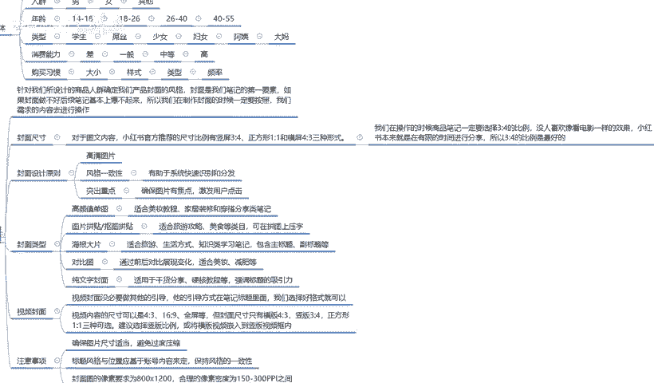

# 【2024版小红书体运营教程】全B站最良心的小红书开店运营教程！小红书体开店 起号真的快，赶快点赞收藏起来 - P21：20、小红书【商品笔记】制作：封面设计及注意事项 - 若只如-初 - BV1MM4m1274h

大家好，今天给大家分享的是小红书全集系列第五大课时的第三小节课时。里面的第二条内容，封面的一个设计啊，结合我们上节课给大家进行的一个业务目标群体的一个整体讲解。

这节课呢啊进入到我们小红书笔记最关键的一点封面的一个整体设计。封面设计啊，其实在这个里面的话，我在这里呢封面因为它是根据我们产品也好，根据我们所宣传的内容也好。

它进行了一个设置呃，整体来说的话，就说针对我们所涉计的商品人群确定我们产品封面的一个风格啊。封面的话，它是我们笔记的第一要素。如果封面做不好，后续笔记基本上报不起来的啊。所以我们在制作封面的时候。

一定要按照我们需求的内容进行操作。需求内容是什么呢？第一个封面的尺寸，第二个封面设计原则，第三个是封面的类型，第四个是封面视频的一个封面。第五个是注意事项。啊，这里面的话，为什么说是是有一个视频封面。

视频封面说实话它比图面纯文字的一个图片封面的话，做商品要好一点。如果说你做引流的话，那个。怎么说呢？做内容分享的，或者说是做引流分享的，用图片文字的比较好。做商品的话。

尽量的话还是用那个视频封面比较好一点。这是区别。首先了解一下封面的一个尺寸啊。

封面尺寸对于图文内的一个内容，小红书官方推荐的一个尺寸比例有嗯竖屏3比4、正方形1比1和横屏4比3三种颜式啊。说实话，我们在操作小红书的时候啊。

商品比记一定要选择3比4，包括其他的所有的啊，尽量不要用1比1或者说是。4比3复拼的一种方式。小红书本来就是放松心情的一个娱乐平台。啊，它只是上面有我们所需要了解的一些东西，用户才会去观看。

如果你说放横屏，用户点进去以后的话，发现横屏导过来以后，他观看信息下去就已经减兴趣就已经减少了50%。就像你看抖音，你觉你们以前的话看抖音刷抖音或者是了解抖音的时候，他还偶尔还会出现一些横屏。

但是评论区里面说的都是什么呢？大爸啊，这么多年了，还没人敢让我把手机横着放。😡，都是类似这样的话，所以说横屏的话给人的一个印象哈，我们又是图文的一个形式。所以说我们做小红书，所有的数据比例啊。

图片比例都是3比4，其他比例不考虑也不选择。

啊，这个是图片的一个比例。第二个封面设计原则。封面设计原则是什么呢？第一个我们在做图片文案和文字文案的时候。图片清晰度一定要高。什么叫清晰度一定要高呢？就说我们照片拍下来以后，截图也好。

或者说是你原创的图片也好，你必须得拿高清的一个手机或者相机去拍。你想办法都得去弄一个。因为如果说你的第一张图片清晰度不够，很模糊的，你类似于别人拍摄以后发给你的截图，或者是原按原文档。

不是第一首文原文件的话，它的那个图片清晰度是有点模糊的。模糊模糊的产品，看上去的话，它的效果和高清图片。就和我们看电视纸一样啊。你电视里面有好几个选项，对吧？标清、高清超清。对吧这几个类似的一个形影像。

你看的话，只是说越高清的图片流量也越多大而已。但是在小红书里面的话，他不会在乎这一点。所以说越高清的图片对我们的效果也就是越好的。第二个就是说。风格一致。什么叫风格一致呢？我们所发的所有笔记啊。

大家记住了，是所有笔记，你发笔记不可能今天发了以后就都不发了。不可能的。你本上一天发1到2天或者3天发1到2天，你有一个时间性的阶段的那风格一致呢，就是我们所发的笔记文案模板要用一样的图片。

只是你们的内容不同。风格一致，它可以有助于系统快速识别和分发。就是我们所发的笔记内容，类似的呃笔记效果发上去以后，系统会反应很快，同时给我们匹配精准的人群。前提是你店铺人群做好了啊。

他才会给你匹配精准人群。你店铺人群没做好的话，他匹配不做到的。它有助于系统快速的一个识别和喷发。就是没有言辞。我们正常做的话，到时候后面还会给大家讲解一下那个笔记发放的一个时间。笔记发放时间的话。

说实话你的笔记自我做完成以后，你发放上去以后的话，它系统是有反应时间的。你如果说不是统一的风格和统一的一个标识在里面的话，系统反应会很慢。你本来是提前多长时间发的，结果两个小时以后，系统才给你识别出来。

那个时候就已经迟了啊。第三个点，封面原则突出重点是吗？确保的是图片有一焦点。激发用户的点击率。这个怎么这个的话其实就是看我们图片的一个效果。然后看我们拍摄效果以后，结合文案对它进行了一个描述。

看我们到不到位。为什么这么说？图片其实拍出来效果都是差不多的，但是它图片的一个聚焦。是否有痛点？你在重点上面有没有做详细的一个讲解？他能不能激发用户的一个点击，就是你看小红书的时候。

你看我们我们正常刷小红书，你看着哎这女装不错。哎，这没子说啊，对不对？这个小女生长得真乖。或者说是我们看新闻看广告看报纸的时候。特意宣传夸大那种都西。就看我们自己怎么去用啊，能不能激发用户的一个点击率。

这个就是重点要突出。包括。封面设计原图啊。你把封面设计不好，后续都是白扯，好吧。下面一个是封面的类型。为什么封面还要分类型呢？后面类型是分什么？高颜值单图啊。

图片拼接拼图抠图的一个图片拼接拼接以后把它组合到一起。然后海报大片对比图纯文字封面，这些它都是有特点的，它对应的人群是不一样的。这里呢我也是给大家列出来了，首先是高颜姿单图。高颜值单图是什么意思呢？

就是。美女路镜或者不路镜，或者说是我们把这个图片放的非常清楚，非常清晰。比较高颜的单图。就是你有模特和没模特都可以做这个图片，它比较适合的就是呃美妆的一个教程。

家居装修、穿搭分类产品介绍等等这一类的笔记，他去做这个是非常好的。图片。拼贴啊抠图拼贴它比较适合的话，就是旅游攻略、美食等类目，可在拼图上面压字。就是我把图片全部抠出来以后，比方说这个是旅游景点，对吧？

这种的话它是做这个网络播主比较适用的一种方式。我把图片拼贴下来以后，某某某某几点啊，相当于做个宣传，好吃不好吃，很难吃，住着舒服不舒服等等。有一个详细的解释。类似于这一种的图片拼接。他比较适合的话。

就是旅游攻略、美食。这种。然后是海报大片，它比较适合的是旅游生活方式、吃式类学习的一个笔记。包含主题副标题等。什么意思呢？宣传。就是笔记它的类型是很多的，你的图片封面的类型，我们要把它选好。

你到底是宣传啊。食品也好，旅游攻略也好，生活方式也好，穿搭也好，它都是有一种。宣传方式知道吧？他所宣传的方式的话，就是说对应人群的一个选项啊，它只是更加细分了而已。我们把它划分出来了。

结合我这么长时间的一个经验。啊，给大家做了一个对比。然后是对比图，对比图的话，说实话他比较适合的就是。实用性的一个产品。口红。指甲油假指甲、睫毛。小饰品、耳环、项链、首饰。都可以适用它。

通过全后对比的一个展示。比方说传统戒指。啊，网红戒传统鞋、网红鞋、传统衣服、网红衣服等等，它都是合。他比较适合。去宣传商品的一个对讲。最后一个就是纯文字纯文字的一个封面啊。说实话。

纯文字的封面的话就比较适合我这样啊。那我给大家进行的分享，基本上都是纯文字封面。我很少给大家去基本上没有啊给大家做过什么。演示啊示范那种。存托时间的一种解说和讲解。因为我觉得我不屑于去那么做。

能听懂我课的基本上都能听懂，听不懂的那就是。真的听不懂。所以说我给大家分享的基本上都是纯的一个干货啊，硬核的一个教程。所以说我给大家分享的基本上都是强调。啊，标题等等之类的。

他就比较适合我这种啊给大家做分享的一个。是吧多的就不说了，大家理解一就行好吧，封面的一个类型，看我们大家自己根据自己所选择的类目产品去进行选择。效果都是不一样的啊。大家不要小小看我整理的这些资料。

它的效果都真的都是不一样的。我后面呢就是视频封面啊，视频封面我之前给大家说过了啊，视频封面的话就是说没有必要做其他的一个引导。整个视频的话，你从头到尾把它一遍拍下来就行了。这上面什么文字啊。

图案之类的都不要有，但是。第一印象亮度一定要够视频拍摄下来整体的结果效。效果也好。你不行，多拍几遍，选个最好的都可以。但是你不能说是我觉得拍它好麻烦，那你还不如不拍。

你还不如直接去做那个文字文案的一个封面的啊。视频后面的话，它比较适用于那个产品的一个介绍和我们那个穿搭之类的，比较适合这个去操作。就是说视频拍下来以后的话，你把它格式改正确就行了，其他的都不用改了啊。

是什么样的视频就什么样视频，要保证它的一个实际效果。本来我们就是原创视频，制作笔记里面本来就是原创视频，没必要去改啊。视频内容尺寸呢还是那会跟大家说的啊，4比3。哦，应该说是。3比4哈，不要搞错了。

是3比4，不是4比3啊，他只说给我们提供了1个4比316比9全屏。但封面尺寸的话只有横板和竖板，我们一般都是选竖版3比4的啊，其他的都不考虑。最后一个呢就是注意事项。第一个确保图片的尺寸适当啊。

避免过于压缩压缩的一个池面。你小红书笔记里面内容太大以后的话，它有那个延迟的。但是小红书整体的话，因为它的数据量还没有达到那么大的一个规模，它的后台系统还能承受。所以说我们看小红书的时候。

它的反应速度还是很快的。偶尔你的手机网络速度不卡，可能卡个0点几秒，0。5秒到1秒钟左右，那都是正常显示，其实也还好。然后就是标题的风格与位置的话，基于账号内容来定的，保持一致的风格就行。

就是我们把标题，你在图片上面加文案也好，在文字上面加文案也好，你把标题放成旁边竖着也行，横着也行。但是你后续的所有笔记都要按照这个方式去做。保持他整体之间的一个风格。就是你不要前面5个笔记。

本来标题在上面像横幅一样骂着一场圈。后面那个后面的一笔，你就把它做成竖条了，那样不行的，别人看不懂的，好吧，所以说一定要保持风格的一致。然后封面图的像素要求的话是800乘以320。

和你的摄像素密度为150到300PPT之间。啊。这个就是整个封面设计，我们所需要了解和注意的一个思想。同时呢给大家提供了一部分的选项内容啊，让大家知道什么类型的一个封面图，什么类型的一个封面图片效果。

它所适用的一个人群范围，让大家进行了一部分的了解，好吧。那么这节课呢就给大家讲解到这。下节课的话给大家讲解一下图片和文案。

啊。图片和文案要到达选择人群的时候了。我之前给大家说过啊。商评笔记里面定位目标群体的一个人群范围，年龄、性格、消费能力是选用户了，对吧？我们是后面还要靠我们图片文案去选。好吧。

那这节课的内容呢就到这里。