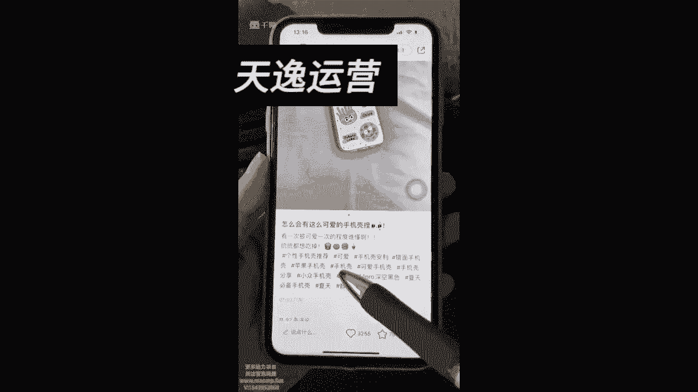
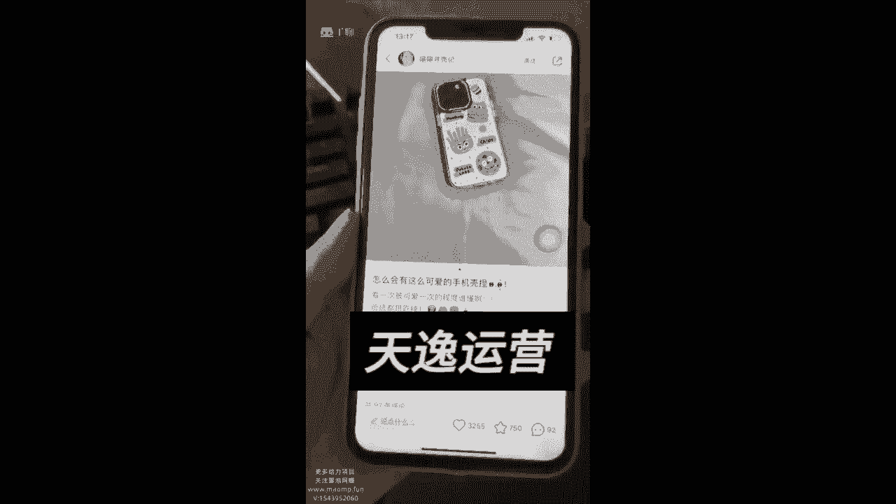
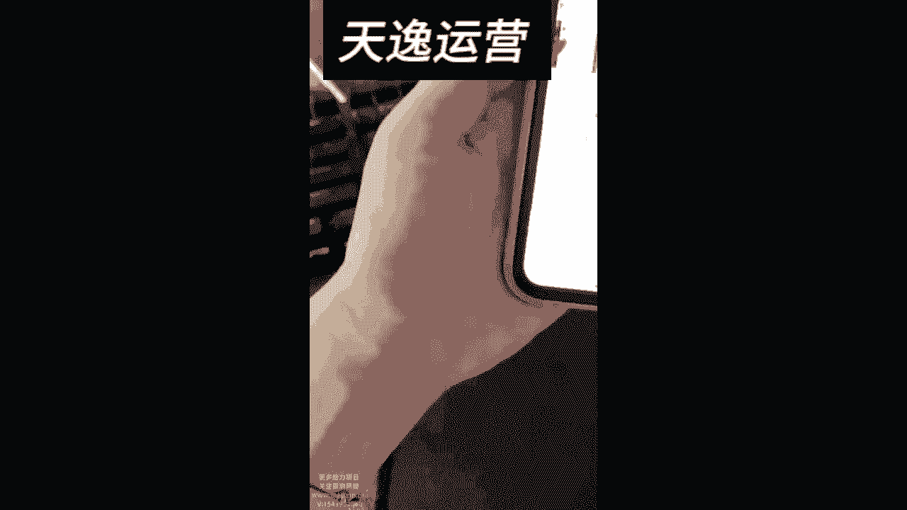
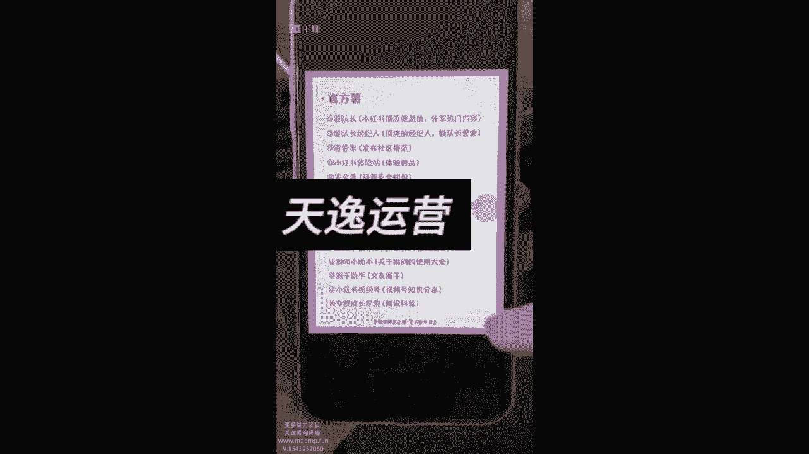

# 【2024版小红书体运营教程】全B站最良心的小红书开店运营教程！小红书体开店 起号真的快，赶快点赞收藏起来 - P21：如何增加笔记曝光度2 - Sathenay - BV1ajsJecEJB

来我们这节课给大家讲一讲，怎么从自身这条笔记啊，本身的这个内容上去提升曝光度，大家可能知道曝光是非常重要的这件事情，如果本身的话，你这个曝光没有你的品再好，你也是没有人买的嘛。

那我们怎么样从自身的情况，就是从这个笔记本身来提升曝光度呢，第一个的话呢叫做关键词，这个的话呢是非常重要的，你的笔记里的内容啊。

你尽量的话呢要有一些关于包包啊，还有的话呢就是这样子的包。

包括你的标题里边，就是包括你的标题，你看像这样子的，它的标题里边没有吧。

但是你看他的这个呃标签里边是包含的，再比如说的话呢，你看他的他们的这些内容。

像这个你看标题里边就包含了，是不是这些，你看他打的这个标签里边。

就包含了这些手机壳的关键词，所以说的话呢你的笔记的内容包括你的标题。

然后的话呢包括你打啊打的这些标签儿。

上边的话，你尽量都要有就是这样的一些关键词，因为关键词的话呢它会影响系统给你划分流量，第二个的话咱们在这个标签上。

我给你们讲过的，就是我们都要去打标签，标签的话你要打五个以上，对不对。

文案里面这个标签是很重要的，你要包含产品的关键词，然后呢。

其次的话咱们要模仿一些热门笔记的标签，比如说这个笔记他的点赞很高。

然后你也觉得这个笔记写的不错，他的标签呢嗯也做的挺好的，你不知道用什么样的标签好。

那你就用这个标签，直接用他的这些东西就行，比如说你看手机壳安利。

然后呢苹果手机壳可爱手机壳，手机壳分享，你就把他的这些标签用在你的这个上面，也是可以的，对不对，就就直接用他们的热门标签，第三个咱们干什么呢，我们要艾特官方账号，怎么知道我要艾特谁呢。

来我给你们看一下图片啊，我给大家找一找一些图片，这里边的话呢就涉及到了官方账号的这个事情。

来你们的话呢可以看一下，这里边的话有很多很多的这种官方的账号来看。

没看到看没看到，这个是生活类的VLOG类的，然后呢写作篇的包括的话呢你如果做运动呢，就就艾特这个运动数，对不对，如果说你们去做的是嗯。

比如说你做的是什么家居类的，就艾特这个家居鼠，那如果说的话，你们自己呢去做这种潮流艺术类的，那就可以去做这个，然后有新品的。

你可以艾特这个新品鼠，你看啊，这里的话给大家归类一些类，比如说的话，你看小红书顶流都是他什么，分享热门内容，安全知识体验新品，看没看到。

你们可以去截个图，比如说做美妆护肤的，就艾特美妆鼠，是不是美妆情报局也行。

好物分享呢就红卡薯，然后穿穿搭就做艾特时尚属潮流属，对不对，一个懂生活的大叔，如果如果你做生活类的。

就小红书是不是，然后呢还有比如说做事呃，外出分享的，对不对，分享外出生活的，然后呢国货宝藏呢，还有呢VLOG技巧和和那个活动呢。

还有母婴类的账号，鼠宝宝是不是母婴干货课堂，你去艾特这些账号。

然后这里边还有一些相对娱乐的运动的，你看小姐姐自律的日常生活，民宿露营类的，这里边的话都非常全了，你们可以把这些东西保存下来，其实你们的话还可以咋办呢，小红书上直接搜索，直接搜一下。

就是嗯他们的官方账号有哪些，就能搜到这些图片，你不保存也可以，你看做宠物的。

有宠物鼠萌宠幼儿园，然后还有商业广告所运营类的嘛。

商家属，然后吃货类的，你看他有吃货属，吃不饱同学这些东西都可以做做情感类的，艾特新情书怎么样，这内容的话是不是你如果说不知道艾特谁的话。

这些内容你都可以去保存啊，这些都是增加笔记曝光度的方法，可以去尝试一下。

