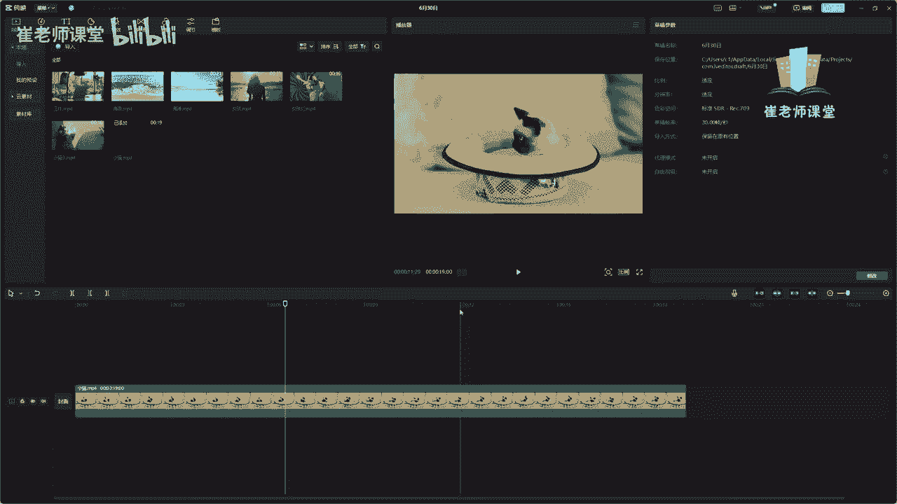
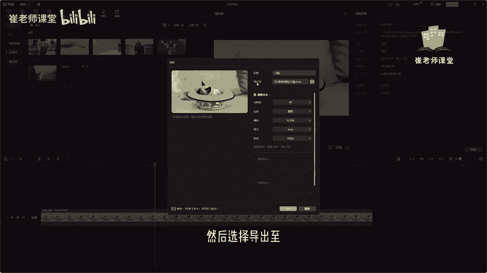
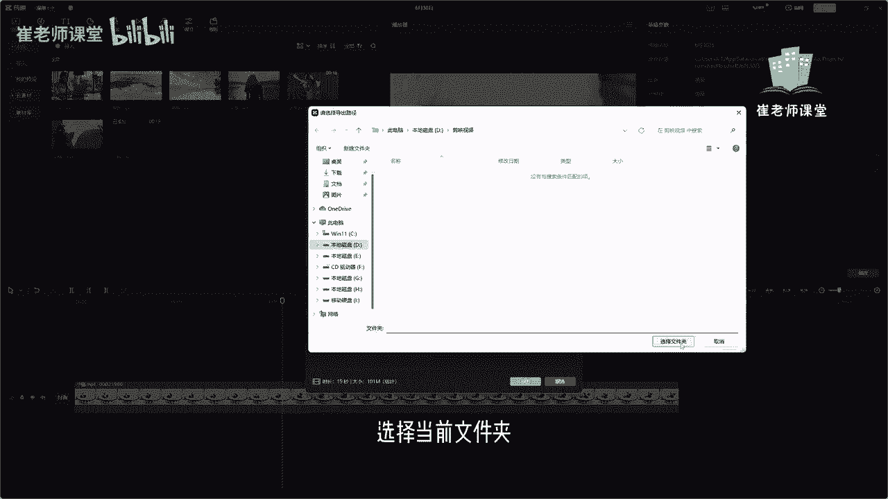
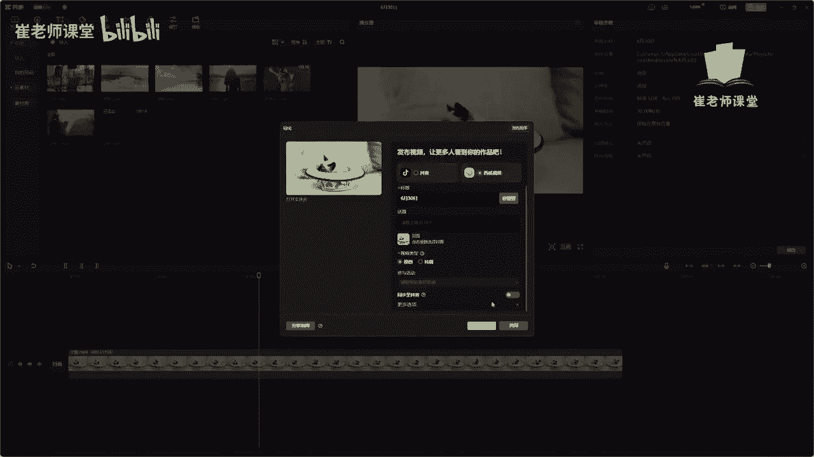

# 【2024版小红书体运营教程】全B站最良心的小红书开店运营教程！小红书体开店 起号真的快，赶快点赞收藏起来 - P22：20.导出素材 - Sathenay - BV1uqHreLEER

当前视频剪辑好之后，如何进行导出视频呢。

可以在右上角这个区域呢，单击导出按钮可以进行导出的操作，在上方这个区域呢可以修改一下导出的名称，然后选择导出至。

找到我们需要导出的文件夹的位置，选择在这里和大家说一下，不要去导，在C盘里面，可以单独的创建一个文件夹，来用来保存我们所导出的视频文件，进行及时的整理以及分类，选择当前文件夹。

在下方，这个区域呢可以设置视频导出的一些参数，有分辨率，有480P，720p，1080p，还有2K4K当然分辨率越高啊，画质也就越高，同时呢视频的大小也就越大，这个是需要大家注意的。

但是一般常见的视频平台，他们需要的最多的就是1080P，720p，480p，因为如果你的分辨率越高的话，文件肯定是越大的，在一些视频播放当中呢，视频越大，也就越意味着加载的时间也就越慢。

在这里呢常见的短视频平台，他们都推荐1080P或者720P，如果你是有其他的需求啊，也可以选择更高的分辨率进行导出，在这里呢可以设置码率，码率呢其实也就是单位时间的取样率啊，取样率越大，视频越清晰。

同时也意味着文件也就越大，比如说选择更高，那么它的大小码率选择推荐，这是它当前估计的大小，如果选择更低，就是以下大小，大家可以根据自己的需求来进行选择，也可以选择自定义来设置当前的码率，紧接着呢是编码。

可以选择编码，有常见的压缩方式以及高效的压缩方式，但是呢大家可以看一下当前的大小，有更加开放的编码，就是更节省空间，还有是高效的压缩，节省空间以及最常见的压缩方式，只有这三种，选项不是很多。

但是呢还是推荐大家使用最常见的压缩方式，嗯这个呢是对当前的视频啊进行压缩，另外呢可以设置导出的视频格式，可以选择mp4以及MOV，之前和大家说过啊，MOV呢就是苹果公司开发的视频格式，对不对。

然后mp4呢是MPEG，这个工作组推出来的一种常见的视频格式，大家可以根据需求来进行选择，检验的功能不是很多，但是已经足够使用了，可以导出这两种格式常见的格式，然后呢帧率这个大家比较熟悉啊。

之前讲过帧率呢它等于每秒钟播放图片的数量，帧率越高，也就是也就说明当前视频也就越流畅，比如说每秒播放60张照片，肯定要比每秒播放24张照片要更加的流畅，对不对，然后可以单击导出按钮，可以执行导出操作。

也可以取消对当前视频格式进行取消操作，然后重新的剪辑或者修改，然后选择导出，单击导出按钮，这个导出的速度呢是根据电脑的CPU，当然如果你的工程文件比较大啊，它导出时间也是很慢的，导出完成之后呢。

可以根据自己想要的平台进行发布，比如说选择抖音啊，或者选择西瓜西瓜视频啊，然后可以在这里设置标题以及话题，然后可以选择原创等等。

